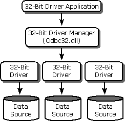

# Using 32-Bit Applications with 32-Bit Drivers
You can run 32-bit applications with 32-bit drivers. The 32-bit applications and the 32-bit drivers use the Win32® API.  
  
## Architecture  
 The following illustration shows how 32-bit applications communicate with 32-bit drivers. The application calls the 32-bit Driver Manager, which in turn calls 32-bit drivers.  
  
   
  
> [!IMPORTANT]  
>  Do not use the 32-bit thunking installer DLL on WindowsNT/Windows2000. Although it has the same file name as the 32-bit installer DLL, it is a different DLL.  
  
## Administration  
 You can manage data sources for 32-bit drivers by using the ODBC Data Source Administrator. To open the ODBC Administrator on computers running Windows 2000, open the Windows Control Panel, double-click **Administrative Tools**, and then double-click **Data Sources (ODBC)**. On computers running previous versions of Microsoft Windows, the icon is named **32-bit ODBC** or simply **ODBC**.  
  
## Components  
 The ODBC component includes the following files for running 32-bit applications with 32-bit drivers. These components are in the \Redist directory.  
  
|File name|Description|  
|---------------|-----------------|  
|Odbc32.dll|32-bit Driver Manager|  
|Odbccp32.dll|32-bit Installer DLL|  
|Odbcad32.exe|32-bit ODBC Administrator program|  
|Odbcinst.hlp|Installer Help file|  
|Msvcrt40.dll|C run-time library|
