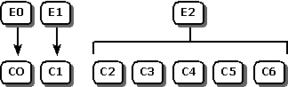
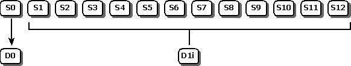
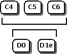

# Appendix B: ODBC State Transition Tables
The tables in this appendix show how ODBC functions cause transitions of the environment, connection, statement, and descriptor states. The state of the environment, connection, statement, or descriptor usually dictates when functions that use the corresponding type of handle (environment, connection, statement, or descriptor) can be called. The environment, connection, statement, and descriptor states overlap roughly as shown in the following illustrations. For example, the exact overlap of connection states C5 and C6 and statement states S1 through S12 is data source-dependent, since transactions begin at different times on different data sources, and descriptor state D1i (implicitly allocated descriptor) depends on the state of the statement with which the descriptor is associated, while state D1e (explicitly allocated descriptor) is independent of the state of any statement. For a description of each state, see [Environment Transitions](../../../odbc/reference/appendixes/environment-transitions.md), [Connection Transitions](../../../odbc/reference/appendixes/connection-transitions.md), [Statement Transitions](../../../odbc/reference/appendixes/statement-transitions.md), and [Descriptor Transitions](../../../odbc/reference/appendixes/descriptor-transitions.md), later in this appendix.  
  
 The environment and connection states overlap as follows:  
  
   
  
 The connection and statement states overlap as follows:  
  
   
  
 The statement and descriptor states overlap as follows:  
  
   
  
 The connection and descriptor states overlap as follows:  
  
   
  
 Each entry in a transition table can be one of the following values:  
  
-   **--** -The state is unchanged after executing the function.  
  
-   **E**  

     **_n_** , **C_n_**, **S_n_**, or **D_n_** - The environment, connection, statement, or descriptor state moves to the specified state.  
 
-   **(IH)** - An invalid handle was passed to the function. If the handle was a null handle or was a valid handle of the wrong type - for example, a connection handle was passed when a statement handle was required - the function returns SQL_INVALID_HANDLE; otherwise the behavior is undefined and probably fatal. This error is shown only when it is the only possible outcome of calling the function in the specified state. This error does not change the state and is always detected by the Driver Manager, as indicated by the parentheses.  
  
-   **NS** - Next State. The statement transition is the same as if the statement had not gone through the asynchronous states. For example, suppose a statement that creates a result set enters state S11 from state S1 because **SQLExecDirect** returned SQL_STILL_EXECUTING. The NS notation in state S11 means that the transitions for the statement are the same as those for a statement in state S1 that creates a result set. If **SQLExecDirect** returns an error, the statement remains in state S1; if it succeeds, the statement moves to state S5; if it needs data, the statement moves to state S8; and if it is still executing, it remains in state S11.  

-   **_XXXXX_**  or **(*XXXXX*)** - An SQLSTATE that is related to the transition table; SQLSTATEs detected by the Driver Manager are enclosed in parentheses. The function returned SQL_ERROR and the specified SQLSTATE, but the state does not change. For example, if **SQLExecute** is called before **SQLPrepare**, it returns SQLSTATE HY010 (Function sequence error).  

> [!NOTE]  
>  The tables do not show errors unrelated to the transition tables that do not change the state. For example, when **SQLAllocHandle** is called in environment state E1 and returns SQLSTATE HY001 (Memory allocation error), the environment remains in state E1; this is not shown in the environment transition table for **SQLAllocHandle**.  
  
 If the environment, connection, statement, or descriptor can move to more than one state, each possible state is shown and one or more footnotes explain the conditions under which each transition takes place. The following footnotes may appear in any table.  
  
|Footnote|Meaning|  
|--------------|-------------|  
|b|Before or after. The cursor was positioned before the start of the result set or after the end of the result set.|  
|c|Current function. The current function was executing asynchronously.|  
|d|Need data. The function returned SQL_NEED_DATA.|  
|e|Error. The function returned SQL_ERROR.|  
|i|Invalid row. The cursor was positioned on a row in the result set and either the row had been deleted or an error had occurred in an operation on the row. If the row status array existed, the value in the row status array for the row was SQL_ROW_DELETED or SQL_ROW_ERROR. (The row status array is pointed to by the SQL_ATTR_ROW_STATUS_PTR statement attribute.)|  
|nf|Not found. The function returned SQL_NO_DATA. This does not apply when **SQLExecDirect**, **SQLExecute**, or **SQLParamData** returns SQL_NO_DATA after executing a searched update or delete statement.|  
|np|Not prepared. The statement was not prepared.|  
|nr|No results. The statement will not or did not create a result set.|  
|o|Other function. Another function was executing asynchronously.|  
|p|Prepared. The statement was prepared.|  
|r|Results. The statement will or did create a (possibly empty) result set.|  
|s|Success. The function returned SQL_SUCCESS_WITH_INFO or SQL_SUCCESS.|  
|v|Valid row. The cursor was positioned on a row in the result set, and the row had been successfully inserted, successfully updated, or another operation on the row had been successfully completed. If the row status array existed, the value in the row status array for the row was SQL_ROW_ADDED, SQL_ROW_SUCCESS, or SQL_ROW_UPDATED. (The row status array is pointed to by the SQL_ATTR_ROW_STATUS_PTR statement attribute.)|  
|x|Executing. The function returned SQL_STILL_EXECUTING.|  
  
## SQLFreeHandle  
 In this example, the row in the environment state transition table for **SQLFreeHandle** when *HandleType* is SQL_HANDLE_ENV is as follows.  
  
|E0   Unallocated|E1   Allocated|E2   Connection|  
|------------------------|----------------------|-----------------------|  
|(IH)|E0|(HY010)|  
  
 If **SQLFreeHandle** is called in environment state E0 with *HandleType* set to SQL_HANDLE_ENV, the Driver Manager returns SQL_INVALID_HANDLE. If it is called in state E1 with *HandleType* set to SQL_HANDLE_ENV, the environment moves to state E0 if the function succeeds and remains in state E1 if the function fails. If it is called in state E2 with *HandleType* set to SQL_HANDLE_ENV, the Driver Manager always returns SQL_ERROR and SQLSTATE HY010 (Function sequence error) and the environment remains in state E2.  
  
 To understand the state transition tables, it is necessary to understand which item (environment, connection, statement, or descriptor) they refer to. Suppose a function accepts the handle of an item of type X. The X state transition table for that function describes how calling the function, with the handle of an item of type X, affects that item. For example, **SQLDisconnect** accepts a connection handle. The connection state transition table for **SQLDisconnect** describes how **SQLDisconnect** affects the state of the connection for which it is called.  
  
 Suppose a function accepts the handle of an item of type Y, where Y is not equal to X. The X state transition table for that function describes how calling the function, with a handle of type X that is associated with the item of type Y, affects the item of type Y. For example, the statement state transition table for **SQLDisconnect** describes how **SQLDisconnect** affects the state of a statement when called with the handle of the connection with which the statement is associated.  
  
 This appendix contains the following topics.  
  
-   [Environment Transitions](../../../odbc/reference/appendixes/environment-transitions.md)  
  
-   [Connection Transitions](../../../odbc/reference/appendixes/connection-transitions.md)  
  
-   [Statement Transitions](../../../odbc/reference/appendixes/statement-transitions.md)  
  
-   [Descriptor Transitions](../../../odbc/reference/appendixes/descriptor-transitions.md)
