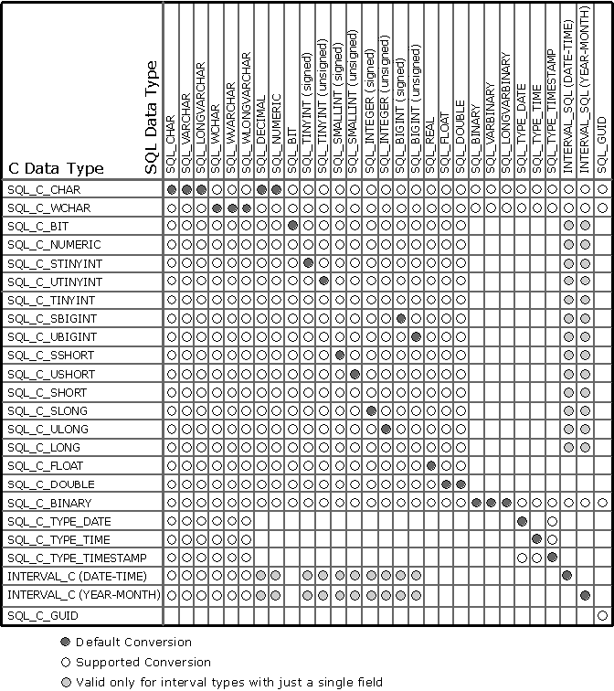

# Converting Data from C to SQL Data Types
When an application calls **SQLExecute** or **SQLExecDirect**, the driver retrieves the data for any parameters bound with **SQLBindParameter** from storage locations in the application. When an application calls **SQLSetPos**, the driver retrieves the data for an update or add operation from columns bound with **SQLBindCol**. For data-at-execution parameters, the application sends the parameter data with **SQLPutData**. If necessary, the driver converts the data from the data type specified by the *ValueType* argument in **SQLBindParameter** to the data type specified by the *ParameterType* argument in **SQLBindParameter**,and then sends the data to the data source.  
  
 The following table shows the supported conversions from ODBC C data types to ODBC SQL data types. A filled circle indicates the default conversion for an SQL data type (the C data type from which the data will be converted when the value of *ValueType* or the SQL_DESC_CONCISE_TYPE descriptor field is SQL_C_DEFAULT). A hollow circle indicates a supported conversion.  
  
 The format of the converted data is not affected by the Windows® country or region setting.  
  
   
  
 The tables in the following sections describe how the driver or data source converts data sent to the data source; drivers are required to support conversions from all ODBC C data types to the ODBC SQL data types that they support. For a given ODBC C data type, the first column of the table lists the legal input values of the *ParameterType* argument in **SQLBindParameter**. The second column lists the outcomes of a test that the driver performs to determine if it can convert the data. The third column lists the SQLSTATE returned for each outcome by **SQLExecDirect**, **SQLExecute**, **SQLBulkOperations**, **SQLSetPos**, or **SQLPutData**. Data is sent to the data source only if SQL_SUCCESS is returned.  
  
 If the *ParameterType* argument in **SQLBindParameter** contains the identifier of an ODBC SQL data type that is not shown in the table for a given C data type, **SQLBindParameter** returns SQLSTATE 07006 (Restricted data type attribute violation). If the *ParameterType* argument contains a driver-specific identifier and the driver does not support the conversion from the specific ODBC C data type to that driver-specific SQL data type, **SQLBindParameter** returns SQLSTATE HYC00 (Optional feature not implemented).  
  
 If the *ParameterValuePtr* and *StrLen_or_IndPtr* arguments specified in **SQLBindParameter** are both null pointers, that function returns SQLSTATE HY009 (Invalid use of null pointer). Although it is not shown in the tables, an application sets the value of the length/indicator buffer pointed to by the *StrLen_or_IndPtr* argument of **SQLBindParameter** or the value of the *StrLen_or_IndPtr* argument of **SQLPutData** to SQL_NULL_DATA to specify a NULL SQL data value. (The *StrLen_or_IndPtr* argument corresponds to the SQL_DESC_OCTET_LENGTH_PTR field of the APD.) The application sets these values to SQL_NTS to specify that the value in \**ParameterValuePtr* in **SQLBindParameter** or \**DataPtr* in **SQLPutData** (pointed to by the SQL_DESC_DATA_PTR field of the APD) is a null-terminated string.  
  
 The following terms are used in the tables:  
  
-   **Byte length of data** - Number of bytes of SQL data available to send to the data source, whether or not the data will be truncated before it is sent to the data source. For string data, this does not include space for the null-termination character.  
  
-   **Column byte length** - Number of bytes required to store the data at the data source.  
  
-   **Character byte length** - Maximum number of bytes needed to display data in character form. This is as defined for each SQL data type in [Display Size](../../../odbc/reference/appendixes/display-size.md), except character byte length is in bytes, while the display size is in characters.  
  
-   **Number of digits** - Number of characters used to represent a number, including the minus sign, decimal point, and exponent (if needed).  
  
-   **Words in**   
     ***italics***  - Elements of the SQL grammar. For the syntax of grammar elements, see [Appendix C: SQL Grammar](../../../odbc/reference/appendixes/appendix-c-sql-grammar.md).  
  
 This section contains the following topics.  
  
-   [C to SQL: Character](../../../odbc/reference/appendixes/c-to-sql-character.md)  
  
-   [C to SQL: Numeric](../../../odbc/reference/appendixes/c-to-sql-numeric.md)  
  
-   [C to SQL: Bit](../../../odbc/reference/appendixes/c-to-sql-bit.md)  
  
-   [C to SQL: Binary](../../../odbc/reference/appendixes/c-to-sql-binary.md)  
  
-   [C to SQL: Date](../../../odbc/reference/appendixes/c-to-sql-date.md)  
  
-   [C to SQL: GUID](../../../odbc/reference/appendixes/c-to-sql-guid.md)  
  
-   [C to SQL: Time](../../../odbc/reference/appendixes/c-to-sql-time.md)  
  
-   [C to SQL: Timestamp](../../../odbc/reference/appendixes/c-to-sql-timestamp.md)  
  
-   [C to SQL: Year-Month Intervals](../../../odbc/reference/appendixes/c-to-sql-year-month-intervals.md)  
  
-   [C to SQL: Day-Time Intervals](../../../odbc/reference/appendixes/c-to-sql-day-time-intervals.md)  
  
-   [C to SQL Data Conversion Examples](../../../odbc/reference/appendixes/c-to-sql-data-conversion-examples.md)
