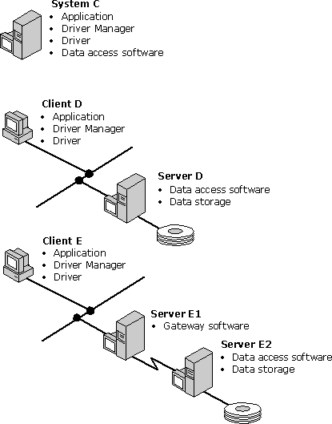

# DBMS-Based Drivers
DBMS-based drivers are used with data sources such as Oracle or SQL Server that provide a stand-alone database engine for the driver to use. These drivers access the physical data through the stand-alone engine; that is, they submit SQL statements to and retrieve results from the engine.  
  
 Because DBMS-based drivers use an existing database engine, they are usually easier to write than file-based drivers. Although a DBMS-based driver can be easily implemented by translating ODBC calls to native API calls, this results in a slower driver. A better way to implement a DBMS-based driver is to use the underlying data stream protocol, which is usually what the native API does. For example, a SQL Server driver should use TDS (the data stream protocol for SQL Server) rather than DB Library (the native API for SQL Server). An exception to this rule is when ODBC is the native API. For example, Watcom SQL is a stand-alone engine that resides on the same machine as the application and is loaded directly as the driver.  
  
 DBMS-based drivers act as the client in a client/server configuration where the data source acts as the server. In most cases, the client (driver) and server (data source) reside on different machines, although both could reside on the same machine running a multitasking operating system. A third possibility is a *gateway,* which sits between the driver and data source. A gateway is a piece of software that causes one DBMS to look like another. For example, applications written to use SQL Server can also access DB2 data through the Micro Decisionware DB2 Gateway; this product causes DB2 to look like SQL Server.  
  
 The following illustration shows three different configurations of DBMS-based drivers. In the first configuration, the driver and data source reside on the same machine. In the second, the driver and data source reside on different machines. In the third, the driver and data source reside on different machines and a gateway sits between them, residing on yet another machine.  
  
 
