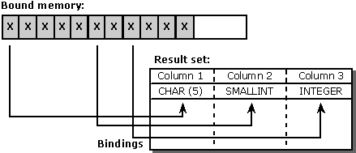
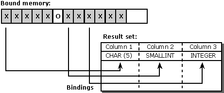
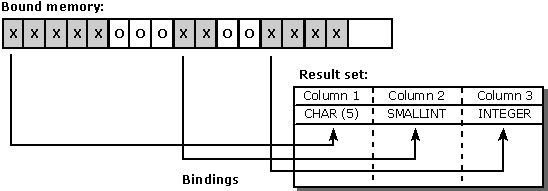

# Alignment
The alignment issues in an ODBC application are generally no different than they are in any other application. That is, most ODBC applications have few or no problems with alignment. The penalties for not aligning addresses vary with the hardware and operating system and might be as minor as a slight performance penalty or as major as a fatal run-time error. Therefore, ODBC applications, and portable ODBC applications in particular, should be careful to align data properly.  
  
 One example of when ODBC applications encounter alignment issues is when they allocate a large block of memory and bind different parts of that memory to the columns in a result set. This is most likely to occur when a generic application must determine the shape of a result set at run time and allocate and bind memory accordingly.  
  
 For example, suppose an application executes a **SELECT** statement entered by the user and fetches the results from this statement. Because the shape of this result set is not known when the program is written, the application must determine the type of each column after the result set is created and bind memory accordingly. The easiest way to do this is to allocate a large block of memory and bind different addresses in that block to each column. To access the data in a column, the application casts the memory bound to that column.  
  
 The following diagram shows a sample result set and how a block of memory might be bound to it using the default C data type for each SQL data type. Each "X" represents a single byte of memory. (This example shows only the data buffers that are bound to the columns. This is done for simplicity. In actual code, the length/indicator buffers must also be aligned.)  
  
   
  
 Assuming the bound addresses are stored in the *Address* array, the application uses the following expressions to access the memory bound to each column:  
  
```  
(SQLCHAR *)       Address[0]  
(SQLSMALLINT *)   Address[1]  
(SQLINTEGER *)    Address[2]  
```  
  
 Notice that the addresses bound to the second and third columns start on odd-numbered bytes and that the address bound to the third column is not divisible by four, which is the size of an SDWORD. On some machines, this will not be a problem; on others, it will cause a slight performance penalty; on still others, it will cause a fatal run-time error. A better solution would be to align each bound address on its natural alignment boundary. Assuming this is 1 for a UCHAR, 2 for an SWORD, and 4 for an SDWORD, this would give the result shown in the following illustration, where an "X" represents a byte of memory that is used and an "O" represents a byte of memory that is unused.  
  
   
  
 While this solution does not use all of the application's memory, it does not encounter any alignment problems. Unfortunately, it takes a fair amount of code to implement this solution, as each column must be aligned individually according to its type. A simpler solution is to align all columns on the size of the largest alignment boundary, which is 4 in the example shown in the following illustration.  
  
   
  
 Although this solution leaves larger holes, the code to implement it is relatively simple and fast. In most cases, this offsets the penalty paid in unused memory. For an example that uses this method, see [Using SQLBindCol](../../../odbc/reference/develop-app/using-sqlbindcol.md).
