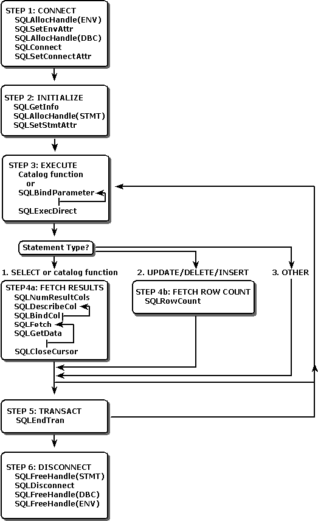

# Basic ODBC Application Steps
This section describes the general flow of ODBC applications. It is unlikely that any application calls all of these functions in exactly this order. However, most applications use some variation of these steps. The basic application steps are shown in the following illustration.  
  
   
  
 This section contains the following topics.  
  
-   [Step 1: Connect to the Data Source](../../../odbc/reference/develop-app/step-1-connect-to-the-data-source.md)  
  
-   [Step 2: Initialize the Application](../../../odbc/reference/develop-app/step-2-initialize-the-application.md)  
  
-   [Step 3: Build and Execute an SQL Statement](../../../odbc/reference/develop-app/step-3-build-and-execute-an-sql-statement.md)  
  
-   [Step 4a: Fetch the Results](../../../odbc/reference/develop-app/step-4a-fetch-the-results.md)  
  
-   [Step 4b: Fetch the Row Count](../../../odbc/reference/develop-app/step-4b-fetch-the-row-count.md)  
  
-   [Step 5: Commit the Transaction](../../../odbc/reference/develop-app/step-5-commit-the-transaction.md)  
  
-   [Step 6: Disconnect from the Data Source](../../../odbc/reference/develop-app/step-6-disconnect-from-the-data-source.md)
