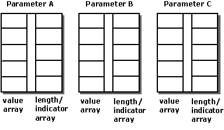
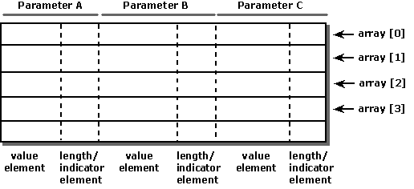

# Binding Arrays of Parameters
Applications that use arrays of parameters bind the arrays to the parameters in the SQL statement. There are two binding styles:  
  
-   Bind an array to each parameter. Each data structure (array) contains all the data for a single parameter. This is called *column-wise binding* because it binds a column of values for a single parameter.  
  
-   Define a structure to hold the parameter data for an entire set of parameters and bind an array of these structures. Each data structure contains the data for a single SQL statement. This is called *row-wise binding* because it binds a row of parameters.  
  
 As when the application binds single variables to parameters, it calls **SQLBindParameter** to bind arrays to parameters. The only difference is that the addresses passed are array addresses, not single-variable addresses. The application sets the SQL_ATTR_PARAM_BIND_TYPE statement attribute to specify whether it is using column-wise (the default) or row-wise binding. Whether to use column-wise or row-wise binding is largely a matter of application preference. Depending on how the processor accesses memory, row-wise binding might be faster. However, the difference is likely to be negligible except for very large numbers of rows of parameters.  
  
## Column-Wise Binding  
 When using column-wise binding, an application binds one or two arrays to each parameter for which data is to be provided. The first array holds the data values, and the second array holds length/indicator buffers. Each array contains as many elements as there are values for the parameter.  
  
 Column-wise binding is the default. The application also can change from row-wise binding to column-wise binding by setting the SQL_ATTR_PARAM_BIND_TYPE statement attribute. The following illustration shows how column-wise binding works.  
  
   
  
 For example, the following code binds 10-element arrays to parameters for the PartID, Description, and Price columns, and executes a statement to insert 10 rows. It uses column-wise binding.  
  
```  
#define DESC_LEN 51  
#define ARRAY_SIZE 10  
  
SQLCHAR *      Statement = "INSERT INTO Parts (PartID, Description,  Price) "  
                                                "VALUES (?, ?, ?)";  
SQLUINTEGER    PartIDArray[ARRAY_SIZE];  
SQLCHAR        DescArray[ARRAY_SIZE][DESC_LEN];  
SQLREAL        PriceArray[ARRAY_SIZE];  
SQLINTEGER     PartIDIndArray[ARRAY_SIZE], DescLenOrIndArray[ARRAY_SIZE],  
               PriceIndArray[ARRAY_SIZE];  
SQLUSMALLINT   i, ParamStatusArray[ARRAY_SIZE];  
SQLULEN ParamsProcessed;  
  
memset(DescLenOrIndArray, 0, sizeof(DescLenOrIndArray));  
memset(PartIDIndArray, 0, sizeof(PartIDIndArray));  
memset(PriceIndArray, 0, sizeof(PriceIndArray));  
  
// Set the SQL_ATTR_PARAM_BIND_TYPE statement attribute to use  
// column-wise binding.  
SQLSetStmtAttr(hstmt, SQL_ATTR_PARAM_BIND_TYPE, SQL_PARAM_BIND_BY_COLUMN, 0);  
  
// Specify the number of elements in each parameter array.  
SQLSetStmtAttr(hstmt, SQL_ATTR_PARAMSET_SIZE, ARRAY_SIZE, 0);  
  
// Specify an array in which to return the status of each set of  
// parameters.  
SQLSetStmtAttr(hstmt, SQL_ATTR_PARAM_STATUS_PTR, ParamStatusArray, 0);  
  
// Specify an SQLUINTEGER value in which to return the number of sets of  
// parameters processed.  
SQLSetStmtAttr(hstmt, SQL_ATTR_PARAMS_PROCESSED_PTR, &ParamsProcessed, 0);  
  
// Bind the parameters in column-wise fashion.  
SQLBindParameter(hstmt, 1, SQL_PARAM_INPUT, SQL_C_ULONG, SQL_INTEGER, 5, 0,  
                  PartIDArray, 0, PartIDIndArray);  
SQLBindParameter(hstmt, 2, SQL_PARAM_INPUT, SQL_C_CHAR, SQL_CHAR, DESC_LEN - 1, 0,  
                  DescArray, DESC_LEN, DescLenOrIndArray);  
SQLBindParameter(hstmt, 3, SQL_PARAM_INPUT, SQL_C_FLOAT, SQL_REAL, 7, 0,  
                  PriceArray, 0, PriceIndArray);  
  
// Set part ID, description, and price.  
for (i = 0; i < ARRAY_SIZE; i++) {  
   GetNewValues(&PartIDArray[i], DescArray[i], &PriceArray[i]);  
   PartIDIndArray[i] = 0;  
   DescLenOrIndArray[i] = SQL_NTS;  
   PriceIndArray[i] = 0;  
}  
  
// Execute the statement.  
SQLExecDirect(hstmt, Statement, SQL_NTS);  
  
// Check to see which sets of parameters were processed successfully.  
for (i = 0; i < ParamsProcessed; i++) {  
   printf("Parameter Set  Status\n");  
   printf("-------------  -------------\n");  
   switch (ParamStatusArray[i]) {  
      case SQL_PARAM_SUCCESS:  
      case SQL_PARAM_SUCCESS_WITH_INFO:  
         printf("%13d  Success\n", i);  
         break;  
  
      case SQL_PARAM_ERROR:  
         printf("%13d  Error\n", i);  
         break;  
  
      case SQL_PARAM_UNUSED:  
         printf("%13d  Not processed\n", i);  
         break;  
  
      case SQL_PARAM_DIAG_UNAVAILABLE:  
         printf("%13d  Unknown\n", i);  
         break;  
  
   }  
}  
```  
  
## Row-Wise Binding  
 When using row-wise binding, an application defines a structure for each set of parameters. The structure contains one or two elements for each parameter. The first element holds the parameter value, and the second element holds the length/indicator buffer. The application then allocates an array of these structures, which contains as many elements as there are values for each parameter.  
  
 The application declares the size of the structure to the driver with the SQL_ATTR_PARAM_BIND_TYPE statement attribute. The application binds the addresses of the parameters in the first structure of the array. Thus, the driver can calculate the address of the data for a particular row and column as  
  
```  
Address = Bound Address + ((Row Number - 1) * Structure Size) + Offset  
```  
  
 where rows are numbered from 1 to the size of the parameter set. The offset, if defined, is the value pointed to by the SQL_ATTR_PARAM_BIND_OFFSET_PTR statement attribute. The following illustration shows how row-wise binding works. The parameters can be placed in the structure in any order but are shown in sequential order for clarity.  
  
   
  
 The following code creates a structure with elements for the values to store in the PartID, Description, and Price columns. It then allocates a 10-element array of these structures and binds it to parameters for the PartID, Description, and Price columns, using row-wise binding. It then executes a statement to insert 10 rows.  
  
```  
#define DESC_LEN 51  
#define ARRAY_SIZE 10  
  
typedef tagPartStruct {  
   SQLREAL       Price;  
   SQLUINTEGER   PartID;  
   SQLCHAR       Desc[DESC_LEN];  
   SQLINTEGER    PriceInd;  
   SQLINTEGER    PartIDInd;  
   SQLINTEGER    DescLenOrInd;  
} PartStruct;  
  
PartStruct PartArray[ARRAY_SIZE];  
SQLCHAR *      Statement = "INSERT INTO Parts (PartID, Description,  
                Price) "  
               "VALUES (?, ?, ?)";  
SQLUSMALLINT   i, ParamStatusArray[ARRAY_SIZE];  
SQLULEN ParamsProcessed;  
  
// Set the SQL_ATTR_PARAM_BIND_TYPE statement attribute to use  
// column-wise binding.  
SQLSetStmtAttr(hstmt, SQL_ATTR_PARAM_BIND_TYPE, sizeof(PartStruct), 0);  
  
// Specify the number of elements in each parameter array.  
SQLSetStmtAttr(hstmt, SQL_ATTR_PARAMSET_SIZE, ARRAY_SIZE, 0);  
  
// Specify an array in which to return the status of each set of  
// parameters.  
SQLSetStmtAttr(hstmt, SQL_ATTR_PARAM_STATUS_PTR, ParamStatusArray, 0);  
  
// Specify an SQLUINTEGER value in which to return the number of sets of  
// parameters processed.  
SQLSetStmtAttr(hstmt, SQL_ATTR_PARAMS_PROCESSED_PTR, &ParamsProcessed, 0);  
  
// Bind the parameters in row-wise fashion.  
SQLBindParameter(hstmt, 1, SQL_PARAM_INPUT, SQL_C_ULONG, SQL_INTEGER, 5, 0,  
                  &PartArray[0].PartID, 0, &PartArray[0].PartIDInd);  
SQLBindParameter(hstmt, 2, SQL_PARAM_INPUT, SQL_C_CHAR, SQL_CHAR, DESC_LEN - 1, 0,  
                  PartArray[0].Desc, DESC_LEN, &PartArray[0].DescLenOrInd);  
SQLBindParameter(hstmt, 3, SQL_PARAM_INPUT, SQL_C_FLOAT, SQL_REAL, 7, 0,  
                  &PartArray[0].Price, 0, &PartArray[0].PriceInd);  
  
// Set part ID, description, and price.  
for (i = 0; i < ARRAY_SIZE; i++) {  
   GetNewValues(&PartArray[i].PartID, PartArray[i].Desc, &PartArray[i].Price);  
   PartArray[0].PartIDInd = 0;  
   PartArray[0].DescLenOrInd = SQL_NTS;  
   PartArray[0].PriceInd = 0;  
}  
  
// Execute the statement.  
SQLExecDirect(hstmt, Statement, SQL_NTS);  
  
// Check to see which sets of parameters were processed successfully.  
for (i = 0; i < ParamsProcessed; i++) {  
   printf("Parameter Set  Status\n");  
   printf("-------------  -------------\n");  
   switch (ParamStatusArray[i]) {  
      case SQL_PARAM_SUCCESS:  
      case SQL_PARAM_SUCCESS_WITH_INFO:  
         printf("%13d  Success\n", i);  
         break;  
  
      case SQL_PARAM_ERROR:  
         printf("%13d  Error\n", i);  
         break;  
  
      case SQL_PARAM_UNUSED:  
         printf("%13d  Not processed\n", i);  
         break;  
  
      case SQL_PARAM_DIAG_UNAVAILABLE:  
         printf("%13d  Unknown\n", i);  
         break;  
  
   }  
```
