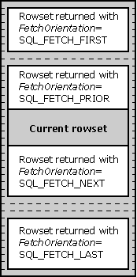

# Block Cursors
Many applications spend a significant amount of time bringing data across the network. Part of this time is spent actually bringing the data across the network, and part of it is spent on network overhead, such as the call made by the driver to request a row of data. The latter time can be reduced if the application makes efficient use of *block,* or *fat,* *cursors,* which can return more than one row at a time.  
  
 An application always has the option of using a block cursor. On data sources from which only one row at a time can be fetched, block cursors must be simulated in the driver. This can be done by performing multiple single-row fetches. While this is unlikely to provide any performance gains, it opens opportunities for applications. Such applications will then experience performance increases as DBMSs implement block cursors natively and the drivers associated with those DBMSs expose them.  
  
 The rows returned in a single fetch with a block cursor are called the *rowset*. It is important not to confuse the rowset with the result set. The result set is maintained at the data source, while the rowset is maintained in application buffers. While the result set is fixed, the rowset is not - it changes position and contents each time a new set of rows is fetched. Just as a single-row cursor such as the traditional SQL forward-only cursor points to a current row, a block cursor points to the rowset, which can be thought of as *current rows*.  
  
 To perform operations that operate on a single row when multiple rows have been fetched, the application must first indicate which row is the current row. The current row is required by calls to **SQLGetData** and positioned update and delete statements. When a block cursor first returns a rowset, the current row is the first row of the rowset. To change the current row, the application calls **SQLSetPos** or **SQLBulkOperations** (to update by bookmark). The following illustration shows the relationship of the result set, rowset, current row, rowset cursor, and block cursor. For more information, see [Using Block Cursors](../../../odbc/reference/develop-app/using-block-cursors.md), later in this section, and [Positioned Update and Delete Statements](../../../odbc/reference/develop-app/positioned-update-and-delete-statements.md) and [Updating Data with SQLSetPos](../../../odbc/reference/develop-app/updating-data-with-sqlsetpos.md).  
  
   
  
 Whether a cursor is a block cursor is independent of whether it is scrollable. For example, most of the work in a report application is spent retrieving and printing rows. Because of this, it will work fastest with a forward-only, block cursor. It uses a forward-only cursor to avoid the expense of a scrollable cursor, and a block cursor to reduce the network traffic.  
  
 This section contains the following topics.  
  
-   [Binding Columns for Use with Block Cursors](../../../odbc/reference/develop-app/binding-columns-for-use-with-block-cursors.md)  
  
-   [Using Block Cursors](../../../odbc/reference/develop-app/using-block-cursors.md)  
  
-   [Row Status Array](../../../odbc/reference/develop-app/row-status-array.md)
