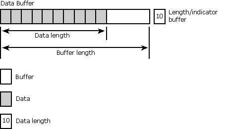

# Buffers
A buffer is any piece of application memory used to pass data between the application and the driver. For example, application buffers can be associated with, or *bound to,* result set columns with **SQLBindCol**. As each row is fetched, the data is returned for each column in these buffers. *Input buffers* are used to pass data from the application to the driver; *output buffers* are used to return data from the driver to the application.  
  
> [!NOTE]  
>  If an ODBC function returns SQL_ERROR, the contents of any output arguments to that function are undefined.  
  
 This discussion concerns itself primarily with buffers of indeterminate type. The addresses of these buffers appear as arguments of type SQLPOINTER, such as the *TargetValuePtr* argument in **SQLBindCol**. However, some of the items discussed here, such as the arguments used with buffers, also apply to arguments used to pass strings to the driver, such as the *TableName* argument in **SQLTables**.  
  
 These buffers usually come in pairs. *Data buffers* are used to pass the data itself, while *length/indicator buffers* are used to pass the length of the data in the data buffer or a special value such as SQL_NULL_DATA, which indicates that the data is NULL. The length of the data in a data buffer is different from the length of the data buffer itself. The following illustration shows the relationship between the data buffer and the length/indicator buffer.  
  
   
  
 A length/indicator buffer is required whenever the data buffer contains variable-length data, such as character or binary data. If the data buffer contains fixed-length data, such as an integer or date structure, a length/indicator buffer is needed only to pass indicator values because the length of the data is already known. If an application uses a length/indicator buffer with fixed-length data, the driver ignores any lengths passed in it.  
  
 The length of both the data buffer and the data it contains is measured in bytes, as opposed to characters. This distinction is unimportant for programs that use ANSI strings because lengths in bytes and characters are the same.  
  
 When the data buffer represents a driver-defined descriptor field, diagnostic field, or attribute, the application should indicate to the Driver Manager the nature of the function argument that indicates the value for the field or attribute. The application does this by setting the length argument in any function call that sets the field or attribute to one of the following values. (The same is true for functions that retrieve the values of the field or attribute, with the exception that the argument points to the values that for the setting function are in the argument itself.)  
  
-   If the function argument that indicates the value for the field or attribute is a pointer to a character string, the *length* argument is the length of the string or SQL_NTS.  
  
-   If the function argument that indicates the value for the field or attribute is a pointer to a binary buffer, the application places the result of the SQL_LEN_BINARY_ATTR(*length*) macro in the *length* argument. This places a negative value in the *length* argument.  
  
-   If the function argument that indicates the value for the field or attribute is a pointer to a value other than a character string or a binary string, the *length* argument should have the value SQL_IS_POINTER.  
  
-   If the function argument that indicates the value for the field or attribute contains a fixed-length value, the *length* argument is SQL_IS_INTEGER, SQL_IS_UINTEGER, SQL_IS_SMALLINT, or SQL_ISI_USMALLINT, as appropriate.  
  
 This section contains the following topics.  
  
-   [Deferred Buffers](../../../odbc/reference/develop-app/deferred-buffers.md)  
  
-   [Allocating and Freeing Buffers](../../../odbc/reference/develop-app/allocating-and-freeing-buffers.md)  
  
-   [Using Data Buffers](../../../odbc/reference/develop-app/using-data-buffers.md)
