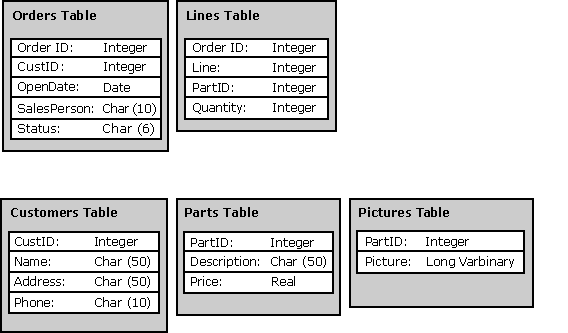

# Catalog Functions
All databases have a structure that outlines how data will be stored in the database. For example, a simple sales order database might have the structure shown in the following illustration, in which the ID columns are used to link the tables.  
  
   
  
 This structure, along with other information such as privileges, is stored in a set of system tables called the database's *catalog,* which is also known as a *data dictionary*.  
  
 An application can discover this structure through calls to the *catalog functions*. The catalog functions return information in result sets and are usually implemented through **SELECT** statements against the tables in the catalog. For example, an application might request a result set containing information about all the tables on the system or all the columns in a particular table.  
  
 This section contains the following topics.  
  
-   [Uses of Catalog Data](../../../odbc/reference/develop-app/uses-of-catalog-data.md)  
  
-   [Catalog Functions in ODBC](../../../odbc/reference/develop-app/catalog-functions-in-odbc.md)
