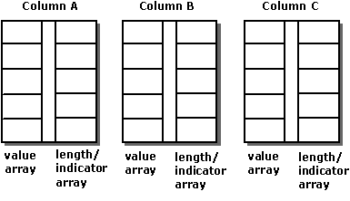

# Column-Wise Binding
When using column-wise binding, an application binds one or two, or in some cases three, arrays to each column for which data is to be returned. The first array holds the data values, and the second array holds length/indicator buffers. Indicators and length values can be stored in separate buffers by setting the SQL_DESC_INDICATOR_PTR and SQL_DESC_OCTET_LENGTH_PTR descriptor fields to different values; if this is done, a third array is bound. Each array contains as many elements as there are rows in the rowset.  
  
 The application declares that it is using column-wise binding with the SQL_ATTR_ROW_BIND_TYPE statement attribute, which determines the bind type for rowset buffers as opposed to parameter set buffers. The driver returns the data for each row in successive elements of each array. The following illustration shows how column-wise binding works.  
  
   
  
 For example, the following code binds 10-element arrays to the OrderID, SalesPerson, and Status columns:  
  
```  
#define ROW_ARRAY_SIZE 10  
  
SQLUINTEGER    OrderIDArray[ROW_ARRAY_SIZE], NumRowsFetched;  
SQLCHAR        SalesPersonArray[ROW_ARRAY_SIZE][11],  
               StatusArray[ROW_ARRAY_SIZE][7];  
SQLINTEGER     OrderIDIndArray[ROW_ARRAY_SIZE],  
               SalesPersonLenOrIndArray[ROW_ARRAY_SIZE],  
               StatusLenOrIndArray[ROW_ARRAY_SIZE];  
SQLUSMALLINT   RowStatusArray[ROW_ARRAY_SIZE], i;  
SQLRETURN      rc;  
SQLHSTMT       hstmt;  
  
// Set the SQL_ATTR_ROW_BIND_TYPE statement attribute to use  
// column-wise binding. Declare the rowset size with the  
// SQL_ATTR_ROW_ARRAY_SIZE statement attribute. Set the  
// SQL_ATTR_ROW_STATUS_PTR statement attribute to point to the  
// row status array. Set the SQL_ATTR_ROWS_FETCHED_PTR statement  
// attribute to point to cRowsFetched.  
SQLSetStmtAttr(hstmt, SQL_ATTR_ROW_BIND_TYPE, SQL_BIND_BY_COLUMN, 0);  
SQLSetStmtAttr(hstmt, SQL_ATTR_ROW_ARRAY_SIZE, ROW_ARRAY_SIZE, 0);  
SQLSetStmtAttr(hstmt, SQL_ATTR_ROW_STATUS_PTR, RowStatusArray, 0);  
SQLSetStmtAttr(hstmt, SQL_ATTR_ROWS_FETCHED_PTR, &NumRowsFetched, 0);  
  
// Bind arrays to the OrderID, SalesPerson, and Status columns.  
SQLBindCol(hstmt, 1, SQL_C_ULONG, OrderIDArray, 0, OrderIDIndArray);  
SQLBindCol(hstmt, 2, SQL_C_CHAR, SalesPersonArray, sizeof(SalesPersonArray[0]),  
            SalesPersonLenOrIndArray);  
SQLBindCol(hstmt, 3, SQL_C_CHAR, StatusArray, sizeof(StatusArray[0]),  
            StatusLenOrIndArray);  
  
// Execute a statement to retrieve rows from the Orders table.  
SQLExecDirect(hstmt, "SELECT OrderID, SalesPerson, Status FROM Orders", SQL_NTS);  
  
// Fetch up to the rowset size number of rows at a time. Print the actual  
// number of rows fetched; this number is returned in NumRowsFetched.  
// Check the row status array to print only those rows successfully  
// fetched. Code to check if rc equals SQL_SUCCESS_WITH_INFO or  
// SQL_ERROR not shown.  
while ((rc = SQLFetchScroll(hstmt,SQL_FETCH_NEXT,0)) != SQL_NO_DATA) {  
   for (i = 0; i < NumRowsFetched; i++) {  
      if ((RowStatusArray[i] == SQL_ROW_SUCCESS) ||  
            (RowStatusArray[i] == SQL_ROW_SUCCESS_WITH_INFO)) {  
         if (OrderIDIndArray[i] == SQL_NULL_DATA)  
            printf(" NULL      ");  
         else  
            printf("%d\t", OrderIDArray[i]);  
         if (SalesPersonLenOrIndArray[i] == SQL_NULL_DATA)  
            printf(" NULL      ");  
         else  
            printf("%s\t", SalesPersonArray[i]);  
         if (StatusLenOrIndArray[i] == SQL_NULL_DATA)  
            printf(" NULL\n");  
         else  
            printf("%s\n", StatusArray[i]);  
      }  
   }  
}  
  
// Close the cursor.  
SQLCloseCursor(hstmt);  
```
