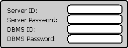
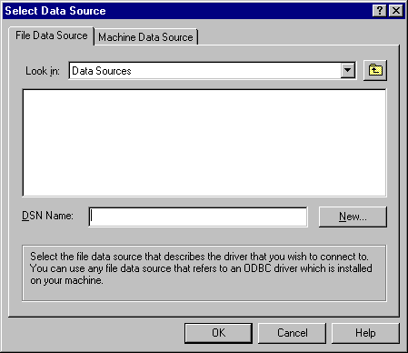

# Prompting the User for Connection Information
If the application uses **SQLConnect** and needs to prompt the user for any connection information, such as a user name and password, it must do so itself. While this allows the application to control its "look and feel," it might force the application to contain driver-specific code. This occurs when the application needs to prompt the user for driver-specific connection information. This presents an impossible situation for generic applications, which are designed to work with any and all drivers, including drivers that do not exist when the application is written.  
  
 **SQLDriverConnect** can prompt the user for connection information. For example, the custom program mentioned earlier could pass the following connection string to **SQLDriverConnect**:  
  
```  
DSN=XYZ Corp;  
```  
  
 The driver might then display a dialog box that prompts for user IDs and passwords, similar to the following illustration.  
  
   
  
 That the driver can prompt for connection information is particularly useful to generic and vertical applications. These applications should not contain driver-specific information, and having the driver prompt for the information it needs keeps that information out of the application. This is shown by the previous two examples. When the application passed only the data source name to the driver, the application did not contain any driver-specific information and was therefore not tied to a particular driver. When the application passed a complete connection string to the driver, it was tied to the driver that could interpret that string.  
  
 A generic application might take this one step further and not even specify a data source. When **SQLDriverConnect** receives an empty connection string, the Driver Manager displays the following dialog box.  
  
   
  
 After the user selects a data source, the Driver Manager constructs a connection string specifying that data source and passes it to the driver. The driver can then prompt the user for any additional information it needs.  
  
 The conditions under which the driver prompts the user are controlled by the *DriverCompletion* flag; there are options to always prompt, prompt if necessary, or never prompt. For a complete description of this flag, see the [SQLDriverConnect](../../../odbc/reference/syntax/sqldriverconnect-function.md) function description.
