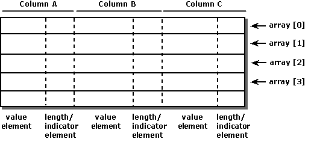

# Row-Wise Binding
When using row-wise binding, an application defines a structure containing one or two, or in some cases three, elements for each column for which data is to be returned. The first element holds the data value, and the second element holds the length/indicator buffer. Indicators and length values can be stored in separate buffers by setting the SQL_DESC_INDICATOR_PTR and SQL_DESC_OCTET_LENGTH_PTR descriptor fields to different values; if this is done, the structure contains a third element. The application then allocates an array of these structures, which contains as many elements as there are rows in the rowset.  
  
 The application declares the size of the structure to the driver with the SQL_ATTR_ROW_BIND_TYPE statement attribute and binds the address of each member in the first element of the array. Thus, the driver can calculate the address of the data for a particular row and column as  
  
```  
Address = Bound Address + ((Row Number - 1) * Structure Size)  
```  
  
 where rows are numbered from 1 to the size of the rowset. (One is subtracted from the row number because array indexing in C is zero-based.) The following illustration shows how row-wise binding works. Generally, only columns that will be bound are included in the structure. The structure can contain fields that are unrelated to result set columns. The columns can be placed in the structure in any order but are shown in sequential order for clarity.  
  
   
  
 For example, the following code creates a structure with elements in which to return data for the OrderID, SalesPerson, and Status columns, and length/indicators for the SalesPerson and Status columns. It allocates 10 of these structures and binds them to the OrderID, SalesPerson, and Status columns.  
  
```  
#define ROW_ARRAY_SIZE 10  
  
// Define the ORDERINFO struct and allocate an array of 10 structs.  
typedef struct {  
   SQLUINTEGER   OrderID;  
   SQLINTEGER    OrderIDInd;  
   SQLCHAR       SalesPerson[11];  
   SQLINTEGER    SalesPersonLenOrInd;  
   SQLCHAR       Status[7];  
   SQLINTEGER    StatusLenOrInd;  
} ORDERINFO;  
ORDERINFO OrderInfoArray[ROW_ARRAY_SIZE];  
  
SQLULEN    NumRowsFetched;  
SQLUSMALLINT   RowStatusArray[ROW_ARRAY_SIZE], i;  
SQLRETURN      rc;  
SQLHSTMT       hstmt;  
  
// Specify the size of the structure with the SQL_ATTR_ROW_BIND_TYPE  
// statement attribute. This also declares that row-wise binding will  
// be used. Declare the rowset size with the SQL_ATTR_ROW_ARRAY_SIZE  
// statement attribute. Set the SQL_ATTR_ROW_STATUS_PTR statement  
// attribute to point to the row status array. Set the  
// SQL_ATTR_ROWS_FETCHED_PTR statement attribute to point to  
// NumRowsFetched.  
SQLSetStmtAttr(hstmt, SQL_ATTR_ROW_BIND_TYPE, sizeof(ORDERINFO), 0);  
SQLSetStmtAttr(hstmt, SQL_ATTR_ROW_ARRAY_SIZE, ROW_ARRAY_SIZE, 0);  
SQLSetStmtAttr(hstmt, SQL_ATTR_ROW_STATUS_PTR, RowStatusArray, 0);  
SQLSetStmtAttr(hstmt, SQL_ATTR_ROWS_FETCHED_PTR, &NumRowsFetched, 0);  
  
// Bind elements of the first structure in the array to the OrderID,  
// SalesPerson, and Status columns.  
SQLBindCol(hstmt, 1, SQL_C_ULONG, &OrderInfoArray[0].OrderID, 0, &OrderInfoArray[0].OrderIDInd);  
SQLBindCol(hstmt, 2, SQL_C_CHAR, OrderInfoArray[0].SalesPerson,  
            sizeof(OrderInfoArray[0].SalesPerson),  
            &OrderInfoArray[0].SalesPersonLenOrInd);  
SQLBindCol(hstmt, 3, SQL_C_CHAR, OrderInfoArray[0].Status,  
            sizeof(OrderInfoArray[0].Status), &OrderInfoArray[0].StatusLenOrInd);  
  
// Execute a statement to retrieve rows from the Orders table.  
SQLExecDirect(hstmt, "SELECT OrderID, SalesPerson, Status FROM Orders", SQL_NTS);  
  
// Fetch up to the rowset size number of rows at a time. Print the actual  
// number of rows fetched; this number is returned in NumRowsFetched.  
// Check the row status array to print only those rows successfully  
// fetched. Code to check if rc equals SQL_SUCCESS_WITH_INFO or  
// SQL_ERRORnot shown.  
while ((rc = SQLFetchScroll(hstmt,SQL_FETCH_NEXT,0)) != SQL_NO_DATA) {  
   for (i = 0; i < NumRowsFetched; i++) {  
      if (RowStatusArray[i] == SQL_ROW_SUCCESS|| RowStatusArray[i] ==   
         SQL_ROW_SUCCESS_WITH_INFO) {  
         if (OrderInfoArray[i].OrderIDInd == SQL_NULL_DATA)  
            printf(" NULL      ");  
         else  
            printf("%d\t", OrderInfoArray[i].OrderID);  
         if (OrderInfoArray[i].SalesPersonLenOrInd == SQL_NULL_DATA)  
            printf(" NULL      ");  
         else  
            printf("%s\t", OrderInfoArray[i].SalesPerson);  
         if (OrderInfoArray[i].StatusLenOrInd == SQL_NULL_DATA)  
            printf(" NULL\n");  
         else  
            printf("%s\n", OrderInfoArray[i].Status);  
      }  
   }  
}  
  
// Close the cursor.  
SQLCloseCursor(hstmt);  
```
