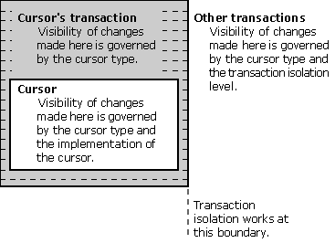

# Scrollable Cursors and Transaction Isolation
The following table lists the factors governing the visibility of changes.  
  
|Changes made by:|Visibility depends on:|  
|----------------------|----------------------------|  
|Cursor|Cursor type, cursor implementation|  
|Other statements in same transaction|Cursor type|  
|Statements in other transactions|Cursor type, transaction isolation level|  
  
 These factors are shown in the following illustration.  
  
   
  
 The following table summarizes the ability of each cursor type to detect changes made by itself, by other operations in its own transaction, and by other transactions. The visibility of the latter changes depends on the cursor type and the isolation level of the transaction containing the cursor.  
  
|Cursor type\action|Self|Own   Txn|Othr   Txn   (RU[a])|Othr   Txn   (RC[a])|Othr   Txn   (RR[a])|Othr   Txn   (S[a])|  
|-------------------------|----------|-----------------|----------------------------------|----------------------------------|----------------------------------|---------------------------------|  
|Static|||||||  
|Insert|Maybe[b]|No|No|No|No|No|  
|Update|Maybe[b]|No|No|No|No|No|  
|Delete|Maybe[b]|No|No|No|No|No|  
|Keyset-driven|||||||  
|Insert|Maybe[b]|No|No|No|No|No|  
|Update|Yes|Yes|Yes|Yes|No|No|  
|Delete|Maybe[b]|Yes|Yes|Yes|No|No|  
|Dynamic|||||||  
|Insert|Yes|Yes|Yes|Yes|Yes|No|  
|Update|Yes|Yes|Yes|Yes|No|No|  
|Delete|Yes|Yes|Yes|Yes|No|No|  
  
 [a]   The letters in parentheses indicate the isolation level of the transaction containing the cursor; the isolation level of the other transaction (in which the change was made) is irrelevant.  
  
 RU: Read uncommitted  
  
 RC: Read committed  
  
 RR: Repeatable read  
  
 S:  Serializable  
  
 [b]   Depends on how the cursor is implemented. Whether the cursor can detect such changes is reported through the SQL_STATIC_SENSITIVITY option in **SQLGetInfo**.
