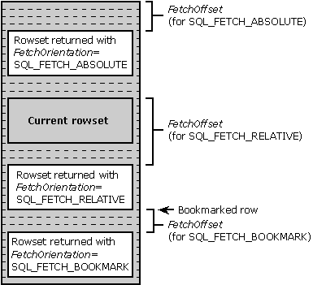

# Scrolling and Fetching Rows (ODBC)
When using a scrollable cursor, applications call **SQLFetchScroll** to position the cursor and fetch rows. **SQLFetchScroll** supports relative scrolling (next, prior, and relative *n* rows), absolute scrolling (first, last, and row *n*), and positioning by bookmark. The *FetchOrientation* and *FetchOffset* arguments in **SQLFetchScroll** specify which rowset to fetch, as shown in the following diagrams.  
  
   
  
 **Fetching Next, Prior, First, and Last Rowsets**  
  
   
  
 **Fetching Absolute, Relative, and Bookmarked Rowsets**  
  
 **SQLFetchScroll** positions the cursor to the specified row and returns the rows in the rowset starting with that row. If the specified rowset overlaps the end of the result set, a partial rowset is returned. If the specified rowset overlaps the start of the result set, the first rowset in the result set is usually returned; for complete details, see the [SQLFetchScroll](../../../odbc/reference/syntax/sqlfetchscroll-function.md) function description.  
  
 In some cases, the application might want to position the cursor without retrieving any data. For example, it might want to test whether a row exists or just get the bookmark for the row without bringing other data across the network. To do this, it sets the SQL_ATTR_RETRIEVE_DATA statement attribute to SQL_RD_OFF. The variable bound to the bookmark column (if any) is always updated, regardless of the setting of this statement attribute.  
  
 After the rowset has been retrieved, the application can call **SQLSetPos** to position to a particular row in the rowset or refresh rows in the rowset. For more information on using **SQLSetPos**, see [Updating Data with SQLSetPos](../../../odbc/reference/develop-app/updating-data-with-sqlsetpos.md).  
  
> [!NOTE]  
>  Scrolling is supported in ODBC 2.*x* drivers by **SQLExtendedFetch**. For more information, see [Block Cursors, Scrollable Cursors, and Backward Compatibility](../../../odbc/reference/appendixes/block-cursors-scrollable-cursors-and-backward-compatibility.md)in Appendix G: Driver Guidelines for Backward Compatibility.
