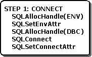

# Step 1: Connect to the Data Source
The first step in any application is to connect to the data source. This phase, including the functions it requires, is shown in the following illustration.  
  
   
  
 The first step in connecting to the data source is to load the Driver Manager and allocate the environment handle with **SQLAllocHandle**. For more information, see [Allocating the Environment Handle](../../../odbc/reference/develop-app/allocating-the-environment-handle.md).  
  
 The application then registers the version of ODBC to which it conforms by calling **SQLSetEnvAttr** with the SQL_ATTR_APP_ODBC_VER environment attribute. For more information, see [Declaring the Application's ODBC Version](../../../odbc/reference/develop-app/declaring-the-application-s-odbc-version.md) and [Backward Compatibility and Standards Compliance](../../../odbc/reference/develop-app/backward-compatibility-and-standards-compliance.md).  
  
 Next, the application allocates a connection handle with **SQLAllocHandle** and connects to the data source with **SQLConnect**, **SQLDriverConnect**, or **SQLBrowseConnect**. For more information, see [Allocating a Connection Handle](../../../odbc/reference/develop-app/allocating-a-connection-handle-odbc.md) and [Establishing a Connection](../../../odbc/reference/develop-app/establishing-a-connection.md).  
  
 The application then sets any connection attributes, such as whether to manually commit transactions. For more information, see [Connection Attributes](../../../odbc/reference/develop-app/connection-attributes.md).
