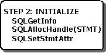

# Step 2: Initialize the Application
The second step is to initialize the application, as shown in the following illustration. Exactly what is done here varies with the application.  
  
   
  
 At this point, it is common to use **SQLGetInfo** to discover the capabilities of the driver. For more information, see [Considering Database Features to Use](../../../odbc/reference/develop-app/considering-database-features-to-use.md).  
  
 All applications need to allocate a statement handle with **SQLAllocHandle**, and many applications set statement attributes, such as the cursor type, with **SQLSetStmtAttr**. For more information, see [Allocating a Statement Handle](../../../odbc/reference/develop-app/allocating-a-statement-handle-odbc.md) and [Statement Attributes](../../../odbc/reference/develop-app/statement-attributes.md).
