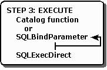

# Step 3: Build and Execute an SQL Statement
The third step is to build and execute an SQL statement, as shown in the following illustration. The methods used to perform this step are likely to vary tremendously. The application might prompt the user to enter an SQL statement, build an SQL statement based on user input, or use a hard-coded SQL statement. For more information, see [Constructing SQL Statements](../../../odbc/reference/develop-app/constructing-sql-statements.md).  
  
   
  
 If the SQL statement contains parameters, the application binds them to application variables by calling **SQLBindParameter** for each parameter. For more information, see [Statement Parameters](../../../odbc/reference/develop-app/statement-parameters.md).  
  
 After the SQL statement is built and any parameters are bound, the statement is executed with **SQLExecDirect**. If the statement will be executed multiple times, it can be prepared with **SQLPrepare** and executed with **SQLExecute**. For more information, see [Executing a Statement](../../../odbc/reference/develop-app/executing-a-statement.md).  
  
 The application might also forgo executing an SQL statement altogether and instead call a function to return a result set containing catalog information, such as the available columns or tables. For more information, see [Uses of Catalog Data](../../../odbc/reference/develop-app/uses-of-catalog-data.md).  
  
 The application's next action depends on the type of SQL statement executed.  
  
|Type of SQL statement|Proceed to|  
|---------------------------|----------------|  
|**SELECT** or catalog function|[Step 4a: Fetch the Results](../../../odbc/reference/develop-app/step-4a-fetch-the-results.md)|  
|**UPDATE**, **DELETE**, or **INSERT**|[Step 4b: Fetch the Row Count](../../../odbc/reference/develop-app/step-4b-fetch-the-row-count.md)|  
|All other SQL statements|Step 3: Build and Execute an SQL Statement (this topic) or [Step 5: Commit the Transaction](../../../odbc/reference/develop-app/step-5-commit-the-transaction.md)|
