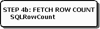

# Step 4b: Fetch the Row Count
The next step is to fetch the row count, as shown in the following illustration.  
  
   
  
 If the statement executed in Step 3 was an **UPDATE**, **DELETE**, or **INSERT** statement, the application retrieves the count of affected rows with **SQLRowCount**. For more information, see [Determining the Number of Affected Rows](../../../odbc/reference/develop-app/determining-the-number-of-affected-rows.md).  
  
 The application now returns to step 3 to execute another statement in the same transaction or proceeds to step 5 to commit or roll back the transaction.
