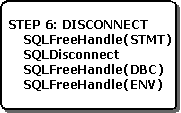

# Step 6: Disconnect from the Data Source
The final step is to disconnect from the data source, as shown in the following illustration. First, the application frees any statement handles by calling **SQLFreeHandle**. For more information, see [Freeing a Statement Handle](../../../odbc/reference/develop-app/freeing-a-statement-handle-odbc.md).  
  
   
  
 Next, the application disconnects from the data source with **SQLDisconnect** and frees the connection handle with **SQLFreeHandle**. For more information, see [Disconnecting from a Data Source or Driver](../../../odbc/reference/develop-app/disconnecting-from-a-data-source-or-driver.md).  
  
 Finally, the application frees the environment handle with **SQLFreeHandle** and unloads the Driver Manager. For more information, see [Allocating the Environment Handle](../../../odbc/reference/develop-app/allocating-the-environment-handle.md).
