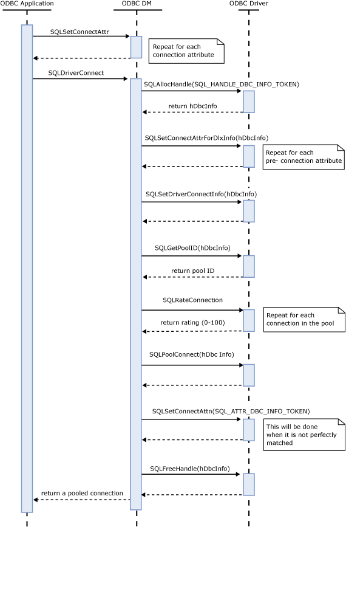
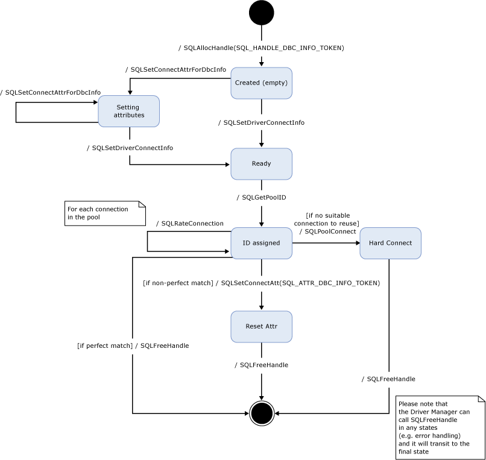

# Developing Connection-Pool Awareness in an ODBC Driver
This topic discusses the details of developing an ODBC driver that contains information about how the driver should provide connection pooling services.  
  
## Enabling Driver-Aware Connection Pooling  
 A driver must implement the following ODBC Service Provider Interface (SPI) functions:  
  
-   SQLSetConnectAttrForDbcInfo  
  
-   SQLSetConnectInfo  
  
-   SQLSetDriverConnectInfo  
  
-   SQLGetPoolID  
  
-   SQLRateConnection  
  
-   SQLPoolConnect  
  
-   SQLCleanupConnectionPoolID  
  
 See [ODBC Service Provider Interface (SPI) Reference](../../../odbc/reference/syntax/odbc-service-provider-interface-spi-reference.md) for more information.  
  
 A driver must also implement the following existing functions so that the driver-aware pooling can be enabled:  
  
|Function|Added Functionality|  
|--------------|-------------------------|  
|[SQLAllocHandle](../../../odbc/reference/syntax/sqlallochandle-function.md)   [SQLFreeHandle](../../../odbc/reference/syntax/sqlfreehandle-function.md)   [SQLGetDiagField](../../../odbc/reference/syntax/sqlgetdiagfield-function.md)   [SQLGetDiagRec](../../../odbc/reference/syntax/sqlgetdiagrec-function.md)|Support the new handle type: SQL_HANDLE_DBC_INFO_TOKEN (see the description below).|  
|[SQLSetConnectAttr](../../../odbc/reference/syntax/sqlsetconnectattr-function.md)|Support the new set-only connection attribute: SQL_ATTR_DBC_INFO_TOKEN for resetting the connection (see the description below).|  
  
> [!NOTE]  
>  Deprecated functions such as **SQLError** and **SQLSetConnectOption** are not supported for driver-aware connection pooling.  
  
## The Pool ID  
 The pool ID is a pointer-length driver-specific ID to represent a particular group of connections that can be used interchangeably. Given a set of connection information, a driver should be able to quickly deduce the corresponding pool ID.  
  
 For example, the pool ID should encode the server name and credential information. However, the database name is not needed because a driver may be able to reuse a connection and then change the database in less time than making a new connection.  
  
 A driver should define a set of key attributes, which will comprise the pool ID. The value of these key attributes can come from connection attributes, connection string, and DSN. In case there are any conflicts in these sources, the existing, driver-specific resolution policy should be used for backward compatibility.  
  
 The Driver Manager will use a different pool for different pool IDs. All connections in the same pool are reusable. The Driver Manager will never reuse a connection with a different pool ID.  
  
 Therefore drivers should assign a unique pool ID for every group of connections with the same value in their defined key attributes. If a driver uses the same pool ID for two connections with different values in their key attributes, the Driver Manager will still put them into the same pool (the Driver Manager knows nothing about the driver-specific key attributes). This means that the driver will need to report to the Driver Manager that a connection with a different set of key attributes is not reusable inside [SQLRateConnection Function](../../../odbc/reference/syntax/sqlrateconnection-function.md). This can decrease performance and this is not recommended.  
  
 The Driver Manager will not reuse a connection allocated from another driver environment even if all connection information matches. The Driver Manager will use a different pool for different environment, even when connections have the same pool ID. Therefore, the pool ID is local to its driver environment.  
  
 The function for getting the pool ID from the driver is [SQLGetPoolID Function](../../../odbc/reference/syntax/sqlgetpoolid-function.md).  
  
## The Connection Rating  
 Compared to establishing a new connection, you can get better performance by resetting some connection information (such as DATABASE) in a pooled connection. So, you may not want the database name to be in your set of key attributes. Otherwise, you can have a separate pool for each database, which may not be good in mid-tier applications, where customers use various different connection strings.  
  
 Whenever you reuse a connection that has some attribute mismatch, you should reset the mismatched attributes based on the new application request, so that the returned connection is identical to the application request (see the discussion of the attribute SQL_ATTR_DBC_INFO_TOKEN in [SQLSetConnectAttr Function](../syntax/sqlsetconnectattr-function.md)). However, resetting those attributes may decrease performance. For example, resetting a database requires a network call to server. Therefore, reuse a connection that is perfectly matched, if one is available.  
  
 A rating function in the driver can evaluate an existing connection with a new connection request. For example, the driver's rating function can determine:  
  
-   If the existing connection is perfectly matched with the request.  
  
-   If there are only some insignificant mismatches, such as connection timeout, which do not require communication with the server to reset.  
  
-   If there are some mismatched attributes that require a communication with the server to reset but would still result in better performance than establishing a new connection.  
  
-   If the mismatched occurred for an attribute that is very time-consuming to reset (the developer of the driver may consider adding this attribute into the set of key attributes, which is used to generate the pool ID).  
  
 A score between 0 and 100 is possible, where 0 means do not reuse and 100 means perfectly matched. [SQLRateConnection](../../../odbc/reference/syntax/sqlrateconnection-function.md) is the function for rating a connection.  
  
## New ODBC Handle - SQL_HANDLE_DBC_INFO_TOKEN  
 To support driver-aware connection pooling, the driver needs connection information to compute the Pool ID. The driver also needs connection information to compare new connection requests with connections in the pool.  Whenever no connection in the pool can be reused, the driver has to establish a new connection, hence requiring connection information.  
  
 Since connection information can come from multiple sources (connection string, connection attributes, and DSN), the driver may need to parse the connection string and resolve the conflict between these sources in each of the above function call.  
  
 Therefore, a new ODBC handle is introduced: SQL_HANDLE_DBC_INFO_TOKEN. With SQL_HANDLE_DBC_INFO_TOKEN, a driver does not need to parse the connection string and resolve conflicts in connection information more than once. Since this is a driver-specific data structure, the driver can store data such as connection information or pool ID.  
  
 This handle is only used as an interface between the Driver Manager and driver. An application cannot allocate this handle directly.  
  
 The parent handle of this handle is of type SQL_HANDLE_ENV, meaning that the driver can obtain the environment information from the HENV handle during connection information resolution.  
  
 Whenever it receives a new connection request, the Driver Manager will allocate a handle of type SQL_HANDLE_DBC_INFO_TOKEN for storing connection information, after it confirms that the driver supports connection-pool awareness. When finished using the handle (but before returning some return codes other than SQL_STILL_EXECUTING from [SQLDriverConnect](../../../odbc/reference/syntax/sqldriverconnect-function.md) or [SQLConnect](../../../odbc/reference/syntax/sqlconnect-function.md)), the Driver Manager will free the handle. Therefore, the handle is created after the SQLAllocHandle call, and destroyed after the SQLFreeHandle call. The Driver Manager guarantees the handle will be freed before freeing its associated HENV (when [SQLDriverConnect](../../../odbc/reference/syntax/sqldriverconnect-function.md) or [SQLConnect](../../../odbc/reference/syntax/sqlconnect-function.md) returns an error).  
  
 The driver should modify the following functions to accept the new handle type SQL_HANDLE_DBC_INFO_TOKEN:  
  
1.  [SQLAllocHandle](../../../odbc/reference/syntax/sqlallochandle-function.md)  
  
2.  [SQLFreeHandle](../../../odbc/reference/syntax/sqlfreehandle-function.md)  
  
3.  [SQLGetDiagField](../../../odbc/reference/syntax/sqlgetdiagfield-function.md)  
  
4.  [SQLGetDiagRec](../../../odbc/reference/syntax/sqlgetdiagrec-function.md)  
  
 The Driver Manager guarantees that multiple threads will not use the same SQL_HANDLE_DBC_INFO_TOKEN handle simultaneously. Therefore, the synchronization model of this handle can be very simple inside the driver. The Driver Manager will not take an environment lock before allocating and freeing SQL_HANDLE_DBC_INFO_TOKEN.  
  
 The Driver Manager's **SQLAllocHandle** and **SQLFreeHandle** will not accept this new handle type.  
  
 SQL_HANDLE_DBC_INFO_TOKEN may contain confidential information such as credentials. Therefore, a driver should securely clear the memory buffer (using [SecureZeroMemory](https://msdn.microsoft.com/library/windows/desktop/aa366877\(v=vs.85\).aspx)) that contains the sensitive information before releasing this handle with **SQLFreeHandle**. Whenever an application's environment handle is closed, all associated connection pools will be closed.  
  
## Driver Manager Connection Pool Rating Algorithm  
 This section discusses the rating algorithm for Driver Manager connection pooling. Driver developers can implement the same algorithm for backward compatibility. This algorithm may not be the best one. You should refine this algorithm based your implementation (otherwise, there is no reason to implement this feature).  
  
 The Driver Manager will return an integral rating from 0 to 100 for each connection from the pool. 0 means the connection cannot be reused and 100 indicates a perfect matched. Assume the connection request is named hRequest and the existing connection from the pool is named as hCandidate. If any one of the following conditions is false, the pooled connection hCandidate cannot be reused for hRequest (the Driver Manager will assign a rating of 0).  
  
-   hCandidate and hRequest both come from either UNICODE API (such as SQLDriverConnectW) or ANSI API (such as SQLDriverConnectA). (UNICODE drivers can behavior different given ANSI API and UNICODE API (see the connection attribute SQL_ATTR_ANSI_APP).)  
  
-   hCandidate and hRequest are created by the same function; either SQLDriverConnect or SQLConnect.  
  
-   The connection string used to open hCandidate should be the same as hRequest, when SQLDriverConnect is used.  
  
-   The ServerName (or DSN), user name, and password used to open hCandidate should be the same used to open hRequest when SQLConnect is used.  
  
-   The security identifier (SID) of the current thread should be the same as the SID used to open hCandidate.  
  
-   For driver that is expensive to enlist and unenlist (see the discussion of SQL_DTC_TRANSITION_COST in [SQLConnect](../../../odbc/reference/syntax/sqlconnect-function.md)), reusing *hRequest* must not require an extra enlistment or unenlistment.  
  
 The following table shows score assignment for different scenarios.  
  
|Comparison on connection attributes between the pooled connection and the request|No Enlistment / unenlistment|Require Extra Enlistment / Unenlistment|  
|---------------------------------------------------------------------------------------|-----------------------------------|----------------------------------------------|  
|Catalog (SQL_ATTR_CURRENT_CATALOG) is different|60|50|  
|Some connection attributes are different, but catalog is the same|90|70|  
|All connection attributes perfectly matched|100|80|  
  
## Sequence Diagram  
 This sequence diagram shows the basic pooling mechanism described in this topic. It only shows the use of [SQLDriverConnect](../../../odbc/reference/syntax/sqldriverconnect-function.md) but the [SQLConnect](../../../odbc/reference/syntax/sqlconnect-function.md) case is similar.  
  
   
  
## State Diagram  
 This state diagram shows the connection info token object, described in this topic. The diagram only shows [SQLDriverConnect](../../../odbc/reference/syntax/sqldriverconnect-function.md) but the [SQLConnect](../../../odbc/reference/syntax/sqlconnect-function.md) case is similar. Since the Driver Manager may need to handle errors at any time, the Driver Manager can call [SQLFreeHandle](../../../odbc/reference/syntax/sqlfreehandle-function.md) for any state.  
  
   
  
## See Also  
 [Driver-Aware Connection Pooling](../../../odbc/reference/develop-app/driver-aware-connection-pooling.md)   
 [ODBC Service Provider Interface (SPI) Reference](../../../odbc/reference/syntax/odbc-service-provider-interface-spi-reference.md)