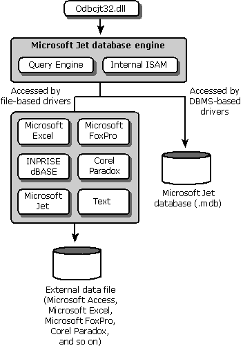

# ODBC Driver Architecture
Driver writers must be aware that the driver architecture can affect whether an application can use DBMS-specific SQL.  
  
   
  
 [File-based Drivers](../../../odbc/reference/file-based-drivers.md)  
  
 When the driver accesses the physical data directly, the driver acts as both driver and data source. The driver must process both ODBC calls and SQL statements. Developers of file-based drivers must write their own database engines.  
  
 [DBMS-Based Drivers](../../../odbc/reference/dbms-based-drivers.md)  
  
 When a separate database engine is used to access physical data, the driver processes only ODBC calls. It passes SQL statements to the database engine for processing.  
  
 [Network Architecture](../../../odbc/reference/network-example.md)  
  
 File and DBMS ODBC configurations can exist on a single network.  
  
 [Other Driver Architectures](../../../odbc/reference/other-driver-architectures.md)  
  
 When a driver is required to work with a variety of data sources, it can be used as middleware. Heterogeneous join engine architecture can make the driver appear as a driver manager. Drivers can also be installed on servers, where they can be shared by a series of clients.  
  
 For more information about driver architecture, see [Driver Manager](../../../odbc/reference/the-driver-manager.md) and [Driver Architecture](../../../odbc/reference/driver-architecture.md) in the section on [ODBC Architecture](../../../odbc/reference/odbc-architecture.md).  
  
 More information about driver issues can be found in the locations described in the following table.  
  
|Issue|Topic|Location|  
|-----------|-----------|--------------|  
|Compatibility issues with applications and drivers|[Application/Driver Compatibility](../../../odbc/reference/develop-app/application-and-driver-compatibility.md)|[Programming Considerations](../../../odbc/reference/develop-app/programming-considerations.md), in the ODBC Programmer's Reference|  
|Writing ODBC drivers|[Writing ODBC 3.x Drivers](../../../odbc/reference/develop-app/writing-odbc-3-x-drivers.md)|[Programming Considerations](../../../odbc/reference/develop-app/programming-considerations.md), in the ODBC Programmer's Reference|  
|Driver guidelines for backward compatibility|[Driver Guidelines for Backward Compatibility](../../../odbc/reference/appendixes/appendix-g-driver-guidelines-for-backward-compatibility.md)|[Appendix G: Driver Guidelines for Backward Compatibility](../../../odbc/reference/appendixes/appendix-g-driver-guidelines-for-backward-compatibility.md), in the ODBC Programmer's Reference|  
|Connecting to a driver|[Choosing a Data Source or Driver](../../../odbc/reference/develop-app/choosing-a-data-source-or-driver.md)|[Connecting to a Data Source or Driver](../../../odbc/reference/develop-app/connecting-to-a-data-source-or-driver.md), in the ODBC Programmer's Reference|  
|Identifying drivers|[Viewing Drivers](../../../odbc/admin/viewing-drivers.md)|[Viewing Drivers](../../../odbc/admin/viewing-drivers.md), in the Microsoft ODBC Data Source Administrator online Help|  
|Enabling connection pooling|[ODBC Connection Pooling](../../../odbc/reference/develop-app/driver-manager-connection-pooling.md)|[Connecting to a Data Source or Driver](../../../odbc/reference/develop-app/connecting-to-a-data-source-or-driver.md), in the ODBC Programmer's Reference|  
|Unicode/ANSI driver and connection issues|[Unicode Drivers](../../../odbc/reference/develop-app/unicode-drivers.md)|[Programming Considerations](../../../odbc/reference/develop-app/programming-considerations.md), in the ODBC Programmer's Reference|  
  
## See Also  
 [Developing an ODBC Driver](../../../odbc/reference/develop-driver/developing-an-odbc-driver.md)
