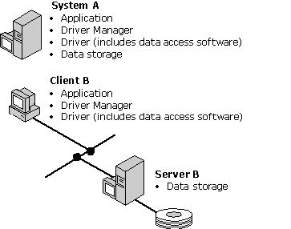

# File-Based Drivers
File-based drivers are used with data sources such as dBASE that do not provide a stand-alone database engine for the driver to use. These drivers access the physical data directly and must implement a database engine to process SQL statements. As a standard practice, the database engines in file-based drivers implement the subset of ODBC SQL defined by the minimum SQL conformance level; for a list of the SQL statements in this conformance level, see [Appendix C: SQL Grammar](../../odbc/reference/appendixes/appendix-c-sql-grammar.md).  
  
 In comparing file-based and DBMS-based drivers, file-based drivers are harder to write because of the database engine component, less complicated to configure because there are no network pieces, and less powerful because few people have the time to write database engines as powerful as those produced by database companies.  
  
 The following illustration shows two different configurations of file-based drivers, one in which the data resides locally and the other in which it resides on a network file server.  
  
 
