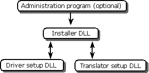

# Configuration Components
> [!NOTE]  
>  Starting with Windows XP and Windows Server 2003, ODBC is included in the Windows operation system. You should only explicitly install ODBC on earlier versions of Windows.  
  
 Data sources are configured by the installer DLL, which in turn calls driver setup DLLs and translator setup DLLs as they are needed. The installer DLL is either invoked directly from Control Panel or loaded and called by another program, known as the *administration program*. The following illustration shows the relationship between the configuration components.  
  
   
  
 For more information about these components, see the following topics at the end of this section.  
  
-   [Setup Program](../../../odbc/reference/install/setup-program.md)  
  
-   [Installer DLL](../../../odbc/reference/install/installer-dll.md)  
  
-   [Driver Setup DLL](../../../odbc/reference/install/driver-setup-dll.md)  
  
## See Also  
 [Installation Components](../../../odbc/reference/install/installation-components.md)
