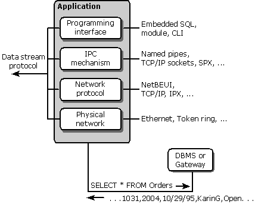

# Network Database Access
Accessing a database across a network requires a number of components, each of which is independent of, and resides beneath, the programming interface. These components are shown in the following illustration.  
  
   
  
 A further description of each component follows:  
  
-   **Programming Interface** As described earlier in this section, the programming interface contains the calls made by the application. These interfaces (embedded SQL, SQL modules, and call-level interfaces) are generally specific to each DBMS, although they are usually based on an ANSI or ISO standard.  
  
-   **Data Stream Protocol** The data stream protocol describes the stream of data transferred between the DBMS and its client. For example, the protocol might require the first byte to describe what the rest of the stream contains: an SQL statement to be executed, a returned error value, or returned data. The format of the rest of the data in the stream would then depend on this flag. For example, an error stream might contain the flag, a 2-byte integer error code, a 2-byte integer error message length, and an error message.  
  
     The data stream protocol is a logical protocol and is independent of the protocols used by the underlying network. Thus, a single data stream protocol can generally be used on a number of different networks. Data stream protocols are typically proprietary and have been optimized to work with a particular DBMS.  
  
-   **Interprocess Communication Mechanism** The interprocess communication (IPC) mechanism is the process by which one process communicates with another. Examples include named pipes, TCP/IP sockets, and DECnet sockets. The choice of IPC mechanism is constrained by the operating system and network being used.  
  
-   **Network Protocol** The network protocol is used to transport the data stream over a network. It can be considered the plumbing that supports the IPC mechanisms used to implement the data stream protocol, as well as supporting basic network operations such as file transfers and print sharing. Network protocols include NetBEUI, TCP/IP, DECnet, and SPX/IPX and are specific to each network.
