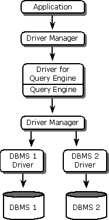
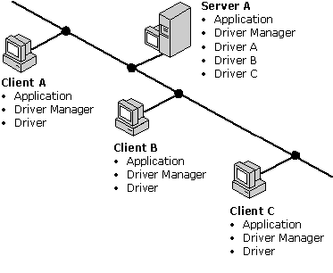

# Other Driver Architectures
Some ODBC drivers do not strictly conform to the architecture described previously. This might be because the drivers perform duties other than those of a traditional ODBC driver, or are not drivers in the normal sense.  
  
## Driver as a Middle Component  
 The ODBC driver may reside between the Driver Manager and one or more other ODBC drivers. When the driver in the middle is capable of working with multiple data sources, it acts as a dispatcher of ODBC calls (or appropriately translated calls) to other modules that actually access the data sources. In this architecture, the driver in the middle is taking on some of the role of a Driver Manager.  
  
 Another example of this sort of driver is a spy program for ODBC, which intercepts and copies ODBC functions being sent between the Driver Manager and the driver. This layer can be used to emulate either a driver or an application. To the Driver Manager, the layer appears to be the driver; to the driver, the layer appears to be the Driver Manager.  
  
## Heterogeneous Join Engines  
 Some ODBC drivers are built upon a query engine for performing heterogeneous joins. In one architecture of a heterogeneous join engine (see the following illustration), the driver appears to the application as a driver but appears to another instance of the Driver Manager as an application. This driver processes a heterogeneous join from the application by calling separate SQL statements in drivers for each joined database.  
  
   
  
 This architecture provides a common interface for the application to access data from different databases. It can use a common way to retrieve metadata, such as information about special columns (row identifiers), and it can call common catalog functions to retrieve data dictionary information. By calling the ODBC function **SQLStatistics**, for instance, the application can retrieve information about the indexes on the tables to be joined, even if the tables are on two separate databases. The query processor does not have to worry about how the databases store metadata.  
  
 The application also has standard access to data types. ODBC defines common SQL data types that DBMS-specific data types are mapped to. An application can call **SQLGetTypeInfo** to retrieve information about data types on different databases.  
  
 When the application generates a heterogeneous join statement, the query processor in this architecture parses the SQL statement and then generates separate SQL statements for each database to be joined. By using metadata about each driver, the query processor can determine the most efficient, intelligent join. For example, if the statement joins two tables on one database with one table on another database, the query processor can join the two tables on the one database before joining the result with the table from the other database.  
  
## ODBC on the Server  
 ODBC drivers can be installed on a server so that they can be used by applications on any of a series of client machines. In this architecture (see the following illustration), a Driver Manager and a single ODBC driver are installed on each client, and another Driver Manager and a series of ODBC drivers are installed on the server. This allows each client access to a variety of drivers used and maintained on the server.  
  
   
  
 One advantage of this architecture is efficient software maintenance and configuration. Drivers need only be updated in one place: on the server. By using system data sources, data sources can be defined on the server for use by all clients. The data sources need not be defined on the client. Connection pooling can be used to streamline the process by which clients connect to data sources.  
  
 The driver on the client is usually a very small driver that transfers the Driver Manager call to the server. Its footprint can be significantly smaller than the fully functional ODBC drivers on the server. In this architecture, client resources can be freed if the server has more computing power. In addition, the efficiency and security of the entire system can be enhanced by installing backup servers and performing load balancing to optimize server use.
