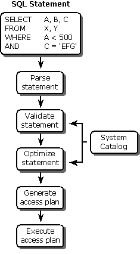

# Processing a SQL Statement
Before discussing the techniques for using SQL programmatically, it is necessary to discuss how an SQL statement is processed. The steps involved are common to all three techniques, although each technique performs them at different times. The following illustration shows the steps involved in processing an SQL statement, which are discussed throughout the rest of this section.  
  
   
  
 To process an SQL statement, a DBMS performs the following five steps:  
  
1.  The DBMS first parses the SQL statement. It breaks the statement up into individual words, called tokens, makes sure that the statement has a valid verb and valid clauses, and so on. Syntax errors and misspellings can be detected in this step.  
  
2.  The DBMS validates the statement. It checks the statement against the system catalog. Do all the tables named in the statement exist in the database? Do all of the columns exist and are the column names unambiguous? Does the user have the required privileges to execute the statement? Certain semantic errors can be detected in this step.  
  
3.  The DBMS generates an access plan for the statement. The access plan is a binary representation of the steps that are required to carry out the statement; it is the DBMS equivalent of executable code.  
  
4.  The DBMS optimizes the access plan. It explores various ways to carry out the access plan. Can an index be used to speed a search? Should the DBMS first apply a search condition to Table A and then join it to Table B, or should it begin with the join and use the search condition afterward? Can a sequential search through a table be avoided or reduced to a subset of the table? After exploring the alternatives, the DBMS chooses one of them.  
  
5.  The DBMS executes the statement by running the access plan.  
  
 The steps used to process an SQL statement vary in the amount of database access they require and the amount of time they take. Parsing an SQL statement does not require access to the database and can be done very quickly. Optimization, on the other hand, is a very CPU-intensive process and requires access to the system catalog. For a complex, multitable query, the optimizer may explore thousands of different ways of carrying out the same query. However, the cost of executing the query inefficiently is usually so high that the time spent in optimization is more than regained in increased query execution speed. This is even more significant if the same optimized access plan can be used over and over to perform repetitive queries.
