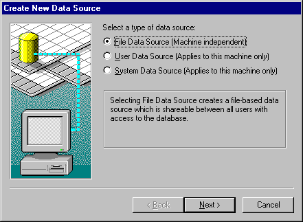
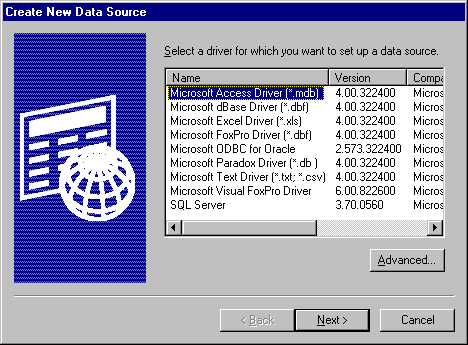
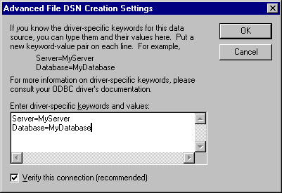
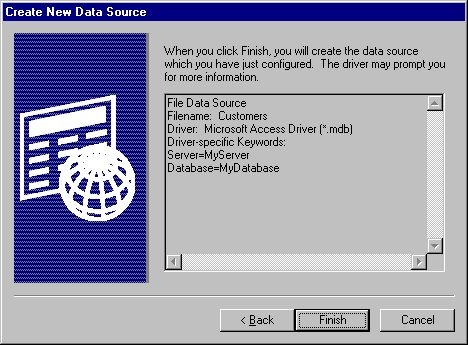

# SQLCreateDataSource Function
**Conformance**  
 Version Introduced: ODBC 2.0  
  
 **Summary**  
 **SQLCreateDataSource** displays a dialog box with which the user can add a data source.  
  
## Syntax  
  
```  
  
BOOL SQLCreateDataSource(  
     HWND    hwnd,  
     LPSTR   lpszDS);  
```  
  
## Arguments  
 *hwnd*  
 [Input] Parent window handle.  
  
 *lpszDS*  
 [Input] Data source name. *lpszDS* can be a null pointer or an empty string.  
  
## Returns  
 **SQLCreateDataSource** returns TRUE if the data source is created. Otherwise, it returns FALSE.  
  
## Diagnostics  
 When **SQLCreateDataSource** returns FALSE, an associated *\*pfErrorCode* value can be obtained by calling **SQLInstallerError**. The following table lists the *\*pfErrorCode* values that can be returned by **SQLInstallerError** and explains each one in the context of this function.  
  
|*\*pfErrorCode*|Error|Description|  
|---------------------|-----------|-----------------|  
|ODBC_ERROR_GENERAL_ERR|General installer error|An error occurred for which there was no specific installer error.|  
|ODBC_ERROR_INVALID_HWND|Invalid window handle|The *hwnd* argument was invalid or NULL.|  
|ODBC_ERROR_INVALID_DSN|Invalid DSN|The *lpszDS* argument contained a string that was invalid for a DSN.|  
|ODBC_ERROR_REQUEST_FAILED|*Request* failed|The call to **ConfigDSN** with the ODBC_ADD_DSN option failed.|  
|ODBC_ERROR_LOAD_LIBRARY_FAILED|Could not load the driver or translator setup library|The driver setup library could not be loaded.|  
|ODBC_ERROR_USER_CANCELED|User canceled operation|User canceled creation of a new data source.|  
|ODBC_ERROR_CREATE_DSN_FAILED|Could not create the requested DSN|Could not connect to the database; the call to **SQLDriverConnect** for a File DSN did not return a successful connection.<br /><br /> Could not write to the file.|  
|ODBC_ERROR_OUT_OF_MEM|Out of memory|The installer could not perform the function because of a lack of memory.|  
  
## Comments  
 If *hwnd* is null, **SQLCreateDataSource** returns FALSE. Otherwise, it displays the **Create New Data Source** dialog box with a wizard page for choosing the type of data source to be set up, as shown in the following illustration.  
  
   
  
 The default option is **File Data Source**. When a data source has been chosen and **Next** clicked, the following wizard page that contains a list of installed drivers is displayed.  
  
   
  
 If **Cancel** is clicked, the dialog box disappears and **SQLCreateDataSource** returns FALSE with the error code of ODBC_ERROR_USER_CANCELED. If either the **User Data Source** or **System Data Source** option was selected, the **Advanced** button is unavailable.  
  
 When the **Next** button is clicked, one of the following will occur, depending on which type of data source was selected:  
  
-   If **File Data Source** was selected, a wizard page is displayed for the user to enter a file name.  
  
-   If either **User Data Source** or **System Data Source** was selected, a wizard page displaying the type of data source and driver is displayed for review, and when **Finish** is clicked, the data source is set up.  
  
 If **Advanced** is clicked from the Create New Data Source wizard page, a wizard page is displayed for the user to enter driver-specific information. In the text box of this dialog box, type the driver and keywords separated by returns, as shown in the following illustration.  
  
   
  
 Additional driver-specific keywords can be found under the description of **SQLDriverConnect**. All except **DSN** are allowed.  
  
 The default for the **Verify This Connection** option is TRUE. This default applies whether or not this wizard page is activated. If **OK** is clicked, the string specified in the text box and the **Verify This Connection** option value are cached. (If the **Close** button or **Cancel** is clicked, any newly entered driver-specific information is lost because the string specified in the text box and the **Verify This Connection** option value are not cached.)  
  
 If **File Data Source** was selected in the first wizard page, then after a driver has been selected and the keyword values have been entered in the Advanced wizard page, the user is prompted to enter a file name. Click **Browse** to search for a file name, in which case the default directory in the **Browse** box is specified by a combination of the path specified by CommonFileDir in HKEY_LOCAL_MACHINE\SOFTWARE\Microsoft\Windows\CurrentVersion and "ODBC\DataSources". (If CommonFileDir was "C:\Program Files\Common Files", the default directory would be "C:\Program Files\Common Files\ODBC\Data Sources".)  
  
 When a file name has been entered and **Next** is clicked, the file name entered is checked for validity against the standard file-naming rules of the operating system. If the file name is invalid, an error message box notifies the user that an invalid file name was entered. After the user acknowledges the message box, the focus is returned to the wizard page in which the file name is entered. If the file name is valid, a wizard page that shows the selected keyword-value pairs is displayed for review, as shown in the following illustration.  
  
   
  
 If **Finish** is clicked and **File Data Source** was selected as the data source type, and if the **Verify this connection** option is TRUE, **SQLDriverConnect** is called with the **SAVEFILE** and **DRIVER** keywords. The *DriverCompletion* argument is set to SQL_DRIVER_COMPLETE. The file name for the **SAVEFILE** keyword is the name that was entered or chosen, and the driver name for the **DRIVER** keyword is the name that was chosen. If a driver-specific connection string was specified in the Advanced wizard page, that string is appended after the **DRIVER** keyword.  
  
 If **SQLDriverConnect** returns SQL_SUCCESS, the Driver Manager has created the File DSN. **SQLCreateDataSource** returns TRUE. If **SQLDriverConnect** does not return SQL_SUCCESS, a warning message box indicates that a connection could not be made to the data source. A DSN with minimal connection information can still be created. This message box lets the user either cancel or continue with the File DSN creation.  
  
 If the user chooses to continue creating the DSN, this process continues as if the **Verify this connection** option were set to FALSE. If the user chooses to cancel, FALSE is returned for **SQLCreateDataSource** with an error code of ODBC_ERROR_CREATE_DSN_FAILED.  
  
 If **File Data Source** was selected as the data source type and the **Verify this connection** option is FALSE, a File DSN is created with the **DRIVER** keyword and user-specified connect string (if any) from the Advanced wizard page. If the file creation was successful, TRUE is returned for **SQLCreateDataSource**. If the file creation was not successful, an error message box notifies the user with whatever error was returned from the operating system. FALSE is returned for **SQLCreateDataSource** with an error code of ODBC_ERROR_CREATE_DSN_FAILED. For more information about file data sources, see [Connecting Using File Data Sources](../../../odbc/reference/develop-app/connecting-using-file-data-sources.md), or see [SQLDriverConnect](../../../odbc/reference/syntax/sqldriverconnect-function.md).  
  
 If **User** or **System Data Source** was selected as the data source type, **ConfigDSN** in the driver setup library is called with the ODBC_ADD_DSN *fRequest*. For more information, see [ConfigDSN](../../../odbc/reference/syntax/configdsn-function.md).  
  
## Related Functions  
  
|For information about|See|  
|---------------------------|---------|  
|Managing data sources|[SQLManageDataSources](../../../odbc/reference/syntax/sqlmanagedatasources.md)|
