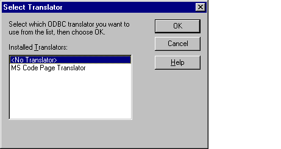

# SQLGetTranslator Function
**Conformance**  
 Version Introduced: ODBC 2.0  
  
 **Summary**  
 **SQLGetTranslator** displays a dialog box from which a user can select a translator.  
  
## Syntax  
  
```cpp  
  
BOOL SQLGetTranslator(  
     HWND      hwndParent,  
     LPSTR     lpszName,  
     WORD      cbNameMax,  
     WORD *    pcbNameOut,  
     LPSTR     lpszPath,  
     WORD      cbPathMax,  
     WORD *    pcbPathOut,  
     DWORD *   pvOption);  
```  
  
## Arguments  
 *hwndParent*  
 [Input] Parent window handle.  
  
 *lpszName*  
 [Input/Output] Name of the translator from the system information.  
  
 *cbNameMax*  
 [Input] Maximum length of the *lpszName* buffer.  
  
 *pcbNameOut*  
 [Input/Output] Total number of bytes (excluding the null-termination byte) passed or returned in *lpszName*. If the number of bytes available to return is greater than or equal to *cbNameMax*, the translator name in *lpszName* is truncated to *cbNameMax* minus the null-termination character. The *pcbNameOut* argument can be a null pointer.  
  
 *lpszPath*  
 [Output] Full path of the translation DLL.  
  
 *cbPathMax*  
 [Input] Maximum length of the *lpszPath* buffer.  
  
 *pcbPathOut*  
 [Output] Total number of bytes (excluding the null-termination byte) returned in *lpszPath*. If the number of bytes available to return is greater than or equal to *cbPathMax*, the translation DLL path in *lpszPath* is truncated to *cbPathMax* minus the null-termination character. The *pcbPathOut* argument can be a null pointer.  
  
 *pvOption*  
 [Output] 32-bit translation option.  
  
## Returns  
 The function returns TRUE if it is successful, FALSE if it fails or if the user cancels the dialog box.  
  
## Diagnostics  
 When **SQLGetTranslator** returns FALSE, an associated *\*pfErrorCode* value can be obtained by calling **SQLInstallerError**. The following table lists the *\*pfErrorCode* values that can be returned by **SQLInstallerError** and explains each one in the context of this function.  
  
|*\*pfErrorCode*|Error|Description|  
|---------------------|-----------|-----------------|  
|ODBC_ERROR_GENERAL_ERR|General installer error|An error occurred for which there was no specific installer error.|  
|ODBC_ERROR_INVALID_BUFF_LEN|Invalid buffer length|The *cbNameMax* or *cbPathMax* argument was less than or equal to 0.|  
|ODBC_ERROR_INVALID_HWND|Invalid window handle|The *hwndParent* argument was invalid or NULL.|  
|ODBC_ERROR_INVALID_NAME|Invalid driver or translator name|The *lpszName* argument was invalid. It could not be found in the registry.|  
|ODBC_ERROR_LOAD_LIBRARY_FAILED|Could not load the driver or translator  setup library|The translator library could not be loaded.|  
|ODBC_ERROR_INVALID_OPTION|Invalid transaction option|The *pvOption* argument contained an invalid value.|  
|ODBC_ERROR_OUT_OF_MEM|Out of memory|The installer could not perform the function because of a lack of memory.|  
  
## Comments  
 If *hwndParent* is null or if *lpszName*, *lpszPath*, or *pvOption* is a null pointer, **SQLGetTranslator** returns FALSE. Otherwise, it displays the list of installed translators in the following dialog box.  
  
   
  
 If *lpszName* contains a valid translator name, it is selected. Otherwise, \<No Translator> is selected.  
  
 If the user chooses \<No Translator>, the contents of *lpszName*, *lpszPath*, and *pvOption* are not touched. **SQLGetTranslator** sets *pcbNameOut* and *pcbPathOut* to 0 and returns TRUE.  
  
 If the user chooses a translator, **SQLGetTranslator** calls **ConfigTranslator** in the translator's setup DLL. If **ConfigTranslator** returns FALSE, **SQLGetTranslator** returns to its dialog box. If **ConfigTranslator** returns TRUE, **SQLGetTranslator** returns TRUE, along with the selected translator name, path, and translation option.  
  
## Related Functions  
  
|For information about|See|  
|---------------------------|---------|  
|Configuring a translator|[ConfigTranslator](../../../odbc/reference/syntax/configtranslator-function.md)|  
|Getting a translation attribute|[SQLGetConnectAttr](../../../odbc/reference/syntax/sqlgetconnectattr-function.md)|  
|Setting a translation attribute|[SQLSetConnectAttr](../../../odbc/reference/syntax/sqlsetconnectattr-function.md)|
