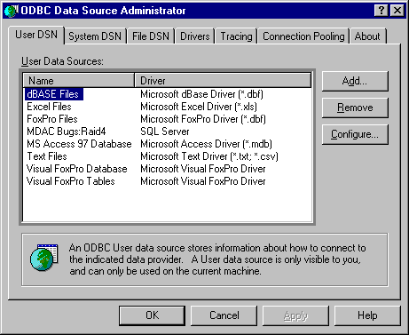
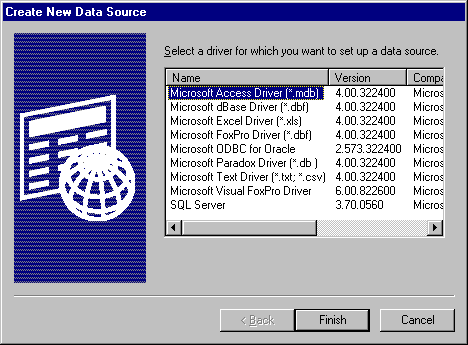
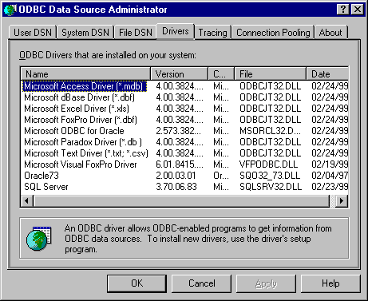
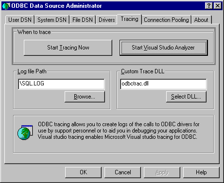

# SQLManageDataSources
**Conformance**  
 Version Introduced: ODBC 2.0  
  
 **Summary**  
 **SQLManageDataSources** displays a dialog box with which users can set up, add, and delete data sources in the system information.  
  
## Syntax  
  
```cpp  
  
BOOL SQLManageDataSources(  
     HWND     hwnd);  
```  
  
## Arguments  
 *hwnd*  
 [Input] Parent window handle.  
  
## Returns  
 **SQLManageDataSources** returns FALSE if *hwnd* is not a valid window handle. Otherwise, it returns TRUE.  
  
## Diagnostics  
 When **SQLManageDataSources** returns FALSE, an associated *\*pfErrorCode* value can be obtained by calling **SQLInstallerError**. The following table lists the *\*pfErrorCode* values that can be returned by **SQLInstallerError** and explains each one in the context of this function.  
  
|*\*pfErrorCode*|Error|Description|  
|---------------------|-----------|-----------------|  
|ODBC_ERROR_GENERAL_ERR|General installer error|An error occurred for which there was no specific installer error.|  
|ODBC_ERROR_REQUEST_FAILED|*Request* failed|The call to **ConfigDSN** failed.|  
|ODBC_ERROR_INVALID__HWND|Invalid window handle|The *hwnd* argument was invalid or NULL.|  
|ODBC_ERROR_OUT_OF_MEM|Out of memory|The installer could not perform the function because of a lack of memory.|  
  
## Managing Data Sources  
 **SQLManageDataSources** initially displays the **ODBC Data Source Administrator** dialog box, as shown in the following illustration.  
  
   
  
 The dialog box displays the data sources listed in the system information under three tabs: **User DSN**, **System DSN**, and **File DSN**. If the user double-clicks a data source or selects a data source and clicks **Configure**, **SQLManageDataSources** calls **ConfigDSN** in the setup DLL with the ODBC_CONFIG_DSN option.  
  
 If the user clicks **Add**, **SQLManageDataSources** displays the **Create New Data Source** dialog box, shown in the following illustration.  
  
   
  
 The dialog box displays a list of installed drivers. If the user double-clicks a driver or selects a driver and clicks **OK**, **SQLManageDataSources** calls **ConfigDSN** in the setup DLL and passes it the ODBC_ADD_DSN option.  
  
 If the user selects a data source and clicks **Remove**, **SQLManageDataSources** asks whether the user wants to delete the data source. If the user clicks **Yes**, **SQLManageDataSources** calls **ConfigDSN** in the setup DLL with the ODBC_REMOVE_DSN option.  
  
 The **Create New Data Source** dialog box is used to add or delete a user data source, a system data source, or a file data source.  
  
## User DSNs  
 DSNs created for individual users will be called User DSNs, to distinguish them from System DSNs. User DSNs are registered as follows in the system information:  
  
 `HKEY_CURRENT_USERS`  
  
 `SOFTWARE`  
  
 `ODBC`  
  
 `Odbc.ini`  
  
## System DSNs  
 The **Create New Data Source** dialog box allows you to add a system data source to your local computer or delete one, or to set the configuration for a system data source.  
  
 A data source set up with a system data source name (DSN) can be used by more than one user on the same machine. It can also be used by a systemwide service, which can then gain access to the data source even if no user is logged on to the machine.  
  
 A System DSN is registered in the HKEY_LOCAL_MACHINE entry in the system information rather than in the HKEY_CURRENT_USER entry. It is not tied to one user who logs on with his or her particular user name and password but can be used by any user of that machine or by an automatic systemwide service. The System DSN is, however, tied to one machine. It does not support the capability of using remote DSNs between machines. System DSNs are registered as follows in the system information:  
  
 HKEY_LOCAL_MACHINE    SOFTWARE       ODBC          Odbc.ini  
  
## File DSNs  
 A file data source does not have a data source name, as does a machine data source, and is not registered to any one user or machine. The connection information for that data source is contained in a .dsn file that can be copied to any machine. A file data source can be shareable, in which case the .dsn file resides on a network and can be used simultaneously by multiple users on the network as long as the user has the appropriate driver installed. A file data source can also be unshareable, in which case it can be used only on a single machine.  
  
 For more information on file data sources, see [Connecting Using File Data Sources](../../../odbc/reference/develop-app/connecting-using-file-data-sources.md), or see [SQLDriverConnect](../../../odbc/reference/syntax/sqldriverconnect-function.md).  
  
## Managing Drivers  
 If the user clicks the **Drivers** tab in the **ODBC Data Source Administrator** dialog box, **SQLManageDataSources** displays a list of ODBC drivers installed on the system, as well as information about the drivers. The date displayed is the creation date of the driver, as shown in the following illustration.  
  
   
  
## Tracing Options  
 If the user clicks the **Tracing** tab in the **ODBC Data Source Administrator** dialog box, **SQLManageDataSources** displays tracing options, as shown in the following illustration.  
  
   
  
 If the user clicks **Start Tracing Now** and then clicks **OK**, **SQLManageDataSources** enables tracing manually for all applications currently running on the machine.  
  
 If the user specifies the name of a trace file in the **Log file Path** text box and then clicks **OK**, **SQLManageDataSources** sets the **TraceFile** keyword in the [ODBC] section of the system information to the specified name.  
  
> [!IMPORTANT]  
>  Support for Visual Studio Analyzer was removed beginning in Windows 8 (Visual Studio Analyzer was only included in older versions of Visual Studio.). For an alternative troubleshooting mechanism, use BID tracing.  
  
 If the user clicks **Start Visual Studio Analyzer** and then clicks **OK**, Visual Studio Analyzer is enabled. It remains enabled until **Stop Visual Studio Analyzer** is clicked.  
  
 For more information on tracing, see [Tracing](../../../odbc/reference/develop-app/tracing.md). For more information about the **Trace** and **TraceFile** keywords, see [ODBC Subkey](../../../odbc/reference/install/odbc-subkey.md).  
  
## Related Functions  
  
|For information about|See|  
|---------------------------|---------|  
|Creating data sources|[SQLCreateDataSource](../../../odbc/reference/syntax/sqlcreatedatasource-function.md)|
