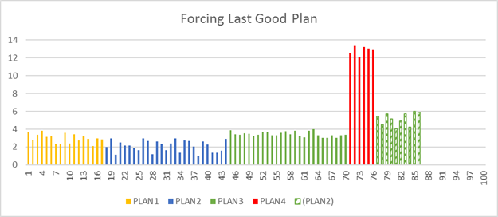

# Automatic tuning
[!INCLUDE[tsql-appliesto-ss2017-asdb-xxxx-xxx-md](../../includes/tsql-appliesto-ss2017-asdb-xxxx-xxx-md.md)]

Automatic tuning is a database feature that provides insight into potential query performance problems, recommend solutions, and automatically fix identified problems.

Automatic tuning in [!INCLUDE[sssqlv14-md](../../includes/sssqlv14-md.md)] notifies you whenever a potential performance issue is detected, and lets you apply corrective actions,
or lets the [!INCLUDE[ssde_md](../../includes/ssde_md.md)] automatically fix performance problems.
Automatic tuning in [!INCLUDE[sssqlv14-md](../../includes/sssqlv14-md.md)] enables you to identify and fix performance issues caused by **query execution plan choice regressions**. Automatic tuning in [!INCLUDE[ssazure_md](../../includes/ssazure_md.md)] also creates necessary indexes and drops unused indexes. For more information on query execution plans, see [Execution Plans](../../relational-databases/performance/execution-plans.md).

The [!INCLUDE[ssDEnoversion](../../includes/ssdenoversion-md.md)] monitors the queries that are executed on the database and automatically improves performance of the workload. The [!INCLUDE[ssde_md](../../includes/ssde_md.md)] has a built-in intelligence mechanism that can automatically tune and improve performance of your queries by dynamically adapting the database to your workload. There are two automatic tuning features that are available:

 -	**Automatic plan correction** identifies problematic query execution plans and fixes query execution plan performance problems. **Applies to**: [!INCLUDE[ssNoVersion](../../includes/ssnoversion-md.md)] (Starting with [!INCLUDE[sssqlv14-md](../../includes/sssqlv14-md.md)]) and [!INCLUDE[ssSDSfull](../../includes/sssdsfull-md.md)]
 -	**Automatic index management** identifies indexes that should be added in your database, and indexes that should be removed. **Applies to**: [!INCLUDE[ssSDSfull](../../includes/sssdsfull-md.md)]

## Why automatic tuning?

Three of the main tasks in classic database administration are monitoring the workload, identifying critical [!INCLUDE[tsql_md](../../includes/tsql-md.md)] queries, indexes that should be added to improve performance, and identifying rarely used. The [!INCLUDE[ssDEnoversion](../../includes/ssdenoversion-md.md)] provides detailed insight into the queries and indexes that you need to monitor. However, constantly monitoring a database is a hard and tedious task, especially when dealing with many databases. Managing a huge number of databases might be impossible to do efficiently. Instead of monitoring and tuning your database manually, you might consider delegating some of the monitoring and tuning actions to the [!INCLUDE[ssde_md](../../includes/ssde_md.md)] using automatic tuning feature.

### How does automatic tuning work?

Automatic tuning is a continuous monitoring and analysis process that constantly learns about the characteristics of your workload and identify potential issues and improvements.


This process enables database to dynamically adapt to your workload by finding what indexes and plans might improve performance of your workloads and what indexes affect your workloads. Based on these findings, automatic tuning applies tuning actions that improve performance of your workload. In addition, database continuously monitors performance after any change made by automatic tuning to ensure that it improves performance of your workload. Any action that didn't improve performance is automatically reverted. This verification process is a key feature that ensures that any change made by automatic tuning does not decrease the performance of your workload.

## Automatic plan correction

Automatic plan correction is an automatic tuning feature that identifies **execution plans choice regression** and automatically fix the issue by forcing the last known good plan. For more information about query execution plans and the query optimizer, see the [Query Processing Architecture Guide](../../relational-databases/query-processing-architecture-guide.md).

### What is execution plan choice regression?

The [!INCLUDE[ssdenoversion_md](../../includes/ssdenoversion_md.md)] may use different execution plans to execute the [!INCLUDE[tsql_md](../../includes/tsql-md.md)] queries. Query plans
depend on the statistics, indexes, and other factors. The optimal plan that should be used to execute some [!INCLUDE[tsql_md](../../includes/tsql-md.md)] query might be changed
over time. In some cases, the new plan might not be better than the previous one, and the new plan might cause a performance regression.

  

Whenever you notice the plan choice regression, you should find some previous good plan and force it instead of the current one using `sp_query_store_force_plan` procedure.
[!INCLUDE[ssde_md](../../includes/ssde_md.md)] in [!INCLUDE[sssqlv14-md](../../includes/sssqlv14-md.md)] provides information about regressed plans and recommended corrective actions.
Additionally, [!INCLUDE[ssde_md](../../includes/ssde_md.md)] enables you to fully automate this process and let [!INCLUDE[ssde_md](../../includes/ssde_md.md)] fix any problem found related 
to the plan changes.

### Automatic plan choice correction

[!INCLUDE[ssde_md](../../includes/ssde_md.md)] can automatically switch to the last known good plan whenever the plan choice regression is detected.

 

[!INCLUDE[ssde_md](../../includes/ssde_md.md)] automatically detects any potential plan choice regression including the plan that should be used instead of the wrong plan.
When the [!INCLUDE[ssde_md](../../includes/ssde_md.md)] applies the last known good plan, it automatically monitors the performance of the forced plan. If the forced plan is not better
than the regressed plan, the new plan will be unforced and the [!INCLUDE[ssde_md](../../includes/ssde_md.md)] will compile a new plan. If the [!INCLUDE[ssde_md](../../includes/ssde_md.md)] verifies that the forced plan is better than the regressed plan, the forced plan will be retained if it is better than the regressed plan, until a recompile occurs (for example, on next statistics update or schema change).

> [!NOTE]
> Any execution plans auto forced are not persisted between restarts of the [!INCLUDE[ssNoVersion](../../includes/ssnoversion-md.md)] instance.

### Enabling automatic plan choice correction

You can enable automatic tuning per database and specify that last good plan should be forced whenever some plan change regression is detected. Automatic tuning is enabled using
the following command:

```sql   
ALTER DATABASE current
SET AUTOMATIC_TUNING ( FORCE_LAST_GOOD_PLAN = ON ); 
```

Once you enable this option, the [!INCLUDE[ssde_md](../../includes/ssde_md.md)] will automatically force any recommendation where the estimated CPU gain is higher than 10 seconds, or the number of errors in the new plan is higher than the number of errors in the recommended plan, and verify that the forced plan is better than the current one.

### Alternative - manual plan choice correction

Without automatic tuning, users must periodically monitor system and look for the queries that regressed. If any plan regressed, user should find some previous good plan and force it instead of the current one using `sp_query_store_force_plan` procedure. The best practice would be to force the last known good plan because older plans might be invalid due to statistic or index changes. The user who forces the last known good plan should monitor performance of the query that is executed using the forced plan and verify that forced plan works as expected. Depending on the results of monitoring and analysis, plan should be forced or user should find some other way to optimize the query.
Manually forced plans should not be forced forever, because the [!INCLUDE[ssde_md](../../includes/ssde_md.md)] should be able to apply optimal plans. The user or DBA should eventually
unforce the plan using `sp_query_store_unforce_plan` procedure, and let the [!INCLUDE[ssde_md](../../includes/ssde_md.md)] find the optimal plan. 

> [!TIP]
> Alternativelly, use the **Queries With Forced Plans** Query Store view to locate and unforce plans.

[!INCLUDE[ssNoVersion](../../includes/ssnoversion-md.md)] provides all necessary views and procedures required to monitor performance and fix problems in Query Store.

In [!INCLUDE[sssql15-md](../../includes/sssql15-md.md)], you can find plan choice regressions using Query Store system views. In [!INCLUDE[sssqlv14-md](../../includes/sssqlv14-md.md)], the [!INCLUDE[ssde_md](../../includes/ssde_md.md)] detects and shows potential plan choice regressions and the recommended actions that should be applied in the [sys.dm_db_tuning_recommendations &#40;Transact-SQL&#41;](../../relational-databases/system-dynamic-management-views/sys-dm-db-tuning-recommendations-transact-sql.md)
view. The view shows information about the problem, the importance of the issue, and details such as the identified query, the ID of the regressed plan, the ID of the plan that was used as baseline for comparison, and the [!INCLUDE[tsql_md](../../includes/tsql-md.md)] statement that can be executed to fix the problem.

| type | description | datetime | score | details | ... |
| --- | --- | --- | --- | --- | --- |
| `FORCE_LAST_GOOD_PLAN` | CPU time changed from 4 ms to 14 ms | 3/17/2017 | 83 | `queryId` `recommendedPlanId` `regressedPlanId` `T-SQL` |   |
| `FORCE_LAST_GOOD_PLAN` | CPU time changed from 37 ms to 84 ms | 3/16/2017 | 26 | `queryId` `recommendedPlanId` `regressedPlanId` `T-SQL` |   |

Some columns from this view are described in the following list:
 - Type of the recommended action - `FORCE_LAST_GOOD_PLAN`
 - Description that contains information why [!INCLUDE[ssde_md](../../includes/ssde_md.md)] thinks that this plan change is a potential performance regression
 - Datetime when the potential regression is detected
 - Score of this recommendation
 - Details about the issues such as ID of the detected plan, ID of the regressed plan, ID of the plan that should be forced to fix the issue, [!INCLUDE[tsql_md](../../includes/tsql-md.md)]
 script that might be applied to fix the issue, etc. Details are stored in [JSON format](../../relational-databases/json/index.md)

Use the following query to obtain a script that fixes the issue and additional information about the estimated gain:

```sql   
SELECT reason, score,
      script = JSON_VALUE(details, '$.implementationDetails.script'),
      planForceDetails.*,
      estimated_gain = (regressedPlanExecutionCount + recommendedPlanExecutionCount)
                  * (regressedPlanCpuTimeAverage - recommendedPlanCpuTimeAverage)/1000000,
      error_prone = IIF(regressedPlanErrorCount > recommendedPlanErrorCount, 'YES','NO')
FROM sys.dm_db_tuning_recommendations
CROSS APPLY OPENJSON (Details, '$.planForceDetails')
    WITH (  [query_id] int '$.queryId',
            regressedPlanId int '$.regressedPlanId',
            recommendedPlanId int '$.recommendedPlanId',
            regressedPlanErrorCount int,
            recommendedPlanErrorCount int,
            regressedPlanExecutionCount int,
            regressedPlanCpuTimeAverage float,
            recommendedPlanExecutionCount int,
            recommendedPlanCpuTimeAverage float
          ) AS planForceDetails;
```

[!INCLUDE[ssresult-md](../../includes/ssresult-md.md)]     

| reason | score | script | query\_id | current plan\_id | recommended plan\_id | estimated\_gain | error\_prone
| --- | --- | --- | --- | --- | --- | --- | --- | --- |
| CPU time changed from 3 ms to 46 ms | 36 | EXEC sp\_query\_store\_force\_plan 12, 17; | 12 | 28 | 17 | 11.59 | 0

`estimated_gain` represents the estimated number of seconds that would be saved if the recommended plan would be executed instead of the current plan. The recommended plan should be forced instead of the current plan if the gain is greater than 10 seconds. If there are more errors (for example, time-outs or aborted executions) in the current plan than in the recommended plan, the column `error_prone` would be set to the value `YES`. Error prone plan is another reason why the recommended plan should be forced instead of the current one.

Although [!INCLUDE[ssde_md](../../includes/ssde_md.md)] provides all information required to identify plan choice regressions; continuous
monitoring and fixing performance issues might be a tedious process. Automatic tuning makes this process much easier.

> [!NOTE]
> Data in the sys.dm_db_tuning_recommendations DMV is not persisted between restarts of the [!INCLUDE[ssNoVersion](../../includes/ssnoversion-md.md)] instance.

## Automatic index management

In [!INCLUDE[ssazure_md](../../includes/ssazure_md.md)], index management is easy because [!INCLUDE[ssazure_md](../../includes/ssazure_md.md)] learns about your workload and ensures that your data is always optimally indexed. Proper index design is crucial for optimal performance of your workload, and automatic index management can help you optimize your indexes. Automatic index management can either fix performance issues in incorrectly indexed databases, or maintain and improve indexes on the existing database schema. Automatic tuning in [!INCLUDE[ssazure_md](../../includes/ssazure_md.md)] performs the following actions:

 - Identifies indexes that could improve performance of your [!INCLUDE[tsql_md](../../includes/tsql-md.md)] queries that read data from the tables.
 - Identifies the redundant indexes or indexes that were not used in longer period of time that could be removed. Removing unnecessary indexes improves performance of the queries that update data in tables.

### Why do you need index management?

Indexes speed up some of your queries that read data from the tables; however, they can slow down the queries that update data. You need to carefully analyze when to create an index and what columns you need to include in the index. Some indexes might not be needed after some time. Therefore, you would need to periodically identify and drop the indexes that do not bring any benefits. If you ignore the unused indexes, performance of the queries that update data would be decreased without any benefit on the queries that read data. Unused indexes also affect overall performance of the system because additional updates require unnecessary logging.

Finding the optimal set of indexes that improve performance of the queries that read data from your tables and have minimal impact on updates might require continuous and complex analysis.

[!INCLUDE[ssazure_md](../../includes/ssazure_md.md)] uses built-in intelligence and advanced rules that analyze your queries, identify indexes that would be optimal for your current workloads, and the indexes might be removed. Azure SQL Database ensures that you have a minimal necessary set of indexes that optimize the queries that read data, with the minimized impact on the other queries.

### Automatic index management

In addition to detection, [!INCLUDE[ssazure_md](../../includes/ssazure_md.md)] can automatically apply identified recommendations. If you find that the built-in rules improve the performance of your database, you might let [!INCLUDE[ssazure_md](../../includes/ssazure_md.md)] automatically manage your indexes.

To enable automatic tuning in [!INCLUDE[ssSDSfull](../../includes/sssdsfull-md.md)] and allow the automatic tuning feature to fully manage your workload, see [Enable automatic tuning in Azure SQL Database using Azure portal](/azure/sql-database/sql-database-automatic-tuning-enable).

When the [!INCLUDE[ssazure_md](../../includes/ssazure_md.md)] applies a CREATE INDEX or DROP INDEX recommendation, it automatically monitors the performance of the queries that are affected by the index. New index will be retained only if performances of the affected queries are improved. Dropped index will be automatically re-created if there are some queries that run slower due to the absence of the index.

### Automatic index management considerations

Actions required to create necessary indexes in [!INCLUDE[ssazure_md](../../includes/ssazure_md.md)] might consume resources and temporally affect workload performance. To minimize the impact of index creation on workload performance, [!INCLUDE[ssSDSfull](../../includes/sssdsfull-md.md)]  finds the appropriate time window for any index management operation. Tuning action is postponed if the database needs resources to execute your workload, and started when the database has enough unused resources that can be used for the maintenance task. One important feature in automatic index management is a verification of the actions. When [!INCLUDE[ssSDSfull](../../includes/sssdsfull-md.md)]  creates or drops index, a monitoring process analyzes performance of your workload to verify that the action improved the performance. If it didn't bring significant improvement - the action is immediately reverted. This way, [!INCLUDE[ssSDSfull](../../includes/sssdsfull-md.md)]  ensures that automatic actions do not negatively impact performance of your workload. Indexes created by automatic tuning are transparent for the maintenance operation on the underlying schema. Schema changes such as dropping or renaming columns are not blocked by the presence of automatically created indexes. Indexes that are automatically created by [!INCLUDE[ssSDSfull](../../includes/sssdsfull-md.md)]  are immediately dropped when related table or columns is dropped.

### Alternative - manual index management

Without automatic index management, user would need to manually query [sys.dm_db_missing_index_details &#40;Transact-SQL&#41;](../../relational-databases/system-dynamic-management-views/sys-dm-db-missing-index-details-transact-sql.md) view or use the Performance Dashboard report in [!INCLUDE[ssManStudio](../../includes/ssManStudio-md.md)] to find indexes that might improve performance, create indexes using the details provided in this view, and manually monitor performance of the query. In order to find the indexes that should be dropped, users should monitor operational usage statistics of the indexes to find rarely used indexes.

[!INCLUDE[ssazure_md](../../includes/ssazure_md.md)] simplifies this process. [!INCLUDE[ssazure_md](../../includes/ssazure_md.md)] analyzes your workload, identifies the queries that could be executed faster with a new index, and identifies unused or duplicated indexes. Find more information about identification of indexes that should be changed at [Find index recommendations in Azure portal](https://docs.microsoft.com/azure/sql-database/sql-database-advisor-portal).

## See Also  
 [ALTER DATABASE SET AUTOMATIC_TUNING &#40;Transact-SQL&#41;](../../t-sql/statements/alter-database-transact-sql-set-options.md)   
 [sys.database_automatic_tuning_options &#40;Transact-SQL&#41;](../../relational-databases/system-catalog-views/sys-database-automatic-tuning-options-transact-sql.md)  
 [sys.dm_db_tuning_recommendations &#40;Transact-SQL&#41;](../../relational-databases/system-dynamic-management-views/sys-dm-db-tuning-recommendations-transact-sql.md)   
 [sys.dm_db_missing_index_details &#40;Transact-SQL&#41;](../../relational-databases/system-dynamic-management-views/sys-dm-db-missing-index-details-transact-sql.md)   
 [sp_query_store_force_plan &#40;Transact-SQL&#41;](../../relational-databases/system-stored-procedures/sp-query-store-force-plan-transact-sql.md)     
 [sp_query_store_unforce_plan &#40;Transact-SQL&#41;](../../relational-databases/system-stored-procedures/sp-query-store-unforce-plan-transact-sql.md)           
 [sys.database_query_store_options &#40;Transact-SQL&#41;](../../relational-databases/system-catalog-views/sys-database-query-store-options-transact-sql.md)   
 [JSON functions](../../relational-databases/json/index.md)    
 [Execution Plans](../../relational-databases/performance/execution-plans.md)    
 [Monitor and Tune for Performance](../../relational-databases/performance/monitor-and-tune-for-performance.md)     
 [Performance Monitoring and Tuning Tools](../../relational-databases/performance/performance-monitoring-and-tuning-tools.md)     
 [Monitoring Performance By Using the Query Store](../../relational-databases/performance/monitoring-performance-by-using-the-query-store.md)  
 [Query Tuning Assistant](../../relational-databases/performance/upgrade-dbcompat-using-qta.md)
