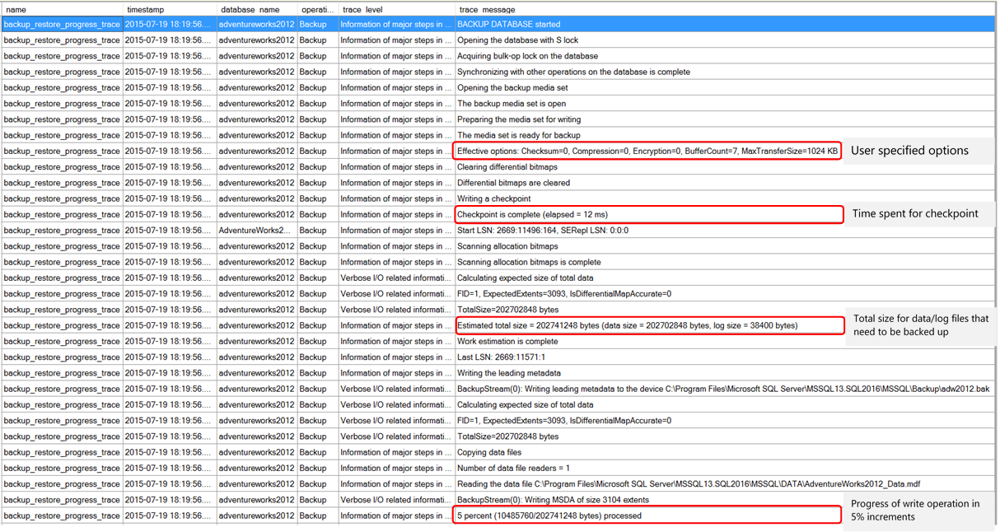
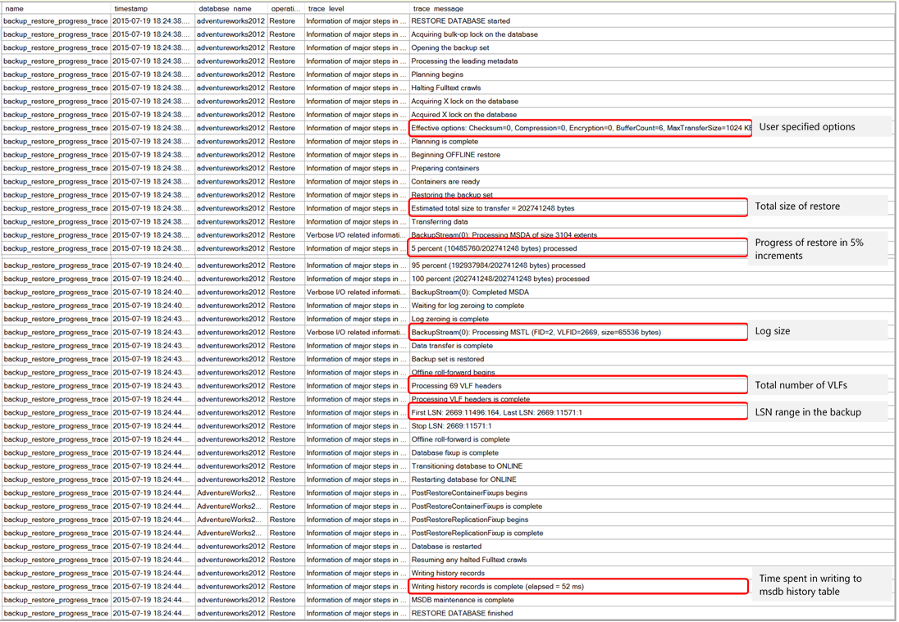

# Back Up and Restore of SQL Server Databases
 [!INCLUDE [SQL Server](../../includes/applies-to-version/sqlserver.md)]
  This article describes the benefits of backing up [!INCLUDE[ssNoVersion](../../includes/ssnoversion-md.md)] databases, basic backup and restore terms, and introduces backup and restore strategies for [!INCLUDE[ssNoVersion](../../includes/ssnoversion-md.md)] and security considerations for [!INCLUDE[ssNoVersion](../../includes/ssnoversion-md.md)] backup and restore. 

> This article introduces SQL Server backups. For specific steps to back up SQL Server databases, see [Creating backups](#creating-backups).
  
 The SQL Server backup and restore component provides an essential safeguard for protecting critical data stored in your [!INCLUDE[ssNoVersion](../../includes/ssnoversion-md.md)] databases. To minimize the risk of catastrophic data loss, you need to back up your databases to preserve modifications to your data on a regular basis. A well-planned backup and restore strategy helps protect databases against data loss caused by a variety of failures. Test your strategy by restoring a set of backups and then recovering your database to prepare you to respond effectively to a disaster.
  
 In addition to local storage for storing the backups, SQL Server also supports backup to and restore from Azure Blob Storage. For more information, see [SQL Server Backup and Restore with Microsoft Azure Blob Storage](../../relational-databases/backup-restore/sql-server-backup-and-restore-with-microsoft-azure-blob-storage-service.md). For database files stored using Azure Blob Storage, [!INCLUDE[sssql16-md](../../includes/sssql16-md.md)] provides the option to use Azure snapshots for nearly instantaneous backups and faster restores. For more information, see [File-Snapshot Backups for Database Files in Azure](../../relational-databases/backup-restore/file-snapshot-backups-for-database-files-in-azure.md). Azure also offers an enterprise-class backup solution for SQL Server running in Azure VMs. A fully-managed backup solution, it supports Always On availability groups, long-term retention, point-in-time recovery, and central management and monitoring. For more information, see [Azure Backup for SQL Server in Azure VM](/azure/backup/backup-azure-sql-database).
  
##  Why back up?  
-   Backing up your [!INCLUDE[ssNoVersion](../../includes/ssnoversion-md.md)] databases, running test restores procedures on your backups, and storing copies of backups in a safe, off-site location protects you from potentially catastrophic data loss. **Backing up is the only way to protect your data.**

     With valid backups of a database, you can recover your data from many failures, such as:  
  
    -   Media failure.    
    -   User errors, for example, dropping a table by mistake.    
    -   Hardware failures, for example, a damaged disk drive or permanent loss of a server.    
    -   Natural disasters. By using SQL Server Backup to Azure Blob Storage, you can create an off-site backup in a different region than your on-premises location, to use in the event of a natural disaster affecting your on-premises location.  
  
-   Additionally, backups of a database are useful for routine administrative purposes, such as copying a database from one server to another, setting up [!INCLUDE[ssHADR](../../includes/sshadr-md.md)] or database mirroring, and archiving.  
  
##  Glossary of backup terms
 **back up** [verb]  
 The process of creating a **backup [noun]** by copying data records from a [!INCLUDE[ssNoVersion](../../includes/ssnoversion-md.md)]  database, or log records from its transaction log.  
  
 **backup** [noun]  
 A copy of data that can be used to restore and recover the data after a failure. Backups of a database can also be used to restore a copy the database to a new location.  
  
**backup** device  
 A disk or tape device to which SQL Server backups are written and from which they can be restored. SQL Server backups can also be written to an Azure Blob Storage, and **URL** format is used to specify the destination and the name of the backup file.. For more information, see [SQL Server Backup and Restore with Microsoft Azure Blob Storage](../../relational-databases/backup-restore/sql-server-backup-and-restore-with-microsoft-azure-blob-storage-service.md).  
  
**backup media**  
 One or more tapes or disk files to which one or more backups have been written.  
  
**data backup**  
 A backup of data in a complete database (a database backup), a partial database (a partial backup), or a set of data files or filegroups (a file backup).  
  
**database backup**  
 A backup of a database. Full database backups represent the whole database at the time the backup finished. Differential database backups contain only changes made to the database since its most recent full database backup.  
  
**differential backup**  
 A data backup that is based on the latest full backup of a complete or partial database or a set of data files or filegroups (the differential base) and that contains only the data that has changed since that base.  
  
**full backup**  
 A data backup that contains all the data in a specific database or set of filegroups or files, and also enough log to allow for recovering that data.  
  
**log backup**  
 A backup of transaction logs that includes all log records that were not backed up in a previous log backup. (full recovery model)  
  
**recover**  
 To return a database to a stable and consistent state.  
  
**recovery**  
 A phase of database startup or of a restore with recovery that brings the database into a transaction-consistent state.  
  
**recovery model**  
 A database property that controls transaction log maintenance on a database. Three recovery models exist: simple, full, and bulk-logged. The recovery model of database determines its backup and restore requirements.  
  
**restore**  
 A multi-phase process that copies all the data and log pages from a specified [!INCLUDE[ssNoVersion](../../includes/ssnoversion-md.md)] backup to a specified database, and then rolls forward all the transactions that are logged in the backup by applying logged changes to bring the data forward in time.  
  
 ##  Backup and restore strategies  
 Backing up and restoring data must be customized to a particular environment and must work with the available resources. Therefore, a reliable use of backup and restore for recovery requires a backup and restore strategy.A well-designed backup and restore strategy balances the business requirements for maximum data availability and minimum data loss, while considering the cost of maintaining and storing backups.  

 A backup and restore strategy contains a backup portion and a restore portion. The backup part of the strategy defines the type and frequency of backups, the nature, and speed of the hardware that is required for them, how backups are to be tested, and where and how backup media is to be stored (including security considerations). The restore part of the strategy defines who is responsible for performing restores, how restores should be performed to meet your goals for database availability and minimizing data loss, and how restores are tested. 
  
 Designing an effective backup and restore strategy requires careful planning, implementation, and testing. Testing is required: you do not have a backup strategy until you have successfully restored backups in all the combinations that are included in your restore strategy and have tested the restored database for physical consistency. You must consider a variety of factors. These include:  
  
- The goals of your organization regarding your production databases, especially the requirements for availability and protection of data from loss or damage.  
  
-  The nature of each database: its size, its usage patterns, the nature of its content, the requirements for its data, and so on.  
  
-   Constraints on resources, such as: hardware, personnel, space for storing backup media, the physical security of the stored media, and so on.  

## Best Practice Recommendations

### Use Separate Storage 
> [!IMPORTANT] 
> Ensure that you place your database backups on a separate physical location or device from the database files. When your physical drive that stores your databases malfunctions or crashes, recoverability depends on the ability to access the separate drive or remote device that stored the backups in order to perform a restore. Keep in mind that you could create several logical volumes or partitions from a same physical disk drive. Carefully study the disk partition and logical volume layouts before choosing a storage location for the backups.

### Choose appropriate recovery model
 Backup and restore operations occur within the context of a [recovery model](../backup-restore/recovery-models-sql-server.md). A recovery model is a database property that controls how the transaction log is managed. Thus, the recovery model of a database determines what types of backups and restore scenarios are supported for the database, and what the size of the transaction log backups would be. Typically, a database uses either the simple recovery model or the full recovery model. The full recovery model can be augmented by switching to the bulk-logged recovery model before bulk operations. For an introduction to these recovery models and how they affect transaction log management, see [The Transaction Log (SQL Server)](../logs/the-transaction-log-sql-server.md)  
  
 The best choice of recovery model for the database depends on your business requirements. To avoid transaction log management and simplify backup and restore, use the simple recovery model. To minimize work-loss exposure, at the cost of administrative overhead, use the full recovery model. To minimize impact on log size during bulk-logged operations while at the same time allowing for recoverability of those operations, use bulk-logged recovery model. For information about the effect of recovery models on backup and restore, see [Backup Overview &#40;SQL Server&#41;](../../relational-databases/backup-restore/backup-overview-sql-server.md).  
  
### Design your backup strategy  
 After you have selected a recovery model that meets your business requirements for a specific database, you have to plan and implement a corresponding backup strategy. The optimal backup strategy depends on a variety of factors, of which the following are especially significant:  
  
-   How many hours a day do applications have to access the database?  
  
     If there is a predictable off-peak period, we recommend that you schedule full database backups for that period.  
  
-   How frequently are changes and updates likely to occur?  
  
     If changes are frequent, consider the following:  
  
    -   Under the simple recovery model, consider scheduling differential backups between full database backups. A differential backup captures only the changes since the last full database backup.  
  
    -   Under the full recovery model, you should schedule frequent log backups. Scheduling differential backups between full backups can reduce restore time by reducing the number of log backups you have to restore after restoring the data.  
  
-   Are changes likely to occur in only a small part of the database or in a large part of the database?  
  
     For a large database in which changes are concentrated in a part of the files or filegroups, partial backups and or file backups can be useful. For more information, see [Partial Backups &#40;SQL Server&#41;](../../relational-databases/backup-restore/partial-backups-sql-server.md) and [Full File Backups &#40;SQL Server&#41;](../../relational-databases/backup-restore/full-file-backups-sql-server.md).  
  
-   How much disk space will a full database backup require?  
-   How far in the past does your business require to maintain backups? 

    Make sure you have a proper backup schedule established according to the needs of the application and business requirements. As the backups get old, the risk of data loss is higher unless you have a way to regenerate all the data till the point of failure. Before you choose to dispose of old backups due to storage resource limitations, consider if recoverability is required that far in the past

  
 ### Estimate the size of a full database backup  
 Before you implement a backup and restore strategy, you should estimate how much disk space a full database backup will use. The backup operation copies the data in the database to the backup file. The backup contains only the actual data in the database and not any unused space. Therefore, the backup is usually smaller than the database itself. You can estimate the size of a full database backup by using the **sp_spaceused** system stored procedure. For more information, see [sp_spaceused &#40;Transact-SQL&#41;](../../relational-databases/system-stored-procedures/sp-spaceused-transact-sql.md).  
  
### Schedule backups  
 Performing a backup operation has minimal effect on transactions that are running; therefore, backup operations can be run during regular operations. You can perform a [!INCLUDE[ssNoVersion](../../includes/ssnoversion-md.md)] backup with minimal effect on production workloads.  
   
>  For information about concurrency restrictions during backup, see [Backup Overview &#40;SQL Server&#41;](../../relational-databases/backup-restore/backup-overview-sql-server.md).  
  
 After you decide what types of backups you require and how frequently you have to perform each type, we recommend that you schedule regular backups as part of a database maintenance plan for the database. For information about maintenance plans and how to create them for database backups and log backups, see [Use the Maintenance Plan Wizard](../../relational-databases/maintenance-plans/use-the-maintenance-plan-wizard.md).
  
### Test your backups!  
 You do not have a restore strategy until you have tested your backups. It is very important to thoroughly test your backup strategy for each of your databases by restoring a copy of the database onto a test system. You must test restoring every type of backup that you intend to use. It is also recommended that once you restore the backup, you perform database consistency checks via DBCC CHECKDB of the database to validate the backup media was not damaged. 

### Verify Media Stability and Consistency
Use the verification options provided by the backup utilities (BACKUP T-SQL command, SQL Server Maintenance Plans, your backup software or solution, etc). For an example, see [RESTORE VERIFYONLY] (../t-sql/statements/restore-statements-verifyonly-transact-sql.md)
Use advanced features like BACKUP CHECKSUM to detect problems with the backup media itself. For more information see [Possible Media Errors During Backup and Restore (SQL Server)](../backup-restore/possible-media-errors-during-backup-and-restore-sql-server.md)

### Document Backup/Restore Strategy 
We recommend that you document your backup and restore procedures and keep a copy of the documentation in your run book.
We also recommend that you maintain an operations manual for each database. This operations manual should document the location of the backups, backup device names (if any), and the amount of time that is required to restore the test backups.


## Monitor progress with xEvent
Backup and restore operations can take a considerable amount of time due to the size of a database and the complexity of the operations involved. When issues arise with either operation, you can use the **backup_restore_progress_trace** extended event to monitor progress live. For more information about extended events, see [extended events](../extended-events/extended-events.md).

  >[!WARNING]
  > Using the backup_restore_progress_trace extended event can cause a performance issue and consume a significant amount of disk space. Use for short periods of time, exercise caution, and test thoroughly before implementing in production.


```sql
-- Create the backup_restore_progress_trace extended event esssion
CREATE EVENT SESSION [BackupRestoreTrace] ON SERVER 
ADD EVENT sqlserver.backup_restore_progress_trace
ADD TARGET package0.event_file(SET filename=N'BackupRestoreTrace')
WITH (MAX_MEMORY=4096 KB,EVENT_RETENTION_MODE=ALLOW_SINGLE_EVENT_LOSS,MAX_DISPATCH_LATENCY=5 SECONDS,MAX_EVENT_SIZE=0 KB,MEMORY_PARTITION_MODE=NONE,TRACK_CAUSALITY=OFF,STARTUP_STATE=OFF)
GO

-- Start the event session  
ALTER EVENT SESSION [BackupRestoreTrace]  
ON SERVER  
STATE = start;  
GO  

-- Stop the event session  
ALTER EVENT SESSION [BackupRestoreTrace]  
ON SERVER  
STATE = stop;  
GO  
```

### Sample output from extended event 



 
  
## More about backup tasks  
-   [Create a Maintenance Plan](../../relational-databases/maintenance-plans/create-a-maintenance-plan.md)  
  
-   [Create a Job](../../ssms/agent/create-a-job.md)  
  
-   [Schedule a Job](../../ssms/agent/schedule-a-job.md)  
  
## Working with backup devices and backup media  
-   [Define a Logical Backup Device for a Disk File &#40;SQL Server&#41;](../../relational-databases/backup-restore/define-a-logical-backup-device-for-a-disk-file-sql-server.md)  
  
-   [Define a Logical Backup Device for a Tape Drive &#40;SQL Server&#41;](../../relational-databases/backup-restore/define-a-logical-backup-device-for-a-tape-drive-sql-server.md)  
  
-   [Specify a Disk or Tape As a Backup Destination &#40;SQL Server&#41;](../../relational-databases/backup-restore/specify-a-disk-or-tape-as-a-backup-destination-sql-server.md)  
  
-   [Delete a Backup Device &#40;SQL Server&#41;](../../relational-databases/backup-restore/delete-a-backup-device-sql-server.md)  
  
-   [Set the Expiration Date on a Backup &#40;SQL Server&#41;](../../relational-databases/backup-restore/set-the-expiration-date-on-a-backup-sql-server.md)  
  
-   [View the Contents of a Backup Tape or File &#40;SQL Server&#41;](../../relational-databases/backup-restore/view-the-contents-of-a-backup-tape-or-file-sql-server.md)  
  
-   [View the Data and Log Files in a Backup Set &#40;SQL Server&#41;](../../relational-databases/backup-restore/view-the-data-and-log-files-in-a-backup-set-sql-server.md)  
  
-   [View the Properties and Contents of a Logical Backup Device &#40;SQL Server&#41;](../../relational-databases/backup-restore/view-the-properties-and-contents-of-a-logical-backup-device-sql-server.md)  
  
-   [Restore a Backup from a Device &#40;SQL Server&#41;](../../relational-databases/backup-restore/restore-a-backup-from-a-device-sql-server.md)  
  
## Creating backups  
> [!NOTE]  
> For partial or copy-only backups, you must use the [!INCLUDE[tsql](../../includes/tsql-md.md)][BACKUP](../../t-sql/statements/backup-transact-sql.md) statement with the PARTIAL or COPY_ONLY option, respectively.  
  
 ### Using SSMS   
-   [Create a Full Database Backup &#40;SQL Server&#41;](../../relational-databases/backup-restore/create-a-full-database-backup-sql-server.md)  
  
-   [Back Up a Transaction Log &#40;SQL Server&#41;](../../relational-databases/backup-restore/back-up-a-transaction-log-sql-server.md)  
  
-   [Back Up Files and Filegroups &#40;SQL Server&#41;](../../relational-databases/backup-restore/back-up-files-and-filegroups-sql-server.md)  
  
-   [Create a Differential Database Backup &#40;SQL Server&#41;](../../relational-databases/backup-restore/create-a-differential-database-backup-sql-server.md)  
  
 ### Using T-SQL  
-   [Use Resource Governor to Limit CPU Usage by Backup Compression &#40;Transact-SQL&#41;](../../relational-databases/backup-restore/use-resource-governor-to-limit-cpu-usage-by-backup-compression-transact-sql.md)  
  
-   [Back Up the Transaction Log When the Database Is Damaged &#40;SQL Server&#41;](../../relational-databases/backup-restore/back-up-the-transaction-log-when-the-database-is-damaged-sql-server.md)  
  
-   [Enable or Disable Backup Checksums During Backup or Restore &#40;SQL Server&#41;](../../relational-databases/backup-restore/enable-or-disable-backup-checksums-during-backup-or-restore-sql-server.md)  
  
-   [Specify Whether a Backup or Restore Operation Continues or Stops After Encountering an Error &#40;SQL Server&#41;](../../relational-databases/backup-restore/specify-if-backup-or-restore-continues-or-stops-after-error.md)  
  
## Restore data backups 
### Using SSMS 
-   [Restore a Database Backup Using SSMS](../../relational-databases/backup-restore/restore-a-database-backup-using-ssms.md)  
  
-   [Restore a Database to a New Location &#40;SQL Server&#41;](../../relational-databases/backup-restore/restore-a-database-to-a-new-location-sql-server.md)  
  
-   [Restore a Differential Database Backup &#40;SQL Server&#41;](../../relational-databases/backup-restore/restore-a-differential-database-backup-sql-server.md)  
  
-   [Restore Files and Filegroups &#40;SQL Server&#41;](../../relational-databases/backup-restore/restore-files-and-filegroups-sql-server.md)  
  
### Using T-SQL
-   [Restore a Database Backup Under the Simple Recovery Model &#40;Transact-SQL&#41;](../../relational-databases/backup-restore/restore-a-database-backup-under-the-simple-recovery-model-transact-sql.md)  
  
-   [Restore a Database to the Point of Failure Under the Full Recovery Model &#40;Transact-SQL&#41;](../../relational-databases/backup-restore/restore-database-to-point-of-failure-full-recovery.md)  
  
-   [Restore Files and Filegroups over Existing Files &#40;SQL Server&#41;](../../relational-databases/backup-restore/restore-files-and-filegroups-over-existing-files-sql-server.md)  
  
-   [Restore Files to a New Location &#40;SQL Server&#41;](../../relational-databases/backup-restore/restore-files-to-a-new-location-sql-server.md)  
  
-   [Restore the master Database &#40;Transact-SQL&#41;](../../relational-databases/backup-restore/restore-the-master-database-transact-sql.md)  

## Restore transaction logs (Full Recovery Model)
### Using SSMS  
-   [Restore a Database to a Marked Transaction &#40;SQL Server Management Studio&#41;](../../relational-databases/backup-restore/restore-a-database-to-a-marked-transaction-sql-server-management-studio.md)  
  
-   [Restore a Transaction Log Backup &#40;SQL Server&#41;](../../relational-databases/backup-restore/restore-a-transaction-log-backup-sql-server.md)  
  
-   [Restore a SQL Server Database to a Point in Time &#40;Full Recovery Model&#41;](../../relational-databases/backup-restore/restore-a-sql-server-database-to-a-point-in-time-full-recovery-model.md)  
  
 ### Using T-SQL 
-   [Restore a SQL Server Database to a Point in Time &#40;Full Recovery Model&#41;](../../relational-databases/backup-restore/restore-a-sql-server-database-to-a-point-in-time-full-recovery-model.md)  
 
-   [Restart an Interrupted Restore Operation &#40;Transact-SQL&#41;](../../relational-databases/backup-restore/restart-an-interrupted-restore-operation-transact-sql.md)  
  
-   [Recover a Database Without Restoring Data &#40;Transact-SQL&#41;](../../relational-databases/backup-restore/recover-a-database-without-restoring-data-transact-sql.md)  
 
## More information and resources
 [Backup Overview &#40;SQL Server&#41;](../../relational-databases/backup-restore/backup-overview-sql-server.md)   
 [Restore and Recovery Overview &#40;SQL Server&#41;](../../relational-databases/backup-restore/restore-and-recovery-overview-sql-server.md)   
 [BACKUP &#40;Transact-SQL&#41;](../../t-sql/statements/backup-transact-sql.md)   
 [RESTORE &#40;Transact-SQL&#41;](../../t-sql/statements/restore-statements-transact-sql.md)   
 [Backup and Restore of Analysis Services Databases](/analysis-services/multidimensional-models/backup-and-restore-of-analysis-services-databases)   
 [Back Up and Restore Full-Text Catalogs and Indexes](../../relational-databases/search/back-up-and-restore-full-text-catalogs-and-indexes.md)   
 [Back Up and Restore Replicated Databases](../../relational-databases/replication/administration/back-up-and-restore-replicated-databases.md)   
 [The Transaction Log &#40;SQL Server&#41;](../../relational-databases/logs/the-transaction-log-sql-server.md)   
 [Recovery Models &#40;SQL Server&#41;](../../relational-databases/backup-restore/recovery-models-sql-server.md)   
 [Media Sets, Media Families, and Backup Sets &#40;SQL Server&#41;](../../relational-databases/backup-restore/media-sets-media-families-and-backup-sets-sql-server.md)  
  
