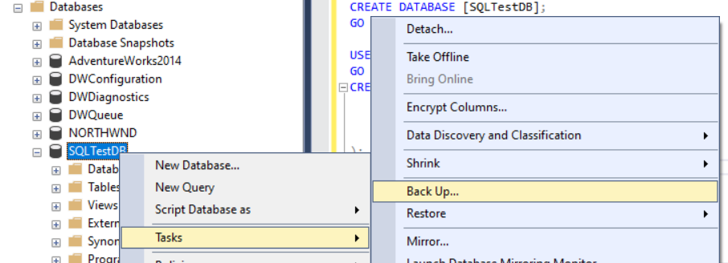
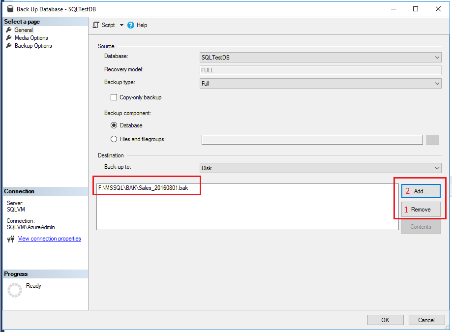
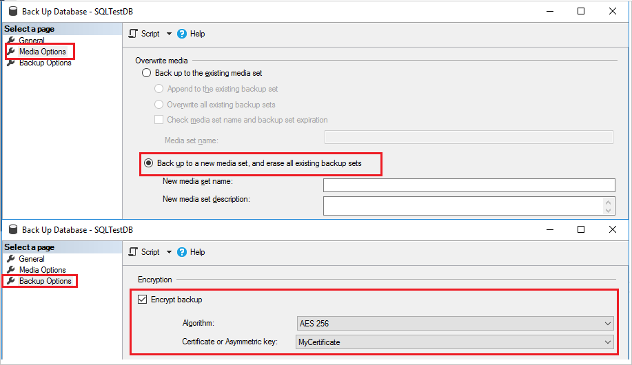

# Create a Full Database Backup

 [!INCLUDE [SQL Server](../../includes/applies-to-version/sqlserver.md)]

This topic describes how to create a full database backup in [!INCLUDE[ssnoversion](../../includes/ssnoversion-md.md)] using [!INCLUDE[ssManStudioFull](../../includes/ssmanstudiofull-md.md)], [!INCLUDE[tsql](../../includes/tsql-md.md)], or PowerShell.

For more information, see [SQL Server Backup and Restore with Azure Blob Storage](../../relational-databases/backup-restore/sql-server-backup-and-restore-with-microsoft-azure-blob-storage-service.md) and [SQL Server Backup to URL](../../relational-databases/backup-restore/sql-server-backup-to-url.md).

## <a name="Restrictions"></a> Limitations and restrictions

- The `BACKUP` statement isn't allowed in an explicit or implicit transaction.
- Backups created by more recent version of [!INCLUDE[ssNoVersion](../../includes/ssnoversion-md.md)] cannot be restored in earlier versions of [!INCLUDE[ssNoVersion](../../includes/ssnoversion-md.md)].

For an overview of, and deeper dive into, backup concepts and tasks, see [Backup Overview &#40;SQL Server&#41;](../../relational-databases/backup-restore/backup-overview-sql-server.md) before proceeding.

## <a name="Recommendations"></a> Recommendations

- As a database increases in size, full database backups take more time to complete and require more storage space. For large databases, consider supplementing full database backups with a series of [differential database backups](../../relational-databases/backup-restore/differential-backups-sql-server.md).
- Estimate the size of a full database backup by using the [sp_spaceused](../../relational-databases/system-stored-procedures/sp-spaceused-transact-sql.md) system stored procedure.
- By default, every successful backup operation adds an entry in the [!INCLUDE[ssNoVersion](../../includes/ssnoversion-md.md)] error log and in the system event log. If you back up frequently, success messages will accumulate quickly, resulting in huge error logs, making finding other messages difficult. In such cases, you can suppress these backup log entries by using trace flag 3226 if none of your scripts depend on those entries. For more information, see [Trace Flags &#40;Transact-SQL&#41;](../../t-sql/database-console-commands/dbcc-traceon-trace-flags-transact-sql.md).

## <a name="Security"></a> Security

**TRUSTWORTHY** is set to OFF on a database backup. For information about how to set **TRUSTWORTHY** to ON, see [ALTER DATABASE SET Options &#40;Transact-SQL&#41;](../../t-sql/statements/alter-database-transact-sql-set-options.md).

Beginning with [!INCLUDE[ssSQL11](../../includes/sssql11-md.md)], the **PASSWORD** and **MEDIAPASSWORD** options are no longer available for creating backups. You can still restore backups created with passwords.

## <a name="Permissions"></a> Permissions

`BACKUP DATABASE` and `BACKUP LOG` permissions default to members of the **sysadmin** fixed server role and the **db_owner** and **db_backupoperator** fixed database roles.

 Ownership and permission problems on the backup device's physical file can interfere with a backup operation. The [!INCLUDE[ssNoVersion](../../includes/ssnoversion-md.md)] service should read and write to the device. The account under which the [!INCLUDE[ssNoVersion](../../includes/ssnoversion-md.md)] service runs must have write permissions to the backup device. However, [sp_addumpdevice](../../relational-databases/system-stored-procedures/sp-addumpdevice-transact-sql.md), which adds an entry for a backup device in the system tables, doesn't check file access permissions. Problems in the backup device's physical file may not appear until the backup is used or a restore attempted.

## <a name="SSMSProcedure"></a> Using SQL Server Management Studio

> [!NOTE]
> When you specify a backup task by using [!INCLUDE[ssManStudioFull](../../includes/ssmanstudiofull-md.md)], you can generate the corresponding [!INCLUDE[tsql](../../includes/tsql-md.md)] [BACKUP](../../t-sql/statements/backup-transact-sql.md) script by clicking the **Script** button and selecting a script destination.

1. After connecting to the appropriate instance of the [!INCLUDE[msCoName](../../includes/msconame-md.md)] [!INCLUDE[ssDEnoversion](../../includes/ssdenoversion-md.md)], in **Object Explorer**, expand the server tree.

1. Expand **Databases**, and either select a user database or expand **System Databases** and select a system database.

1. Right-click the database that you wish to backup, point to **Tasks**, and then select **Back Up...**.

1. In the **Back Up Database** dialog box, the database that you selected appears in the drop-down list (which you can change to any other database on the server).

1. In the **Backup type** drop-down list, select a backup type - the default is **Full**.

   > [!IMPORTANT]
   > You must perform at least one full database backup before you can perform a differential or a transaction log backup.
   
1. Under **Backup component**, select **Database**.

1. In the **Destination** section, review the default location for the backup file (in the ../mssql/data folder).

   You can use the **Back up to** drop-down list to select a different device. Select **Add** to add backup objects and or destinations. You can stripe the backup set across multiple files for increased backup speed.

   To remove a backup destination, select it and select **Remove**. To view the contents of an existing backup destination, select it and select **Contents**.

1. (optional) Review the other available settings under the **Media Options** and **Backup Options** pages.

   For more information about the various backup options, see [General page](back-up-database-general-page.md), [Media options page](back-up-database-media-options-page.md), and [Backup options page](back-up-database-backup-options-page.md).

1. Select **OK** to start the backup.

1. When the backup completes successfully, select **OK** to close the SQL Server Management Studio dialog box.

### Additional information

- After creating a full database backup, you can create a [differential database backup](create-a-differential-database-backup-sql-server.md) or a [transaction log backup](back-up-a-transaction-log-sql-server.md).

- (optional) You can select the **Copy-only backup** checkbox to create a copy-only backup. A *copy-only backup* is a [!INCLUDE[ssNoVersion](../../includes/ssnoversion-md.md)] backup that is independent of the sequence of conventional [!INCLUDE[ssNoVersion](../../includes/ssnoversion-md.md)] backups. For more information, see [Copy-Only Backups &#40;SQL Server&#41;](../../relational-databases/backup-restore/copy-only-backups-sql-server.md). A copy-only backup isn't available for the **Differential** backup type.

- The **Overwrite media** option is disabled on the **Media Options** page if you're backing up to a URL.

### Examples

For the following examples, create a test database with the following Transact-SQL code:

```sql
USE [master]
GO

CREATE DATABASE [SQLTestDB]
GO

USE [SQLTestDB]
GO
CREATE TABLE SQLTest
   (
      ID INT NOT NULL PRIMARY KEY,
      c1 VARCHAR(100) NOT NULL,
      dt1 DATETIME NOT NULL DEFAULT getdate()
   );
GO

USE [SQLTestDB]
GO

INSERT INTO SQLTest (ID, c1) VALUES (1, 'test1')
INSERT INTO SQLTest (ID, c1) VALUES (2, 'test2')
INSERT INTO SQLTest (ID, c1) VALUES (3, 'test3')
INSERT INTO SQLTest (ID, c1) VALUES (4, 'test4')
INSERT INTO SQLTest (ID, c1) VALUES (5, 'test5')
GO

SELECT * FROM SQLTest
GO
```

#### A. Full back up to disk to default location

In this example, the `SQLTestDB` database will be backed up to disk at the default backup location.

1. After connecting to the appropriate instance of the [!INCLUDE[msCoName](../../includes/msconame-md.md)] [!INCLUDE[ssDEnoversion](../../includes/ssdenoversion-md.md)], in **Object Explorer**, expand the server tree.

1. Expand **Databases**, right-click `SQLTestDB`, point to **Tasks**, and then select **Back Up...**.

1. Select **OK**.

1. When the backup completes successfully, select **OK** to close the SQL Server Management Studio dialog box.



#### B. Full back up to disk to non-default location

In this example, the `SQLTestDB` database will be backed up to disk at a location of your choice.

1. After connecting to the appropriate instance of the [!INCLUDE[msCoName](../../includes/msconame-md.md)] [!INCLUDE[ssDEnoversion](../../includes/ssdenoversion-md.md)], in **Object Explorer**, expand the server tree.

1. Expand **Databases**, right-click `SQLTestDB`, point to **Tasks**, and then select **Back Up...**.

1. On the **General** page in the **Destination** section select **Disk** from the **Back up to:** drop-down list.

1. Select **Remove** until all existing backup files have been removed.

1. Select **Add** and the **Select Backup Destination** dialog box will open.

1. Enter a valid path and file name in the **File name** text box and use **.bak** as the extension to simplify the classification of this file.

1. Select **OK** and then select **OK** again to start the backup.

1. When the backup completes successfully, select **OK** to close the SQL Server Management Studio dialog box.



#### C. Create an encrypted backup

In this example, the `SQLTestDB` database will be backed up with encryption to the default backup location.

1. After connecting to the appropriate instance of the [!INCLUDE[msCoName](../../includes/msconame-md.md)] [!INCLUDE[ssDEnoversion](../../includes/ssdenoversion-md.md)], in **Object Explorer**, expand the server tree.

1. Expand **Databases**, expand **System Databases**, right-click `master`, and select **New Query** to open a query window with a connection to your `SQLTestDB` database.

1. Execute the following commands to create a [**database master key**](../../relational-databases/security/encryption/create-a-database-master-key.md) and a [**certificate**](../../t-sql/statements/create-certificate-transact-sql.md) within the `master` database.  

   ```sql
   -- Create the master key
   CREATE MASTER KEY ENCRYPTION BY PASSWORD = '23987hxJ#KL95234nl0zBe';  

   -- If the master key already exists, open it in the same session that you create the certificate (see next step)
   OPEN MASTER KEY DECRYPTION BY PASSWORD = '23987hxJ#KL95234nl0zBe'

   -- Create the certificate encrypted by the master key
   CREATE CERTIFICATE MyCertificate
   WITH SUBJECT = 'Backup Cert', EXPIRY_DATE = '20201031';  
   ```

1. In **Object Explorer**, in the **Databases** node, right-click `SQLTestDB`, point to **Tasks**, and then select **Back Up...**.

1. On the **Media Options** page, in the **Overwrite media** section select **Back up to a new media set, and erase all existing backup sets**.

1. On the **Backup Options** page in the **Encryption** section select the **Encrypt backup** check box.

1. From the Algorithm drop-down list, select **AES 256**.

1. From the **Certificate or Asymmetric key** drop-down list select `MyCertificate`.

1. Select **OK**.



#### D. Back up to Azure Blob Storage

The example creates a full database backup of `SQLTestDB` to Azure Blob Storage. The example assumes that you already have a storage account with a blob container. The example creates a shared access signature for you; this example fails if the container has an existing shared access signature.

If you don't have an Azure Blob Storage container in a storage account, create one before continuing. See [Create a general purpose storage account](/azure/storage/common/storage-quickstart-create-account?tabs=azure-portal) and [Create a container](/azure/storage/blobs/storage-quickstart-blobs-portal#create-a-container).

1. After connecting to the appropriate instance of the [!INCLUDE[msCoName](../../includes/msconame-md.md)] [!INCLUDE[ssDEnoversion](../../includes/ssdenoversion-md.md)], in **Object Explorer**, expand the server tree.

1. Expand **Databases**, right-click `SQLTestDB`, point to **Tasks**, and then select **Back Up...**.

1. On the **General** page in the **Destination** section select **URL** from the **Back up to:** drop-down list.

1. Select **Add** and the **Select Backup Destination** dialog box will open.

1. If you've previously registered the Azure storage container that you wish to use with SQL Server Management Studio, select it. Otherwise, select **New container** to register a new container.

1. In the **Connect to a Microsoft Subscription** dialog box, sign in to your account.

1. In the **Select Storage Account** drop-down text box, select your storage account.

1. In the **Select Blob Container** drop-down text box, select your blob container.

1. In the **Shared Access Policy Expiration** drop-down calendar box, select an expiration date for the shared access policy that you create in this example.

1. Select **Create Credential** to generate a shared access signature and credential in SQL Server Management Studio.

1. Select **OK** close the **Connect to a Microsoft Subscription** dialog box.

1. In the **Backup File** text box, modify the name of the backup file (optional).

1. Select **OK** to close the **Select a backup destination** dialog box.

1. Select **OK** to start the backup.

1. When the backup completes successfully, select **OK** to close the SQL Server Management Studio dialog box.

## <a name="TsqlProcedure"></a> Using Transact-SQL

Create a full database backup by executing the `BACKUP DATABASE` statement to create the full database backup, specifying:

- The name of the database to back up.
- The backup device where the full database backup is written.

The basic [!INCLUDE[tsql](../../includes/tsql-md.md)] syntax for a full database backup is:

 BACKUP DATABASE *database*
 TO *backup_device* [ **,**...*n* ]
 [ WITH *with_options* [ **,**...*o* ] ] ;

|Option|Description|
|------------|-----------------|
|*database*|Is the database that is to be backed up.|
|*backup_device* [ **,**...*n* ]|Specifies a list of from 1 to 64 backup devices to use for the backup operation. You can specify a physical backup device, or you can specify a corresponding logical backup device, if already defined. To specify a physical backup device, use the DISK or TAPE option:<br /><br /> { DISK &#124; TAPE } **=**_physical\_backup\_device\_name_<br /><br /> For more information, see [Backup Devices &#40;SQL Server&#41;](../../relational-databases/backup-restore/backup-devices-sql-server.md).|
|WITH *with_options* [ **,**...*o* ]|Used to specify one or more options, *o*. For information about some of the basic with options, see step 2.|

Optionally, specify one or more **WITH** options. A few basic **WITH** options are described here. For information about all the **WITH** options, see [BACKUP &#40;Transact-SQL&#41;](../../t-sql/statements/backup-transact-sql.md).

Basic backup set **WITH** options:

- **{ COMPRESSION | NO_COMPRESSION }**: In [!INCLUDE[ssEnterpriseEd10](../../includes/ssenterpriseed10-md.md)] and later only, specifies whether [backup compression](../../relational-databases/backup-restore/backup-compression-sql-server.md) is performed on this backup, overriding the server-level default.
- **ENCRYPTION (ALGORITHM, SERVER CERTIFICATE | ASYMMETRIC KEY)**: In SQL Server 2014 or later only, specify the encryption algorithm to use, and the Certificate or Asymmetric key to use to secure the encryption.
- **DESCRIPTION** **=** { **'**_text_**'** | **@**_text\_variable_ }: Specifies the free-form text that describes the backup set. The string can have a maximum of 255 characters.
- **NAME = { *backup_set_name* | **@**_backup\_set\_name\_var_ }**: Specifies the name of the backup set. Names can have a maximum of 128 characters. If NAME isn't specified, it's blank.

By default, `BACKUP` appends the backup to an existing media set, preserving existing backup sets. To explicitly specify, use the `NOINIT` option. For information about appending to existing backup sets, see [Media Sets, Media Families, and Backup Sets &#40;SQL Server&#41;](../../relational-databases/backup-restore/media-sets-media-families-and-backup-sets-sql-server.md).

To format the backup media, use the **FORMAT** option:

 FORMAT [ **,** MEDIANAME **=** { *media_name* | **@**_media\_name\_variable_ } ] [ **,** MEDIADESCRIPTION **=** { *text* | **@**_text\_variable_ } ]

 Use the **FORMAT** clause when you're using media for the first time or you want to overwrite all existing data. Optionally, assign the new media a media name and description.

 > [!IMPORTANT]
 > Use extreme caution when you are using the **FORMAT** clause of the `BACKUP` statement because this destroys any backups that were previously stored on the backup media.

### <a name="TsqlExample"></a> Examples

For the following examples, create a test database with the following Transact-SQL code:

```sql
USE [master]
GO

CREATE DATABASE [SQLTestDB]
GO

USE [SQLTestDB]
GO
CREATE TABLE SQLTest (
   ID INT NOT NULL PRIMARY KEY,
   c1 VARCHAR(100) NOT NULL,
   dt1 DATETIME NOT NULL DEFAULT GETDATE()
)
GO

USE [SQLTestDB]
GO

INSERT INTO SQLTest (ID, c1) VALUES (1, 'test1')
INSERT INTO SQLTest (ID, c1) VALUES (2, 'test2')
INSERT INTO SQLTest (ID, c1) VALUES (3, 'test3')
INSERT INTO SQLTest (ID, c1) VALUES (4, 'test4')
INSERT INTO SQLTest (ID, c1) VALUES (5, 'test5')
GO

SELECT * FROM SQLTest
GO
```

#### A. Back up to a disk device

The following example backs up the complete `SQLTestDB` database to disk, by using `FORMAT` to create a new media set.

```sql
USE SQLTestDB;
GO
BACKUP DATABASE SQLTestDB
TO DISK = 'c:\tmp\SQLTestDB.bak'
   WITH FORMAT,
      MEDIANAME = 'SQLServerBackups',
      NAME = 'Full Backup of SQLTestDB';
GO
```

#### B. Back up to a tape device

 The following example backs up the complete `SQLTestDB` database to tape, appending the backup to the previous backups.

```sql
USE SQLTestDB;
GO
BACKUP DATABASE SQLTestDB
   TO TAPE = '\\.\Tape0'
   WITH NOINIT,
      NAME = 'Full Backup of SQLTestDB';
GO
```

#### C. Back up to a logical tape device

The following example creates a logical backup device for a tape drive. The example then backs up the complete SQLTestDB database to that device.

```sql
-- Create a logical backup device,
-- SQLTestDB_Bak_Tape, for tape device \\.\tape0.
USE master;
GO
EXEC sp_addumpdevice 'tape', 'SQLTestDB_Bak_Tape', '\\.\tape0'; USE SQLTestDB;
GO
BACKUP DATABASE SQLTestDB
   TO SQLTestDB_Bak_Tape
   WITH FORMAT,
      MEDIANAME = 'SQLTestDB_Bak_Tape',
      MEDIADESCRIPTION = '\\.\tape0',
      NAME = 'Full Backup of SQLTestDB';
GO
```

## <a name="PowerShellProcedure"></a> Using PowerShell

Use the **Backup-SqlDatabase** cmdlet. To explicitly indicate a full database backup, specify the **-BackupAction** parameter with its default value, **Database**. This parameter is optional for full database backups.

> [!NOTE]
> These examples require the SqlServer module. To determine if it is installed, run `Get-Module -Name SqlServer`. To install, run `Install-Module -Name SqlServer` in an administrator session of PowerShell.
>
> For more information, see [SQL Server PowerShell Provider](../../powershell/sql-server-powershell-provider.md).

> [!IMPORTANT]
> If you are opening a PowerShell window from within SQL Server Management Studio to connect to an installation of SQL Server, you can omit the credential portion as your credential in SSMS is automatically used to establish the connection between PowerShell and your SQL Server instance.

### Examples

#### A. Full backup (local)

The following example creates a full database backup of the `<myDatabase>` database to the default backup location of the server instance `Computer\Instance`. Optionally, this example specifies **-BackupAction Database**.

For the full syntax examples, see [Backup-SqlDatabase](/powershell/module/sqlserver/backup-sqldatabase).

```powershell
$credential = Get-Credential

Backup-SqlDatabase -ServerInstance Computer[\Instance] -Database <myDatabase> -BackupAction Database -Credential $credential
```

#### B. Full backup to Azure

The following example creates a full backup of the database `<myDatabase>` on the `<myServer>` instance to the Azure Blob Storage. A stored access policy has been created with read, write, and list rights. The SQL Server credential, `https://<myStorageAccount>.blob.core.windows.net/<myContainer>`, was created using a Shared Access Signature that is associated with the Stored Access Policy. The PowerShell command uses the **BackupFile** parameter to specify the location (URL) and the backup file name.

```powershell
$credential = Get-Credential
$container = 'https://<myStorageAccount>blob.core.windows.net/<myContainer>'
$fileName = '<myDatabase>.bak'
$server = '<myServer>'
$database = '<myDatabase>'
$backupFile = $container + '/' + $fileName

Backup-SqlDatabase -ServerInstance $server -Database $database -BackupFile $backupFile -Credential $credential
```

## <a name="RelatedTasks"></a> Related tasks

- [Back Up a Database (SQL Server)](../../relational-databases/backup-restore/create-a-full-database-backup-sql-server.md)
- [Create a Differential Database Backup &#40;SQL Server&#41;](../../relational-databases/backup-restore/create-a-differential-database-backup-sql-server.md)
- [Restore a Database Backup Using SSMS](../../relational-databases/backup-restore/restore-a-database-backup-using-ssms.md)
- [Restore a Database Backup Under the Simple Recovery Model &#40;Transact-SQL&#41;](../../relational-databases/backup-restore/restore-a-database-backup-under-the-simple-recovery-model-transact-sql.md)
- [Restore a Database to the Point of Failure Under the Full Recovery Model &#40;Transact-SQL&#41;](../../relational-databases/backup-restore/restore-database-to-point-of-failure-full-recovery.md)
- [Restore a Database to a New Location &#40;SQL Server&#41;](../../relational-databases/backup-restore/restore-a-database-to-a-new-location-sql-server.md)
- [Use the Maintenance Plan Wizard](../../relational-databases/maintenance-plans/use-the-maintenance-plan-wizard.md)

## See also

- [Troubleshooting SQL Server backup and restore operations](https://support.microsoft.com/kb/224071)
- [Backup Overview &#40;SQL Server&#41;](../../relational-databases/backup-restore/backup-overview-sql-server.md)
- [Transaction Log Backups &#40;SQL Server&#41;](../../relational-databases/backup-restore/transaction-log-backups-sql-server.md)
- [Media Sets, Media Families, and Backup Sets &#40;SQL Server&#41;](../../relational-databases/backup-restore/media-sets-media-families-and-backup-sets-sql-server.md)
- [sp_addumpdevice &#40;Transact-SQL&#41;](../../relational-databases/system-stored-procedures/sp-addumpdevice-transact-sql.md)
- [BACKUP &#40;Transact-SQL&#41;](../../t-sql/statements/backup-transact-sql.md)
- [Back Up Database &#40;General Page&#41;](../../relational-databases/backup-restore/back-up-database-general-page.md)
- [Back Up Database &#40;Backup Options Page&#41;](../../relational-databases/backup-restore/back-up-database-backup-options-page.md)
- [Differential Backups &#40;SQL Server&#41;](../../relational-databases/backup-restore/differential-backups-sql-server.md)
- [Full Database Backups &#40;SQL Server&#41;](../../relational-databases/backup-restore/full-database-backups-sql-server.md)
