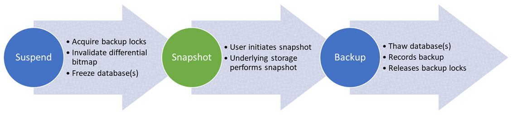
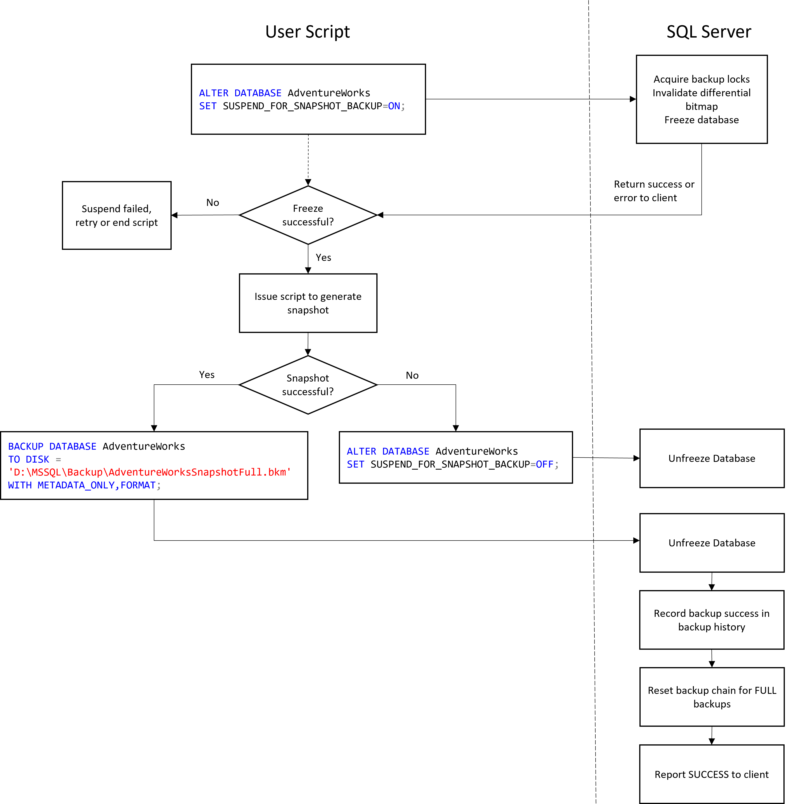
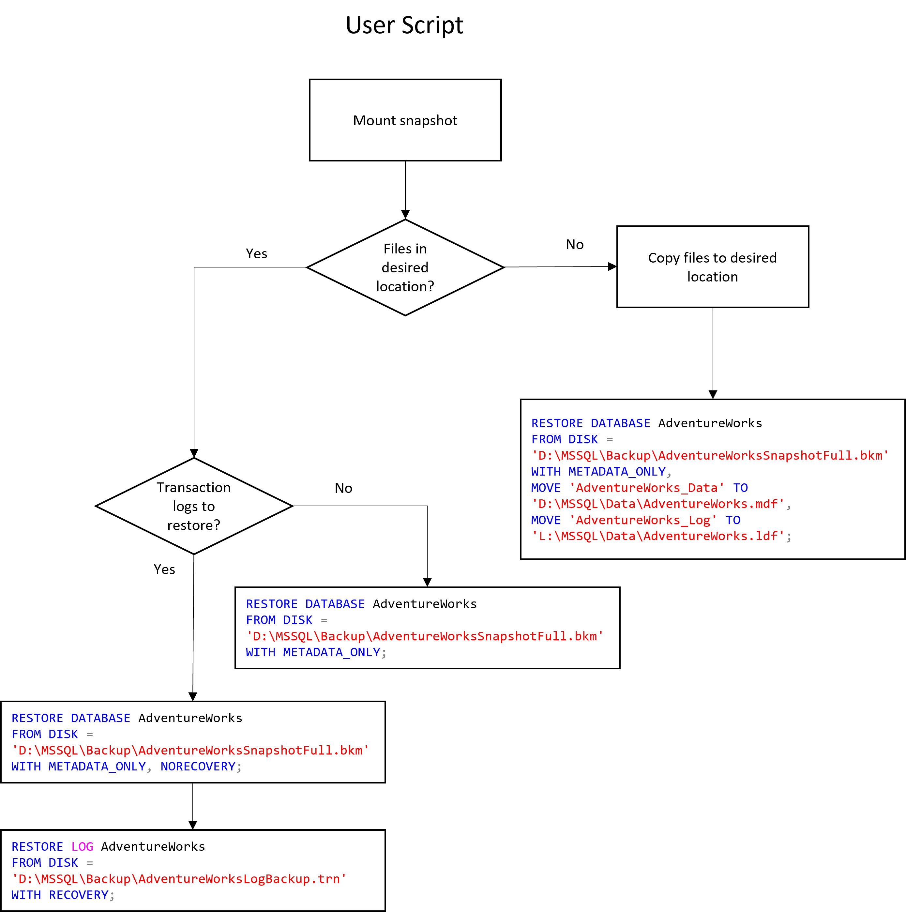
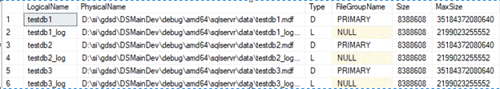
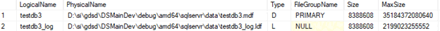

# Create a Transact-SQL snapshot backup

[!INCLUDE [SQL Server 2022](../../includes/applies-to-version/sqlserver2022.md)]

This article explains what, why, and how to use Transact-SQL snapshot backups. Transact-SQL snapshot backups are new in [!INCLUDE [sssql22-md](../../includes/sssql22-md.md)].

Databases are getting larger and larger every day. Traditionally, SQL Server backups are streaming backups. A streaming backup depends on the size of the database. Backup operations consume resources (CPU, memory, I/O, network) which impact throughput of the concurrent OLTP workload for the duration of the backup. One way to make the backup performance constant, rather than depend on the size of data, is by performing a snapshot backup using mechanisms provided by the underlying storage hardware or service.

Because the backup itself happens at the hardware level, this is not a pure SQL Server solution. SQL Server must first prepare the data and log files for the snapshot so that the files are guaranteed to be in a state that can later be restored. Once this is done, I/O is frozen on SQL Server and control is handed over to the backup application to complete the snapshot. Once the snapshot has successfully completed, the application must return control back to SQL Server where I/O is then resumed. Because we must freeze I/O for the duration of the snapshot operation, it is essential that the snapshot happen quickly (ideally less than a second), so that the workload on the server is not interrupted for an extended period. In the past, users have relied on third-party solutions that were built on top of the SQL Writer service to complete snapshot backups. The SQL Writer service depends on Windows VSS (Volume Shadow Service) along with SQL Server VDI (Virtual Device Interface) to perform the orchestration between SQL Server and the disk-level snapshot. Backup clients based on the SQL Writer service tend to be complex, and they only work on Windows. With T-SQL snapshot backups, the SQL Server side of the orchestration can be handled with a series of T-SQL commands. This allows users to create their own simple backup applications that can run on either Windows or Linux, or even scripted solutions if the underlying storage supports a scripting interface to initiate a snapshot.

Here is a [sample PowerShell script](https://github.com/microsoft/sql-server-samples/blob/master/samples/features/t-sql-snapshot-backup/snapshot-backup-restore-azurevm-single-db.ps1) that demonstrates an end-to-end solution of backing up and restoring a database in an Azure SQL IaaS Virtual Machine using the T-SQL snapshot backup capabilities introduced in [!INCLUDE [sssql22-md](../../includes/sssql22-md.md)] (and higher).

## Workflow

The T-SQL snapshot backup syntax decouples the vendor-dependent snapshot mechanism from the suspend and backup operations. With this syntax, you can:

1. Freeze a database with ALTER command – providing an opportunity for you to perform the snapshot of the underlying storage. After which, you can thaw the database and record the snapshot with BACKUP command.
2. Perform snapshots of multiple databases simultaneously with the new BACKUP GROUP and BACKUP SERVER commands. This enables snapshots to be performed at the snapshot granularity of the underlying storage and eliminates the need for you to perform a snapshot of the same disk multiple times.
3. Perform FULL backups as well as COPY_ONLY FULL backups. These backups are recorded in msdb as well.
4. Perform point-in-time recovery using log backups taken with the normal streaming approach after the snapshot FULL backup. Streaming differential backups are also supported if desired.

> [!NOTE]
> Differential bitmaps are cleared during the first stage when suspending the database with ALTER command. If the user decides to thaw the database without performing a backup because snapshot failed or for any other reason, the differential bitmap will be invalid. So, any subsequent differential backups will be more I/O intensive as they must scan the whole database to do the differential backup. The differential bitmap will become valid again after a successful snapshot backup.

The following diagram illustrates the high-level workflow of T-SQL snapshot backups:



The middle snapshot step requires you to initiate the snapshot on the underlying storage. The following diagram shows an example of how a backup script might work in conjunction with SQL Server to complete the snapshot backup process:



Similarly, a restore script might work as follows:



## Examples

The following sections show different T-SQL commands used to perform snapshot backup to disk.  When a snapshot backup is written to disk, only the metadata connected to the snapshot backup is written to the file. The output will not contain any of the database contents except for the header and the file contents. The shell file created as part of performing snapshot backup should be used with the actual snapshot URIto make a complete backup. RESTORE of a database from this file will require the user to copy the database files from the snapshot URIto the mount point prior to issuing the RESTORE command. Users will be able to run all the traditional T-SQL commands like RESTORE HEADERONLY, RESTORE FILELISTONLY on this snapshot backup metadata file along with RESTORE DATABASE. The syntax supports writing snapshot backup metadata to DISK or URL. The snapshot backup sets can also be appended just like streaming backup sets into a single file. 

> [!NOTE]
> For backup to URL, block blobs are preferred although page blobs are supported for SQL Server on Windows. For SQL Server on Linux and containers, only block blobs are supported.

### Suspend a single user database for snapshot backup and record a database backup

```sql
ALTER DATABASE testdb1
SET SUSPEND_FOR_SNAPSHOT_BACKUP = ON

BACKUP DATABASE testdb1
TO DISK='d:\temp\db.bkm'
WITH METADATA_ONLY, FORMAT
```

### Suspend multiple user databases for snapshot backup

If multiple databases on the same underlying disk, you could suspend multiple databases with the following command.

```sql
ALTER SERVER CONFIGURATION
SET SUSPEND_FOR_SNAPSHOT_BACKUP = ON (GROUP=(testdb1, testdb2))

BACKUP GROUP testdb1, testdb2
TO DISK='d:\temp\db.bkm'
WITH METADATA_ONLY, FORMAT
```

### Suspend all user databases on the server for snapshot backup

If all the user databases on the server need to be suspended, use the following command.

```sql
ALTER SERVER CONFIGURATION
SET SUSPEND_FOR_SNAPSHOT_BACKUP = ON

BACKUP SERVER
TO DISK='d:\temp\db.bkm'
WITH METADATA_ONLY, FORMAT
```
> [!NOTE]
> None of these commands support suspending system databases: master, model, and msdb for snapshot backup.

### Suspend multiple user databases with a single command

Record snapshot of all the user databases on the server into a single backup set:

```sql
ALTER SERVER CONFIGURATION
SET SUSPEND_FOR_SNAPSHOT_BACKUP = ON (GROUP=(testdb1, testdb2))

BACKUP GROUP testdb1, testdb2
TO DISK='d:\temp\db.bkm'
WITH METADATA_ONLY, FORMAT
```

> [!NOTE]
> By default suspend for snapshot backup commands will clear the differential bitmap. If you prefer to perform a copy only backup use the COPY_ONLY keyword as shown below.

### Performing Copy-Only Snapshot Backups

Since the differential bitmap is cleared prior to freeze, SUSPEND_FOR_SNAPSHOT_BACKUP provides an option (COPY_ONLY) to not clear the differential bitmap prior to freeze.

```sql

ALTER DATABASE testdb1
SET SUSPEND_FOR_SNAPSHOT_BACKUP = ON (MODE=COPY_ONLY)

BACKUP DATABASE testdb1
TO DISK='d:\temp\db.bkm'
WITH METADATA_ONLY, FORMAT

ALTER SERVER CONFIGURATION
SET SUSPEND_FOR_SNAPSHOT_BACKUP = ON (GROUP=(testdb1, testdb2), MODE=COPY_ONLY)

BACKUP GROUP testdb1, testdb2
TO DISK='d:\temp\db.bkm'
WITH METADATA_ONLY, FORMAT

ALTER SERVER CONFIGURATION
SET SUSPEND_FOR_SNAPSHOT_BACKUP = ON (MODE=COPY_ONLY)

BACKUP SERVER
TO DISK='d:\temp\db.bkm'
WITH METADATA_ONLY, FORMAT
```

> [!NOTE]
> It is not necessary to use COPY_ONLY on the BACKUP command, as it is already specified when suspending the database for snapshot backup.

### Tagging the backupset

You may use the MEDIANAME and MEDIADESCRIPTION options in the backup command to tag the URI associated with the snapshot. This use allows the backup file to carry the underlying snapshot information along with the database metadata. You can also use the NAME and DESCRIPTION options to tag the URI with the individual backupset snapshot.   

SQL Server will not interpret the LABEL information in any way, it will however help the user to view the URI associated with the snapshot backup with RESTORE LABELONLY command.  

You could then attach the snapshot disks located at the URI to the VM to restore the snapshot. The snapshot URI stored in the MEDIANAME and MEDIADESCRIPTION will also be available for viewing subsequently in the msdb database table `msdb.dbo.backupmediaset`.

[backupmediaset (Transact-SQL) - SQL Server | Microsoft Docs](../system-tables/backupmediaset-transact-sql.md)
[BACKUP (Transact-SQL) - SQL Server | Microsoft Docs](../../t-sql/statements/backup-transact-sql.md) <BR />

### Output of snapshot backup with RESTORE HEADERONLY

The output with RESTORE HEADERONLY looks like the following if the database, group and server are executed in sequence and written to the same output file:

```sql
RESTORE HEADERONLY
FROM DISK='d:\temp\db.bkm'
WITH METADATA_ONLY
```

### Output of snapshot backup with RESTORE FILELISTONLY

The output with RESTORE FILELISTONLY displays the first backup set by default:

```sql
RESTORE FILELISTONLY
FROM DISK='d:\temp\db.bkm'
WITH METADATA_ONLY
```

### Filtering RESTORE FILELISTONLY output to a backup set

To specifically select a certain backup set from multiple backup sets with RESTORE FILELISTONLY use FILE clause that is already supported on RESTORE FILELISTONLY.

```sql
RESTORE FILELISTONLY
FROM DISK='d:\temp\db.bkm'
WITH METADATA_ONLY, FILE=3
```



### Filtering RESTORE FILELISTONLY output to a database

Filter To further select a single database from multiple databases within the selected backup set with RESTORE FILELISTONLY use FILE clause with the newly introduced DBNAME clause. DBNAME clause can be used only on snapshot backup sets.

```sql
RESTORE FILELISTONLY
FROM DISK='d:\temp\db.bkm'
WITH METADATA_ONLY, FILE=3, DBNAME='testdb3'
```



### Restore a snapshot database

Restoring a database from snapshot backup is like *attaching* a database. Run the restore command without RECOVERY option if the database needs to be attached without recovery. By default, RESTORE selects the first database in the snapshot backup set. The following example restores testdb1. If testdb1 already exists on the server, include the REPLACE clause. You need to mount the database files before you run RESTORE.

```sql
RESTORE DATABASE testdb1
FROM DISK=' d:\temp\db.bkm'
WITH METADATA_ONLY, FILE=3, REPLACE, --> no DBNAME clause - restore first database in backup set
MOVE 'testdb1' TO 'd:\temp\snap\testdb1.mdf',
MOVE 'testdb1_log' TO 'd:\temp\snap\testdb1_log.ldf'
```

### Restore a snapshot database listed in the middle

If the database that needs to be RESTORED is in the middle, specify the database to be restored with DBNAME clause. The following syntax restores the specified database in the DBNAME clause.

```sql
RESTORE DATABASE testdb3
FROM DISK=' d:\temp\db.bkm'
WITH METADATA_ONLY, FILE=3, DBNAME='testdb3', --> restores testdb3 database
MOVE 'testdb3' TO 'd:\temp\snap\testdb3.mdf',
MOVE 'testdb3_log' TO 'd:\temp\snap\testdb3_log.ldf',
NORECOVERY
```

### Restore the database with a different name

You can restore the database with a different name. If the database that needs to be RESTORED is in the middle, specify the database to be restored with DBNAME clause. The following syntax restores the specified database with DBNAME clause and renames it to testdb33.

```sql
RESTORE DATABASE testdb33 --> renames the specified database testdb3 to testdb33.
FROM DISK=' d:\temp\db.bkm'
WITH METADATA_ONLY, FILE=3, DBNAME='testdb3', --> original name specified here
MOVE 'testdb3' TO 'd:\temp\snap\testdb3.mdf',
MOVE 'testdb3_log' TO 'd:\temp\snap\testdb3_log.ldf',
NORECOVERY
```

### Using RESTORE BACKUPSETONLY to extract databases from a backup set containing multiple databases

A snapshot backup set containing multiple databases from a group or server snapshot can be split with RESTORE BACKUPSETONLY command. This will produce one backup set per database.

If a server snapshot contains 3 databases in a backup file containing a single backup set, the following command will generate 3 backup sets, one for each database. It creates a directory with <file_name_prefix>_<unique_time_stamp> for the output files.

```sql
RESTORE BACKUPSETONLY
FROM DISK='d:\temp\db1.bkm'
WITH METADATA_ONLY
```

### Using RESTORE BACKUPSETONLY to extract a specific database in a backup set containing multiple databases

RESTORE BACKUPSETONLY supports DBNAME parameter if the user wants to output one database out of the 3 databases in the backup set. It also supports FILE parameter to filter multiple backup sets in the backup file.

```sql
RESTORE BACKUPSETONLY
FROM DISK='d:\temp\db.bkm'
WITH METADATA_ONLY, FILE=3, DBNAME='testdb2'
```

### Dynamic Management Views (DMVs) for seeing the suspend status and locks acquired

```sql 
sys.dm_server_suspend_status (db_id, db_name, suspend_session_id, suspend_time_ms, is_diffmap_cleared, is_writeio_frozen) 
sys.dm_tran_locks (resource_type, resource_database_id, resource_lock_partition, request_mode, request_type, request_status, request_owner_type, request_session_id)
```

### Server and database level properties for checking if a database was suspended for snapshot backup

```sql
SELECT SERVERPROPERTY('SuspendedDatabaseCount')
SELECT SERVERPROPERTY('IsServerSuspendedForSnapshotBackup')
SELECT DATABASEPROPERTYEX('db1', 'IsDatabaseSuspendedForSnapshotBackup')
```

### Sample T-SQL troubleshooting script

The following sample T-SQL script can be used to detect suspended databases on the server and unsuspend them if required. 

```sql
IF (SERVERPROPERTY('IsServerSuspendedForSnapshotBackup') = 1) 
    BEGIN
    --full server suspended, requires server level thaw
    PRINT 'Full server is suspended, requires server level thaw'
    ALTER SERVER CONFIGURATION SET SUSPEND_FOR_SNAPSHOT_BACKUP = OFF
    END
ELSE
    BEGIN
    IF (SERVERPROPERTY('SuspendedDatabaseCount') > 0)
        BEGIN
                DECLARE @curdb sysname
                DECLARE @sql nvarchar(500)
                DECLARE mycursor CURSOR FAST_FORWARD FOR SELECT db_name FROM sys.dm_server_suspend_status ;
                OPEN mycursor
                FETCH next FROM mycursor INTO @curdb
                WHILE @@FETCH_STATUS = 0  
                BEGIN  
                    PRINT 'unfreezing DB '+ @curdb 
                    SET @sql = 'ALTER DATABASE ' + @curdb +' SET SUSPEND_FOR_SNAPSHOT_BACKUP = OFF'
                    EXEC sp_executesql @SQL
                    FETCH next FROM mycursor INTO @curdb
                END  
                PRINT 'All DB unfrozen'
                CLOSE mycursor;  
                DEALLOCATE mycursor;  
        END
    ELSE
        -- no suspended database, thus no user action needed.
        PRINT 'No database/server is suspended for snapshot backup'
END
```
