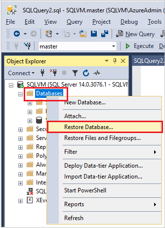
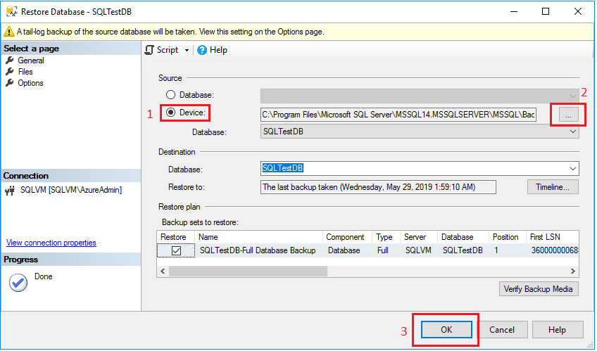

# Quickstart: Backup and restore a SQL Server database on-premises
 [!INCLUDE [SQL Server](../../includes/applies-to-version/sqlserver.md)]

In this quickstart, you will create a new database, take a simple backup of it, and then restore it. 

For a more detailed how-to, see [Create a full database backup](create-a-full-database-backup-sql-server.md) and [Restore a backup using SSMS](restore-a-database-backup-using-ssms.md).

## Prerequisites
To complete this quickstart, you will need the following: 

- [SQL Server](https://www.microsoft.com/sql-server/sql-server-downloads)
- [SQL Server Management Studio (SSMS)](../../ssms/download-sql-server-management-studio-ssms.md)

## Create a test database 

1. Launch [SQL Server Management Studio (SSMS)](../../ssms/download-sql-server-management-studio-ssms.md) and connect to your SQL Server instance.
1. Open a **New Query** window. 
1. Run the following Transact-SQL (T-SQL) code to create your test database. Refresh the **Databases** node in **Object Explorer** to see your new database. 

```sql
USE [master]
GO

CREATE DATABASE [SQLTestDB]
GO

USE [SQLTestDB]
GO
CREATE TABLE SQLTest (
	ID INT NOT NULL PRIMARY KEY,
	c1 VARCHAR(100) NOT NULL,
	dt1 DATETIME NOT NULL DEFAULT getdate()
)
GO


USE [SQLTestDB]
GO

INSERT INTO SQLTest (ID, c1) VALUES (1, 'test1')
INSERT INTO SQLTest (ID, c1) VALUES (2, 'test2')
INSERT INTO SQLTest (ID, c1) VALUES (3, 'test3')
INSERT INTO SQLTest (ID, c1) VALUES (4, 'test4')
INSERT INTO SQLTest (ID, c1) VALUES (5, 'test5')
GO

SELECT * FROM SQLTest
GO
```
 
## Take a backup
To take a backup of your database, do the following: 

1. Launch [SQL Server Management Studio (SSMS)](../../ssms/download-sql-server-management-studio-ssms.md) and connect to your SQL Server instance.
1. Expand the **Databases** node in **Object Explorer**.  
1. Right-click the database, hover over **Tasks**, and select **Back up...**. 
1. Under **Destination**, confirm the path for your backup is correct. If you need to change this, select **Remove** to remove the existing path, and then **Add** to type in a new path. You can use the ellipses to navigate to a specific file. 
1. Select **OK** to take a backup of your database. 


Alternatively, you can run the following Transact-SQL command to back up your database: 

```sql
BACKUP DATABASE [SQLTestDB] 
TO DISK = N'C:\Program Files\Microsoft SQL Server\MSSQL14.MSSQLSERVER\MSSQL\Backup\SQLTestDB.bak' 
WITH NOFORMAT, NOINIT,  
NAME = N'SQLTestDB-Full Database Backup', SKIP, NOREWIND, NOUNLOAD,  STATS = 10
GO
```


## Restore a backup
To restore your database, do the following: 

1. Launch [SQL Server Management Studio (SSMS)](../../ssms/download-sql-server-management-studio-ssms.md) and connect to your SQL Server instance.
1. Right-click the **Databases** node in **Object Explorer** and select **Restore Database...**.

    

1. Select **Device:**, and then select the ellipses (...) to locate your backup file. 
1. Select **Add** and navigate to where your `.bak` file is located. Select the `.bak` file and then select **OK**. 
1. Select **OK** to close the **Select backup devices** dialog box. 
1. Select **OK** to restore the backup of your database. 

    

Alternatively, you can run the following Transact-SQL script to restore your database:

```sql
USE [master]
RESTORE DATABASE [SQLTestDB] 
FROM DISK = N'C:\Program Files\Microsoft SQL Server\MSSQL14.MSSQLSERVER\MSSQL\Backup\SQLTestDB.bak' WITH  FILE = 1,  NOUNLOAD,  STATS = 5
GO
```

### Clean up resources
Run the following Transact-SQL command to remove the database you created, along with its backup history in the MSDB database:

```sql
EXEC msdb.dbo.sp_delete_database_backuphistory @database_name = N'SQLTestDB'
GO

USE [master]
DROP DATABASE [SQLTestDB]
GO
```

## See more
[Back up and restore overview](back-up-and-restore-of-sql-server-databases.md)
[Back up to URL](sql-server-backup-to-url.md)
[Create a full backup](create-a-full-database-backup-sql-server.md)
[Restore a database backup](restore-a-database-backup-using-ssms.md)
