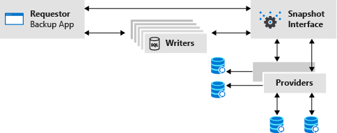
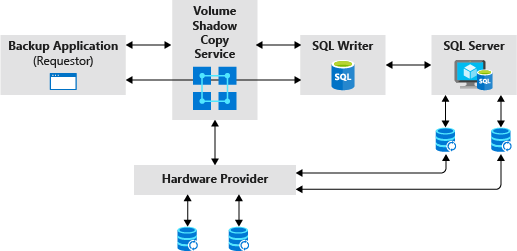
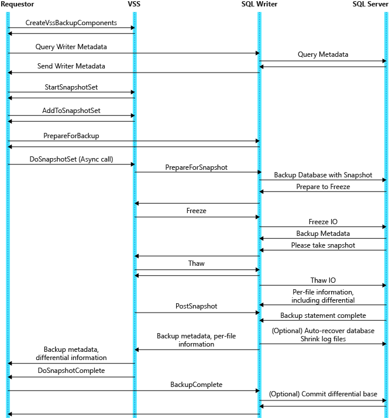
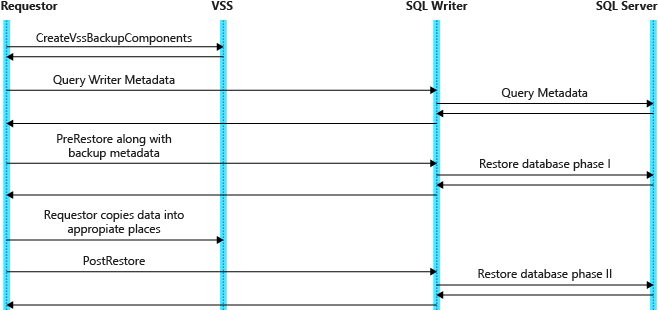

# SQL Server Backup Applications - Volume Shadow Copy Service (VSS) and SQL Writer
 [!INCLUDE [SQL Server](../../includes/applies-to-version/sqlserver.md)]

SQL Server provides support for Volume Shadow Copy Service (VSS) by providing a writer (the SQL writer) so that a third-party backup application can use the VSS framework to back up database files. This paper describes the SQL writer component and its role in the VSS snapshot creation and restores process for SQL Server databases. It also captures details on how to configure and use the SQL writer to work with backup applications in the VSS framework.

## Infrastructure of VSS

VSS provides the system infrastructure for running VSS applications on Windows systems. Though largely transparent to both user and developer, VSS:

- Coordinates activities of providers, writers, and requestors in the creation and use of shadow copies.
- Furnishes the default system provider.
- Implements the low-level driver functionality necessary for any provider to work.

The VSS service starts on demand; therefore, for VSS operations to be successful, this service must be enabled.

## VSS Components

VSS coordinates the activities of the following cooperating components: 

- Providers own the shadow copy data and instantiate the shadow copies.
- Writers are applications that change data and participate in the shadow copy synchronization process.
- Requestors initiate the creation and destruction of shadow copies. Our design is focused on the scenario where the requestor is a backup application.

VSS provides coordination between these parties: 



This diagram shows all the components participating in a typical VSS snapshot activity. In such a scenario, SQL Server (including the SQL writer) is acting as a writer in one of the Writer boxes.  Other such writers might be Exchange Server, etc.

- **Virtual Device Interface**: SQL Server provides an application programming interface called Virtual Device Interface (VDI) that helps independent software vendors to integrate SQL Server into their products by providing support for backup and restore operations. These APIs are engineered to provide maximum reliability and performance, and support the full range of SQL Server backup and restore functionality, including the full range of hot and snapshot backup capabilities. For more information, see [SQL Server 2005 Virtual Backup Device Interface Specification](https://www.microsoft.com/download/details.aspx?id=17282). 

- **Requestor**: A process (either automated or GUI) that requests that one or more snapshot sets be taken of one or more original volumes. In this paper, a requestor is also used to imply a backup application that is creating a snapshot of SQL Server databases.

See the documentation on [Volume Shadow Copy Service](/windows/win32/vss/volume-shadow-copy-service-overview) for details.

## SQL Writer

The SQL writer is a VSS writer provided by the SQL Server. It handles the VSS interaction with SQL Server. The SQL writer ships with SQL Server as a standalone service and is installed as part of the SQL Server installation.

The role of the SQL writer in a VSS snapshot backup operation: 



### Configuring the SQL Writer

The SQL writer service is installed in the system as part of the SQL Server installation and is configured to start automatically when Windows starts. 

### SQL Writer Service Account

During installation, the SQL writer account will be installed to use the Local System account. Since the SQL writer needs to talk to SQL Server using exclusive VDI APIs, the SQL writer account must have sufficient access rights for both SQL Server and VSS.  Configuring the service as a Local System account provides sufficient rights for the service to run correctly.

  > [!NOTE]
  > To have the SQL writer service work correctly, it is important to make sure that the Local System account is not removed from the SQL Server instance's 'sa' role.

### Re-Enabling and Starting SQL Writer

By default SQL Writer is enabled and will start automatically. If this configuration has been modified, the following must be done to revert to default settings:

SQL writer service can be enabled by marking this service as "Automatic". To open the services through control panel, click Start, click Control Panel, double-click Administrative Tools, and then double-click Services. In the Services pane, double-click the SQL writer service and modify the "Startup Type" property to "Automatic".

Service should then be started by selecting the "Start" button under the "Service Status" property in the service property screen mentioned above.

  > [!NOTE]
  > In certain cases where an instance of SQL Server Express is installed and an application is using the User Instances feature, the SQL writer may be automatically started by SQL Server. This is done to facilitate the enumeration of these User Instances during a VSS backup operation. 

## Features Supported by SQL Writer

- **Fulltext**: The SQL writer reports fulltext catalog containers with recursive file specifications under the database components in the writer's metadata document.  They are automatically included in the backup when the database component is selected
- **Differential backup and restore**: The SQL writer supports differential backup and restore through two VSS differential mechanisms: Partial File and Differenced File by Last Modify Time.
- **Partial File**:   The SQL writer uses the VSS Partial File mechanism for reporting changed byte ranges within its database files.  
- **Differenced File by Last Modify Time**: The SQL writer uses the VSS Differenced File by Last Modify Time mechanism for reporting changed files in fulltext catalogs.
- **Restore with Move**: The SQL writer supports VSSs New Target specification during restore.  VSSs New Target specification allows for a database/log file or fulltext catalog container to be relocated as part of the Restore operation.
- **Database Rename**: A requestor may need to restore a SQL database with a new name, especially if the database is to be restored side by side with the original database. The SQL writer supports renaming a database during the restore operation, as long as the database remains within the original SQL instance.
- **Copy-Only Backup**: It is sometimes necessary to take a backup that is intended for a special purpose, for example when you need to make a copy of a database for testing purposes.  This back up should not impact the overall backup and restore procedures for the database. Using the COPY_ONLY option specifies that the backup is done "out-of-band" and should not affect the normal sequence of backups. The SQL writer supports the "copy-only" backup type with SQL Server instances.
- **Autorecovery of Database Snapshot**:   Typically a snapshot of a SQL Server database obtained by using the VSS framework is in a non-recovered state. Data in the snapshot cannot be safely accessed prior to it going through the recovery phase to roll back in-flight transactions and place the database in a consistent state. It is possible for a VSS backup application to request autorecovery of the snapshots, as part of the snapshot creation process.

These new features and their usage are described in more detail in Backup and Restore Option Details in this topic.

### What is Not Supported

- Log backups are not supported by the SQL writer.
- File/Filegroup back up is not supported.
- Page restore is not supported.
- Database snapshots are not supported and are ignored while creating both component and non-component VSS snapshots. 
- Autoclose databases, or databases with shutdown enabled.
- Linux does not provide a VSS framework and therefore SQL Writer is not available on Linux

The following table lists the kinds of snapshot backups that are supported by the SQL writer/SQL Server working with the VSS framework for all editions of SQL Server.

| **backup and restore Operation**                 | **Component-Based**           | **Noncomponent-Based** |
|:-------------------------------------------- | :---------------------------- | :--------------------- |
|Full Data Backup </br> (Including fulltext catalog)| Yes                     | Yes                    |
|Full Restore                                  | Yes                           | Yes                    |
|Full Restore (No recovery)                    | Yes                           | No                     |
|Differential Backup                           | Yes                           | No                     |
|Differential Restore                          | Yes                           | No                     |
|Restore With Move                             | Yes                           | No                     |
|Database Rename                               | Yes                           | No                     |
|Copy Only Backup                              | Yes                           | No                     |
|Auto-Recovered Snapshots                       | Yes                           | No                     |
|Log Backup                                    | No                            | No                     |
|Database snapshots                            | No                            | No                     |
|Autoclose databases</br> Databases with shutdown | Yes                        | No                     |
|Availability group databases                  | Yes                           | No on secondary        | 

## Backup Operations

SQL Server (using the SQL writer) will support the following modes of VSS-based backup operations:

- Noncomponent-based
- Component-based

### Version Support

The SQL writer is shipped as part of SQL Server and supports only SQL Server instances. The SQL writer will enumerate the SQL Server Express instances also. User instances launched by SQL Server Express will also be enumerated by the SQL writer.

### Noncomponent-Based Backup Operations

Noncomponent-based backups implicitly select databases by using the list of volumes in the snapshot set. The SQL writer checks for torn databases, raising an error if found. A torn database is one in which a subset of files is selected by the list of volumes.

In the noncomponent-based model, only databases with the Simple Recovery model are supported. Roll forward after a restore is not supported.

### Component-Based Backup Operations

Component-based backups are preferred and recommended with the SQL writer, since the application (VSS backup application) will explicitly select the databases from the metadata that is returned from the SQL writer. The snapshot set should include all the volumes necessary to back up those databases. The VSS infrastructure does not automatically add the volumes that are required for the selected set of databases. All backing volumes should be included in the volume snapshot set. It is the responsibility of the backup application to make sure that all backing volumes are included in the snapshot set.  The SQL writer will detect torn databases (with backing volumes outside the snapshot set) and fail the backup.

The rest of this topic assumes that component-based backups are used as part of the VSS snapshot creation process for SQL Server.

## Snapshot Creation Process

The VSS framework coordinates the activities of a requestor (a backup application) and the SQL writer during the creation of SQL Server snapshots. To enable this coordination, the VSS framework defines requestor and writer interfaces.  These interfaces should be implemented by participating requestor applications and writers. The SQL writer implements the necessary writer interfaces. As part of the snapshot creation process, the SQL writer's interfaces are called by the VSS framework. The SQL writer interacts with SQL Server instances on the system to facilitate snapshot creation.

The VSS framework defines a set of APIs for usage by a requestor/backup application. A backup application developer needs to follow these API calling patterns to work with the VSS framework snapshot creation process. The next sections describe the snapshot creation process from the SQL writer point of view. They also detail some of the internal interactions between the requestor, VSS framework, SQL writer, and SQL Server instances. For more information on these steps and for details of the VSS framework interfaces, see the documentation on Volume Shadow Copy Service.    

  > [!NOTE]
  > It is assumed that the reader is familiar with the VSS framework and backup creation process in general. These sections are provided as supplemental information about how the SQL writer participates in the VSS backup creation process.

### Snapshot Creation Workflow



The image shows the dataflow diagram during a component-based snapshot creation/backup operation. To more fully understand the basic tasks involved in performing a backup, it is useful to break down this overview into the following phases:

- Backup initialization
- Backup discovery phase
- Prebackup tasks
- Actual backup of files
- Backup termination

### Backup Initialization

During this phase of the backup the requestor (backup application) binds to the snapshot interface `IvssBackupComponents` and initializes it in preparation for the backup. It also calls the VSS API `IVssGatherWriterMetadata` to tell the VSS framework to gather metadata from all the writers.

The VSS framework will call each of the registered writers including the SQL writer for the writer metadata using the **OnIdentify** event. The SQL writer will query the SQL Server instances to get the backup metadata information for each database and create the Writer Metadata Document. This phase is also referred to as Metadata Enumeration.

The Writer Metadata Document is a document that contains information that is passed from the writer to the requestor (backup application). The Writer Metadata Document contains the following information:

- The application ID and friendly name.
- Where files and components exist.
- Which files need to be included and excluded in a backup.
- What options should be used at restore time.
- This is passed back to the requestor via the VSS framework.

### Backup Discovery
In this phase, a requestor examines the Writer Metadata Document and creates and fills a **Backup Component Document** with each component that needs to be backed up. It also specifies the needed backup options and parameters as part of this document. For the SQL writer, each database instance that needs to be backed up is a separate component.

#### Backup Components Document
This is an XML document created by a requestor (using the `IVssBackupComponents` interface) in the course of setting up a restore or backup operation. The Backup Components Document contains a list of those explicitly included components, from one or more writers, participating in a backup or restore operation. It does not contain implicitly included component information. In contrast, a Writer Metadata Document contains only writer components that may participate in a backup. Structural details of a backup component document are described in the VSS API documentation.

#### Prebackup Tasks
Prebackup tasks under VSS are focused on creating a shadow copy of the volumes containing data for backup. The backup application will save data from the shadow copy, not the actual volume.

Requestors typically wait on writers during preparation for backup and while the shadow copy is being created. If the SQL writer is participating in the backup operation, it needs to configure its files and also itself to be ready for backup and shadow copy.

#### Prepare for backup
The requestor will need to set the type of backup operation that needs to be performed `IVssBackupComponents::SetBackupState` and then notify writers through VSS, to prepare for a backup operation using `IVssBackupComponents::PrepareForBackup`.

The SQL writer is given access to the Backup Component Document, which details what databases need to be backed up. All backing volumes should be included in the volume snapshot set. The  SQL writer will detect torn databases (with backing volumes outside the snapshot set) and fail the backup during the PostSnapshot event.

#### Actual Backup of Files

In this phase, the requestor can move the data to a backup media, if needed. Interactions in this stage are between the requestor and the VSS framework. The SQL writer is not involved.

1. Get writer status. Returns the status of writers. The requestor may need to handle any failures here.
1. Do back up.

The requestor can move the data to back up media if needed at this time.

#### Backup complete

This event will indicate that the backup was completed successfully.

This is also the time at which the SQL writer can commit the backup as a differential base, if the current backup is a full backup of the database (and not a copy-only backup).

  > [!NOTE]
  > The requestor should send this event (Backup Complete event) explicitly to allow the SQL writer to commit differential base backups. If this event is not received, the backup that is created will not be an eligible "differential base" backup.

#### Save writer metadata

The requestor should save the Backup Component Document and each component backup metadata along with the data backed from the snapshot. These writer metadata are needed by the SQL writer/SQL Server for restore operations.

#### Backup Termination

The requestor terminates the shadow copy by releasing the `IVssBackupComponents` interface or by calling `IVssBackupComponents::DeleteSnapshots`.

### SQL Writer Metadata Document

This is an XML document created by a writer (the SQL writer in this case) using the `IVssCreateWriterMetadata` interface, and containing information about the writer's state and components. The structural details of a Writer Metadata Document are described in the VSS API documentation. Here are some of the details of the SQL Writer Metadata Document.

- Writer Identification Information
    - **Writer name**  - L"SqlServerWriter"
    - **Writer class ID** -  0xa65faa63, 0x5ea8, 0x4ebc, 0x9d, 0xbd, 0xa0, 0xc4, 0xdb, 0x26, 0x91, 0x2a 
    - **Writer instance ID**  - L"SQL Server:SQLWriter" 
    - **VSSUsageType** - VSS_UT_USERDATA 
    - **VSSSourceType** - VSS_ST_TRANSACTEDDB 
- Writer Level Information - VSS_APP_BACK_END 
- Restore Method Specification – VSS_RME_RESTORE_IF_CAN_REPLACE.
- Supported Backup schema (IVssCreateWriterMetadata::SetBackupSchema API)
    - VSS_BS_DIFFERENTIAL – differential backup
    - VSS_BS_TIMESTAMPED – Timestamp based – for full-text catalog files.
    - VSS_BS_LAST_MODIFY –Differential backup based on last modify time,
    - VSS_BS_WRITER_SUPPORTS_NEW_TARGET – supports new target location option.
    - VSS_BS_WRITER_SUPPORTS_RESTORE_WITH_MOVE – supports restore "with move"
    - VSS_BS_COPY – supports "copy-only" backup option.
- Component Level Information
This contains component level-specific information provided by the SQL writer.
   - **Type** - VSS_CT_FILEGROUP
   - **Name**  - name of the component (database name)
   - **Logical path** – of the server instance (Will be in the form of "server\instance-name" for named instances and "server" for default instance.)
   - **Component Flags**
   - **VSS_CF_APP_ROLLBACK_RECOVERY** – indicates that SQL Server snapshots always require a "recovery" phase to make the files consistent and useable for non-backup (that is, app-rollback) scenarios.
   - Selectable - True
   - Selectable for Restore - True 
   - Restore methods supported - VSS_RME_RESTORE_IF_CAN_REPLACE

The only extension of the component set structure in SQL Server is the introduction of full-text catalogs.  Full-text catalogs are container directories, which cannot be expressed as the VSS database or log files, given that the VSS database and log files do not have recursive specification.  Therefore, the SQL writer will use a VSS filegroup component (VSS_CT_FILEGROUP) to represent the database level component and filegroup files to represent the database, log, and full-text catalog files.

An example Writer Metadata Document is provided at the end of this document.

**Initiate snapshot**
Requestor will initiate the snapshot process by calling the VSS framework interface DoSnapshotSet.

**Create snapshot**
This phase involves a series of interactions between the VSS framework and the SQL writer.

1. _Prepare for snapshot_. The SQL writer will call SQL Server to prepare for snapshot creation.
1. _Freeze_. The SQL writer will call SQL Server to freeze all the database I/O's for each of the databases being backed up in the snapshot. Once the freeze event returns to the VSS framework, VSS will create the snapshot.
1. _Thaw_. On this event, the SQL writer will call the SQL Server instances to "thaw" or resume normal I/O operations.

The snapshot creation phase is fast (less than 60 seconds), to prevent blocking of all writes to the database.

**Post-snapshot**
If autorecovery is needed for the snapshot, the SQL writer will do the autorecovery for each database that has been selected to be in the snapshot. For a detailed explanation, see Auto-Recovered Snapshots.

## Restore Process

This section describes the restore operation workflow and various steps involved.

### Restore Operation Workflow

The following figure shows the dataflow diagram during a VSS restore operation. To more fully understand the basic tasks involved in performing a restore, it is useful to break down this overview into the following topics:

- Restore Initialization
- Preparing for Restore
- Actual File Restoration
- Restore Clean up and Termination



In all VSS component-based restore scenarios, database restore is handled by the SQL writer in two distinct phases.

- **PreRestore**:  The SQL writer handles the validation, closing of file handles, etc.
- **Post Restore**:  The SQL writer attaches the database and does crash recovery if needed.

Between these two phases, the backup application is responsible for moving the relevant data around underneath SQL.

### Restore Initialization

During the initialization phase of a restore, the requestor needs to have access to the stored Backup Components Documents.

The Backup Component Document that is generated during the backup operation, is stored as part of the backup data. The backup application needs to pass this data back to the VSS framework. The SQL writer obtains access to this data at the beginning of the restore process.

#### Prepare for Restore

In preparing for a restore, a requestor uses the stored Backup Components Document to determine what is to be restored and how.  The requestor will select the components to be restored and set appropriate restore options as needed.

If a backup application intends to apply differential or log backups on top of the current restore operation (i.e., "Restore with norecovery" is needed), the following option should be set as part of component creation for each database that is being restored.

```
IVssBackupComponents::SetAdditionalRestores(true)
```

Once all the needed details are set in the Backup Component Document, the requestor makes the `IVssBackupComponents::PreRestore` call to generate a PreRestore event through VSS that will be handled by the writers.

The SQL writer will examine the supplied Backup Component Document to identify the appropriate databases, deleting any additional files created since the backup time. It also checks disk spaces and closes any opened database file handles so that the requestor can copy the needed data during the Restore phase. This phase allows any early error conditions to be detected before the requestor does the actual file copying. SQL Server will also put the database in restoring state.  From this point on, the database cannot be started until a successful restore.

#### Restore Files

This is purely a requestor-specific action. It is the responsibility of the requestor (backup application) to copy the needed database files (or copy relevant ranges of data for differential restores) to the appropriate places. The SQL writer is not involved in this operation.

#### Cleanup and Termination

Once all the data is restored to the right places, a call from a requestor notifying that the restore operation has been completed `IvssBackupComponents::PostRestore`, will let the SQL writer know that Post Restore actions can be started.  The SQL writer at this point will do the Redo phase of crash recovery. If recovery is not requested (that is, SetAdditionalRestores(true) is not specified by the requestor), the undo phase of the recovery step is also carried out during this phase.

## Backup and Restore Option Details

This section describes in detail all backup and restore options supported by SQL Writer.

### Requestor Creates a Volume Shadow Copy

The SQL writer could be involved in the volume shadow copy creation process (outside the context of backup and restore) because the db files' backing volume(s) have been added into the volume snapshot set.  In this case, the SQL writer only participates in the metadata enumeration, Freeze, Thaw, PrepareForSnapshot, and PostSnapshot coordination (see the data flow diagram for detail).

### Full Backup and Restore

The SQL writer supports full backup and restore operations in both noncomponent-based mode and component-based mode.

### Noncomponent-Based Backup and Restore

In a noncomponent-based backup and restore, the requestor specifies a volume or a folder tree to be backed up and restored. All the data in the specified volume and folder is backed up and restored.

#### Backup

In a noncomponent-based backup, the SQL writer implicitly selects databases by using the list of volumes in the snapshot set.  The writer checks for torn databases, raising an error if found. A torn database is one in which a subset of files is selected by the list of volumes.  Roll forward (differential or log restores) after a restore is not supported through the SQL writer.

#### Restore

The requestor restores database(s) that have been backed up in noncomponent-based mode.  Such restores cannot be followed up by a rollforward restore, such as log restore or differential restore.

For noncomponent-based restore operations, the restore must be performed with the SQL Server instance offline or the target databases are dropped/detached to ensure that the files are offline.  The files are copied in place and then the database(s) attached. All this happens outside the scope of the SQL writer.

### Component-Based Backup and Restore

In a component-based backup, the requestor explicitly selects database components (from the metadata that the SQL writer returns to the client) to be backed up/restored.

#### Backup

In a component-based backup, all backing volumes for selected databases should be included in the volume snapshot set.  Otherwise, the SQL writer will detect torn databases (with backing volumes outside the snapshot set) and fail the backup.  A full backup backs up database data and all the log files necessary to bring the database up to a transactionally consistent state at restore time.

#### Full restore without rollforward

A full restore of the database backup is sometimes accomplished without doing any additional  roll forwards. This may be because there is no metadata to facilitate the rollforward or, in some cases, roll forwards are not needed. This section covers these two situations briefly.  

#### No metadata/no rollforward

If no writer metadata (component-based backup metadata) is saved during the backup operation, then the restore must be performed with the SQL Server instance offline or the target databases are dropped/detached to ensure that the files are offline.  The files are copied in place and then the database(s) attached. All this happens outside the scope of the SQL writer.

#### Metadata exist but no additional rollforward is needed

The requestor restores database(s) that have been backed up in component-based mode but no roll forwards are requested. In this case SQL Server will perform crash recovery on the database as part of restore.

### Full restore with additional roll forwards

The requestor can issue a restore specifying the SetAdditionalRestores(true) option.  This option indicates that the requestor is going to follow up with more rollforward restores (such as log restore, differential restore etc.). This instructs SQL Server not to perform the recovery step at the end of the restore operation.

This is only possible if the writer metadata was saved during the backup and is available to the SQL writer at the time of the restore. The SQL Server service must be running before the requestor directs VSS to perform the restore activity.

The SQL writer expects the following sequence:

1. Preparation to restore each database. This activity involves closing all the file handles so as to allow database files to be copied/mounted by the requestor application.
1. Files are copied/mounted by the requestor application.
1. Finalize the restore (with NORECOVERY).  The databases are brought online, but into a "Restoring" state.

Conventional SQL backups, differential or logs, can then be used to roll forward the database through the VDI/T-SQL, or by applying the differential restore using the VSS framework.

### Full-Text Support

The SQL writer reports full-text catalog containers with recursive file specifications under the database components in the Writer Metadata Document.  They are automatically included in the backup when the database component is selected

### Differential backup and restore

A differential backup operation backs up only the data that has changed since the most recent base full backup. A differential backup contains only those parts of the database files that have changed. In order to do such a backup, the backup application, or requestor would need information about the location of the changes in the database files, so that appropriate sections of the file(s) can be backed up. During a differential backup operation, the SQL writer provides this information in the format as specified by "VSS partial file information." This information can be used to back up only the changed portion of the database files.

### Backup

The requestor can issue a differential backup by setting the DIFFERENTIAL option VSS_BT_DIFFERENTIAL in the Backup Component Document `IVssBackupComponents::SetBackupState` when initiating a backup operation with VSS.  The SQL writer will pass the partial file information (returned to it by SQL Server) to VSS.  The requestor can obtain this file information by calling VSS APIs `IVssComponent::GetPartialFile`. This partial file information allows the requestor to choose only changed byte-ranges to back up for the database files.

During the Pre Backup Tasks phase, the SQL writer will make sure that a single differential base for each selected database exists.

During the PostSnapshot event, the SQL writer will obtain the partial file information from SQL Server and add it to Backup Component Document using `IVssComponent::AddPartialFile` call.  

  > [!NOTE]
  > The SQL writer supports only a single differential baseline for differential backups. Multi-baselines are not supported.

### Partial file information format

For each database being backed up during a differential backup, the SQL writer will store the partial file information for each database file. This information is used by the requestor or backup application to copy only relevant portions of the file to the backup medium during the actual backup of the files. For more information on the format for this partial file information, see the documentation for Volume Shadow Copy Service.

A requestor can determine these files by calling `IVssComponent::GetPartialFileCount` and `IVssComponent::GetPartialFile`.  `IVssComponent::GetPartialFile` will return a path and a filename pointing to the file, and a ranges string indicating what needs to be backed up in the file.

For more information of the partial file information retrieval, see the [VSS documentation](/windows/win32/vss/volume-shadow-copy-service-overview).

### Back up files

During this phase, the backup application should look at the writer metadata stored in the Backup Component Document and back up only the relevant portions of the files. (For full-text catalog files, this backup should be done based on the file timestamps. This is described later in this document).

A differential backup will always be with respect to the latest base backup that exists for the database.  At restore time, SQL Server will detect mismatched base and differential backups. So, it is responsibility of the backup application or system administrator to be sure that the differential is relative to the expected full backup.  If some out of band procedure has made another full backup, the backup application may not be able to restore the differential, since it doesn't "own" the base backup.

Currently if the byte-range information (partial file information) is too large (exceeding 64 K bytes in buffer size), SQL Server will throw an error instructing the user to perform a full backup.

### Troubleshooting 

File add/drop/shrink/growth/logical-rename/physical-rename make interesting cases in backup.

**Files newly added after the base was taken**

These files are included in the partial specification because every header of the SQL database file needs to be in the partial specification.  Besides the header page, all the allocated pages need to be included in the partial specification.

**Files dropped after base was taken**

After the base was taken, data files could be dropped.  Such files are not included in the Writer Metadata Document during differential backup.  Furthermore, there will not be partial information associated with the dropped file.

**Files shrunk after the base was taken**

The partial information is not collected from the files until file shrinks have been disabled in the server.  This ensures that we will never include any partial information that corresponds to the shrunk region of a data file.  

**Files grown after the base was taken**

If growth took place before the partial information is collected, then the partial information should have included the allocated pages in the grown region.  If the growth took place after the partial information is collected, then the partial information does not include changes in the grown region.  In the following sections, we will see that such changes will be restored by the log roll-forward.

**File logically renamed after the base was taken**

A logical rename of the file does not affect the backup or restore, since the file's logical name is not referenced anywhere in the Writer Metadata Document or in the Backup Component Document.  (See the Writer Metadata document: An Example for more detail.)

**File physically renamed after the base was taken**

A physical database file rename does not take effect until the database restarts.  Therefore, the database configuration information or the file path information in the partial information buffer is still based on the old physical paths, which are the only valid paths to those database files on the snapshot.

### Restore

During a differential restore, the backup metadata that the requestor gives back to the SQL writer has the backup type information.  Therefore, no special treatment from the SQL writer is needed.  SQL Server will figure out that it's a differential restore by itself.  SQL Server handles such a differential restore in the same way as against a native differential restore that is not performed through VSS.

### Prerestore phase

During this phase SQL Server will resize all files to the appropriate size based on the differential backup's file metadata.  If the file is grown, SQL Server zeros out the grown portion.  If a new file has to be created (it was created after the base was taken), SQL Server zeros out the new file. It also closes all the file handles so that the backup application can overwrite the files with the restored data from the backup media.

### Restore files

The client should restore the files based on the partial file specification.  The data should be restored to the same offset/range of the database file as specified in the partial file specification stored in the writer metadata.

Database file add/drop/growth/shrink/logical-rename/physical-rename again makes interesting cases at restore time.

**If a database file had been added after the full base was taken**

Such files must have been pre-created by SQL Server during the restore preparation phase.  They should have been extended to the right size and zeroed out.  The client only needs to lay down the data as per partial specification (the partial specification includes all allocated extents).

**If a database file had been dropped after the full base was taken**

The partial information that SQL Server has provided does not include any tracking information for such file drops.  SQL Server is responsible for detecting the files to be deleted, by comparing the restored files metadata against the existing containers, and actually deleting them.  This is done prior to the restore as a preparation step.

**If a database file had grown since the full base was taken**

Such files must have been extended to the right size by SQL Server during the restore preparation phase.  The extended region must have been zeroed out by SQL Server as well.  Therefore, the client can safely lay down the data even in the grown region as per partial specification.  If the file was grown after the partial information was taken, the changes in the grown region will be restored by replaying the log that was backed up along with the differential backup.

**If a database file had shrunk since the full base was taken**

SQL Server is responsible for truncating the file to the required size as per metadata.  This is done prior to the restore as a preparation step.

**If a database file had been logically renamed since the full base was taken**

This would not affect the restore as the logical name does not appear in the Writer Metadata Document or the Backup Component Document.  The logical name change will be restored when the client applies the change to the primary database file, which contains the system catalog information.

**If a database file had been physically renamed since the full base was taken.**

If by the time of differential backup, the rename had not taken effect, then the client still restores data to the old location.  A database restart post-restore will cause the physical rename to take effect.  If by the time of differential backup, the physical file rename had already taken effect, then the partial data, if any, was backed up from the new physical path.  

### Post restore

During the post restore events, the SQL writer will perform the normal redo operation and recovery (if `SetAdditionalRestores()` is set to False) of the database.

## Differential Backup and Restore for Full-Text Catalogs

SQL Server full-text catalogs are part of the database resources that need to be backed up or restored together with the rest of the database files.  A differential backup is timestamp-based for full-text catalog.  The SQL Server VSS differential backup and restore has a single base backup.  In other words, there will not be different bases for different containers.  For VSS full-text catalog backup, this means for all full-text catalog containers, the differential backup will be single-timestamp based, unlike the case of native SQL differential backup, in which there is one timestamp base per full-text catalog container.

In VSS, this timestamp is expressed as a component-wide property that is set during the full backup, and used during a subsequent differential backup.  

### OnIdentify

In OnIdentify, the SQL writer calls IVssCreateWriterMetadata::SetBackupSchema() to set the value VSS_BS_TIMESTAMPED.  This indicates to the backup application that the SQL writer owns the management of the differential base.

### Setting the base timestamp

The base timestamp is set during a full backup.  In `OnPostSnapshot()`, the writer invokes `IVssComponent::SetBackupStamp()` to store the timestamp with the component in the backup document.

### Differential backup

The backup application will retrieve this timestamp from the base full backup, and make the timestamp available for the writer by calling `IVssComponent::GetBackupStamp()` to retrieve the base stamp from the previous base backup.  Then it makes it available to the writer by calling `IVssBackupComponent::SetPreviousBackupStamp()`.  Writer then retrieves the stamp by calling `IVssComponent::GetPreviousBackupStamp()` and translates it into a timestamp used for `IVssComponent::AddDifferencedFilesByLastModifyTime()`.  

**Backup application's responsibility during differential backup**
During a differential backup, the backup application is responsible for:

- Backing up any file (the entire file) whose last modified timestamp is greater than the timestamp specified by the "last modify time" for the file set in the component.
- Tracking and detecting deleted files.  

**Backup application's responsibilities during a differential restore**
During a differential restore, the backup application is responsible for:

- Restoring all files that have been backed up, either by creating a new file if it does not already exist, or by overwriting an existing file if it already exists.
- Growing the file before laying down the content if the restored file is larger than the existing file.
- Truncating the file to the same size as that of the restored file if the restored file is smaller than the existing file.
- Deleting all files that should be deleted; that is, those files that should not exist as of the point in time of the differential backup.

### Copy-Only Backup

It is sometimes necessary to take a backup that is intended for a special purpose. For example, you might need to make a copy of a database for testing purposes.  This backup should not impact the overall backup and restore procedures for the database. Using the COPY_ONLY option specifies that the backup is done "out-of-band" and should not affect the normal sequence of backups. The SQL writer supports the "copy-only" backup type with SQL Server instances.

During the backup discovery phase, the SQL writer will indicate its capability to do a copy-only backup by setting the supported backup schema option  VSS_BS_COPY using the `IVssCreateWriterMetadata::SetBackupSchema` call. The requestor can set the backup type as a copy-only backup by setting the VSS_BACKUP_TYPE option as VSS_BT_COPY with the call `IVssBackupComponents::SetBackupState`.

When a copy-only backup is selected, it is assumed that files on disk will be copied to a backup medium (by the requestor) regardless of the state of each file's backup history. SQL Server will not update the backup history. This type of backup will not constitute as a base backup for further differential backup operations and also it does not disturb the history of the previous differential backups.

### Restore with Move

VSS allows the backup application(requestor) to specify a new restore target using the `IVssComponent::SetNewTarget` call.  In both `PreRestore()` and `PostRestore()`, the SQL writer checks if there is at least one new target specified. It is the backup application's responsibility to physically copy the file(s) to the new location during the actual file restore/copy time.

The backup application is only allowed to specify new targets for the physical path, but not the file specification.  For example, for a database file located at c:\data\test.mdf, the actual file name, test.mdf, cannot be changed.  Only the path c:\data can be changed.  For a full-text catalog container located at c:\ftdata\foo, since the file specification in VSS is "*" and the path specification in VSS is c:\ftdata\foo, the entire path can be changed.  

### Database Rename

A requestor may need to restore an SQL database with a new name, especially if the database is to be restored side by side with the original database.  This option can be specified by the requestor during the restore operation by setting a custom restore option as "New Component Name" = <"New Name"> using the VSS call `IVssBackupComponents::SetRestoreOptions()` (in the wszRestoreOptions parameter).

The SQL writer will take the entire content of New Component Name's value and use it as the new name for the restored database. If no option is specified, SQL will restore the database with its original name (component name).

  > [!NOTE]
  > The SQL writer currently does not support "Rename across Instances" to move a database to a new instance.

### Auto-Recovered Snapshots

Typically a snapshot of SQL Server database obtained by using VSS framework is in a non-recovered state. Data in the snapshot cannot be safely accessed prior to going through the recovery phase to roll back in-flight transactions and placing the database in a consistent state. Since the snapshot is in a read-only state, it cannot be recovered by the normal process of attaching the database.

It is possible to autorecover the snapshots as part of the snapshot creation process. As part of the Writer Metadata Document, the SQL writer will specify the component flag `VSS_CF_APP_ROLLBACK_RECOVERY` to indicate that recovery needs to be performed for the database on snapshot before the database can be accessed when specifying the snapshot set, the requestor can indicate that the snapshot should be an app-rollback snapshot (that is, all database files in a snapshot are meant to be in a consistent state for application usage) or a backup snapshot (a snapshot used for backing up data to be restored later if there is a system failure).

The requestor should set `VSS_VOLSNAP_ATTR_ROLLBACK_RECOVERY` to indicate that this component is being backed up for a non-backup purpose.  VSS will then correlate `VSS_CF_APP_ROLLBACK_RECOVERY` that the SQL writer specified on the selected component with `VSS_VOLSNAP_ATTR_ROLLBACK_RECOVERY`, and determine that auto recovery is happening.  VSS will make the snapshot writeable for a limited period of time and automatically add the `VSS_VOLSNAP_ATTR_AUTORECOVERY` bit to the snapshot context.

SQL Server the auto recovery should be applied only to app-rollback snapshots but not for backup snapshots. For app-rollback snapshots, an autorecovery process is initiated by the SQL writer during the `PostSnapShotevent`. This process will do the following for each explicitly selected (by the requestor) SQL Server database in the snapshot set:

- Attach the snapshot database to the original SQL Server instance (that is, the instance to which the original database is attached).
- Recover the database (this happens as part of the "attach" operation).
- Shrink log files.

    This reduces the amount of unnecessary "copy-on-write" that needs to be done by the VSS framework, if VSS provider is a "Software Provider". Shrinking the log files is the default behavior. This can be disabled by setting the value to the following registry key to 1.
    
    `HKEY_LOCAL_MACHINE\SYSTEM\CurrentControlSet\Services\SQLWriter\
    Settings\DisableLogShrink`
    
    This may be useful in scenarios where the snapshot may be used to export data from a specific page (at a specific point in time) from the log to fix a problem in the online database.

- Detach the database.

Now we have a consistent, recovered snapshot that can be attached for querying.

### Multi-database transactions

In some cases, the snapshot databases may contain some in-flight multi-database transactions. During recovery operation, the SQL writer will attach the database on the snapshots with the Presumed Abort option. This would roll back any multi-database transaction that is not yet committed (including any transactions that are in a Prepared to Commit state). This may lead to some inconsistencies between databases in the snapshot set. For example, consider two databases A and B. There is a distributed transaction between these two databases and this transaction is in Committed state in database A and in Prepared to Commit state in database B. As part of the autorecovery process, this transaction will be committed in database A and rolled back in database B. This may lead to some inconsistencies in the snapshot set.

Microsoft Distributed Transaction Coordinator (MS DTC) component to be released in the Longhorn timeframe by the VSS framework will fix this inconsistency problem for transactions spanning databases across SQL Server instances. The next version of SQL Server will fix these inconsistencies for transactions spanning databases within a SQL Server instance.

### Security implications for autorecovered snapshots

For VSS snapshots, after the auto recovery, the files will be secured using Access Control Lists(ACLs) to allow access only to the special builtin group which SQL server account belongs to.  This implies that member of either box admin or that special group will be able to attach the database. The client requesting an attach of the database files on a snapshot either has to be a member of Builtin/Administrators or the SQL Server account.

#### Simple Recovery model user databases

If Master database is restored together with user databases that are using the Simple Recovery model, the user databases can be restored with the same technique as the master database: with the instance shut down, just copy or mount the volume(s).  When the SQL instance is started, everything recovers.

#### Rolling forward user databases

If user databases are to be recovered and rolled forward together with master database recovery, the instance must not start up and recover the master and user databases together.

The procedure is as follows:

1. Ensure that the SQL Server instance is stopped.
1. Perform the restore in two phases.
    1. Restore the system databases and user databases that should be recovered at the same time (that is, Simple Recovery mode user databases) via file copy /volume-mount through VSS.
        1. If the user databases to be rolled forward are not on the same volume as the system databases, then that volume should not be brought back at this time. This scenario requires planning prior to back up.
        1. If the user databases are on the same volume as the system databases, then the user databases need to be hidden from SQL Server.
    1. Start the SQL Server instance using the -f parameter.  (When using the -f startup option, only the master database can be restored.)
        1. Issue an ALTER DATABASE \<x> SET OFFLINE for each database to be rolled forward.  (Detach database is an alternative)
        1. Stop the SQL Server instance.
        1. Start the SQL Server instance (the files for the user databases to roll forward are not visible to SQL Server).

Use VSS to restore the user databases WITH NORECOVERY, as described in "Full Restore with rollforward".

### Writer Metadata Document:  An Example

A database named DB1, belonging to SQL Server instance Instance1 on machine Server1, and contains the following database/log files:

- Database file named "primary" stored at c:\db\DB1.mdf
- Database file named "secondary" stored at c:\db\DB1.ndf
- Database log file named "log" stored at c:\db\DB1.ldf
- Full-text catalog named "foo" stored under the directory c:\db\ftdata\foo
- Full-text catalog named "bar" stored under the directory c:\db\ftdata\bar.

Following is the database's writer metadata:

**Database level filegroup component**

**Primary database file:**

```text
ComponentType: VSS_CT_FILEGROUP
LogicalPath: "Server1\Instance1"
ComponentName: "DB1"
Caption: NULL
pbIcon: NULL
cbIcon: 0
bRestoreMetadata: FALSE
NotifyOnBackupComplete: TRUE
Selectable: TRUE
SelectableForRestore: TRUE
ComponentFlags: VSS_CF_APP_ROLLBACK_RECOVERY
```

**Secondary database file:**

```text
LogicalPath: "Server1\Instance1"
GroupName: "DB1"
Path: "c:\db"
FileSpec: "DB1.mdf"
Recursive: FALSE
AlternatePath: NULL
BackupTypeMask: VSS_FSBT_ALL_BACKUP_REQUIRED | VSS_FSBT_ALL_SNAPSHOT_REQUIRED
Filegroup file
LogicalPath: "Server1\Instance1"
GroupName: "DB1"
Path: "c:\db"
FileSpec: "DB1.ndf"
Recursive: FALSE
AlternatePath: NULL
BackupTypeMask: VSS_FSBT_ALL_BACKUP_REQUIRED | VSS_FSBT_ALL_SNAPSHOT_REQUIRED
```

**Full-text file log:**

```text
LogicalPath: "Server1\Instance1"
GroupName: "DB1"
Path: "c:\db"
FileSpec: "DB1.ldf"
Recursive: FALSE
AlternatePath: NULL
BackupTypeMask: VSS_FSBT_ALL_BACKUP_REQUIRED | VSS_FSBT_ALL_SNAPSHOT_REQUIRED
```

**Full-text file foo:**

```text
LogicalPath: "Server1\Instance1"
GroupName: "DB1"
Path: "c:\db\ftdata\foo"
FileSpec: "*"
Recursive: TRUE
AlternatePath: NULL
BackupTypeMask: VSS_FSBT_ALL_BACKUP_REQUIRED | VSS_FSBT_ALL_SNAPSHOT_REQUIRED
```

**Full-text file bar:**

```text
LogicalPath: "Server1\Instance1"
GroupName: "DB1"
Path: "c:\db\ftdata\bar"
FileSpec: "*"
Recursive: TRUE
AlternatePath: NULL
BackupTypeMask: VSS_FSBT_ALL_BACKUP_REQUIRED | VSS_FSBT_ALL_SNAPSHOT_REQUIRED
```

If the server instance is the default instance on the machine, the logical path becomes one part – "Server1".

### Special Cases

This section describes some of the special cases encountered during SQL writer-based backup and restore operations.

#### Autoclose databases

For noncomponent-based backups, autoclosing of databases is done, when checking for torn conditions, but the autoclosed databases are not explicitly frozen during backup operations.

The expected scenario here is that many closed databases may exist and we want to minimize the cost of the snapshot.  Autoclosed databases are typically used in low-end configurations where resources are scarce.

#### File list

The list of files for each database is determined during an enumeration step prior to the Prepare for Backup event.  If the list of database files changes between enumeration and freeze, then the database could be torn, unless the application rechecks the list of files. We don't expect this to be an issue, but it is something that vendors need to be aware of.

#### Stopped instances

If an instance of SQL Server is not running at the time the enumeration step occurs, then none of the databases for those instances can be selected.

If an instance stops in the interval between enumeration and the Prepare for Backup event, any databases in the stopped instance are ignored.

#### System and User Databases

System databases in SQL Server include the master, model, and msdb databases that are shipped and installed as part of SQL Server. This section describes how these databases are handled in a VSS snapshot backup process.

Master database can only be restored by stopping the instance, replacing the database files (done by the backup application), then restarting the instance. No roll forward is possible.

The SQL writer supports restore of both model and msdb databases online, without shutting down the instance.

## See Also  
 [SQL Server Back up Applications - SQL Writer logging](sql-server-vss-writer-logging.md)   
 [BACKUP &#40;Transact-SQL&#41;](../../t-sql/statements/backup-transact-sql.md)   
 [RESTORE &#40;Transact-SQL&#41;](../../t-sql/statements/restore-statements-transact-sql.md)   
 [Back Up and Restore of SQL Server Databases](../../relational-databases/backup-restore/back-up-and-restore-of-sql-server-databases.md)   
 [Copy-Only Backups &#40;SQL Server&#41;](../../relational-databases/backup-restore/copy-only-backups-sql-server.md)   
 [Transaction Log Backups &#40;SQL Server&#41;](../../relational-databases/backup-restore/transaction-log-backups-sql-server.md)   
 [Apply Transaction Log Backups &#40;SQL Server&#41;](../../relational-databases/backup-restore/apply-transaction-log-backups-sql-server.md)    
 [SQL Server Transaction Log Architecture and Management Guide](../../relational-databases/sql-server-transaction-log-architecture-and-management-guide.md)
  
