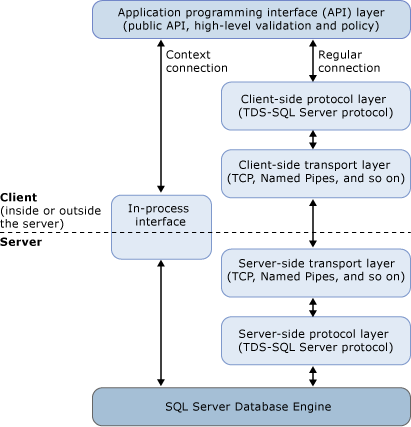

# Context Connections vs. Regular Connections
[!INCLUDE[appliesto-ss-xxxx-xxxx-xxx-md](../../../includes/appliesto-ss-xxxx-xxxx-xxx-md.md)]
  If you are connecting to a remote server, always use regular connections rather than context connections. If you need to connect to the same server on which the stored procedure or function is running, use the context connection in most cases. This has benefits such as running in the same transaction space and not having to reauthenticate.  
  
 Additionally, using the context connection typically results in better performance and less resource usage. The context connection is an in-process-only connection, so it can contact the server "directly" by bypassing the network protocol and transport layers to send Transact-SQL statements and receive results. The authentication process is bypassed, as well. The following figure shows the primary components of the **SqlClient** managed provider, as well as how the different components interact with each other when using a regular connection, and when using the context connection.  
  
   
  
 The context connection follows a shorter code path and involves fewer components, so you can expect requests and results to get to and from the server faster than in a regular connection. Query execution time on the server is the same for context and regular connections.  
  
 There are some cases in which you may need to open a separate regular connection to the same server. For example, there are certain restrictions on using the context connection, described in [Restrictions on Regular and Context Connections](../../../relational-databases/clr-integration/data-access/context-connections-and-regular-connections-restrictions.md).  
  
## See Also  
 [Context Connection](../../../relational-databases/clr-integration/data-access/context-connection.md)  
  
  
