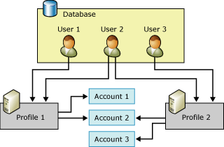

# Database Mail Configuration Objects
[!INCLUDE[appliesto-ss-xxxx-xxxx-xxx-md](../../includes/appliesto-ss-xxxx-xxxx-xxx-md.md)]
  Database Mail has two configuration objects: The database configuration objects provide a way for you to configure the settings that Database mail should use when sending an email from your database application or [!INCLUDE[ssNoVersion](../../includes/ssnoversion-md.md)] Agent.  
  
-   Database Mail accounts  
  
-   Database Mail profiles  
  
  
##   Database Mail Configuration Object Relationship  
 The illustration shows two profiles, three accounts, and three users. User 1 has access to Profile 1, which uses Account 1 and Account 2. User 3 has access to Profile 2, which uses Account 2 and Account 3. User 2 has access to both Profile 1 and Profile 2.  
  
   
  
  
##   Database Mail Account  
 A Database Mail account contains the information that Microsoft [!INCLUDE[ssNoVersion](../../includes/ssnoversion-md.md)] uses to send e-mail messages to an SMTP server. Each account contains information for one e-mail server.  
  
 A Database Mail supports three methods of authentication to communicate with an SMTP server:  
  
-   Windows Authentication: Database Mail uses the credentials of the [!INCLUDE[ssDEnoversion](../../includes/ssdenoversion-md.md)] Windows service account for authentication on the SMTP server.  
  
-   Basic Authentication:  Database Mail uses the username and password specified to authenticate on the SMTP server.  
  
-   Anonymous Authentication:  The SMTP server does not require any authentication.  Database Mail will not use any credentials to authenticate on the SMTP server.  
  
 Account information is stored in the **msdb** database. Each account consists of the following information:  
  
-   The name of the account.  
  
-   A description of the account.  
  
-   The e-mail address of the account.  
  
-   The display name for the account.  
  
-   The e-mail address to use as the reply-to information for the account.  
  
-   The name of the e-mail server.  
  
-   The type of the e-mail server. For [!INCLUDE[msCoName](../../includes/msconame-md.md)] [!INCLUDE[ssNoVersion](../../includes/ssnoversion-md.md)], this is always Simple Mail Transfer Protocol(SMTP).  
  
-   The port number of the e-mail server.  
  
-   A bit column indicating whether the connection to the SMTP mail server is made using Secure Sockets Layer (SSL).  
  
-   A bit column indicating whether the connection to the SMTP server is made using the credentials configured for the [!INCLUDE[ssDEnoversion](../../includes/ssdenoversion-md.md)].  
  
-   The user name to use for authentication to the e-mail server, if the e-mail server requires authentication.  
  
-   The password to use for authentication to the e-mail server, if the e-mail server requires authentication.  
  
 The Database Mail Configuration Wizard provides a convenient way to create and manage accounts. You can also use the configuration stored procedures in **msdb** to create and manage accounts.  
  
  
##   Database Mail Profile  
 A Database Mail profile is an ordered collection of related Database Mail accounts. Applications that send e-mail using Database Mail specify profiles, instead of using accounts directly. Separating information about the individual e-mail servers from the objects that the application uses improves flexibility and reliability: profiles provide automatic failover, so that if one e-mail server is unresponsive, Database Mail can automatically send mail to another e-mail server. Database administrators can add, remove, or reconfigure accounts without requiring changes to application code or job steps.  
  
 Profiles also help database administrators control access to e-mail. Membership in the **DatabaseMailUserRole** is required to send Database Mail. Profiles provide additional flexibility for administrators to control who sends mail and which accounts are used.  
  
 A profile may be public or private.  
  
 **Public profiles** are available for all members of the **DatabaseMailUserRole** database role in the **msdb** database. They allow all members of the **DatabaseMailUserRole** role to send e-mail using the profile.  
  
 **Private profiles** are defined for security principals in the **msdb** database. They allow only specified database users, roles, and members of the **sysadmin** fixed server role to send e-mail using the profile. By default, a profile is private, and allows access only to members of the **sysadmin** fixed server role. To use a private profile, **sysadmin** must grant users permission to use the profile. Additionally, EXECUTE permission on the **sp_send_dbmail** stored procedure is only granted to members of the **DatabaseMailUserRole**. A system administrator must add the user to the **DatabaseMailUserRole** database role for the user to send e-mail messages.  
  
 Profiles improve reliability in cases where an e-mail server becomes unreachable or unable to process messages. Each account in the profile has a sequence number. The sequence number determines the order in which Database Mail uses accounts in the profile. For a new e-mail message, Database Mail uses the last account that sent a message successfully, or the account that has the lowest sequence number if no message has yet been sent. Should that account fail, Database Mail uses the account with the next highest sequence number, and so on until either Database Mail sends the message successfully, or the account with the highest sequence number fails. If the account with the highest sequence number fails, the Database Mail pauses attempts to send the mail for the amount of time configured in the **AccountRetryDelay** parameter of **sysmail_configure_sp**, then starts the process of attempting to send the mail again, starting with the lowest sequence number. Use the **AccountRetryAttempts** parameter of **sysmail_configure_sp**, to configure the number of times that the external mail process attempts to send the e-mail message using each account in the specified profile.  
  
 If more than one account exists with the same sequence number, Database Mail only uses one of those accounts for a given e-mail message. In this case, Database Mail makes no guarantees as to which of the accounts is used for that sequence number or that the same account is used from message to message.  
  
  
##   Database Mail Configuration Tasks  
 The following table describes the Database Mail configuration tasks.  
  
|Configuration Task|Topic Link|  
|------------------------|----------------|  
|Describes how to create a Database Mail accounts|[Create a Database Mail Account](../../relational-databases/database-mail/create-a-database-mail-account.md)|  
|Describes how to Create Database Mail profiles|[Create a Database Mail Profile](../../relational-databases/database-mail/create-a-database-mail-profile.md)|  
|Describes how to Configure Database mail|[Configure Database Mail](../../relational-databases/database-mail/configure-database-mail.md)|  
|Describes how to create a Database Mail configuration script using templates||  
  
  
##   Additional Database Configuration Tasks (System Stored Procedures)  
 Database Mail configuration stored procedures are located in the **msdb** database.  
  
 The following tables list the stored procedures used for configuring and managing Database Mail.  
  
### Database Mail Settings  
  
|Name|Description|  
|----------|-----------------|  
|[sysmail_configure_sp (Transact-SQL)](../../relational-databases/system-stored-procedures/sysmail-configure-sp-transact-sql.md)|Changes configuration settings for Database Mail.|  
|[sysmail_help_configure_sp (Transact-SQL)](../../relational-databases/system-stored-procedures/sysmail-help-configure-sp-transact-sql.md)|Displays configuration settings for Database Mail.|  
  
### Accounts and Profiles  
  
|Name|Description|  
|----------|-----------------|  
|[sysmail_add_profileaccount_sp (Transact-SQL)](../../relational-databases/system-stored-procedures/sysmail-add-profileaccount-sp-transact-sql.md)|Adds a mail account to a Database Mail profile.|  
|[sysmail_delete_account_sp (Transact-SQL)](../../relational-databases/system-stored-procedures/sysmail-delete-account-sp-transact-sql.md)|Deletes a Database Mail account.|  
|[sysmail_delete_profile_sp (Transact-SQL)](../../relational-databases/system-stored-procedures/sysmail-delete-profile-sp-transact-sql.md)|Deletes a Database Mail profile.|  
|[sysmail_delete_profileaccount_sp (Transact-SQL)](../../relational-databases/system-stored-procedures/sysmail-delete-profileaccount-sp-transact-sql.md)|Removes an account from a Database Mail profile.|  
|[sysmail_help_account_sp (Transact-SQL)](../../relational-databases/system-stored-procedures/sysmail-help-account-sp-transact-sql.md)|Lists information about Database Mail accounts.|  
|[sysmail_help_profile_sp (Transact-SQL)](../../relational-databases/system-stored-procedures/sysmail-help-profile-sp-transact-sql.md)|Lists information about one or more Database Mail profiles.|  
|[sysmail_help_profileaccount_sp (Transact-SQL)](../../relational-databases/system-stored-procedures/sysmail-help-profileaccount-sp-transact-sql.md)|Lists the accounts associated with one or more Database Mail profiles.|  
|[sysmail_update_account_sp (Transact-SQL)](../../relational-databases/system-stored-procedures/sysmail-update-account-sp-transact-sql.md)|Updates the information in an existing Database Mail account.|  
|[sysmail_update_profile_sp (Transact-SQL)](../../relational-databases/system-stored-procedures/sysmail-update-profile-sp-transact-sql.md)|Changes the description or name of a Database Mail profile.|  
|[sysmail_update_profileaccount_sp (Transact-SQL)](../../relational-databases/system-stored-procedures/sysmail-update-profileaccount-sp-transact-sql.md)|Updates the sequence number of an account within a Database Mail profile.|  
  
### Security  
  
|Name|Description|  
|----------|-----------------|  
|[sysmail_add_principalprofile_sp (Transact-SQL)](../../relational-databases/system-stored-procedures/sysmail-add-principalprofile-sp-transact-sql.md)|Grants permission for a database principal to use a Database Mail profile.|  
|[sysmail_delete_principalprofile_sp (Transact-SQL)](../../relational-databases/system-stored-procedures/sysmail-delete-principalprofile-sp-transact-sql.md)|Removes permission for a database user to use a public or private Database Mail profile.|  
|[sysmail_help_principalprofile_sp (Transact-SQL)](../../relational-databases/system-stored-procedures/sysmail-help-principalprofile-sp-transact-sql.md)|Lists Database Mail profile information for a given database user.|  
|[sysmail_update_principalprofile_sp (Transact-SQL)](../../relational-databases/system-stored-procedures/sysmail-update-principalprofile-sp-transact-sql.md)|Updates the permission information for a given database user.|  
  
### System State  
  
|Name|Description|  
|----------|-----------------|  
|[sysmail_start_sp &#40;Transact-SQL&#41;](../../relational-databases/system-stored-procedures/sysmail-start-sp-transact-sql.md)|Starts the Database Mail external program and the associated SQL Service Broker queue.|  
|[sysmail_stop_sp &#40;Transact-SQL&#41;](../../relational-databases/system-stored-procedures/sysmail-stop-sp-transact-sql.md)|Stops the Database Mail external program and the associated SQL Service Broker queue.|  
|[sysmail_help_status_sp &#40;Transact-SQL&#41;](../../relational-databases/system-stored-procedures/sysmail-help-status-sp-transact-sql.md)|Indicates if Database Mail is started.|  
  
##   Additional References  
  
-   [Database Mail Log and Audits](../../relational-databases/database-mail/database-mail-log-and-audits.md)  
  
  
  
