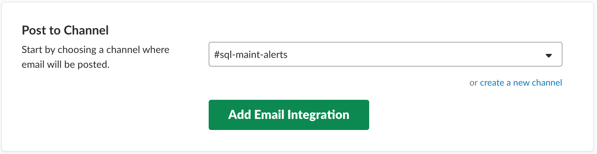
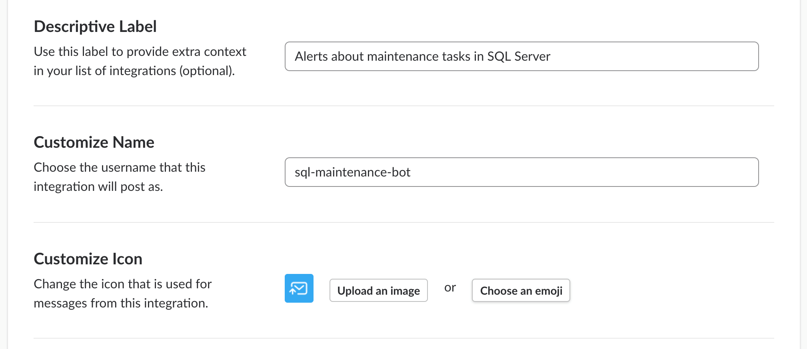
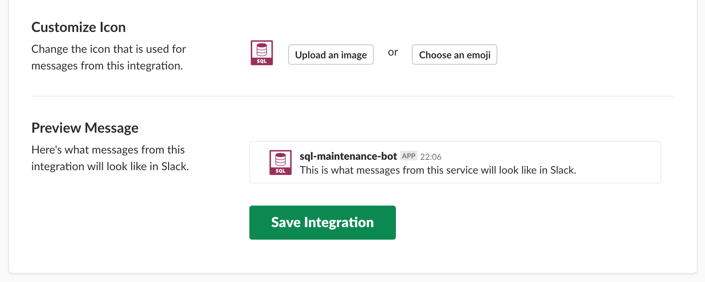
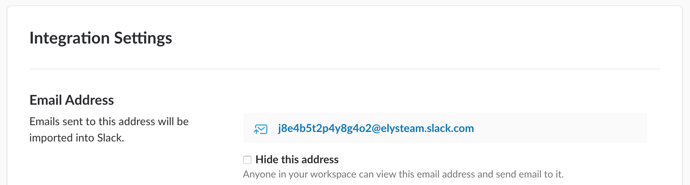
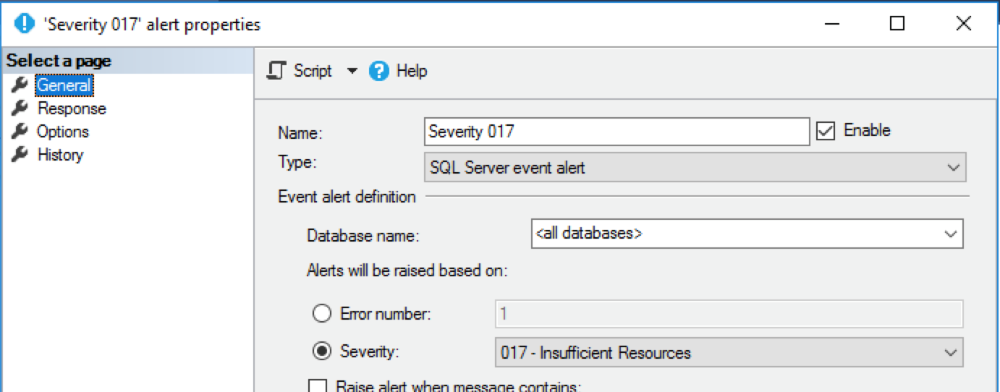
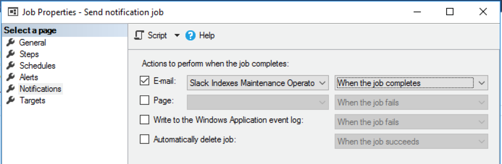
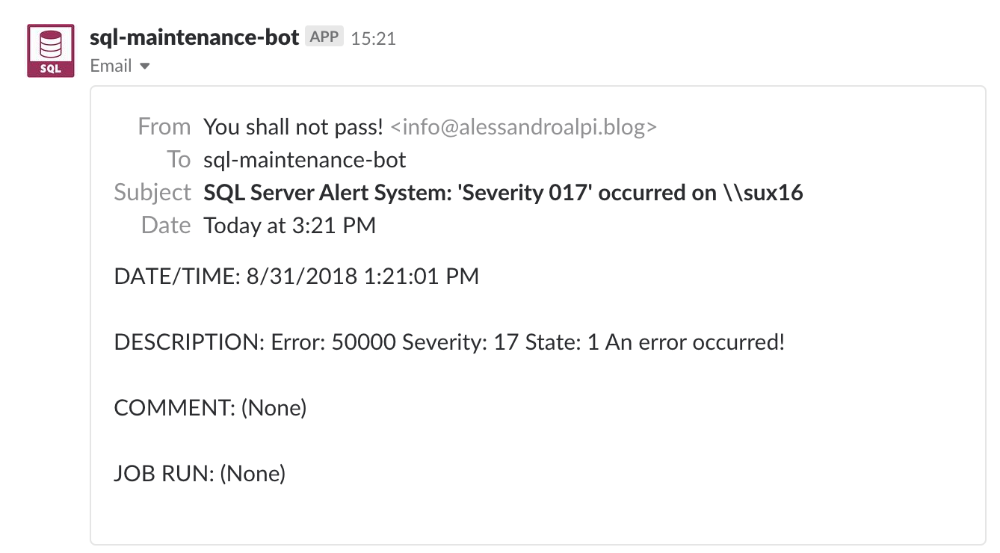
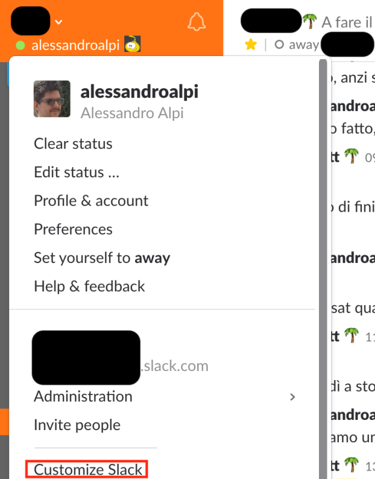
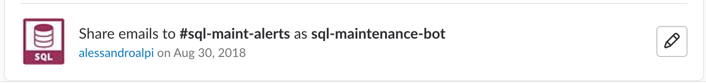
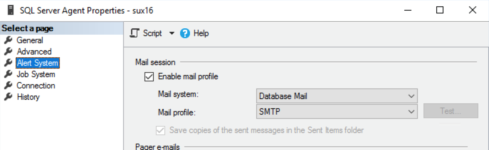

# Introduction

Automation, proactive monitoring, repeatability, reducing waste of time and technical debt. This is something you should know about when trying to do some DevOps.

Why automation? Because you can reduce technical debt and the number of failures that can happen with a manual interaction. You can create environments using a provisioning procedure without falling in common pitfalls like security misconfigurations, wrong configurations and botched monitoring.

Talking about SQL Server, immediate and proactive notifications represent a great step forward toward automation.

We automate whenever we want to stop doing a bunch of recurring or tedious steps manually. At the same time, we are also improving the overall quality and we are reducing the amount of things that can (and will) go wrong.

We are also optimising on how we use our time, because we can just ignore what the automation is doing for us and focus on that something that really needs our attention.

Finally, in this modern and notification-based world, emails generate too much white noise to deal with. In this article, we will learn how to integrate SQL Server tasks’ notifications with one of the most used collaboration tools: Slack.

Keep in mind that this is not the only way to get this done. This guide would help you to better understand why we’re doing this (eventually why DevOps), and not strictly how to do it, even if we’ll see a real working example.

## Minimal requirements

You need to setup an account on [slack.com](https://slack.com/) (on a paid plan) and a SQL Server edition. I recommend the free [developer edition here](https://go.microsoft.com/fwlink/?linkid=853016).

> Don't use SQL Server Express edition. This version doesn't support any SQL Server Agent task as well as the Database Mail, which we'll need hereafter. Also, about slack, you must create a paid account, because the integration described below will not work with a free profile.

In order to send emails, we will use an SMTP sever. It can be either a private Microsoft Exchange, PostFix, or any other on-premises solutions, together with a cloud delivery service, like [_SendGrid_](https://sendgrid.com/), [_SendInBlue_](https://www.sendinblue.com/), [_MailJet_](https://www.mailjet.com/), or [_Office 365_](https://www.office.com/).

## The scenario

In a team like mine, which uses chat as a daily communication driver, centralizing every business and technical message could be a great step forward for the members of the team in terms of awareness and knowledge sharing. Business roles can use that tool as well, so we can chat to each other switching topics between tech and functional discussions. It’s just a matter of how Slack (in our case) is configured with channels and naming conventions. A good setup helps us to better organize our meetings, small talks and any other topic related to implementations. This is a cool argument to speak about, but a little bit out of the scope of this guide. We will focus on notification bots instead.

SQL Server is able to send emails with its built-in features out-of-the-box, but we’d like to centralize every notification inside Slack, gaining the following advantages:

- Instant notification
- Tailored focus (custom sound instead the same popup for all the incoming emails)
- Opt-out
- Quickly involve people that are not following the channel by a mention
- Relay the problem description within the chat
- Take actions as soon as the notification is received

## The proposed solution

Now, how can we send notifications from SQL Server in an easier way than using custom code or a Slack [incoming webhook](https://www.thisintelligentlife.net/posting-to-slack-from-sql-agent)? Is there any integration or a Slack app?  Yes. And guess what? I think you’ll like it because you don’t need to write a single line of code, and you don’t need to choose between CLR, PowerShell or any other language. It’s ironic, but the integration is called “Email”.

### Slack

The purpose of this article is just to describe Slack as a collaboration tool. Further details are provided [here](https://slack.com/). As we said before, the following samples work only if you get a Slack account.

### The Slack Email integration

This is the app to work with: [Email](https://slack.com/apps/A0F81496D-email). Its configuration is based on a four-step wizard:

Select the channel (or create a new one).

  

When added, set the name and a short description of the new contact (bot) in Slack.



Change the avatar (it's important to recognize the bot at a glance)



After saving, copy the email address the app created for you.



A word about the “Hide this address” checkbox: this is useful if you want to hide the address to any other member of your workspace. You will be the only user able to read it if you check that box.

### Type of SQL Server notifications and setup

As a DBA, we’re managing the following types of notifications on a daily basis:

- SQL Server built-in and custom Alerts
- Job execution status
- Integration Services custom emails (within the packages)
- External monitoring tools (which monitor SQL Instances)

With the exception of SSIS custom emails and external monitoring tools, everything is managed by Database Mail. This is a lightweight layer that allows us to send emails directly from a SQL Server Instance, connecting to a SMTP server. In this article, we will describe just the Database Mail based notifications.

To setup Database Mail you can follow [this guide](https://docs.microsoft.com/en-us/sql/relational-databases/database-mail/configure-database-mail?view=sql-server-2017).

Once this is up and running, you can manage the notifications using [SQL Server Operators](https://docs.microsoft.com/en-us/sql/ssms/agent/operators?view=sql-server-2017). An operator is an alias managed by the SQL Server Agent which you can use to send emails and other types of messages, like pagers and Net Send.

Creating an operator is simple, just invoke the following system stored procedure:

```sql
USE msdb;
GO

EXEC dbo.sp_add_operator
    @name = N'<name here>',
    @enabled = 1,
    @email_address = N'<email here>';
GO
```

If you’re asking what email address you should use, it’s easy to say. You must fill the **@email_address** parameter with the address returned by the Email app integration for the channel you will send to (**j8e4b5t2p4y8g4o2@elysteam.slack.com** in the example above). But, what about the name parameter? In my opinion, the best name is the one that helps us to understand where the message will be sent to. Suppose that we’d like to notify something about some index maintenance jobs. We could call the operator _Slack Indexes Maintenance_, _Slack Indexes Maintenance Operator_ and so on. With such names, you will immediately know what we are going to send to Slack as the topic is related to index maintenance.

Thus, you’ll get the following snippet:

```sql
USE msdb;
GO

EXEC dbo.sp_add_operator
    @name = N' Slack Indexes Maintenance Operator',
    @enabled = 1,
    @email_address = N'j8e4b5t2p4y8g4o2@elysteam.slack.com';
GO
```

### Slack channels naming considerations

I’d like to share with you my thought about the channel naming conventions. The principles to follow when naming channels, are:

- Readability (clear for everyone)
- Awareness (know what)
- Style and Rules (know how)
- Repeatability (keep using it from now on)

That being said, if the channel name describes a single action (like _indexes maintenance_ in the above example) the operator which will send notifications should be unique. The reason is simple enough: we know that _Indexes Maintenance Operator_ is sending messages to **#sql-idx-maint-alerts** (readability) and everyone knows that this is a one-to-one communication between a SQL Server Operator and Slack (awareness). Everyone knows that the “sql” channel prefix indicates SQL Server-related notification and the “alerts” suffix indicates that is an issue to pay attention to (style and rules). At the same time, everyone knows how to do the same with another pipeline of messages in the future (repeatability).

On the other hand, using a general purposes channel, like **#sql-maint-alerts**, allows us to be ready to future changes. Suppose that index maintenance will not be the only operation we’re executing in our servers (and typically isn’t). Does it make sense to create a new operator called for example, _Database Concurrency Check Operator_, which sends to a specific purpose channel? Clearly not.

In the end, a generic purpose channel gives the opportunity to hold more than one topic. All the notification sent to that channel should be, let’s say, of the same category to avoid too much generalization.

These solutions (one channel for more operators or a one-to-one solution) work equally well, it’s just a matter of how you’re designing your Slack channels. I suggest to avoid the “one channel to rule them all” pattern, because you’ll get thousands of mixed notifications without any clear idea behind them. After all, a noisy channel with messy content is something that will not be considered for a long time and will be eventually dropped.

### Binding alerts

Alerts are triggers that communicate to an operator that something went wrong. This [Brent Ozar’s article](https://www.brentozar.com/blitz/configure-sql-server-alerts/) offers a good list of alerts that need attention. [Here](https://docs.microsoft.com/en-us/sql/relational-databases/errors-events/database-engine-error-severities?view=sql-server-2017) you can find their descriptions, based on severity. The binding is straightforward. All you need to do is to link the operator to the alert:




When one of those events occur, an operator is alerted. Then, it sends the message using its setup - in our scenario, an email. If the operator uses the Slack Email app, the email will be sent to the Email app, and the integration will redirect it to Slack.

### Binding job execution statuses

Let’s see how we can use the notification mechanism to monitor SQL Server Agent Jobs. Each job lets you configure what to do in case of failure, success or completion of its execution. The binding is similar to the alert’s one:



Once the result is collected, based on the configurations you’ve set up, this job will send an email to the app.

## Test

Let’s see a more complete example, using a SQL Server alert. We’ll use the Severity 17 alert. Severity 17 is simple to raise and it describes a missing or insufficient resource when executing a command:

```sql
USE msdb;
GO

EXEC msdb.dbo.sp_add_alert @name=N'Severity 017',
    @message_id=0,
    @severity=17,
    @enabled=1,
    @delay_between_responses=60,
    @include_event_description_in=1,
    @job_id=N'00000000-0000-0000-0000-000000000000';
GO
```

Set the Response for the Severity 17 alert to “Notify Operator”, via email:


Run the following severity 17 based t-sql script:

```sql
RAISERROR(N'An error occurred Severity 17:insufficient resources!', 17, 1)
WITH LOG; --don’t forget to use WITH LOG
GO
```

Go to your Slack account. If you’ve configured everything correctly, you should see the following:



Did it work? Great! If not, continue reading.

## Troubleshooting

If you don’t see the notification try these steps:

- Be sure that your Slack account is confirmed (its email too)

- Once the Slack account is confirmed, check if the channel still exists (CTRL+K -> name of the channel)

- Click on “Customize Slack” in the drop down menu of your Slack client/webpage, then click on Customize App in order to check whether the Email integration is active or not:

  
  

- Verify Database Mail configuration (try to send the test email)

  

- Verify the operator configuration (is it enabled?)

- Verify the alert configuration (did you bind the response with email to the operator? Is it enabled?)

- Verify the SQL Server Agent email profile configuration (is it enabled? Is it the right one?)

## Conclusions

There are some disadvantages when using this kind of integration. For example, you cannot customize the message, unless you do it inside a .NET script. The Slack Email Address is publicly available, albeit hard to discover, so anyone can send message to your private slack channel by sending emails to that special address. Again, you cannot send the notification to more than one Slack channel or outside of the Slack world. In reality native SQL email notifications show the same limits, where email addresses of distribution lists are similar to Slack channels.

For our purposes, this is a very-low-effort automation with a high return in terms of value. With a couple of clicks, you can setup an email address representing a Slack channel, and, with little more, you can get notifications in a smart and comprehensive layout.

Everything is kept inside the collaboration chat tool we are using massively, every day. In the end, this example embeds one of the core DevOps principles (automation) and provides huge cross-role and cross-team value, especially when the channels include also network and server teams.

I hope that you'll give this a try.