# Diagnose and resolve latch contention on SQL Server

This guide describes how to identify and resolve latch contention issues observed when running SQL Server applications on high concurrency systems with certain workloads.

As the number of CPU cores on servers continues to increase, the associated increase in concurrency can introduce contention points on data structures that must be accessed in a serial fashion within the database engine. This is especially true for high throughput/high concurrency transaction processing (OLTP) workloads. There are a number of tools, techniques, and ways to approach these challenges as well as practices that can be followed in designing applications that may help to avoid them altogether. This article will discuss a particular type of contention on data structures that use spinlocks to serialize access to these data structures.

> [!NOTE]
> This content was written by the Microsoft SQL Server Customer Advisory Team (SQLCAT) team based on their process for identifying and resolving issues related to page latch contention in SQL Server applications on high-concurrency systems. The recommendations and best practices documented here are based on real-world experience during the development and deployment of real-world OLTP systems.

## What is SQL Server latch contention?

Latches are lightweight synchronization primitives that are used by the SQL Server engine to guarantee consistency of in-memory structures including; index, data pages, and internal structures, such as non-leaf pages in a B-Tree. SQL Server uses buffer latches to protect pages in the buffer pool and I/O latches to protect pages not yet loaded into the buffer pool. Whenever data is written to or read from a page in the SQL Server buffer pool a worker thread must first acquire a buffer latch for the page. There are various buffer latch types available for accessing pages in the buffer pool including exclusive latch (PAGELATCH_EX) and shared latch (PAGELATCH_SH). When SQL Server attempts to access a page that is not already present in the buffer pool, an asynchronous I/O is posted to load the page into the buffer pool. If SQL Server needs to wait for the I/O subsystem to respond it will wait on an exclusive (PAGEIOLATCH_EX) or shared (PAGEIOLATCH_SH) I/O latch depending on the type of request; this is done to prevent another worker thread from loading the same page into the buffer pool with an incompatible latch. Latches are also used to protect access to internal memory structures other than buffer pool pages; these are known as Non-Buffer latches.

Contention on page latches is the most common scenario encountered on multi-CPU systems and so most of this article will focus on these.

Latch contention occurs when multiple threads concurrently attempt to acquire incompatible latches to the same in-memory structure. As a latch is an internal control mechanism; the SQL engine automatically determines when to use them. Because the behavior of latches is deterministic, application decisions including schema design can affect this behavior. This article aims to provide the following information:

* Background information on how latches are used by SQL Server. 
* Tools used to investigate latch contention. 
* How to determine if the amount of contention being observed is problematic.

We will discuss some common scenarios and how best to handle them to alleviate contention.

## How does SQL Server use latches?

A page in SQL Server is 8 KB and can store multiple rows. To increase concurrency and performance, buffer latches are held only for the duration of the physical operation on the page, unlike locks, which are held for the duration of the logical transaction.

Latches are internal to the SQL engine and are used to provide memory consistency, whereas locks are used by SQL Server to provide logical transactional consistency. The following table compares latches to locks:

| Structure | Purpose     | Controlled by  | Performance cost | Exposed by  |
|---|---|---|---|---|
| **Latch** | Guarantee consistency of in-memory structures. | SQL Server engine only.  | Performance cost is low. To allow for maximum concurrency and provide maximum performance, latches are held only for the duration of the physical operation on the in-memory structure, unlike locks, which are held for the duration of the logical transaction. | [sys.dm_os_wait_stats (Transact-SQL)](./system-dynamic-management-views/sys-dm-os-wait-stats-transact-sql.md) - Provides information on PAGELATCH, PAGEIOLATCH, and LATCH wait types (LATCH_EX, LATCH_SH is used to group all non-buffer latch waits).<br/>[sys.dm_os_latch_stats (Transact-SQL)](./system-dynamic-management-views/sys-dm-os-latch-stats-transact-sql.md) – Provides detailed information about non-buffer latch waits.<br/>[sys.dm_db_index_operational_stats (Transact-SQL)](./system-dynamic-management-views/sys-dm-db-index-operational-stats-transact-sql.md) - This DMV provides aggregated waits for each index, which is useful for troubleshooting latch-related performance issues. |
| **Lock**  | Guarantee consistency of transactions.  | Can be controlled by user. | Performance cost is high relative to latches as locks must be held for the duration of the transaction. | [sys.dm_tran_locks (Transact-SQL)](./system-dynamic-management-views/sys-dm-tran-locks-transact-sql.md).<br/>[sys.dm_exec_sessions (Transact-SQL)](./system-dynamic-management-views/sys-dm-exec-sessions-transact-sql.md).|

## SQL Server latch modes and compatibility

Some latch contention is to be expected as a normal part of the operation of the SQL Server engine. It is inevitable that multiple concurrent latch requests of varying compatibility will occur on a high concurrency system. SQL Server enforces latch compatibility by requiring the incompatible latch requests to wait in a queue until outstanding latch requests are completed.

Latches are acquired in one of five different modes, which relate to level of access. SQL Server latch modes can be summarized as follows:

* **KP** -- Keep latch, ensures that the referenced structure cannot be destroyed. Used when a thread wants to look at a buffer structure. Because the KP latch is compatible with all latches except for the destroy (DT) latch, the KP latch is considered to be "lightweight", meaning that the impact on performance when using it is minimal. Since the KP latch is incompatible with the DT latch, it will prevent any other thread from destroying the referenced structure. For example, a KP latch will prevent the structure it references from being destroyed by the lazywriter process. For more information about how the lazywriter process is used with SQL Server buffer page management, see [Writing Pages](./writing-pages.md).

* **SH** -- Shared latch, required to read the referenced structure (e.g. read a data page). Multiple threads can simultaneously access a resource for reading under a shared latch.
* **UP** -- Update latch, is compatible with SH (Shared latch) and KP, but no others and therefore will not allow an EX latch to write to the referenced structure. 
* **EX** -- Exclusive latch, blocks other threads from writing to or reading from the referenced structure. One example of use would be to modify contents of a page for torn page protection. 
* **DT** -- Destroy latch, must be acquired before destroying contents of referenced structure. For example, a DT latch must be acquired by the lazywriter process to free up a clean page before adding it to the list of free buffers available for use by other threads.

Latch modes have different levels of compatibility, for example, a shared latch (SH) is compatible with an update (UP) or keep (KP) latch but incompatible with a destroy latch (DT). Multiple latches can be concurrently acquired on the same structure as long as the latches are compatible. When a thread attempts to acquire a latch held in a mode that is not compatible, it is placed into a queue to wait for a signal indicating the resource is available. A spinlock of type SOS_Task is used to protect the wait queue by enforcing serialized access to the queue. This spinlock must be acquired to add items to the queue. The SOS_Task spinlock also signals threads in the queue when incompatible latches are released, allowing the waiting threads to acquire a compatible latch and continue working. The wait queue is processed on a first in, first out (FIFO) basis as latch requests are released. Latches follow this FIFO system to ensure fairness and to prevent thread starvation.

Latch mode compatibility is listed in the following table (**Y** indicates compatibility and **N** indicates incompatibility):

|Latch mode |**KP**  |**SH** |**UP**  |**EX**  |**DT**|
|--------|--------|-------|--------|--------|--------|
|**KP**  |Y       |Y      |Y       |Y       |N|
|**SH**  |Y       |Y      |Y       |N       |N|
|**UP**  |Y       |Y      |N       |N       |N|
|**EX**  |Y       |N      |N       |N       |N|
|**DT**  |N       |N      |N       |N       |N|

## SQL Server superLatches and sublatches

With the increasing presence of NUMA based multiple socket / multi-core systems, SQL Server 2005 introduced SuperLatches, also known as sublatches, which are effective only on systems with 32 or more logical processors. Superlatches improve efficiency of the SQL engine for certain usage patterns in highly concurrent OLTP workloads; for example, when certain pages have a pattern of heavy read-only shared (SH) access, but are written to rarely. An example of a page with such an access pattern is a B-tree (i.e. index) root page; the SQL engine requires that a shared latch is held on the root page when a page-split occurs at any level in the B-tree. In an insert-heavy and high-concurrency OLTP workload, the number of page splits will increase broadly in line with throughput, which can degrade performance. SuperLatches can enable increased performance for accessing shared pages where multiple concurrently running worker threads require SH latches. To accomplish this, the SQL Server Engine will dynamically promote a latch on such a page to a SuperLatch. A SuperLatch partitions a single latch into an array of sublatch structures, one sublatch per partition per CPU core, whereby the main latch becomes a proxy redirector and global state synchronization is not required for read-only latches. In doing so, the worker, which is always assigned to a specific CPU, only needs to acquire the shared (SH) sublatch assigned to the local scheduler.

[!INCLUDE [sql-b-tree](../includes/sql-b-tree.md)]

Acquisition of compatible latches, such as a shared Superlatch uses fewer resources and scales access to hot pages better than a non-partitioned shared latch because removing the global state synchronization requirement significantly improves performance by only accessing local NUMA memory. Conversely, acquiring an exclusive (EX) SuperLatch is more expensive than acquiring an EX regular latch as SQL must signal across all sublatches. When a SuperLatch is observed to use a pattern of heavy EX access, the SQL Engine can demote it after the page is discarded from the buffer pool. The following diagram depicts a normal latch and a partitioned SuperLatch:

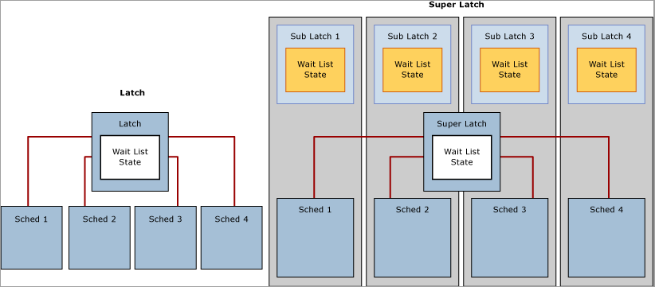

Use the **SQL Server:Latches** object and associated counters in Performance Monitor to gather information about SuperLatches, including the number of SuperLatches, SuperLatch promotions per second, and SuperLatch demotions per second. For more information about the **SQL Server:Latches** object and associated counters, see [SQL Server, Latches Object](./performance-monitor/sql-server-latches-object.md).

## Latch wait types

Cumulative wait information is tracked by SQL Server and can be accessed using the Dynamic Management View (DMW) `sys.dm_os_wait_stats`. SQL Server employs three latch wait types as defined by the corresponding `wait_type` in the `sys.dm_os_wait_stats` DMV:

* **Buffer (BUF) latch:** used to guarantee consistency of index and data pages for user objects. They are also used to protect access to data pages that SQL Server uses for system objects. For example, pages that manage allocations are protected by buffer latches. These include the Page Free Space (PFS), Global Allocation Map (GAM), Shared Global Allocation Map (SGAM) and Index Allocation Map (IAM) pages. Buffer latches are reported in `sys.dm_os_wait_stats` with a `wait_type` of **PAGELATCH\_\***.

* **Non-buffer (Non-BUF) latch:** used to guarantee consistency of any in-memory structures other than buffer pool pages. Any waits for non-buffer latches will be reported as a `wait_type` of **LATCH\_\***.

* **IO latch:** a subset of buffer latches that guarantee consistency of the same structures protected by buffer latches when these structures require loading into the buffer pool with an I/O operation. IO latches prevent another thread loading the same page into the buffer pool with an incompatible latch. Associated with a `wait_type` of **PAGEIOLATCH\_\***.

   > [!NOTE]
   > If you see significant PAGEIOLATCH waits, it means that SQL Server is waiting on the I/O subsystem. While a certain amount of PAGEIOLATCH waits is expected and normal behavior, if the average PAGEIOLATCH wait times are consistently above 10 milliseconds (ms) you should investigate why the I/O subsystem is under pressure.

If when examining the `sys.dm_os_wait_stats` DMV you encounter non-buffer latches, `sys.dm_os_latch_waits` must be examined to obtain a detailed breakdown of cumulative wait information for non-buffer latches. All buffer latch waits are classified under the BUFFER latch class, the remaining are used to classify non-buffer latches.

## Symptoms and causes of SQL Server latch contention

On a busy high-concurrency system, it is normal to see active contention on structures that are frequently accessed and protected by latches and other control mechanisms in SQL Server. It is considered problematic when the contention and wait time associated with acquiring latch for a page is enough to reduce resource (CPU) utilization, which hinders throughput.

### Example of latch contention

In the following diagram, the blue line represents the throughput in SQL Server, as measured by Transactions per second; the black line represents average page latch wait time. In this case, each transaction performs an INSERT into a clustered index with a sequentially increasing leading value, such as when populating an IDENTITY column of data type bigint. As the number of CPUs increase to 32 it is evident that the overall throughput has decreased and the page latch wait time has increased to approximately 48 milliseconds as evidenced by the black line. This inverse relationship between throughput and page latch wait time is a common scenario that is easily diagnosed.

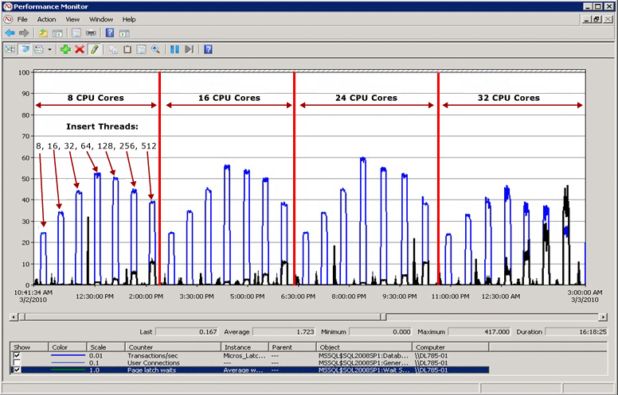

### Performance when latch contention is resolved

As the following diagram illustrates, SQL Server is no longer bottle-necked on page latch waits and throughput is increased by 300% as measured by transactions per second. This was accomplished with the **Use Hash Partitioning with a Computed Column** technique described later in this article. This performance improvement is directed at systems with high numbers of cores and a high level of concurrency.

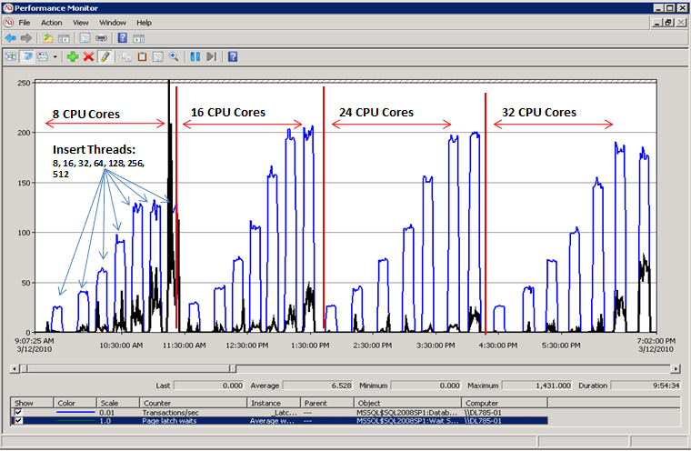

## Factors affecting latch contention

Latch contention that hinders performance in OLTP environments is typically caused by high concurrency related to one or more of the following factors:

| Factor | Details |
|---|---|
| **High number of logical CPUs used by SQL Server**  | Latch contention can occur on any multi-core system. In SQLCAT experience excessive latch contention, which impacts application performance beyond acceptable levels, has most commonly been observed on systems with 16+ CPU cores and may increase as additional cores are made available. |
| **Schema design and access patterns** | Depth of B-tree, clustered and non-clustered index design, size and density of rows per page, and access patterns (read/write/delete activity) are factors that can contribute to excessive page latch contention. |
| **High degree of concurrency at the application level** | Excessive page latch contention typically occurs in conjunction with a high level of concurrent requests from the application tier. There are certain programming practices that can also introduce a high number of requests for a specific page. |
| **Layout of logical files used by SQL Server databases** | Logical file layout can affect the level of page latch contention caused by allocation structures such as Page Free Space (PFS), Global Allocation Map (GAM), Shared Global Allocation Map (SGAM) and Index Allocation Map (IAM) pages. For more information, see [TempDB Monitoring and Troubleshooting: Allocation Bottleneck](https://techcommunity.microsoft.com/t5/sql-server/tempdb-monitoring-and-troubleshooting-allocation-bottleneck/ba-p/383516). |
| **I/O subsystem performance** | Significant PAGEIOLATCH waits indicate SQL Server is waiting on the I/O subsystem. |

## Diagnosing SQL Server latch contention

This section provides information for diagnosing SQL Server latch contention to determine if it is problematic to your environment.

### Tools and methods for diagnosing latch contention

The primary tools used to diagnose latch contention are:

* Performance Monitor to monitor CPU utilization and wait times within SQL Server and establish whether there is a relationship between CPU utilization and latch wait times.

* The SQL Server DMVs, which can be used to determine the specific type of latch that is causing the issue and the affected resource.

* In some cases memory dumps of the SQL Server process must be obtained and analyzed with Windows debugging tools.

> [!NOTE]
> This level of advanced troubleshooting is typically only required if troubleshooting non-buffer latch contention. You may wish to engage Microsoft Product Support Services for this type of advanced troubleshooting.

The technical process for diagnosing latch contention can be summarized in the following steps:

1. Determine that there is contention that may be latch-related.

2. Use the DMV views provided in [Appendix: SQL Server Latch Contention Scripts](#appendix-sql-server-latch-contention-scripts) to determine the type of latch and resource(s) affected.

3. Alleviate the contention using one of the techniques described in [Handling Latch Contention for Different Table Patterns](#handling-latch-contention-for-different-table-patterns).

### Indicators of latch contention

As stated previously, latch contention is only problematic when the contention and wait time associated with acquiring page latches prevents throughput from increasing when CPU resources are available. Determining an acceptable amount of contention requires a holistic approach that considers performance and throughput requirements together with available I/O and CPU resources. This section will walk you through determining the impact of latch contention on workload as follows:

1. Measure overall wait times during a representative test.

2. Rank them in order.

3. Determine the proportion of those that are related to latches.

Cumulative wait information is available from the `sys.dm_os_wait_stats` DMV. The most common type of latch contention is buffer latch contention, observed as an increase in wait times for latches with a `wait_type` of **PAGELATCH\_\***. Non-buffer latches are grouped under the **LATCH\*** wait type. As the following diagram illustrates, you should first take a cumulative look at system waits using the `sys.dm_os_wait_stats` DMV to determine the percentage of the overall wait time caused by buffer or non-buffer latches. If you encounter non-buffer latches, the `sys.dm_os_latch_stats` DMV must also be examined.

The following diagram describes the relationship between the information returned by the `sys.dm_os_wait_stats` and `sys.dm_os_latch_stats` DMVs.

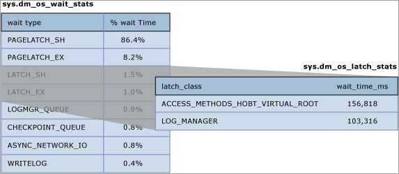

For more information about the `sys.dm_os_wait_stats` DMV, see [sys.dm_os_wait_stats (Transact-SQL)](./system-dynamic-management-views/sys-dm-os-wait-stats-transact-sql.md) in SQL Server help.

For more information about the `sys.dm_os_latch_stats` DMV, see [sys.dm_os_latch_stats (Transact-SQL)](./system-dynamic-management-views/sys-dm-os-latch-stats-transact-sql.md) in SQL Server help.

The following measures of latch wait time are indicators that excessive latch contention is affecting application performance:

* **Average page latch wait time consistently increases with throughput**: If average page latch wait times consistently increase with throughput and if average buffer latch wait times also increase above expected disk response times, you should examine current waiting tasks using the `sys.dm_os_waiting_tasks` DMV. Averages can be misleading if analyzed in isolation so it is important to look at the system live when possible to understand workload characteristics. In particular, check whether there are high waits on PAGELATCH_EX and/or PAGELATCH_SH requests on any pages. Follow these steps to diagnose increasing average page latch wait times with throughput:

   * Use the sample scripts [Query sys.dm_os_waiting_tasks Ordered by Session ID](#waiting-tasks-script1) or [Calculate Waits Over a Time Period](#calculate-waits-over-a-time-period) to look at current waiting tasks and measure average latch wait time. 
   * Use the sample script [Query Buffer Descriptors to Determine Objects Causing Latch Contention](#query-buffer-descriptors) to determine the index and underlying table on which the contention is occurring. 
   * Measure average page latch wait time with the Performance Monitor counter **MSSQL%InstanceName%\\Wait Statistics\\Page Latch Waits\\Average Wait Time** or by running the `sys.dm_os_wait_stats` DMV.

   > [!NOTE]
   > To calculate the average wait time for a particular wait type (returned by `sys.dm_os_wait_stats` as *wt_:type*), divide total wait time (returned as `wait_time_ms`) by the number of waiting tasks (returned as `waiting_tasks_count`).

* **Percentage of total wait time spent on latch wait types during peak load**: If the average latch wait time as a percentage of overall wait time increases in line with application load, then latch contention may be affecting performance and should be investigated.

   Measure page latch waits and non-page latch waits with the [SQLServer:Wait Statistics Object](./performance-monitor/sql-server-wait-statistics-object.md) performance counters. Then compare the values for these performance counters to performance counters associated with CPU, I/O, memory, and network throughput. For example, transactions/sec and batch requests/sec are two good measures of resource utilization.

   > [!NOTE]
   > Relative wait time for each wait type is not included in the `sys.dm_os_wait_stats` DMV because this DMW measures wait times since the last time that the instance of SQL Server was started or the cumulative wait statistics were reset using DBCC SQLPERF. To calculate the relative wait time for each wait type take a snapshot of `sys.dm_os_wait_stats` before peak load, after peak load, and then calculate the difference. The sample script [Calculate Waits Over a Time Period](#calculate-waits-over-a-time-period) can be used for this purpose.

   For a **non-production environment** only, clear the `sys.dm_os_wait_stats` DMV with the following command:
   
   ```sql
   dbcc SQLPERF ('sys.dm_os_wait_stats', 'CLEAR')
   ```
   A similar command can be run to clear the `sys.dm_os_latch_stats` DMV:
   
   ```sql
   dbcc SQLPERF ('sys.dm_os_latch_stats', 'CLEAR')
   ```

* **Throughput does not increase, and in some case decreases, as application load increases and the number of CPUs available to SQL Server increases**: This was illustrated in [Example of Latch Contention](#example-of-latch-contention).

* **CPU Utilization does not increase as application workload increases**: If the CPU utilization on the system does not increase as concurrency driven by application throughput increases, this is an indicator that SQL Server is waiting on something and symptomatic of latch contention.

Analyze root cause. Even if each of the preceding conditions is true it is still possible that the root cause of the performance issues lies elsewhere. In fact, in the majority of cases suboptimal CPU utilization is caused by other types of waits such as blocking on locks, I/O related waits or network-related issues. As a rule of thumb it is always best to resolve the resource wait that represents the greatest proportion of overall wait time before proceeding with more in-depth analysis.

## Analyzing current wait buffer latches

Buffer latch contention manifests as an increase in wait times for latches with a `wait_type` of either **PAGELATCH\_\*** or **PAGEIOLATCH\_\*** as displayed in the `sys.dm_os_wait_stats` DMV. To look at the system in real-time run the following query on a system to join the `sys.dm_os_wait_stats`, `sys.dm_exec_sessions` and `sys.dm_exec_requests` DMVs. The results can be used to determine the current wait type for sessions executing on the server.

```sql
SELECT wt.session_id, wt.wait_type
, er.last_wait_type AS last_wait_type
, wt.wait_duration_ms
, wt.blocking_session_id, wt.blocking_exec_context_id, resource_description
FROM sys.dm_os_waiting_tasks wt
JOIN sys.dm_exec_sessions es ON wt.session_id = es.session_id
JOIN sys.dm_exec_requests er ON wt.session_id = er.session_id
WHERE es.is_user_process = 1
AND wt.wait_type <> 'SLEEP_TASK'
ORDER BY wt.wait_duration_ms desc
```

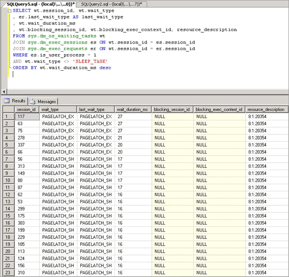

The statistics exposed by this query are described as follows:

| Statistic | Description |
|---|---|
| **Session_id** | ID of the session associated with the task. |
| **Wait_type** | The type of wait that SQL Server has recorded in the engine, which is preventing a current request from being executed. |
| **Last_wait_type** | If this request has previously been blocked, this column returns the type of the last wait. Is not nullable. |
| **Wait_duration_ms** | The total wait time in milliseconds spent waiting on this wait type since SQL Server instance was started or since cumulative wait statistics were reset. |
| **Blocking_session_id** | ID of the session that is blocking the request. |
| **Blocking_exec_context_id** | ID of the execution context associated with the task. |
| **Resource_description** | The `resource_description` column lists the exact page being waited for in the format: `<database_id>:<file_id>:<page_id>` |

The following query will return information for all non-buffer latches:

```sql
select * from sys.dm_os_latch_stats where latch_class <> 'BUFFER' order by wait_time_ms desc;
```

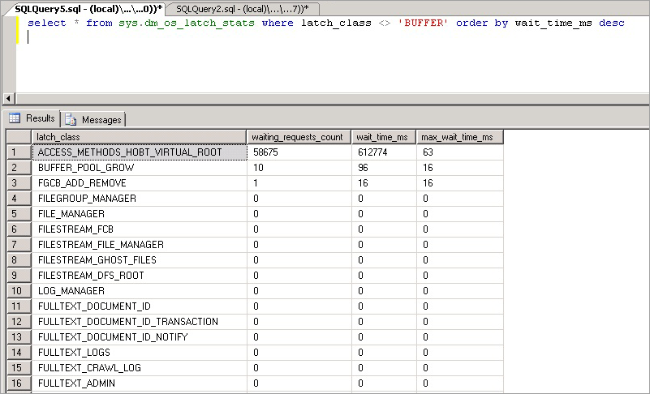

The statistics exposed by this query are described as follows:

| Statistic | Description |
|---|---|
| **latch_class** | The type of latch that SQL Server has recorded in the engine, which is preventing a current request from being executed. |
| **waiting_requests_count** | Number of waits on latches in this class since SQL Server restarted. This counter is incremented at the start of a latch wait. |
| **wait_time_ms** | The total wait time in milliseconds spent waiting on this latch type. |
| **max_wait_time_ms** | Maximum time in milliseconds any request spent waiting on this latch type. |

> [!NOTE]
> The values returned by this DMV are cumulative since last time the database engine was restarted or the DMV was reset. Use the `sqlserver_start_time` column in [sys.dm_os_sys_info](../relational-databases/system-dynamic-management-views/sys-dm-os-sys-info-transact-sql.md) to find the last database engine startup time. On a system that has been running a long time this means some statistics such as `max_wait_time_ms` are rarely useful. The following command can be used to reset the wait statistics for this DMV:
>
> ```sql
> DBCC SQLPERF ('sys.dm_os_latch_stats', CLEAR);
> ```

## SQL Server latch contention scenarios

The following scenarios have been observed to cause excessive latch contention.

### Last page/trailing page insert contention

A common OLTP practice is to create a clustered index on an identity or date column. This helps maintain good physical organization of the index, which can greatly benefit performance of both reads and writes to the index. This schema design can inadvertently lead to latch contention however. This issue is most commonly seen with a large table, with small rows; and inserts into an index containing a sequentially increasing leading key column such as ascending integer or datetime key. In this scenario, the application rarely if ever performs updates or deletes, the exception being for archiving operations.

In the following example, thread one and thread two both want to perform an insert of a record that will be stored on page 299. From a logical locking perspective, there is no problem as row level locks will be used and exclusive locks on both records on the same page can be held at the same time. However to ensure integrity of physical memory only one thread at a time can acquire an exclusive latch so access to the page is serialized to prevent lost updates in memory. In this case, thread 1 acquires the exclusive latch; and thread 2 waits, which registers a PAGELATCH_EX wait for this resource in the wait statistics. This is displayed through the `wait_type` value in the `sys.dm_os_waiting_tasks` DMV.

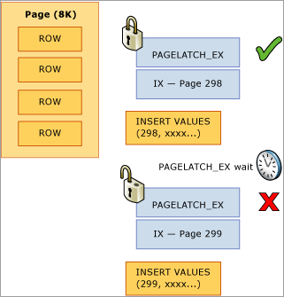

This contention is commonly referred to as "Last Page Insert" contention because it occurs on the right-most edge of the B-tree as displayed in the following diagram:

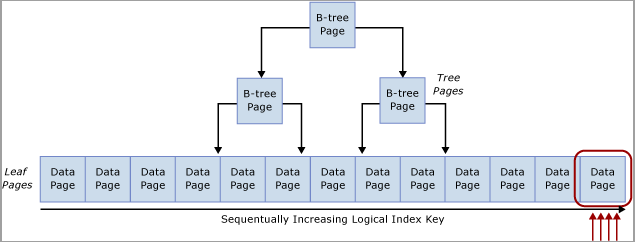

This type of latch contention can be explained as follows. When a new row is inserted into an index, SQL Server will use the following algorithm to execute the modification:

1. Traverse the B-tree to locate the correct page to hold the new record.

2. Latch the page with PAGELATCH_EX, preventing others from modifying it, and acquire shared latches (PAGELATCH_SH) on all the non-leaf pages.

   > [!NOTE]
   > In some cases the SQL Engine requires EX latches to be acquired on non-leaf B-tree pages as well. For example, when a page-split occurs any pages that will be directly impacted need to be exclusively latched (PAGELATCH_EX).

3. Record a log entry that the row has been modified.

4. Add the row to the page and mark the page as dirty.

5. Unlatch all pages.

If the table index is based upon a sequentially increasing key, each new insert will go to the same page at the end of the B-tree, until that page is full. Under high-concurrency scenarios, this may cause contention on the rightmost edge of the B-tree and can occur on clustered and non-clustered indexes. Tables that are affected by this type of contention primarily accept INSERTs, and pages for the problematic indexes are normally relatively dense (for example, a row size \~165 bytes (including row overhead) equals \~49 rows per page). In this insert-heavy example, it is expected that PAGELATCH_EX/PAGELATCH_SH waits will occur, and this is the typical observation. To examine Page Latch waits vs. Tree Page Latch waits, use the `sys.dm_db_index_operational_stats` DMV.

The following table summarizes the major factors observed with this type of latch contention:

| Factor | Typical observations |
|---|---|
| **Logical CPUs in use by SQL Server** | This type of latch contention occurs mainly on 16+ CPU core systems and most commonly on 32+ CPU core systems. |
| **Schema design and access patterns** | Uses a sequentially increasing identity value as a leading column in an index on a table for transactional data.<br/><br/>The index has an increasing primary key with a high rate of inserts.<br/><br/>The index has at least one sequentially increasing column value.<br/><br/>Typically small row size with many rows per page. |
| **Wait type observed** | Many threads contending for same resource with exclusive (EX) or shared (SH) latch waits associated with the same resource_description in the `sys.dm_os_waiting_tasks` DMV as returned by the [Query sys.dm_os_waiting_tasks Ordered by Wait Duration](#waiting-tasks-script2).|
| **Design factors to consider** | Consider changing the order of the index columns as described in the Non-sequential index mitigation strategy if you can guarantee that inserts will be distributed across the B-tree uniformly all of the time.<br/><br/>If the Hash partition mitigation strategy is used it removes the ability to use partitioning for any other purposes such as sliding window archiving.<br/><br/>Use of the Hash partition mitigation strategy can lead to partition elimination problems for SELECT queries used by the application. |

### Latch contention on small tables with a non-clustered index and random inserts (queue table)

This scenario is typically seen when an SQL table is used as a temporary queue (for example, in an asynchronous messaging system).

In this scenario exclusive (EX) and shared (SH) latch contention can occur under the following conditions:

* Insert, select, update or delete operations occur under high concurrency.
* Row size is relatively small (leading to dense pages).
* The number of rows in the table is relatively small; leading to a shallow B-tree, defined by having an index depth of two or three.

> [!NOTE]
> Even B-trees with a greater depth than this can experience contention with this type of access pattern, if the frequency of data manipulation language (DML) and concurrency of the system is high enough. The level of latch contention may become pronounced as concurrency increases when 16 or more CPU cores are available to the system.

Latch contention can occur even if access is random across the B-tree such as when a non-sequential column is the leading key in a clustered index. The following screenshot is from a system experiencing this type of latch contention. In this example, contention is due to the density of the pages caused by small row size and a relatively shallow B-tree. As concurrency increases, latch contention on pages occurs even though inserts are random across the B-tree since a GUID was the leading column in the index.

In the following screenshot, the waits occur on both buffer data pages and pages free space (PFS) pages. For more information about PFS page latch contention, see the following third-party blog post on SQLSkills: [Benchmarking: Multiple data files on SSDs](https://www.sqlskills.com/blogs/paul/benchmarking-multiple-data-files-on-ssds-plus-the-latest-fusion-io-driver/). Even when the number of data files was increased, latch contention was prevalent on buffer data pages.

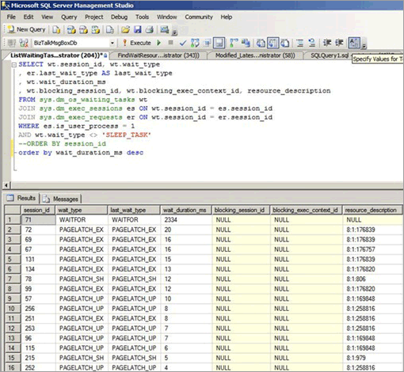

The following table summarizes the major factors observed with this type of latch contention:

| Factor | Typical observations |
|---|---|
| **Logical CPUs in use by SQL Server** | Latch contention occurs mainly on computers with 16+ CPU cores.
| **Schema Design and Access Patterns** | High rate of insert/select/update/delete access patterns against small tables.<br/><br/>Shallow B-tree (index depth of two or three).<br/><br/>Small row size (many records per page).
| **Level of concurrency** | Latch contention will occur only under high levels of concurrent requests from the application tier.
| **Wait type observed** | Observe waits on buffer (PAGELATCH_EX and PAGELATCH_SH) and non-buffer latch ACCESS_METHODS_HOBT_VIRTUAL_ROOT due to root splits. Also PAGELATCH_UP waits on PFS pages. For more information about non-buffer latch waits, see [sys.dm_os_latch_stats (Transact-SQL)](./system-dynamic-management-views/sys-dm-os-latch-stats-transact-sql.md) in SQL Server help.

The combination of a shallow B-Tree and random inserts across the index is prone to causing page splits in the B-tree. In order to perform a page split, SQL Server must acquire shared (SH) latches at all levels, and then acquire exclusive (EX) latches on pages in the B-tree that are involved in the page splits. Also when concurrency is high and data is continually inserted and deleted, B-tree root splits may occur. In this case, other inserts may have to wait for any non-buffer latches acquired on the B-tree. This will be manifested as a large number of waits on the ACCESS_METHODS_HOBT_VIRTUAL_ROOT latch type observed in the `sys.dm_os_latch_stats` DMV.

The following script can be modified to determine the depth of the B-tree for the indexes on the affected table.

```sql
select o.name as [table],
   i.name as [index],
   indexProperty(object_id(o.name), i.name, 'indexDepth')
   + indexProperty(object_id(o.name), i.name, 'isClustered') as depth, --clustered index depth reported doesn't count leaf level
   i.[rows] as [rows],
   i.origFillFactor as [fillFactor],
   case (indexProperty(object_id(o.name), i.name, 'isClustered'))
      when 1 then 'clustered'
      when 0 then 'nonclustered'
      else 'statistic'
   end as type
from sysIndexes i
join sysObjects o on o.id = i.id
where o.type = 'u'
   and indexProperty(object_id(o.name), i.name, 'isHypothetical') = 0 --filter out hypothetical indexes
   and indexProperty(object_id(o.name), i.name, 'isStatistics') = 0 --filter out statistics
order by o.name;
```

### Latch contention on page free space (PFS) pages

PFS stands for Page Free Space, SQL Server allocates one PFS page for every 8088 pages (starting with PageID = 1) in each database file. Each byte in the PFS page records information including how much free space is on the page, if it is allocated or not and whether the page stores ghost records. The PFS page contains information about the pages available for allocation when a new page is required by an insert or update operation. The PFS page must be updated in a number of scenarios, including when any allocations or de-allocations occur. Since the use of an update (UP) latch is required to protect the PFS page, latch contention on PFS pages can occur if you have relatively few data files in a filegroup and a large number of CPU cores. A simple way to resolve this is to increase the number of files per filegroup.

> [!WARNING]
> Increasing the number of files per filegroup may adversely affect performance of certain loads, such as loads with many large sort operations which spill memory to disk.

If many PAGELATCH_UP waits are observed for PFS or SGAM pages in tempdb, complete these steps to eliminate this bottleneck:

1. Add data files to tempdb so that the number of tempdb data files is equal to the number of processor cores in your server.

2. Enable SQL Server Trace Flag 1118.

For more information about allocation bottlenecks caused by contention on system pages, see the blog post [What is allocation bottleneck?](https://techcommunity.microsoft.com/t5/sql-server/what-is-allocation-bottleneck/ba-p/383513).

### Table-valued functions and latch contention on tempdb

There are other factors beyond allocation contention that can cause latch contention on tempdb, such as heavy TVF use within queries.

## Handling latch contention for different table patterns

The following sections describe techniques that can be used to address or work around performance issues related to excessive latch contention.

### Use a non-sequential leading index key

One method for handling latch contention is to replace a sequential index key with a non-sequential key to evenly distribute inserts across an index range.

Typically this is done by having a leading column in the index that will distribute the workload proportionally. There are a couple of options here:

#### Option: Use a column within the table to distribute values across the index key range

Evaluate your workload for a natural value that can be used to distribute inserts across the key range. For example, consider an ATM banking scenario where ATM_ID may be a good candidate to distribute inserts into a transaction table for withdrawals since one customer can only use one ATM at a time. Similarly in a point of sales system, perhaps Checkout_ID or a Store ID would be a natural value that could be used to distribute inserts across a key range. This technique requires creating a composite index key with the leading key column being either the value of the column identified or some hash of that value combined with one or more additional columns to provide uniqueness. In most cases, a hash of the value will work best because too many distinct values will result in poor physical organization. For example, in a point of sales system, a hash can be created from the Store ID that is some modulo, which aligns with the number of CPU cores. This technique would result in a relatively small number of ranges within the table however it would be enough to distribute inserts in such a way to avoid latch contention. The following image illustrates this technique.

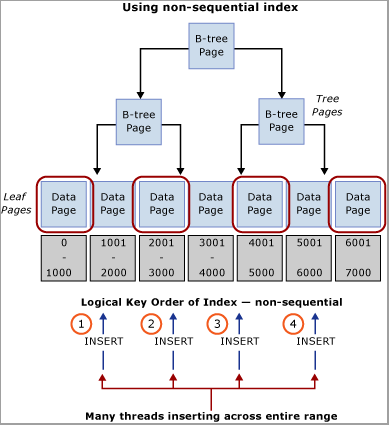

> [!IMPORTANT]
> This pattern contradicts traditional indexing best practices. While this technique will help ensure uniform distribution of inserts across the B-tree, it may also necessitate a schema change at the application level. In addition, this pattern may negatively impact performance of queries which require range scans that utilize the clustered index. Some analysis of the workload patterns will be required to determine if this design approach will work well. This pattern should be implemented if you are able to sacrifice some sequential scan performance to gain insert throughput and scale.

This pattern was implemented during a performance lab engagement and resolved latch contention on a system with 32 physical CPU cores. The table was used to store the closing balance at the end of a transaction; each business transaction performed a single insert into the table.

**Original table definition**

When using the original table definition, excessive latch contention was observed to occur on the clustered index pk_table1:

```sql
create table table1
(
       TransactionID bigint not null,
       UserID      int not null,
       SomeInt       int not null
);
go

alter table table1
       add constraint pk_table1
       primary key clustered (TransactionID, UserID);
go
```

> [!NOTE]
> The object names in the table definition have been changed from their original values.

**Reordered index definition**

Reordering the key columns of the index with UserID as the leading column in the primary key provided an almost random distribution of inserts across the pages. The resulting distribution was not 100% random since not all users are online at the same time, but the distribution was random enough to alleviate excessive latch contention. One caveat of reordering the index definition is that any select queries against this table must be modified to use both UserID and TransactionID as equality predicates.

> [!IMPORTANT]
> Ensure that you thoroughly test any changes in a test environment before running in a production environment.

```sql
create table table1
(
       TransactionID bigint not null,
       UserID      int not null,
       SomeInt       int not null
);
go

alter table table1
       add constraint pk_table1
       primary key clustered (UserID, TransactionID);
go
```

**Using a hash value as the leading column in primary key**

The following table definition can be used to generate a modulo that aligns to the number of CPUs, HashValue is generated using the sequentially increasing value TransactionID to ensure a uniform distribution across the B-Tree:

```sql
create table table1
(
       TransactionID bigint not null,
       UserID      int not null,
       SomeInt       int not null
);
go
-- Consider using bulk loading techniques to speed it up
ALTER TABLE table1
   ADD [HashValue] AS (CONVERT([tinyint], abs([TransactionID])%(32))) PERSISTED NOT NULL   
alter table table1
       add constraint pk_table1
       primary key clustered (HashValue, TransactionID, UserID);
go
```

#### Option: Use a GUID as the leading key column of the index

If there is no natural separator, then a GUID column can be used as a leading key column of the index to ensure uniform distribution of inserts. While using the GUID as the leading column in the index key approach enables use of partitioning for other features, this technique can also introduce potential downsides of more page-splits, poor physical organization and low page densities.

> [!NOTE]
> The use of GUIDs as leading key columns of indexes is a highly debated subject. An in-depth discussion of the pros and cons of this method falls outside the scope of this article.

### Use hash partitioning with a computed column

Table partitioning within SQL Server can be used to mitigate excessive latch contention. Creating a hash partitioning scheme with a computed column on a partitioned table is a common approach that can be accomplished with these steps:

1. Create a new filegroup or use an existing filegroup to hold the partitions.

2. If using a new filegroup, equally balance individual files over the LUN, taking care to use an optimal layout. If the access pattern involves a high rate of inserts, make sure to create the same number of files as there are physical CPU cores on the SQL Server computer.

3. Use the **CREATE PARTITION FUNCTION** command to partition the tables into *X* partitions, where *X* is the number of physical CPU cores on the SQL Server computer. (at least up to 32 partitions)

   > [!NOTE]
   > A 1:1 alignment of the number of partitions to the number of CPU cores is not always necessary. In many cases this can be some value less than the number of CPU cores. Having more partitions can result in more overhead for queries which have to search all partitions and in these cases fewer partitions will help. In SQLCAT testing on 64 and 128 logical CPU systems with real customer workloads 32 partitions has been sufficient to resolve excessive latch contention and reach scale targets. Ultimately the ideal number of partitions should be determined through testing. 

4. Use the **CREATE PARTITION SCHEME** command:

   * Bind the partition function to the filegroups. 
   * Add a hash column of type tinyint or smallint to the table. 
   * Calculate a good hash distribution. For example, use hashbytes with modulo or binary_checksum.

The following sample script can be customized for purposes of your implementation:

```sql
--Create the partition scheme and function, align this to the number of CPU cores 1:1 up to 32 core computer
-- so for below this is aligned to 16 core system
CREATE PARTITION FUNCTION [pf_hash16] (tinyint) AS RANGE LEFT FOR VALUES
   (0, 1, 2, 3, 4, 5, 6, 7, 8, 9, 10, 11, 12, 13, 14, 15);

CREATE PARTITION SCHEME [ps_hash16] AS PARTITION [pf_hash16] ALL TO ( [ALL_DATA] );
-- Add the computed column to the existing table (this is an OFFLINE operation)

-- Consider using bulk loading techniques to speed it up
ALTER TABLE [dbo].[latch_contention_table]
   ADD [HashValue] AS (CONVERT([tinyint], abs(binary_checksum([hash_col])%(16)),(0))) PERSISTED NOT NULL;

--Create the index on the new partitioning scheme 
CREATE UNIQUE CLUSTERED INDEX [IX_Transaction_ID] 
ON [dbo].[latch_contention_table]([T_ID] ASC, [HashValue]) 
ON ps_hash16(HashValue);
```

This script can be used to hash partition a table that is experiencing problems caused by [Last page/trailing page insert contention](#last-pagetrailing-page-insert-contention). This technique moves contention from the last page by partitioning the table and distributing inserts across table partitions with a hash value modulus operation.

#### What hash partitioning with a computed column does

As the following diagram illustrates, this technique moves the contention from the last page by rebuilding the index on the hash function and creating the same number of partitions as there are physical CPU cores on the SQL Server computer. The inserts are still going into the end of the logical range (a sequentially increasing value) but the hash value modulus operation ensures that the inserts are split across the different B-trees, which alleviates the bottleneck. This is illustrated in the following diagrams:

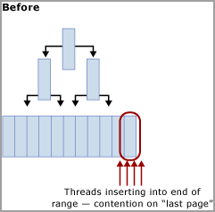

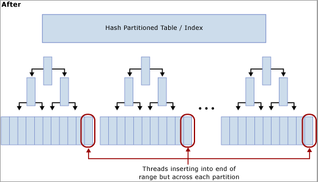

#### Trade-offs when using hash partitioning

While hash partitioning can eliminate contention on inserts, there are several trade-offs to consider when deciding whether or not to use this technique:

* Select queries will in most cases need to be modified to include the hash partition in the predicate and lead to a query plan that provides no partition elimination when these queries are issued. The following screenshot shows a bad plan with no partition elimination after hash partitioning has been implemented.

   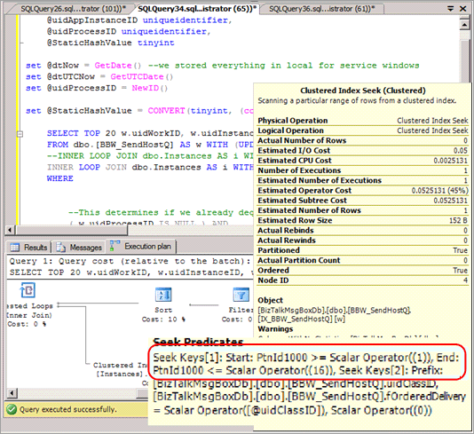

* It eliminates the possibility of partition elimination on certain other queries, such as range-based reports.

* When joining a hash partitioned table to another table, to achieve partition elimination the second table will need to be hash partitioned on the same key and the hash key should be part of the join criteria.

* Hash partitioning prevents the use of partitioning for other management features such as sliding window archiving and partition switch functionality.

Hash partitioning is an effective strategy for mitigating excessive latch contention as it does increase overall system throughput by alleviating contention on inserts. Because there are some trade-offs involved, it may not be the optimal solution for some access patterns.

## Summary of techniques used to address latch contention

The following two sections provide a summary of the techniques that can be used to address excessive latch contention:

### Non-sequential key/index

**Advantages:**

* Allows the use of other partitioning features, such as archiving data using a sliding window scheme and partition switch functionality.

**Disadvantages:**

* Possible challenges when choosing a key/index to ensure 'close enough to' uniform distribution of inserts all of the time.
* GUID as a leading column can be used to guarantee uniform distribution with the caveat that it can result in excessive page-split operations.
* Random inserts across B-Tree can result in too many page-split operations and lead to latch contention on non-leaf pages.

### Hash partitioning with computed column

**Advantages:**

* Transparent for inserts.

**Disadvantages:**

* Partitioning cannot be used for intended management features such as archiving data using partition switch options.
* Can cause partition elimination issues for queries including individual and range-based select/update, and queries that perform a join.
* Adding a persisted computed column is an offline operation.

> [!TIP]
> For additional techniques, see the blog post [PAGELATCH_EX waits and heavy inserts](https://techcommunity.microsoft.com/t5/sql-server/pagelatch-ex-waits-and-heavy-inserts/ba-p/384289).

## Walkthrough: Diagnose a latch contention

The following walkthrough demonstrates the tools and techniques described in [Diagnosing SQL Server Latch Contention](#diagnosing-sql-server-latch-contention) and [Handling Latch Contention for Different Table Patterns](#handling-latch-contention-for-different-table-patterns) to resolve a problem in a real world scenario. This scenario describes a customer engagement to perform load testing of a point of sales system which simulated approximately 8,000 stores performing transactions against a SQL Server application running on an 8 socket, 32 physical core system with 256 GB of memory.

The following diagram details the hardware used to test the point of sales system:


### Symptom: Hot latches

In this case, we observed high waits for PAGELATCH_EX where we typically define high as an average of more than 1 ms. In this case, we consistently observed waits exceeding 20 ms.

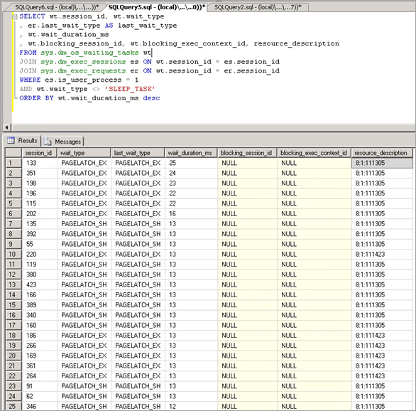

Once we determined that latch contention was problematic, we then set out to determine what was causing the latch contention.

### Isolating the object causing latch contention

The following script uses the resource_description column to isolate which index was causing the PAGELATCH_EX contention:

> [!NOTE]
> The resource_description column returned by this script provides the resource description in the format \<DatabaseID,FileID,PageID\> where the name of the database associated with DatabaseID can be determined by passing the value of DatabaseID to the DB_NAME () function.

```sql
SELECT wt.session_id, wt.wait_type, wt.wait_duration_ms           
, s.name AS schema_name           
, o.name AS object_name           
, i.name AS index_name           
FROM sys.dm_os_buffer_descriptors bd 
JOIN (           
  SELECT *
    --resource_description          
  , CHARINDEX(':', resource_description) AS file_index            
  , CHARINDEX(':', resource_description, CHARINDEX(':', resource_description)+1) AS page_index  
  , resource_description AS rd           
  FROM sys.dm_os_waiting_tasks wt           
  WHERE wait_type LIKE 'PAGELATCH%'                      
  ) AS wt           
    ON bd.database_id = SUBSTRING(wt.rd, 0, wt.file_index)           
    AND bd.file_id = SUBSTRING(wt.rd, wt.file_index+1, 1) --wt.page_index)           
    AND bd.page_id = SUBSTRING(wt.rd, wt.page_index+1, LEN(wt.rd))
JOIN sys.allocation_units au ON bd.allocation_unit_id = au.allocation_unit_id
JOIN sys.partitions p ON au.container_id = p.partition_id
JOIN sys.indexes i ON  p.index_id = i.index_id AND p.object_id = i.object_id
JOIN sys.objects o ON i.object_id = o.object_id 
JOIN sys.schemas s ON o.schema_id = s.schema_id
order by wt.wait_duration_ms desc;
```

As shown here, the contention is on the table LATCHTEST and index name CIX_LATCHTEST. Note names have been changed to anonymize the workload.

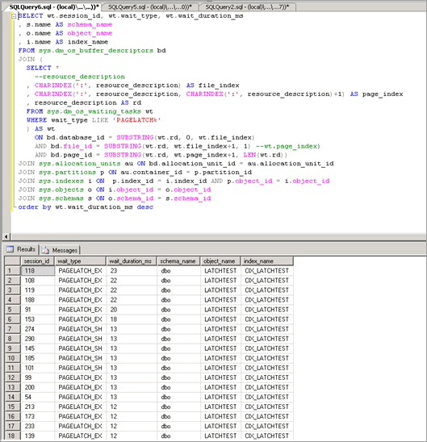

For a more advanced script that polls repeatedly and uses a temporary table to determine the total waiting time over a configurable period see [Query Buffer Descriptors to Determine Objects Causing Latch Contention](#query-buffer-descriptors) in the Appendix.

### Alternative technique to isolate the object causing latch contention

Sometimes it can be impractical to query `sys.dm_os_buffer_descriptors`. As the memory in the system, and available to the buffer pool increases so does the time required to run this DMV. On a 256 GB system, it may take up to 10 minutes or more for this DMV to run. An alternative technique is available and is broadly outlined as follows and is illustrated with a different workload, which we ran in the lab:

1. Query current waiting tasks, using the Appendix script [Query sys.dm_os_waiting_tasks Ordered by Wait Duration](#waiting-tasks-script2).

2. Identify the key page where a convoy is observed, which happens when multiple threads are contending on the same page. In this example, the threads performing the insert are contending on the trailing page in the B-tree and will wait until they can acquire an EX latch. This is indicated by the resource_description in the first query, in our case 8:1:111305.

3. Enable trace flag 3604, which exposes further information about the page via DBCC PAGE with the following syntax, substitute the value you obtained via the resource_description for the value in parentheses:

   ```sql
   --enable trace flag 3604 to enable console output
   dbcc traceon (3604);

   --examine the details of the page
   dbcc page (8,1, 111305, -1);
   ```

4. Examine the DBCC output. There should be an associated Metadata ObjectID, in our case '78623323'.

   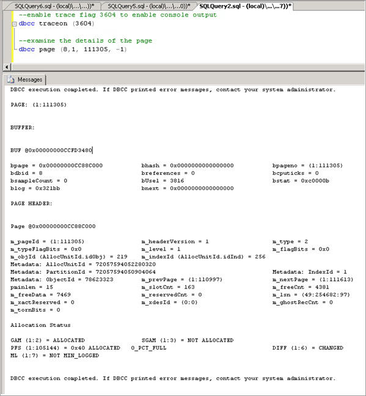

5. We can now run the following command to determine the name of the object causing the contention, which as expected is LATCHTEST.
   
   > [!NOTE]
   > Ensure you are in the correct database context otherwise the query will return NULL.

   ```sql
   --get object name
   select OBJECT_NAME (78623323);
   ```

   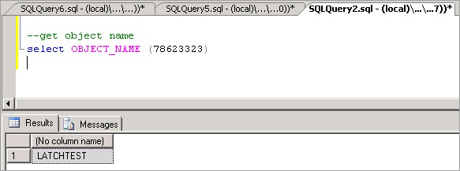

### Summary and results

Using the technique above we were able to confirm that the contention was occurring on a clustered index with a sequentially increasing key value on the table which by far received the highest number of inserts. This type of contention is not uncommon for indexes with a sequentially increasing key value such as datetime, identity or an application-generated transactionID.

To resolve this issue, we used [hash partitioning with a computed column](#use-hash-partitioning-with-a-computed-column) and observed a 690% performance improvement. The following table summarizes the performance of the application before and after implementing hash partitioning with a computed column. The CPU utilization increases broadly in line with throughput as expected after the latch contention bottleneck was removed:

| Measurement | Before hash partitioning | After hash partitioning |
|---|---|---|
| Business Transactions/Sec | 36 | 249 |
| Average Page Latch Wait Time | 36 milliseconds | 0.6 milliseconds |
| Latch Waits/Sec | 9,562 | 2,873 |
| SQL Processor Time | 24% | 78% |
| SQL Batch Requests/sec | 12,368 | 47,045 |

As can be seen from the table above, correctly identifying and resolving performance issues caused by excessive page latch contention can have a positive impact on overall application performance.

## Appendix: Alternate technique

One possible strategy for avoiding excessive page latch contention is to pad rows with a CHAR column to ensure that each row will use a full page. This strategy is an option when the overall data size is small and you need to address EX page latch contention caused by the following combination of factors:

* Small row size 
* Shallow B-tree 
* Access pattern with a high rate of random insert, select, update, and delete operations 
* Small tables, such as temporary queue tables 

By padding rows to occupy a full page you require SQL to allocate additional pages, making more pages available for inserts and reducing EX page latch contention.

### Padding rows to ensure each row occupies a full page

A script similar to the following can be used to pad rows to occupy an entire page:

```sql
ALTER TABLE mytable ADD Padding CHAR(5000) NOT NULL DEFAULT ('X');
```

> [!NOTE]
> Use the smallest char possible that forces one row per page to reduce the extra CPU requirements for the padding value and the extra space required to log the row. Every byte counts in a high performance system.

This technique is explained for completeness; in practice SQLCAT has only used this on a small table with 10,000 rows in a single performance engagement. This technique has a limited application because it increases memory pressure on SQL Server for large tables and can result in non-buffer latch contention on non-leaf pages. The additional memory pressure can be a significant limiting factor for application of this technique. With the amount of memory available in a modern server, a large proportion of the working set for OLTP workloads is typically held in memory. When the data set increases to a size that it no longer fits in memory a significant drop-off in performance will occur. Therefore, this technique is something that is only applicable to small tables. This technique is not used by SQLCAT for scenarios such as last page/trailing page insert contention for large tables.

> [!IMPORTANT]
> Employing this strategy can cause a large number of waits on the ACCESS_METHODS_HOBT_VIRTUAL_ROOT latch type because this strategy can lead to a large number of page splits occurring in the non-leaf levels of the B-tree. If this occurs, SQL Server must acquire shared (SH) latches at all levels followed by exclusive (EX) latches on pages in the B-tree where a page split is possible. Check the `sys.dm_os_latch_stats` DMV for a high number of waits on the ACCESS_METHODS_HOBT_VIRTUAL_ROOT latch type after padding rows.

## Appendix: SQL Server latch contention scripts

This section contains scripts which can be used to help diagnose and troubleshoot latch contention issues.

### <a id="waiting-tasks-script1"></a> Query sys.dm_os_waiting_tasks ordered by session ID

The following sample script will query `sys.dm_os_waiting_tasks` and return latch waits ordered by session ID:

```sql
-- WAITING TASKS ordered by session_id 
SELECT wt.session_id, wt.wait_type
, er.last_wait_type AS last_wait_type
, wt.wait_duration_ms
, wt.blocking_session_id, wt.blocking_exec_context_id,
resource_description
FROM sys.dm_os_waiting_tasks wt
JOIN sys.dm_exec_sessions es ON wt.session_id = es.session_id
JOIN sys.dm_exec_requests er ON wt.session_id = er.session_id
WHERE es.is_user_process = 1
AND wt.wait_type <> 'SLEEP_TASK'
ORDER BY session_id;
```

### <a id="waiting-tasks-script2"></a> Query sys.dm_os_waiting_tasks ordered by wait duration

The following sample script will query `sys.dm_os_waiting_tasks` and return latch waits ordered by wait duration:

```sql
-- WAITING TASKS ordered by wait_duration_ms
SELECT wt.session_id, wt.wait_type
, er.last_wait_type AS last_wait_type
, wt.wait_duration_ms
, wt.blocking_session_id, wt.blocking_exec_context_id, resource_description
FROM sys.dm_os_waiting_tasks wt
JOIN sys.dm_exec_sessions es ON wt.session_id = es.session_id
JOIN sys.dm_exec_requests er ON wt.session_id = er.session_id
WHERE es.is_user_process = 1
AND wt.wait_type <> 'SLEEP_TASK'
ORDER BY wt.wait_duration_ms desc;
```

### Calculate waits over a time period

The following script calculates and returns latch waits over a time period.

```sql
/* Snapshot the current wait stats and store so that this can be compared over a time period 
   Return the statistics between this point in time and the last collection point in time.
   
   **This data is maintained in tempdb so the connection must persist between each execution**
   **alternatively this could be modified to use a persisted table in tempdb.  if that
   is changed code should be included to clean up the table at some point.**
*/
use tempdb
go

declare @current_snap_time datetime;
declare @previous_snap_time datetime;

set @current_snap_time = GETDATE();

if not exists(select name from tempdb.sys.sysobjects where name like '#_wait_stats%')
   create table #_wait_stats
   (
      wait_type varchar(128)
      ,waiting_tasks_count bigint
      ,wait_time_ms bigint
      ,avg_wait_time_ms int
      ,max_wait_time_ms bigint
      ,signal_wait_time_ms bigint
      ,avg_signal_wait_time int
      ,snap_time datetime
   );

insert into #_wait_stats (
         wait_type
         ,waiting_tasks_count
         ,wait_time_ms
         ,max_wait_time_ms
         ,signal_wait_time_ms
         ,snap_time
      )
      select
         wait_type
         ,waiting_tasks_count
         ,wait_time_ms
         ,max_wait_time_ms
         ,signal_wait_time_ms
         ,getdate()
      from sys.dm_os_wait_stats;

--get the previous collection point
select top 1 @previous_snap_time = snap_time from #_wait_stats 
         where snap_time < (select max(snap_time) from #_wait_stats)
         order by snap_time desc;

--get delta in the wait stats  
select top 10
      s.wait_type
      , (e.waiting_tasks_count - s.waiting_tasks_count) as [waiting_tasks_count]
      , (e.wait_time_ms - s.wait_time_ms) as [wait_time_ms]
      , (e.wait_time_ms - s.wait_time_ms)/((e.waiting_tasks_count - s.waiting_tasks_count)) as [avg_wait_time_ms]
      , (e.max_wait_time_ms) as [max_wait_time_ms]
      , (e.signal_wait_time_ms - s.signal_wait_time_ms) as [signal_wait_time_ms]
      , (e.signal_wait_time_ms - s.signal_wait_time_ms)/((e.waiting_tasks_count - s.waiting_tasks_count)) as [avg_signal_time_ms]
      , s.snap_time as [start_time]
      , e.snap_time as [end_time]
      , DATEDIFF(ss, s.snap_time, e.snap_time) as [seconds_in_sample]
   from #_wait_stats e
   inner join (
      select * from #_wait_stats 
         where snap_time = @previous_snap_time 
      ) s on (s.wait_type = e.wait_type)
   where 
      e.snap_time = @current_snap_time 
      and s.snap_time = @previous_snap_time
      and e.wait_time_ms > 0 
      and (e.waiting_tasks_count - s.waiting_tasks_count) > 0 
      and e.wait_type NOT IN ('LAZYWRITER_SLEEP', 'SQLTRACE_BUFFER_FLUSH'
                              , 'SOS_SCHEDULER_YIELD','DBMIRRORING_CMD', 'BROKER_TASK_STOP'
                              , 'CLR_AUTO_EVENT', 'BROKER_RECEIVE_WAITFOR', 'WAITFOR'
                              , 'SLEEP_TASK', 'REQUEST_FOR_DEADLOCK_SEARCH', 'XE_TIMER_EVENT'
                              , 'FT_IFTS_SCHEDULER_IDLE_WAIT', 'BROKER_TO_FLUSH', 'XE_DISPATCHER_WAIT'
                              , 'SQLTRACE_INCREMENTAL_FLUSH_SLEEP')

order by (e.wait_time_ms - s.wait_time_ms) desc ;

--clean up table
delete from #_wait_stats
where snap_time = @previous_snap_time;
```

### <a id="query-buffer-descriptors"></a> Query buffer descriptors to determine objects causing latch contention

The following script queries buffer descriptors to determine which objects are associated with the longest latch wait times.

```sql
IF EXISTS (SELECT * FROM tempdb.sys.objects WHERE [name] like '#WaitResources%') DROP TABLE #WaitResources;
CREATE TABLE #WaitResources (session_id INT, wait_type NVARCHAR(1000), wait_duration_ms INT,
                             resource_description sysname NULL, db_name NVARCHAR(1000), schema_name NVARCHAR(1000),
                             object_name NVARCHAR(1000), index_name NVARCHAR(1000));
GO
declare @WaitDelay varchar(16), @Counter INT, @MaxCount INT, @Counter2 INT
SELECT @Counter = 0, @MaxCount = 600, @WaitDelay = '00:00:00.100'-- 600x.1=60 seconds

SET NOCOUNT ON;
WHILE @Counter < @MaxCount
BEGIN
   INSERT INTO #WaitResources(session_id, wait_type, wait_duration_ms, resource_description)--, db_name, schema_name, object_name, index_name)
   SELECT   wt.session_id,
            wt.wait_type,
            wt.wait_duration_ms,
            wt.resource_description
      FROM sys.dm_os_waiting_tasks wt
      WHERE wt.wait_type LIKE 'PAGELATCH%' AND wt.session_id <> @@SPID
--select * from sys.dm_os_buffer_descriptors
   SET @Counter = @Counter + 1;
   WAITFOR DELAY @WaitDelay;
END;

--select * from #WaitResources;

   update #WaitResources 
      set db_name = DB_NAME(bd.database_id),
         schema_name = s.name,
         object_name = o.name,
         index_name = i.name
            FROM #WaitResources wt
      JOIN sys.dm_os_buffer_descriptors bd
         ON bd.database_id = SUBSTRING(wt.resource_description, 0, CHARINDEX(':', wt.resource_description))
            AND bd.file_id = SUBSTRING(wt.resource_description, CHARINDEX(':', wt.resource_description) + 1, CHARINDEX(':', wt.resource_description, CHARINDEX(':', wt.resource_description) +1 ) - CHARINDEX(':', wt.resource_description) - 1)
            AND bd.page_id = SUBSTRING(wt.resource_description, CHARINDEX(':', wt.resource_description, CHARINDEX(':', wt.resource_description) +1 ) + 1, LEN(wt.resource_description) + 1)
            --AND wt.file_index > 0 AND wt.page_index > 0
      JOIN sys.allocation_units au ON bd.allocation_unit_id = AU.allocation_unit_id
      JOIN sys.partitions p ON au.container_id = p.partition_id
      JOIN sys.indexes i ON p.index_id = i.index_id AND p.object_id = i.object_id
      JOIN sys.objects o ON i.object_id = o.object_id
      JOIN sys.schemas s ON o.schema_id = s.schema_id;

select * from #WaitResources order by wait_duration_ms desc;
GO

/*
--Other views of the same information
SELECT wait_type, db_name, schema_name, object_name, index_name, SUM(wait_duration_ms) [total_wait_duration_ms] FROM #WaitResources
GROUP BY wait_type, db_name, schema_name, object_name, index_name;
SELECT session_id, wait_type, db_name, schema_name, object_name, index_name, SUM(wait_duration_ms) [total_wait_duration_ms] FROM #WaitResources
GROUP BY session_id, wait_type, db_name, schema_name, object_name, index_name;
*/

--SELECT * FROM #WaitResources
--DROP TABLE #WaitResources;
```

### Hash partitioning script

The use of this script is described in [Use Hash Partitioning with a Computed Column](#use-hash-partitioning-with-a-computed-column) and should be customized for purposes of your implementation.

```sql
--Create the partition scheme and function, align this to the number of CPU cores 1:1 up to 32 core computer
-- so for below this is aligned to 16 core system
CREATE PARTITION FUNCTION [pf_hash16] (tinyint) AS RANGE LEFT FOR VALUES
   (0, 1, 2, 3, 4, 5, 6, 7, 8, 9, 10, 11, 12, 13, 14, 15);

CREATE PARTITION SCHEME [ps_hash16] AS PARTITION [pf_hash16] ALL TO ( [ALL_DATA] );
-- Add the computed column to the existing table (this is an OFFLINE operation)

-- Consider using bulk loading techniques to speed it up
ALTER TABLE [dbo].[latch_contention_table]
   ADD [HashValue] AS (CONVERT([tinyint], abs(binary_checksum([hash_col])%(16)),(0))) PERSISTED NOT NULL;

--Create the index on the new partitioning scheme 
CREATE UNIQUE CLUSTERED INDEX [IX_Transaction_ID] 
ON [dbo].[latch_contention_table]([T_ID] ASC, [HashValue]) 
ON ps_hash16(HashValue);
```

## Next steps

For more information on performance monitoring tools, see [Performance Monitoring and Tuning Tools](./performance/performance-monitoring-and-tuning-tools.md).
