# Advanced Viewing of Target Data from Extended Events in SQL Server
[!INCLUDE[appliesto-ss-asdb-xxxx-xxx-md](../../includes/appliesto-ss-asdb-xxxx-xxx-md.md)]

This article illustrates how you can use the advanced features of SQL Server Management Studio (SSMS.exe) to view the target data from extended events in rich detail. The article explains how to:

- Open and view the target data, in various ways.
- Export the target data to various formats, by using the special menu or toolbar for extended events.
- Manipulate the data while viewing, or before exporting.

### Prerequisites

The present article assumes you already know how to create and start an event session. Instructions on how to create an event session are demonstrated early in the following article:

[Quick Start: Extended Events in SQL Server](../../relational-databases/extended-events/quick-start-extended-events-in-sql-server.md)

This article also assumes you have installed a very recent monthly release of SSMS. Installation help is at:

- [Download SQL Server Management Studio (SSMS)](https://msdn.microsoft.com/library/mt238290.aspx)

### Differences with Azure SQL Database

There is a high degree of parity in the implementation and capabilities of extended events in the two products Microsoft SQL Server and Azure SQL Database. But there are some differences that affect the SSMS UI (user interface).

- For SQL Database, the package0.event_file target cannot be a file on the local disk drive. Instead, an Azure Storage container must be used. Therefore when you are connected to SQL Database, the SSMS UI asks for a storage container, instead of a local path and file name.

- In the SSMS UI when you see the check box **Watch live data** is grayed and disabled, it is because that feature is not available for SQL Database.

- A few extended events are installed with SQL Server. Under the **Sessions** node we can see **AlwaysOn_health** plus a couple others. These are not visible when connected to SQL Database because they do not exist for SQL Database.

The present article is written from the perspective of SQL Server. The article uses the event_file target, which is one area of differences. Further mentions of any differences are limited to important or non-obvious differences.

For documentation about extended events that is specific to Azure SQL Database, see:

- [Extended Events in Azure SQL Database](https://azure.microsoft.com/documentation/articles/sql-database-xevent-db-diff-from-svr/)

## A. General options

Generally the advanced options are accessed by the following means:

- The regular menu of **File** > **Open** > **File**.
- Right-clicks in the **Object Explorer** under **Management** > **Extended Events**.
- The special menu **Extended Events**, and the special toolbar for extended events.
- Right-clicks in the tabbed pane that displays the target data.

## B. Bring target data into SSMS for display

There are various ways to bring event_file target data into the SSMS UI. When you specify an event_file target, you set its file path and name:

- .XEL is the extension of the file name.

- Each time the event session is started, the system embeds a large integer into a new file name, to make the file name unique and different from the preceding occasion the session was started.
  - *Example:* Checkpoint_Begins_ES_0_131103935140400000.xel

- The contents inside a .XEL are not plain text that can be viewed with Notepad.exe.
  - If you want, the way to append several .XEL files together is to use the menu **File** > **Open** > **Merge Extended Event Files**.

SSMS can display data from any target. But the displays are different for the various targets:

- *event_file:* Data from an event_file target is displayed very well, with rich features available.

- *ring_buffer:* Data from a ring-buffer target is displayed as raw XML.

- For other targets the power of the display is somewhere between that of event_file versus ring_buffer.
  - Such other targets include event_counter, histogram, and pair_matching.

- *etw_classic_sync_target:* SSMS cannot display data from the target type etw_classic_sync_target.

### B.1 Open .XEL with menu File > Open > File

You can open an individual .XEL file with the standard menu **File** > **Open** > **File**.

You can also drag-and-drop an .XEL file onto the tab bar in the SSMS UI.

### B.2 View Target Data

The **View Target Data** option displays the data that has thus far been captured.

In the **Object Explorer** pane, you can expand the nodes and then right-click:

- **Management** > **Extended Events** > **Sessions** > *[your-session]* > *[your-target-node]* > **View Target Data**.

The target data is displayed in a tabbed pane in SSMS. This is shown in the following screenshot.

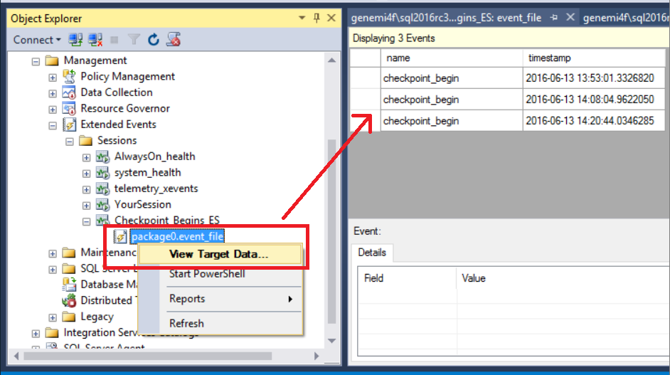

> [!NOTE] 
> **View Target Data** displays the *accumulated data from multiple .XEL files* from the given event session. Each **Start**-**Stop** cycle creates a file with a later time-derived integer embedded in its name, but each file shares the same root name.

#### B.3 Watch Live Data

When your event session is currently active, you might want to watch the event data in real time, as it is received by the target.

- **Management** > **Extended Events** > **Sessions** > *[your-session]* > **Watch Live Data**.

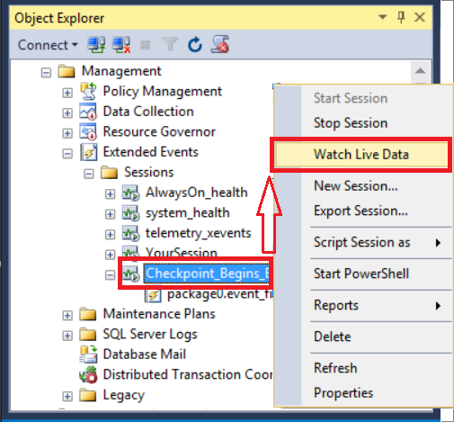

The data display is updated at an interval you can specify. See **Maximum dispatch latency** at:

- **Extended Events** > **Sessions** > *[your-session]* > **Properties** > **Advanced** > **Maximum dispatch latency**

### B.4 View .XEL with sys.fn_xe_file_target_read_file function

For batch processing, the following system function can generate XML for the records in a .XEL file:

- [sys.fn\_xe\_file\_target\_read\_file](../../relational-databases/system-functions/sys-fn-xe-file-target-read-file-transact-sql.md)

## C. Export the target data

After you have the target data in SSMS, you can export the data to various formats by doing the following:

1. Give focus to the data display.
    - Suddenly a new toolbar and a new menu item for extended events both become visible.

	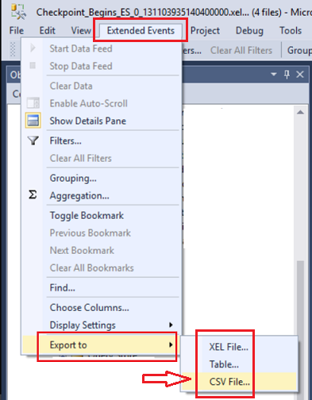

2. Click the new menu item **Extended Events**.
3. Click **Export to**, and then choose a format.

## D. Manipulate data in the display

The SSMS UI offers you several ways to manipulate the data, beyond merely viewing the data as is.

### D.1 Context menus in the data display

Different places in the data display offer different context menus when you right-click.

#### D.1.1 Right-click a data cell

The following screenshot shows the content menu you get when you right-click cell in the data display. The screenshot also shows the expansion of the **Copy** menu item.

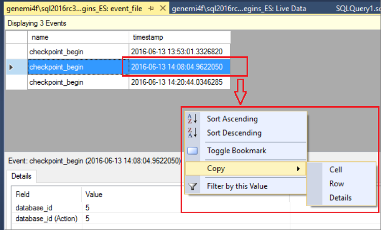

#### D.1.2 Right-click a column header

The following screenshot shows the context menu from a right-click of the **timestamp** header.

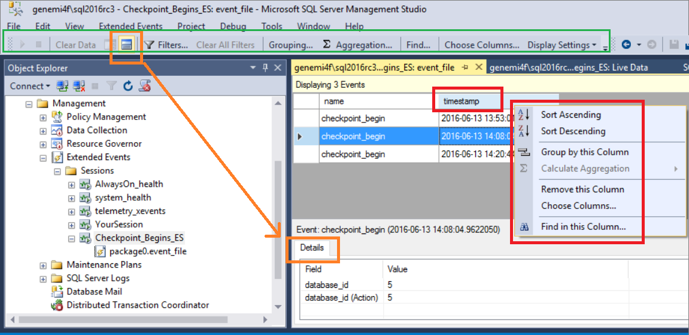

The preceding screenshot also shows the special toolbar for extended events. The brightness of the Details button indicates the button is active. Therefore the image also shows the **Details** tab and grid is present as a second portion of the data display.

### D.2 Choose columns, Merge columns

The **Choose Columns** option enables you to control which data columns are and are not displayed. You can find the **Choose Columns** menu item in a few different places:

- On the **Extended Events** menu.
- On the extended events toolbar.
- On the context menu of a header in the data display.

When you click **Choose Columns**, the dialog of the same name is displayed.

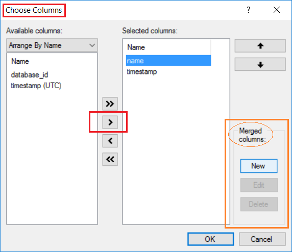

#### D.2.1 Merge columns

The **Choose Columns** dialog has a section devoted to the merging of multiple columns into one, for purposes of:

- Display.
- Export.

### D.3 Filters

In the area of extended events there are two major type of filters that you can specify:

- *Pre-target filters:* Filters that reduce the amount of data that is sent by the events engine to your target.

- *Post-target filters:* Filters you can select in the SSMS UI to exclude some target records from the display.

The SSMS display filters are the following:

- A *time range* filter, which examines the **timestamp** column.
- A *column values* filter.

The relationship between the time filter and columns filter is a Boolean '*AND*'.

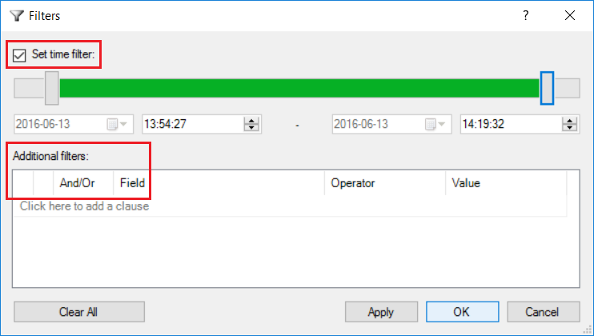

### D.4 Grouping and aggregation

Grouping rows together by matching values in a given column, is the first step toward the summary aggregation of data.

#### D.4.1 Grouping

On the extended events toolbar, the **Grouping** button starts a dialog you can use to group the displayed data by a given column. The next screenshot shows a dialog being used to group by the *name* column.

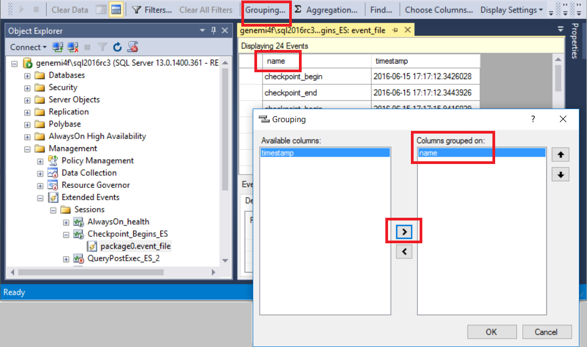

After the grouping is achieved, the display has a new look, as shown next.

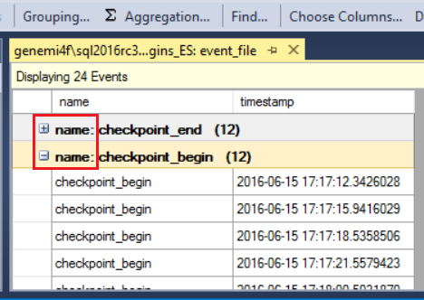

#### D.4.2 Aggregation

After the displayed data has been grouped, you can proceed to aggregate data in other columns.  The next screenshot shows the grouped data is being aggregated by *count*.

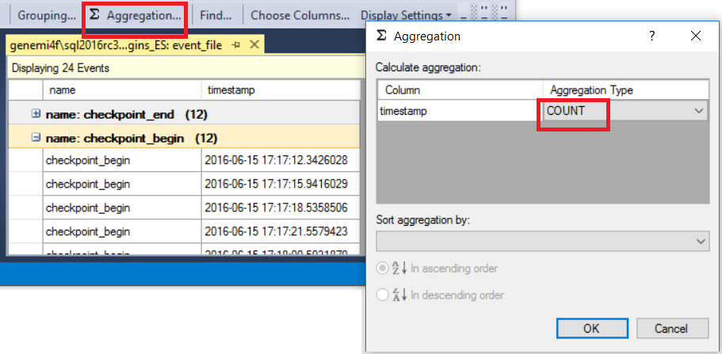

After the aggregation is achieved, the display has a new look, as shown next.

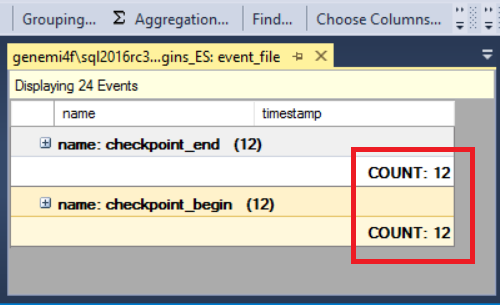

### D.5 View run time query plan

The **query_post_execution_showplan** event enables you to see the actual query plan in the SSMS UI. When the **Details** pane is visible, you can see a graph of the query plan on the **Query Plan** tab. By hovering over a node on the query plan, you can see a list of property names and their values for the node.

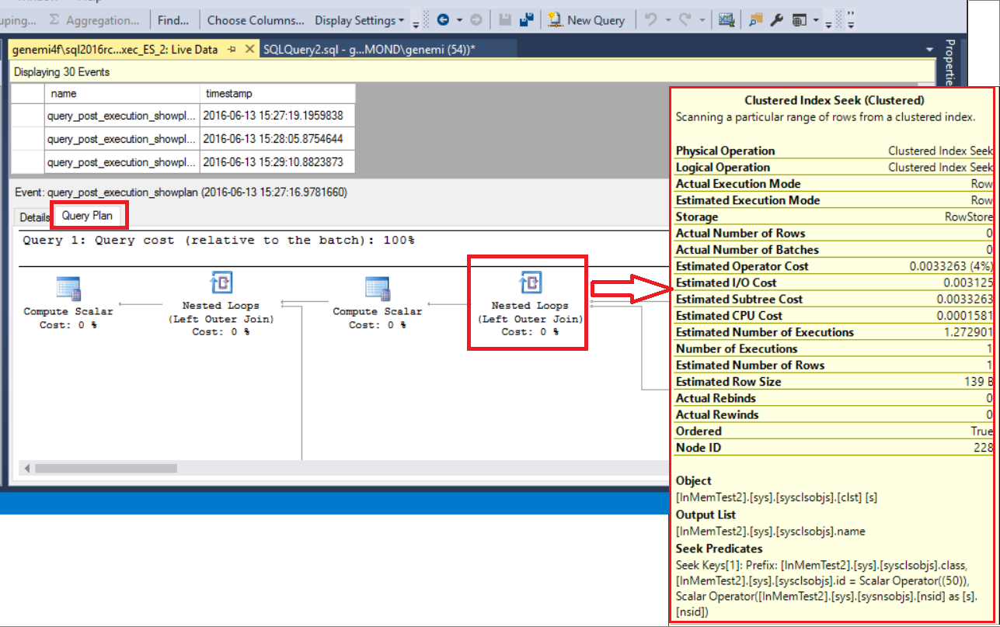

