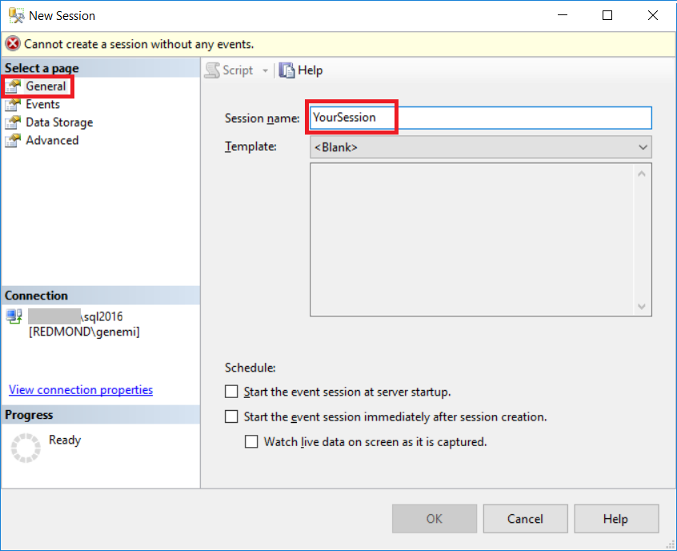
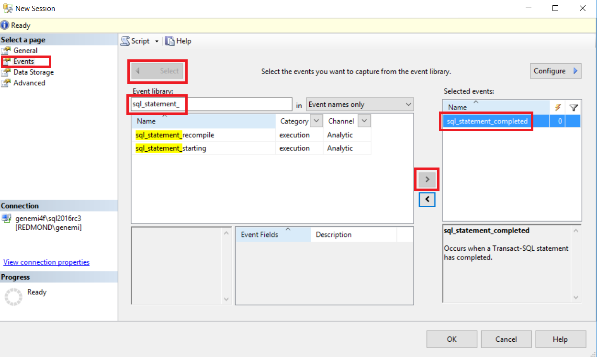
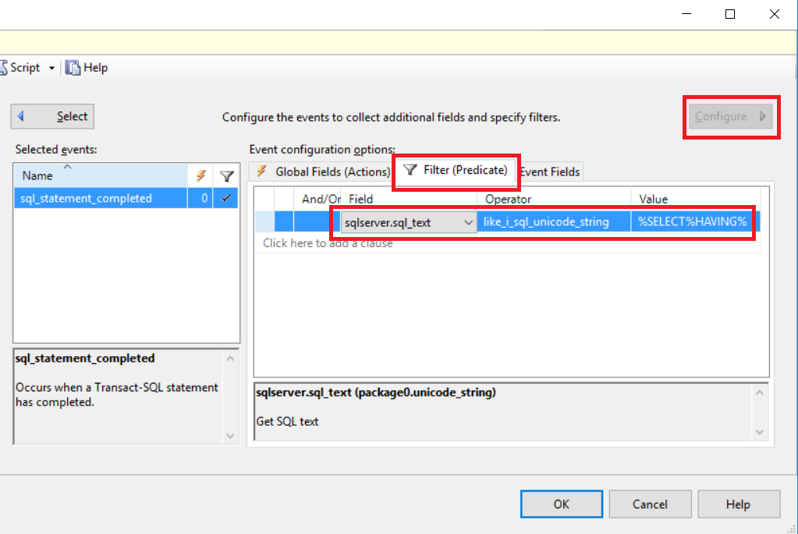
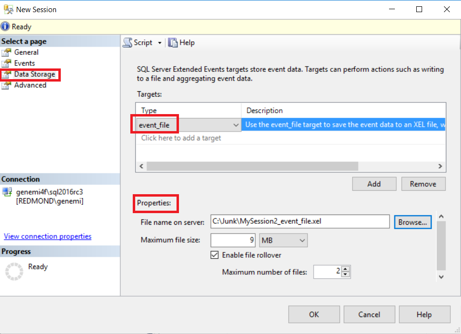
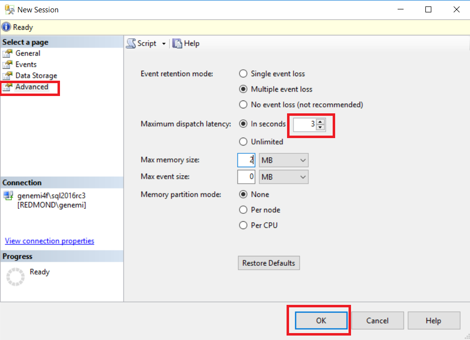
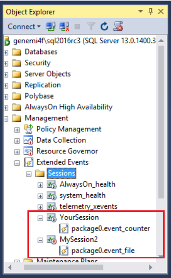
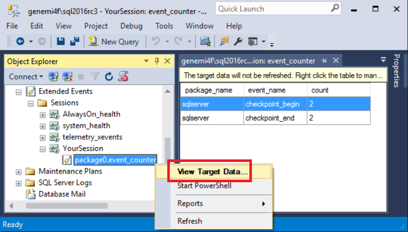
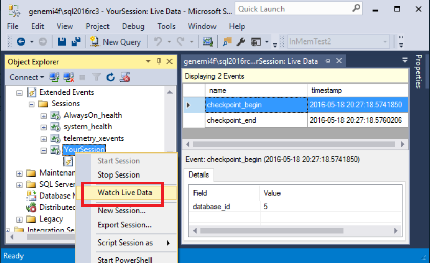

# Quickstart: Extended events in SQL Server

 [!INCLUDE [SQL Server](../../includes/applies-to-version/sqlserver.md)]

Extended Events is a lightweight performance monitoring system that enables users to collect data needed to monitor and troubleshoot problems in SQL Server. See [Extended Events overview](extended-events.md) to learn more about the extended events architecture.  This article aims to help the SQL developer who is new to extended events, and who wants create an event session in just a few minutes. By using Extended Events, you can see details about the inner operations of the SQL system and your application. When you create an Extended Events session, you tell the system:

- Which occurrences you are interested in.
- How you want the system to report the data to you.

This article does the following:

- Uses screenshots to illustrate the clicks in SSMS.exe that create an event session.
- Correlates the screenshots to equivalent Transact-SQL statements.
- Explains in detail the terms and concepts behind the clicks and T-SQL for event sessions.
- Demonstrates how to test your event session.
- Describes the alternatives around results:
  - Storage capture of results.
  - Processed versus raw results.
  - Tools for viewing the results in different ways and on different time scales.
- Shows how you can search for and discover all the available events.
- Provides the primary key and foreign key relationships that are implicit among the dynamic management views (DMVs) for Extended Events.
- Describes what more there is to learn in related articles.

Blogs and other informal conversations sometimes refer to Extended Events by the abbreviation *XEvents*.

> [!NOTE]
> For information about extended events in Azure SQL Database, including code samples, see [Extended Events in SQL Database](/azure/azure-sql/database/xevent-db-diff-from-svr).

## Preparations before demo

The following preliminaries would be required for you to actually perform the upcoming demonstration.

1. [Download SQL Server Management Studio (SSMS)](../../ssms/download-sql-server-management-studio-ssms.md)

   Each month you should install the latest monthly update of SSMS.
2. Log in to Microsoft SQL Server 2014 or higher.
3. Ensure that your account has the [server permission](../../t-sql/statements/grant-server-permissions-transact-sql.md) of **ALTER ANY EVENT SESSION**.

  If interested, more details about security and permissions related to extended events are available at the end of this article in the [Appendix](#appendix1).

## Demo of SSMS integration

SSMS.exe provides an excellent user interface (UI) for extended events. The UI is so good that many users have no need to engage with Extended Events by using Transact-SQL or the dynamic management views (DMVs) that target extended events.

In this section you can see the UI steps to create an Extended Events session, and to see the data it reports. After the steps, you can read about the concepts involved in the steps for a deeper understanding.

### Steps of demo

You can understand the steps even if you decide not to perform them. The demonstration starts the **New Session** dialog. We process its four pages named:

- General
- Events
- Data Storage
- Advanced

The text and supporting screenshots can become slightly inexact when the SSMS UI is tweaked over the months or years. Yet the screenshots remain effective for explanation if the discrepancies are only minor.

1. Connect with SSMS.

2. In the Object Explorer, click **Management** > **Extended Events** > **New Session**. The **New Session** dialog is preferable to the **New Session Wizard**, although the two are similar to each other.

3. In the upper-left, click the **General** page. Then type *YourSession*, or any name you like, into the **Session name** text box. Do *not* press the **OK** button yet, that comes only at the end of the demo.

   

4. In the upper-left, click the **Events** page, and then click the **Select** button.

   

5. In the **Event library** area, in the drop-down list, choose **Event names only**.
    - Into the text box, type in **sql**, which filters and reduces the long list of available events by using a *contains* operator.
    - Scroll and click the event named **sql_statement_completed**.
    - Click the right arrow button **>** to move the event to the **Selected events** box.

6. Staying on the **Events** page, click the **Configure** button at the far right.

   With the left side chopped off for better display, in the following screenshot you can see the **Event configuration options** area.

    

7. Click the **Filter (Predicate)** tab. Next, click **Click here to add a clause**, for the intention of capturing all SQL SELECT statements that have a HAVING clause.

8. In the **Field** drop-down list, and choose **sqlserver.sql_text**.
   - For **Operator** choose a LIKE operator.
   - For **Value** type in **%SELECT%HAVING%**.

   > [!NOTE]
   > In this two-part name, *sqlserver* is the package name and *sql_text* is the field name. The event we chose earlier, *sql_statement_completed*, must be in the same package as the field we choose.

9. In the upper-left, click the **Data Storage** page.

10. In the **Targets** area, click **Click here to add a target**.
    - In the **Type** drop-down list, choose **event_file**.
    - This means the event data will be stored in a file that we can view.
    
    > [!NOTE]
    > You can't use Azure Blob Storage as a data storage target in an on-premises instance of SQL Server.

    

11. In the **Properties** area, type in a full path and file name into the **File name on server** text box.
    - The file name extension must be *.xel*.
    - Our little test will need less than 1 MB of file size.

    

12. In the upper-left, click the **Advanced** page.
    - Reduce the **Maximum dispatch latency** down to 3 seconds.
    - Finally, click the **OK** button at the bottom.

13. Back in the **Object Explorer**, expand **Management** > **Sessions**, and see the new node for **YourSession**.

    

#### Edit your event session

In the SSMS **Object Explorer**, you can edit your event session by right-clicking its node, and then clicking **Properties**. The same multi-page dialog is displayed.

### Corresponding T-SQL for your event session

You used the SSMS UI to generate a T-SQL script that created your event session. You can see the generated script as follows:

- Right-click your session node, click **Script Session as** > **CREATE to** > **Clipboard**.
- Paste into any text editor.

Next is the T-SQL CREATE EVENT SESSION statement for *YourSession*, which was generated by your clicks in the UI:

```sql
CREATE EVENT SESSION [YourSession]
    ON SERVER
    ADD EVENT sqlserver.sql_statement_completed
    (
        ACTION(sqlserver.sql_text)
        WHERE
        ( [sqlserver].[like_i_sql_unicode_string]([sqlserver].[sql_text], N'%SELECT%HAVING%')
        )
    )
    ADD TARGET package0.event_file
    (SET
        filename = N'C:\Junk\YourSession_Target.xel',
        max_file_size = (2),
        max_rollover_files = (2)
    )
    WITH (
        MAX_MEMORY = 2048 KB,
        EVENT_RETENTION_MODE = ALLOW_MULTIPLE_EVENT_LOSS,
        MAX_DISPATCH_LATENCY = 3 SECONDS,
        MAX_EVENT_SIZE = 0 KB,
        MEMORY_PARTITION_MODE = NONE,
        TRACK_CAUSALITY = OFF,
        STARTUP_STATE = OFF
    );
GO
```

#### Pre-DROP of the event session

Before the CREATE EVENT SESSION statement, you might want to conditionally issue a DROP EVENT SESSION in case the name already exists.

```sql
IF EXISTS (SELECT *
      FROM sys.server_event_sessions
      WHERE name = 'YourSession')
BEGIN
    DROP EVENT SESSION YourSession
          ON SERVER;
END
go
```

#### ALTER to start and stop the event session

When you create an event session, the default is for it to not start running automatically. You can start or stop your event session any time by using the following T-SQL ALTER EVENT SESSION statement.

```sql
ALTER EVENT SESSION [YourSession]
      ON SERVER
    --ON DATABASE
    STATE = START;   -- STOP;
```

You have the option of telling the event session to automatically start when the SQL Server instance is started. See the **STARTUP STATE = ON** keyword on CREATE EVENT SESSION.

- The SSMS UI offers a corresponding check box on **New Session** > **General** page.

## Test your event session

Test your event session with these simple steps:

1. In the SSMS **Object Explorer**, right-click your event session node, and then click **Start Session**.
2. Run the following `SELECT...HAVING` statement a couple times.
    - Ideally you might change the `HAVING Count` value between the two runs, toggling between 2 and 3. This enables you to see the differences in the results.
3. Right-click your session node, and then click **Stop Session**.
4. Read the next subsection about [how to SELECT and view the results](#select-the-full-results-xml-37).

```sql
SELECT
        c.name,
        Count(*)  AS [Count-Per-Column-Repeated-Name]
    FROM
             sys.syscolumns  AS c
        JOIN sys.sysobjects  AS o
            ON o.id = c.id
    WHERE
        o.type = 'V'
        AND
        c.name like '%event%'
    GROUP BY
        c.name
    HAVING
        Count(*) >= 3   --2     -- Try both values during session.
    ORDER BY
        c.name;
```

Just for completeness, here is the approximate output from the preceding SELECT...HAVING.

```
/*** Approximate output, 6 rows, all HAVING Count >= 3:
name                   Count-Per-Column-Repeated-Name
---------------------  ------------------------------
event_group_type       4
event_group_type_desc  4
event_session_address  5
event_session_id       5
is_trigger_event       4
trace_event_id         3
***/
```

<a name="select-the-full-results-xml-37"/>

### SELECT the full results as XML

In SSMS, run the following T-SQL SELECT to return results where each row provides the data about one event occurrence. The CAST AS XML makes viewing the results easy.

> [!NOTE]
> The event system always appends a long number to the *.xel* event_file file name you specified. Before you can run the following SELECT from the file, you must copy the full name given by the system, and paste it into the SELECT.

```sql
SELECT
        object_name,
        file_name,
        file_offset,
        event_data,
        'CLICK_NEXT_CELL_TO_BROWSE_XML RESULTS!'
                AS [CLICK_NEXT_CELL_TO_BROWSE_XML_RESULTS],
        CAST(event_data AS XML) AS [event_data_XML]
                -- TODO: In ssms.exe results grid, double-click this xml cell!
    FROM
        sys.fn_xe_file_target_read_file(
            'C:\Junk\YourSession_Target_0_131085363367310000.xel',
            null, null, null
        );
```

The preceding SELECT gives you two ways to view the full results of any given event row:

- Run the SELECT in SSMS, and then click a cell in the **event_data_XML** column. This is very handy.
- Copy the long XML string from a cell in the **event_data** column. Paste into any simple text editor like Notepad.exe, and save the string in a file with extension .XML. Then open the .XML file with a browser.

#### Display of results for one event

Next we see part of the results, which are in XML format. The XML here is edited here to make it shorter for display. Note that `<data name="row_count">` displays a value of `6`, which matches our 6 result rows displayed earlier. And we can see the whole SELECT statement.

```xml
<event name="sql_statement_completed" package="sqlserver" timestamp="2016-05-24T04:06:08.997Z">
  <data name="duration">
    <value>111021</value>
  </data>
  <data name="cpu_time">
    <value>109000</value>
  </data>
  <data name="physical_reads">
    <value>0</value>
  </data>
  <data name="last_row_count">
    <value>6</value>
  </data>
  <data name="offset">
    <value>0</value>
  </data>
  <data name="offset_end">
    <value>584</value>
  </data>
  <data name="statement">
    <value>SELECT
        c.name,
        Count(*)  AS [Count-Per-Column-Repeated-Name]
    FROM
             sys.syscolumns  AS c
        JOIN sys.sysobjects  AS o

            ON o.id = c.id
    WHERE
        o.type = 'V'
        AND
        c.name like '%event%'
    GROUP BY
        c.name
    HAVING
        Count(*) &gt;= 3   --2     -- Try both values during session.
    ORDER BY
        c.name</value>
  </data>
</event>
```

## SSMS to display results

There are several advanced features in the SSMS UI you can use to view the data that is captured from an extended event. Details are at:

- [Advanced Viewing of Target Data from Extended Events in SQL Server](../../relational-databases/extended-events/advanced-viewing-of-target-data-from-extended-events-in-sql-server.md)

The basics start with context menu options labeled **View Target Data** and **Watch Live Data**.

### View Target Data

In the SSMS **Object Explorer**, you can right-click the target node which is under your event session node. In the context menu you click **View Target Data**. SSMS displays the data.

The display is not updated as new data is reported by the event. But you can click **View Target Data** again.



### Watch Live Data

In the SSMS **Object Explorer**, you can right-click your event session node. In the context menu you click **Watch Live Data**. SSMS displays incoming data as it continues to arrive in real time.



## Scenarios

There are innumerable scenarios for the effective use of Extended Events. The following articles provide example scenarios that involve the locks taken during queries.

Specific scenarios for event sessions aimed at assessing locks are described in the following articles. The articles also show some advanced techniques, such as using **\@dbid**, and using the dynamic `EXECUTE (@YourSqlString)`:

- [Find the Objects That Have the Most Locks Taken on Them](../../relational-databases/extended-events/find-the-objects-that-have-the-most-locks-taken-on-them.md)
  - This scenario uses the target package0.histogram, which processes the raw event data before displaying it to you.
- [Determine Which Queries Are Holding Locks](../../relational-databases/extended-events/determine-which-queries-are-holding-locks.md)
  - This scenario uses the [target package0.pair_matching](/previous-versions/sql/sql-server-2016/ff878062(v=sql.130)), where the pair of events is sqlserver.lock_acquire and lock_release.

## Terms and concepts in Extended Events

The following table lists the terms used for Extended Events, and describes their meanings.

| Term | Description |
| :--- | :---------- |
| event session | A construct centered around one or more events, plus supporting items like actions are targets. The CREATE EVENT SESSION statement constructs each event session. You can ALTER an event session to start and stop it at will. <br/> <br/> An event session is sometimes referred to as just a *session*, when the context clarifies it means *event session*. <br/> <br/> Further details about event sessions are described in: [SQL Server Extended Events Sessions](../../relational-databases/extended-events/sql-server-extended-events-sessions.md). |
| event | A specific occurrence in the system that is watched for by an active event session. <br/> <br/> For example, the *sql_statement_completed* event represents the moment that any given T-SQL statement completes. The event can report its duration and other data. |
| target | A item that receives the output data from a captured event. The target displays the data to you. <br/> <br/> Examples include the *event_file*, and its handy light-weight cousin the memory *ring_buffer*. The fancier *histogram* target performs some processing of your data before displaying it. <br/> <br/> Any target can be used for any event session. For details, see [Targets for Extended Events in SQL Server](../../relational-databases/extended-events/targets-for-extended-events-in-sql-server.md). |
| action | A field known to the event. Data from the field is sent to the target. The action field is closely related to the *predicate filter*. |
| predicate filter | A test of data in an event field, used so that only an interesting subset of event occurrences are sent to the target. <br/> <br/> For example, a filter could include only those *sql_statement_completed* event occurrences where the T-SQL statement contained the string *HAVING*. |
| package | A name qualifier attached to each item in a set of items that centers around a core of events. <br/> <br/> For example, a package might have events about T-SQL text. One event could be about all the T-SQL in a GO-delimited batch. Meanwhile another narrower event is about individual T-SQL statements. Further, for any one T-SQL statement, there is are start and completed events. <br/> <br/> Fields appropriate for the events are also in the package with the events. Most targets are in *package0* and are used with events from many other packages. |

## How to discover the available events in packages

The following T-SQL SELECT returns a row for each available event whose name contains the three character string 'sql'. Of course, you can edit the LIKE value to search for different event names. The rows also name the package that contains the event.

```sql
SELECT   -- Find an event you want.
        p.name         AS [Package-Name],
        o.object_type,
        o.name         AS [Object-Name],
        o.description  AS [Object-Descr],
        p.guid         AS [Package-Guid]
    FROM
              sys.dm_xe_packages  AS p
        JOIN  sys.dm_xe_objects   AS o
                ON  p.guid = o.package_guid
    WHERE
        o.object_type = 'event'   --'action'  --'target'
        AND
        p.name LIKE '%'
        AND
        o.name LIKE '%sql%'
    ORDER BY
        p.name, o.object_type, o.name;
```

The following display shows the returned row, edited here into the format of column name = value. The data is from the *sql-statement_completed* event that was used in the preceding example steps. The sentence for the Object-Descr column is particularly helpful.

```
Package-Name = sqlserver
object_type  = event
Object-Name  = sql_statement_completed
Object-Descr = Occurs when a Transact-SQL statement has completed.
Package-Guid = 655FD93F-3364-40D5-B2BA-330F7FFB6491
```

### SSMS UI for search

Another search option is to use the SSMS UI for **New Session** > **Events** > **Event library** dialog that is shown in a preceding screenshot.

### SQL Trace event classes, with extended events

A description of using extended events with SQL Trace event classes and columns is available at: [View the Extended Events Equivalents to SQL Trace Event Classes](../../relational-databases/extended-events/view-the-extended-events-equivalents-to-sql-trace-event-classes.md)

### Event Tracing for Windows (ETW), with extended events

Descriptions of using extended events with Event Tracing for Windows (ETW) are available at:

- [Event Tracing for Windows Target](../../relational-databases/extended-events/event-tracing-for-windows-target.md)
- [Monitor System Activity Using Extended Events](../../relational-databases/extended-events/monitor-system-activity-using-extended-events.md)

## Additional items

This section briefly mentions a couple of miscellaneous items.

### Event sessions installed with SQL Server

SQL Server comes with a few Extended Events sessions already created. All are configured to start whenever the SQL system is started. These event sessions gather data that might be helpful in case of a system error. Like many event sessions, they consume only tiny a amount of resources, and Microsoft recommends that they be left alone to run.

You can see these event sessions in the SSMS **Object Explorer** under **Management** > **Extended Events** > **Sessions**.  As of June 2016, the list of these installed event sessions is:

- AlwaysOn_health
- system_health
- telemetry_events

### PowerShell provider for Extended Events

You can manage SQL Server Extended Events by using the SQL Server PowerShell provider. Details are at: [Use the PowerShell Provider for Extended Events](../../relational-databases/extended-events/use-the-powershell-provider-for-extended-events.md)

### System views for Extended Events

The system views for Extended Events include:

- *Catalog views:* for information about event sessions that have been defined by CREATE EVENT SESSION.

- *Dynamic management views (DMVs):* for information about event sessions are actively running at present.

[SELECTs and JOINs From System Views for Extended Events in SQL Server](../../relational-databases/extended-events/selects-and-joins-from-system-views-for-extended-events-in-sql-server.md) - provides information about:

- How to join the views to each other.
- Several useful SELECTs from the views.
- The correlation between:
  - The view columns.
  - CREATE EVENT SESSION clauses.
  - The SSMS UI controls.

## <a name="appendix1"></a> Appendix: SELECTs to ascertain permission owner in advance

The permissions mentioned in this article are:

- ALTER ANY EVENT SESSION
- VIEW SERVER STATE
- CONTROL SERVER

The following Transact-SQL SELECT statements can report who has these permissions.

### UNION direct permissions plus role derived permissions

The following SELECT...UNION ALL statement returns rows that show who has the necessary permissions for creating event sessions and querying the system catalog views for Extended Events.

```sql
-- Ascertain who has the permissions listed in the ON clause.
-- 'CONTROL SERVER' permission includes the permissions
-- 'ALTER ANY EVENT SESSION' and 'VIEW SERVER STATE'.
SELECT
        'Owner-is-Principal'  AS [Type-That-Owns-Permission],
        NULL                  AS [Role-Name],
        prin.name             AS [Owner-Name],

        perm.permission_name
            COLLATE Latin1_General_CI_AS_KS_WS
            AS [Permission-Name]
    FROM
             sys.server_permissions  AS perm
        JOIN sys.server_principals   AS prin

            ON prin.principal_id = perm.grantee_principal_id
    WHERE
        perm.permission_name IN
            ('ALTER ANY EVENT SESSION',
            'VIEW SERVER STATE',
            'CONTROL SERVER')
UNION ALL

-- Plus check for members of the 'sysadmin' fixed server role,
-- because 'sysadmin' includes the 'CONTROL SERVER' permission.
SELECT
        'Owner-is-Role'
        , prin.name  -- [Role-Name]
        , CAST( (IsNull(pri2.name, N'No members'))
            AS nvarchar(128))
        , NULL
    FROM
        sys.server_role_members  AS rolm
        RIGHT OUTER JOIN sys.server_principals    AS prin
            ON prin.principal_id = rolm.role_principal_id
        LEFT OUTER JOIN sys.server_principals     AS pri2
            ON rolm.member_principal_id = pri2.principal_id
    WHERE
        prin.name = 'sysadmin'
    ORDER BY
        1,2,3,4;
```

### HAS_PERMS_BY_NAME function

The follow SELECT reports your permissions. It relies on the built-in function [HAS_PERMS_BY_NAME](../../t-sql/functions/has-perms-by-name-transact-sql.md).

Further, if you have authority to temporarily *impersonate* other accounts, you can uncomment the [EXECUTE AS LOGIN](../../t-sql/statements/execute-as-transact-sql.md) and REVERT statements, to inquire about other accounts.

```sql
--EXECUTE AS LOGIN = 'AccountNameHere';
SELECT HAS_PERMS_BY_NAME
    (
       null
       , null
       , 'ALTER ANY EVENT SESSION'
    );
--REVERT;
```

### Security links

Here are links to documentation related to these SELECTs, and to permissions:

- Details of built-in function [HAS_PERMS_BY_NAME (Transact-SQL)](../../t-sql/functions/has-perms-by-name-transact-sql.md)
- [sys.fn_my_permissions (Transact-SQL)](../../relational-databases/system-functions/sys-fn-my-permissions-transact-sql.md)
- [GRANT Server Permissions (Transact-SQL)](../../t-sql/statements/grant-server-permissions-transact-sql.md)
- [sys.server_principals (Transact-SQL)](../system-catalog-views/sys-server-principals-transact-sql.md)
- Blog: [Effective Database Engine Permissions](https://social.technet.microsoft.com/wiki/contents/articles/15180.effective-database-engine-permissions.aspx)
- Zoomable [poster](https://aka.ms/sql-permissions-poster), as a PDF, that displays the hierarchy of all SQL Server permissions.

## Links to supporting information

- [sys.fn_xe_file_target_read_file (Transact-SQL)](../../relational-databases/system-functions/sys-fn-xe-file-target-read-file-transact-sql.md)
