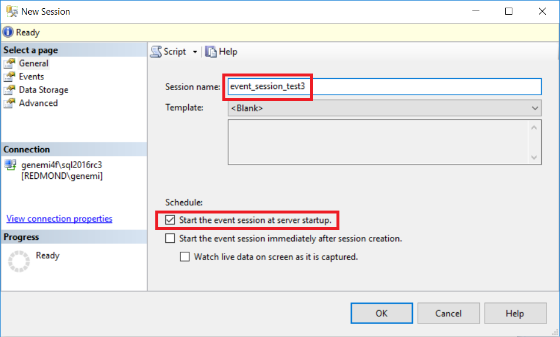
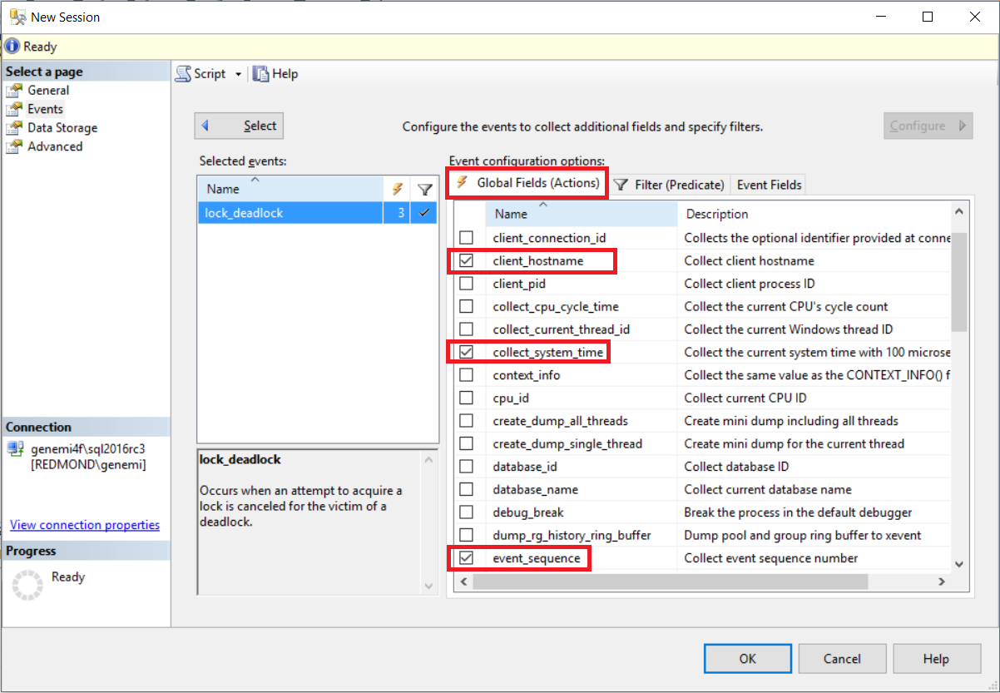
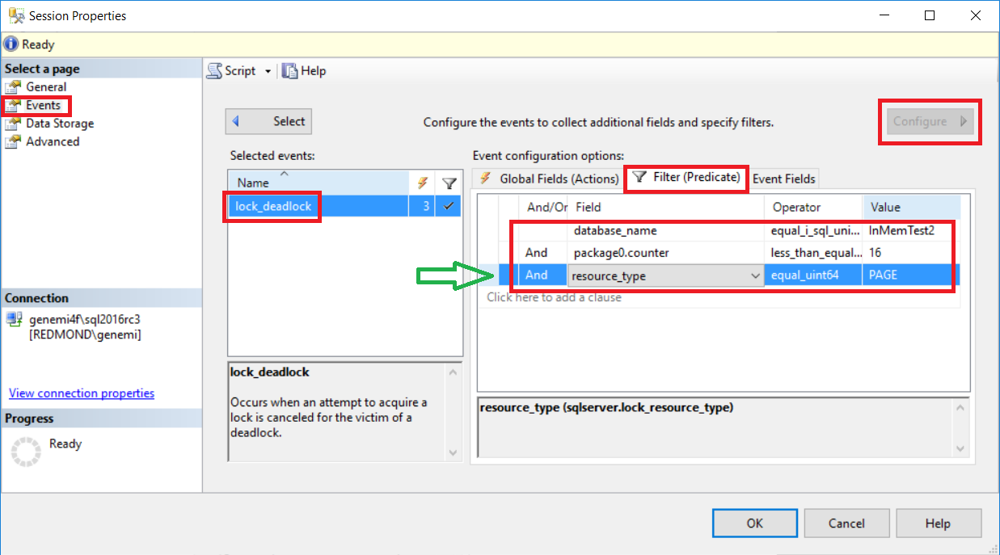
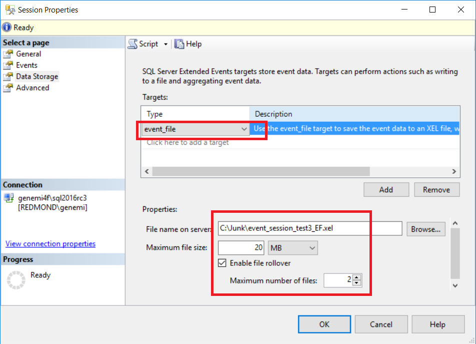
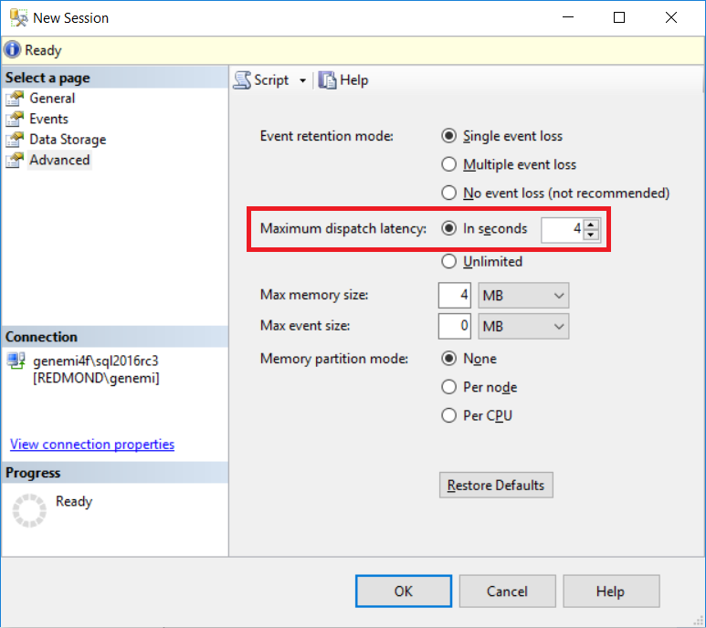

# SELECTs and JOINs From System Views for Extended Events in SQL Server

[!INCLUDE [SQL Server Azure SQL Database Azure SQL Managed Instance](../../includes/applies-to-version/sql-asdb-asdbmi.md)]


This article explains the two sets of system views that relate to Extended Events in SQL Server and in Azure SQL Database. The article illustrates:

- How to JOIN various system views.
- How to SELECT particular kinds of information from the system views.
- How the same event session information is represented from various technological perspectives, which reinforces your understanding of each perspective.


Most of the examples are written for SQL Server. But with minor edits they would run on SQL Database.


## A. Foundational information


There are two sets of system views for Extended Events:


#### Catalog views:

- These views store information about the *definition* of each event session that is created by [CREATE EVENT SESSION](../../t-sql/statements/create-event-session-transact-sql.md), or by an SSMS UI equivalent. But these views know nothing about whether any sessions have ever started running.
    - For example, if the SSMS **Object Explorer** shows no event sessions are defined, SELECTing from the view *sys.server_event_session_targets* would return zero rows.


- Name prefix is:
    - *sys.server\_event\_session\** is the name prefix on SQL Server.
    - *sys.database\_event\_session\** is the name prefix on SQL Database.


#### Dynamic management views (DMVs):

- Store information about the *current activity* of running event sessions. But these DMVs know little about the definition of the sessions.
    - Even if all event sessions are currently stopped, a SELECT from the view *sys.dm_xe_packages* would still return rows because various packages are loaded into active memory a server start.
    - For the same reason, *sys.dm_xe_objects* *sys.dm_xe_object_columns* would also still return rows.


- Name prefix for Extended Events DMVs is:
    - *sys.dm\_xe\_\** is the name prefix on SQL Server.
    - *sys.dm\_xe\_database\_\** is generally the name prefix on SQL Database.


#### Permissions:


To SELECT from the system views, the following permission is necessary:

- VIEW SERVER STATE - if on Microsoft SQL Server.
- VIEW DATABASE STATE - if on Azure SQL Database.


<a name="section_B_catalog_views"></a>

## B. Catalog views


This section matches and correlates three different technological perspectives on the same defined event session. The session has been defined and is visible in the **Object Explorer** of SQL Server Management Studio (SSMS.exe), but the session is not currently running.

Every month it is wise to [install the latest update of SSMS](../../ssms/download-sql-server-management-studio-ssms.md), to avoid unexpected failures.


Reference documentation about the catalog views for Extended Events is at [Extended Events Catalog Views (Transact-SQL)](../../relational-databases/system-catalog-views/extended-events-catalog-views-transact-sql.md).


&nbsp;


#### The sequence in this section B:


- [B.1 SSMS UI perspective](#section_B_1_SSMS_UI_perspective)
	- Create the definition of the event session, by using the SSMS UI. Step-by-step screenshots are shown.


- [B.2 Transact-SQL perspective](#section_B_2_TSQL_perspective)
    - Use the SSMS context menu to reverse engineer the defined event session into the equivalent Transact-SQL **CREATE EVENT SESSION** statement. The T-SQL shows a perfect match to the SSMS screenshots choices.


- [B.3 Catalog view SELECT JOIN UNION perspective](#section_B_3_Catalog_view_S_J_UNION)
	- Issue a T-SQL SELECT statement from the system catalog views for our event session. The results match the **CREATE EVENT SESSION** statement specifications.


&nbsp;


<a name="section_B_1_SSMS_UI_perspective"></a>

### B.1 SSMS UI perspective


In SSMS, in its **Object Explorer**, you can start the **New Session** dialog by expanding **Management** > **Extended Events**, and then right-clicking **Sessions** > **New Session**.

In the large **New Session** dialog, in its first section labeled **General**, we see the option has been selected to **Start the event session at server startup**.




Next on the **Events** section, we see the **lock_deadlock** event was chosen. For that event, we see that three **Actions** have been selected. This means the **Configure** button was clicked, which becomes gray after being clicked.




<a name="resource_type_PAGE_cat_view"></a>

Next, still on the **Events** > **Configure** section, we see that [**resource_type** has been set to **PAGE**](#resource_type_dmv_actual_row). This means that event data will not be sent from the event engine to the target if the **resource_type** value is anything other than **PAGE**.

We see additional predicate filters for the database name and for a counter.




Next on the **Data Storage** section, we see the **event_file** has been chosen as a target. Further, we see that the **Enable file roleover** option has been selected.




Finally, on the **Advanced** section, we see that the **Maximum dispatch latency** value was reduced down to 4 seconds.




This completes the SSMS UI perspective on an event session definition.


<a name="section_B_2_TSQL_perspective"></a>

### B.2 Transact-SQL perspective


Regardless of how an event session definition is created, from the SSMS UI the session can be reversed engineered into a perfectly matching Transact-SQL script. You can examine the preceding New Session screenshots and compare their visible specifications to the clauses in the following generated T-SQL **CREATE EVENT SESSION** script.

To reverse engineer an event session, in the **Object Explorer** you can right-click your session node, and then choose **Script Session as** > **CREATE to** > **Clipboard**.

The following T-SQL script was created by reverse engineering with SSMS. Then the script was manually prettified by strategic manipulation of white space only.


```sql
CREATE EVENT SESSION [event_session_test3]
	ON SERVER  -- Or, if on Azure SQL Database, ON DATABASE.

	ADD EVENT sqlserver.lock_deadlock
	(
		SET
			collect_database_name = (1)
		ACTION
		(
			package0  .collect_system_time,
			package0  .event_sequence,
			sqlserver .client_hostname
		)
		WHERE
		(
			[database_name]           = N'InMemTest2'
			AND [package0].[counter] <= (16)
			AND [resource_type]       = (6)
		)
	)

	ADD TARGET package0.event_file
	(
		SET
			filename           = N'C:\Junk\event_session_test3_EF.xel',
			max_file_size      = (20),
			max_rollover_files = (2)
	)

	WITH
	(
		MAX_MEMORY            = 4096 KB,
		EVENT_RETENTION_MODE  = ALLOW_SINGLE_EVENT_LOSS,
		MAX_DISPATCH_LATENCY  = 4 SECONDS,
		MAX_EVENT_SIZE        = 0 KB,
		MEMORY_PARTITION_MODE = NONE,
		TRACK_CAUSALITY       = OFF,
		STARTUP_STATE         = ON
	);
```


This completes the T-SQL perspective.


<a name="section_B_3_Catalog_view_S_J_UNION"></a>

### B.3 Catalog view SELECT JOIN UNION perspective


Do not be afraid! The following T-SQL SELECT statement is long only because it UNIONs several small SELECTs together. Any of the small SELECTs can be run on its own. The small SELECTs show how the various system cataloging views should be JOINed together.


```sql
SELECT
		s.name        AS [Session-Name],
		'1_EVENT'     AS [Clause-Type],
		'Event-Name'  AS [Parameter-Name],
		e.name        AS [Parameter-Value]
	FROM
		      sys.server_event_sessions         AS s
		JOIN  sys.server_event_session_events   AS e

			ON  e.event_session_id = s.event_session_id
	WHERE
		s.name = 'event_session_test3'

UNION ALL
SELECT
		s.name         AS [Session-Name],
		'2_EVENT_SET'  AS [Clause-Type],
		f.name         AS [Parameter-Name],
		f.value        AS [Parameter-Value]
	FROM
		      sys.server_event_sessions         AS s
		JOIN  sys.server_event_session_events   AS e

			ON  e.event_session_id = s.event_session_id

		JOIN  sys.server_event_session_fields   As f

			ON  f.event_session_id = s.event_session_id
			AND f.object_id        = e.event_id
	WHERE
		s.name = 'event_session_test3'

UNION ALL
SELECT
		s.name              AS [Session-Name],
		'3_EVENT_ACTION'    AS [Clause-Type],

		a.package + '.' + a.name
		                    AS [Parameter-Name],

		'(Not_Applicable)'  AS [Parameter-Value]
	FROM
		      sys.server_event_sessions         AS s
		JOIN  sys.server_event_session_events   AS e

			ON  e.event_session_id = s.event_session_id

		JOIN  sys.server_event_session_actions  As a

			ON  a.event_session_id = s.event_session_id
			AND a.event_id         = e.event_id
	WHERE
		s.name = 'event_session_test3'

UNION ALL
SELECT
		s.name                AS [Session-Name],
		'4_EVENT_PREDICATES'  AS [Clause-Type],
		e.predicate           AS [Parameter-Name],
		'(Not_Applicable)'    AS [Parameter-Value]
	FROM
		      sys.server_event_sessions         AS s
		JOIN  sys.server_event_session_events   AS e

			ON  e.event_session_id = s.event_session_id
	WHERE
		s.name = 'event_session_test3'

UNION ALL
SELECT
		s.name              AS [Session-Name],
		'5_TARGET'          AS [Clause-Type],
		t.name              AS [Parameter-Name],
		'(Not_Applicable)'  AS [Parameter-Value]
	FROM
		      sys.server_event_sessions         AS s
		JOIN  sys.server_event_session_targets  AS t

			ON  t.event_session_id = s.event_session_id
	WHERE
		s.name = 'event_session_test3'

UNION ALL
SELECT
		s.name          AS [Session-Name],
		'6_TARGET_SET'  AS [Clause-Type],
		f.name          AS [Parameter-Name],
		f.value         AS [Parameter-Value]
	FROM
		      sys.server_event_sessions         AS s
		JOIN  sys.server_event_session_targets  AS t

			ON  t.event_session_id = s.event_session_id

		JOIN  sys.server_event_session_fields   As f

			ON  f.event_session_id = s.event_session_id
			AND f.object_id        = t.target_id
	WHERE
		s.name = 'event_session_test3'

UNION ALL
SELECT
		s.name               AS [Session-Name],
		'7_WITH_MAX_MEMORY'  AS [Clause-Type],
		'max_memory'         AS [Parameter-Name],
		s.max_memory         AS [Parameter-Value]
	FROM
		      sys.server_event_sessions  AS s
	WHERE
		s.name = 'event_session_test3'

UNION ALL
SELECT
		s.name                  AS [Session-Name],
		'7_WITH_STARTUP_STATE'  AS [Clause-Type],
		'startup_state'         AS [Parameter-Name],
		s.startup_state         AS [Parameter-Value]
	FROM
		      sys.server_event_sessions  AS s
	WHERE
		s.name = 'event_session_test3'

ORDER BY
	[Session-Name],
	[Clause-Type],
	[Parameter-Name]
;
```


#### Output


The following table shows the output from running the preceding SELECT JOIN UNION. The output parameter names and values map to what is plainly visible in the preceding CREATE EVENT SESSION statement.

| Session-Name | Clause-Type | Parameter-Name | Parameter-Value |
|---|---|---|---|
|event_session_test3  | 1_EVENT |                Event-Name |                       lock_deadlock |
|event_session_test3  |  2_EVENT_SET |             collect_database_name |            1 |
|event_session_test3  |  3_EVENT_ACTION |          sqlserver.client_hostname |       (Not_Applicable) |
|event_session_test3  |  3_EVENT_ACTION |         sqlserver.collect_system_time |   (Not_Applicable) |
|event_session_test3  |  3_EVENT_ACTION |         sqlserver.event_sequence |        (Not_Applicable) |
|event_session_test3  |  4_EVENT_PREDICATES |     (\[sqlserver\].\[equal_i_sql_unicode_string\]\(\[database_name\],N'InMemTest2'\) AND \[package0\].\[counter\]<=\(16\)\) |   (Not_Applicable) |
|event_session_test3  |  5_TARGET |               event_file |                      (Not_Applicable) |
|event_session_test3  |  6_TARGET_SET |           filename  |                       C:\Junk\event_session_test3_EF.xel |
|event_session_test3  |  6_TARGET_SET |           max_file_size |                   20 |
|event_session_test3  |  6_TARGET_SET |           max_rollover_files |              2 |
|event_session_test3  |  7_WITH_MAX_MEMORY |      max_memory |                      4096 |
|event_session_test3  |  7_WITH_STARTUP_STATE |   startup_state |                   1 |

This completes the section on catalog views.


<a name="section_C_DMVs"></a>

## C. Dynamic management views (DMVs)


We now shift to DMVs. This section provides several Transact-SQL SELECT statements which each serve a specific useful business purpose. Further, the SELECTs demonstrate how you can JOIN the DMVs together for any new uses you want.


Reference documentation of the DMVs is available at [Extended Events Dynamic Management Views](../../relational-databases/system-dynamic-management-views/extended-events-dynamic-management-views.md)


In this article, any actual output rows from the following SELECTs are from SQL Server 2016, unless otherwise specified.


Here is list of the SELECTs in this DMV section C:

- [C.1 List of all packages](#section_C_1_list_packages)
- [C.2 Count of every object type](#section_C_2_count_object_type)
- [C.3 SELECT all available items sorted by type](#section_C_3_select_all_available_objects)
- [C.4 Data fields available for your event](#section_C_4_data_fields)
- [C.5 *sys.dm_xe_map_values* and event fields](#section_C_5_map_values_fields)
- [C.6 Parameters for targets](#section_C_6_parameters_targets)
- [C.7 DMV SELECT casting target_data column to XML](#section_C_7_dmv_select_target_data_column)
- [C.8 SELECT from a function to retrieve event_file data from disk drive](#section_C_8_select_function_disk)


<a name="section_C_1_list_packages"></a>

### C.1 List of all packages


All the objects you can use in area of extended events come from packages which are loaded into the system. This section lists all the packages and their descriptions.


```sql
SELECT  --C.1
		p.name         AS [Package],
		p.description  AS [Package-Description]
	FROM
		sys.dm_xe_packages  AS p
	ORDER BY
		p.name;
```


#### Output

Here is the list of packages.

| Package        |Package-Description|
|---|---|
|filestream|     Extended events for SQL Server FILESTREAM and FileTable |
|package0   |    Default package. Contains all standard types, maps, compare operators, actions and targets |
|qds         |   Extended events for Query Store |
|SecAudit     |  Security Audit Events |
|sqlclr        | Extended events for SQL CLR |
|sqlos         | Extended events for SQL Operating System |
|SQLSatellite |  Extended events for SQL Satellite |
|sqlserver   |   Extended events for Microsoft SQL Server |
|sqlserver  |    Extended events for Microsoft SQL Server |
|sqlserver  |    Extended events for Microsoft SQL Server |
|sqlsni     |    Extended events for Microsoft SQL Server |
|ucs        |    Extended events for Unified Communications Stack |
|XtpCompile |    Extended events for the XTP Compile |
|XtpEngine  |    Extended events for the XTP Engine |
|XtpRuntime |    Extended events for the XTP Runtime |


*Definitions of the preceding initialisms:*

- clr = Common Language Runtime of .NET
- qds = Query Data Store
- sni = Server Network Interface
- ucs = Unified Communications Stack
- xtp = extreme transaction processing


<a name="section_C_2_count_object_type"></a>

### C.2 Count of every object type


This section tells us about the type of objects that event packages contain. A complete list is displayed of all object types that are in *sys.dm\_xe\_objects*, along with the count for each type.


```sql
SELECT  --C.2
		Count(*)  AS [Count-of-Type],
		o.object_type
	FROM
		sys.dm_xe_objects  AS o
	GROUP BY
		o.object_type
	ORDER BY
		1  DESC;
```


#### Output

Here is the count of objects per object type. There are about 1915 objects.

|Count-of-Type |   object_type |
|---|---|
|1303|            event |
|351  |           map |
|84    |          message |
|77     |         pred_compare |
|53     |        action |
|46     |         pred_source |
|28     |         type |
|17     |         target |

<a name="section_C_3_select_all_available_objects"></a>

### C.3 SELECT all available items sorted by type


The following SELECT returns about 1915 rows, one for each object.


```sql
SELECT  --C.3
		o.object_type  AS [Type-of-Item],
		p.name         AS [Package],
		o.name         AS [Item],
		o.description  AS [Item-Description]
	FROM
		     sys.dm_xe_objects  AS o
		JOIN sys.dm_xe_packages AS p  ON o.package_guid = p.guid
	WHERE
		o.object_type IN ('action' , 'target' , 'pred_source')
		AND
		(
			(o.capabilities & 1) = 0
			OR
			o.capabilities IS NULL
		)
	ORDER BY
		[Type-of-Item],
		[Package],
		[Item];
```


#### Output

To whet your appetite, next is an arbitrary sampling of the objects returned by the preceding SELECT.


|Type-of-Item|   Package|        Item|                          Item-Description|
|---|---|---|---|
|action|         package0  |     callstack                     |Collect the current call stack|
|action |        package0  |     debug_break                   |Break the process in the default debugger|
|action |       sqlos      |    task_time                     |Collect current task execution time|
|action |        sqlserver |     sql_text                     | Collect SQL text|
|event  |        qds       |     query_store_aprc_regression  | Fired when Query Store detects regression in query plan performance|
|event  |        SQLSatellite |  connection_accept            | Occurs when a new connection is accepted. This event serves to log all connection attempts.|
|event  |        XtpCompile  |   cgen                          |Occurs at start of C code generation.|
|map    |        qds         |   aprc_state                    |Query Store Automatic Plan Regression Correction state|
|message |       package0    |   histogram_event_required      |A value is required for the parameter 'filtering_event_name' when source type is 0.|
|pred_compare |  package0   |    equal_ansi_string             |Equality operator between two ANSI string values|
|pred_compare |  sqlserver  |    equal_i_sql_ansi_string       |Equality operator between two SQL ANSI string values|
|pred_source |   sqlos      |    task_execution_time           |Get current task execution time|
|pred_source |   sqlserver  |    client_app_name               |Get the current client application name|
|target |        package0   |    etw_classic_sync_target       |Event Tracing for Windows (ETW) Synchronous Target|
|target |        package0   |    event_counter                 |Use the event_counter target to count the number of occurrences of each event in the event session.|
|target  |       package0  |     event_file                    |Use the event_file target to save the event data to an XEL file, which can be archived and used for later analysis and review. You can merge multiple XEL files to view the combined data from separate event sessions.|
|target  |       package0   |    histogram                     |Use the histogram target to aggregate event data based on a specific event data field or action associated with the event. The histogram allows you to analyze distribution of the event data over the period of the event session.|
|target   |      package0  |     pair_matching                 |Pairing target|
|target   |      package0  |     ring_buffer                   |Asynchronous ring buffer target|
|type     |      package0  |     xml                           |Well formed XML fragment|

<a name="section_C_4_data_fields"></a>

### C.4 Data fields available for your event


The following SELECT returns all the data fields that are particular to your event type.

- Note the WHERE clause item: *column_type = 'data'*.
- Also, you would need to edit the WHERE clause value for *o.name =*.


```sql
SELECT  -- C.4
		p.name         AS [Package],
		c.object_name  AS [Event],
		c.name         AS [Column-for-Predicate-Data],
		c.description  AS [Column-Description]
	FROM
		      sys.dm_xe_object_columns  AS c
		JOIN  sys.dm_xe_objects         AS o

			ON  o.name = c.object_name

		JOIN  sys.dm_xe_packages        AS p

			ON  p.guid = o.package_guid
	WHERE
		c.column_type = 'data'
		AND
		o.object_type = 'event'
		AND
		o.name        = '\<EVENT-NAME-HERE!>'  --'lock_deadlock'
	ORDER BY
		[Package],
		[Event],
		[Column-for-Predicate-Data];
```


#### Output

The following rows were returned by the preceding SELECT, WHERE `o.name = 'lock_deadlock'`:

- Each row represents an optional filter for the *sqlserver.lock_deadlock* event.
- The *\[Column-Description\]* column is omitted from the following display. Its value is often NULL.
- This is actual output, except for the omitted Description column which is often NULL.
- These rows are where object_type = 'lock_deadlock'.

|Package|     Event|           Column-for-Predicate-Data|
|---|---|---|
|sqlserver|   lock_deadlock|   associated_object_id|
|sqlserver|  lock_deadlock |  database_id|
|sqlserver|  lock_deadlock |  database_name|
|sqlserver|   lock_deadlock|   deadlock_id|
|sqlserver|   lock_deadlock|   duration|
|sqlserver|   lock_deadlock|   lockspace_nest_id|
|sqlserver|   lock_deadlock|   lockspace_sub_id|
|sqlserver|   lock_deadlock|   lockspace_workspace_id|
|sqlserver|   lock_deadlock|   mode|
|sqlserver|   lock_deadlock|   object_id|
|sqlserver|   lock_deadlock|   owner_type|
|sqlserver|   lock_deadlock|   resource_0|
|sqlserver|   lock_deadlock|  resource_1|
|sqlserver|   lock_deadlock|   resource_2|
|sqlserver|   lock_deadlock|   resource_description|
|sqlserver|   lock_deadlock|   resource_type|
|sqlserver|   lock_deadlock|   transaction_id|


<a name="section_C_5_map_values_fields"></a>

### C.5 *sys.dm_xe_map_values* and event fields


The following SELECT includes a JOIN to the tricky view named *sys.dm_xe_map_values*.

The purpose of the SELECT display the numerous fields that you can choose from for your event session. The event fields can be used in two ways:

- To choose which field values will be written to your target for each event occurrence..
- To filter which event occurrences will be sent to versus kept from your target.


```sql
SELECT  --C.5
		dp.name         AS [Package],
		do.name         AS [Object],
		do.object_type  AS [Object-Type],
		'o--c'     AS [O--C],
		dc.name         AS [Column],
		dc.type_name    AS [Column-Type-Name],
		dc.column_type  AS [Column-Type],
		dc.column_value AS [Column-Value],
		'c--m'     AS [C--M],
		dm.map_value    AS [Map-Value],
		dm.map_key      AS [Map-Key]
	FROM
		      sys.dm_xe_objects         AS do
		JOIN  sys.dm_xe_object_columns  AS dc

			ON  dc.object_name = do.name

		JOIN  sys.dm_xe_map_values      AS dm

			ON  dm.name = dc.type_name

		JOIN  sys.dm_xe_packages        AS dp

			ON  dp.guid = do.package_guid
	WHERE
		do.object_type = 'event'
		AND
		do.name        = '\<YOUR-EVENT-NAME-HERE!>'  --'lock_deadlock'
	ORDER BY
		[Package],
		[Object],
		[Column],
		[Map-Value];
```


#### Output

<a name="resource_type_dmv_actual_row"></a>

Next is a sampling of the actual 153 rows of output from the preceding T-SQL SELECT. The row for **resource_type** is [relevant](#resource_type_PAGE_cat_view) to the predicate filtering used in the **event_session_test3** example elsewhere in this article.


```
/***  5 sampled rows from the actual 153 rows returned.
	NOTE:  'resource_type' under 'Column'.

Package     Object          Object-Type   O--C   Column          Column-Type-Name     Column-Type   Column-Value   C--M   Map-Value        Map-Key
-------     ------          -----------   ----   ------          ----------------     -----------   ------------   ----   ---------        -------
sqlserver   lock_deadlock   event         o--c   CHANNEL         etw_channel          readonly      2              c--m   Operational      4
sqlserver   lock_deadlock   event         o--c   KEYWORD         keyword_map          readonly      16             c--m   access_methods   1024
sqlserver   lock_deadlock   event         o--c   mode            lock_mode            data          NULL           c--m   IX               8
sqlserver   lock_deadlock   event         o--c   owner_type      lock_owner_type      data          NULL           c--m   Cursor           2
sqlserver   lock_deadlock   event         o--c   resource_type   lock_resource_type   data          NULL           c--m   PAGE             6

Therefore, on your CREATE EVENT SESSION statement, in its ADD EVENT WHERE clause,
you could put:
	WHERE( ... resource_type = 6 ...)  -- Meaning:  6 = PAGE.
***/
```


<a name="section_C_6_parameters_targets"></a>

### C.6 Parameters for targets


The following SELECT returns every parameter for your target. Each parameter is tagged to indicate whether it is mandatory. The values you assign to parameters affect the behavior of the target.

- Note the WHERE clause item: *object_type = 'customizable'*.
- Also, you would need to edit the WHERE clause value for *o.name =*.


```sql
SELECT  --C.6
		p.name        AS [Package],
		o.name        AS [Target],
		c.name        AS [Parameter],
		c.type_name   AS [Parameter-Type],

		CASE c.capabilities_desc
			WHEN 'mandatory' THEN 'YES_Mandatory'
			ELSE 'Not_mandatory'
		END  AS [IsMandatoryYN],

		c.description AS [Parameter-Description]
	FROM
		      sys.dm_xe_objects   AS o
		JOIN  sys.dm_xe_packages  AS p

			ON  o.package_guid = p.guid

		LEFT OUTER JOIN  sys.dm_xe_object_columns  AS c

			ON  o.name        = c.object_name
			AND c.column_type = 'customizable'  -- !
	WHERE
		o.object_type = 'target'
		AND
		o.name     LIKE '%'    -- Or '\<YOUR-TARGET-NAME-HERE!>'.
	ORDER BY
		[Package],
		[Target],
		[IsMandatoryYN]  DESC,
		[Parameter];
```


#### Output

The following rows of parameters are a subset of those returned by the preceding SELECT, in SQL Server 2016.


```
/***  Actual output, all rows, where target name = 'event_file'.
Package    Target       Parameter            Parameter-Type       IsMandatoryYN   Parameter-Description
-------    ------       ---------            --------------       -------------   ---------------------
package0   event_file   filename             unicode_string_ptr   YES_Mandatory   Specifies the location and file name of the log
package0   event_file   increment            uint64               Not_mandatory   Size in MB to grow the file
package0   event_file   lazy_create_blob     boolean              Not_mandatory   Create blob upon publishing of first event buffer, not before.
package0   event_file   max_file_size        uint64               Not_mandatory   Maximum file size in MB
package0   event_file   max_rollover_files   uint32               Not_mandatory   Maximum number of files to retain
package0   event_file   metadatafile         unicode_string_ptr   Not_mandatory   Not used
***/
```


<a name="section_C_7_dmv_select_target_data_column"></a>

### C.7 DMV SELECT casting target_data column to XML


This DMV SELECT returns data rows from the target of your active event session. The data is cast to XML, which makes its returned cell clickable for easy display in SSMS.

- If your event session is stopped, this SELECT will return zero rows.
- You would need to edit the WHERE clause value for *s.name =*.


```sql
SELECT  --C.7
		s.name,
		t.target_name,
		CAST(t.target_data AS XML)  AS [XML-Cast]
	FROM
		      sys.dm_xe_session_targets  AS t
		JOIN  sys.dm_xe_sessions         AS s

			ON s.address = t.event_session_address
	WHERE
		s.name = '\<Your-Session-Name-Here!>';
```


#### Output, the only row, including its XML cell

Here is the only row that is output from the preceding SELECT. The column *XML-Cast* contains a string of XML that SSMS understands is XML. Therefore SSMS understands it should make the XML-Cast cell clickable.


For this run:

- The *s.name =* value was set to an event session for the *checkpoint_begin* event.
- The target was a *ring_buffer*.


```XML
name                              target_name   XML-Cast
----                              -----------   --------
checkpoint_session_ring_buffer2   ring_buffer   <RingBufferTarget truncated="0" processingTime="0" totalEventsProcessed="2" eventCount="2" droppedCount="0" memoryUsed="104"><event name="checkpoint_begin" package="sqlserver" timestamp="2016-07-09T01:28:23.508Z"><data name="database_id"><type name="uint32" package="package0" /><value>5</value></data></event><event name="checkpoint_begin" package="sqlserver" timestamp="2016-07-09T01:28:26.975Z"><data name="database_id"><type name="uint32" package="package0" /><value>5</value></data></event></RingBufferTarget>
```


#### Output, XML displayed pretty when cell is clicked


When the XML-Cast cell is clicked, the following pretty display appears.


```xml
<RingBufferTarget truncated="0" processingTime="0" totalEventsProcessed="2" eventCount="2" droppedCount="0" memoryUsed="104">
  <event name="checkpoint_begin" package="sqlserver" timestamp="2016-07-09T01:28:23.508Z">
    <data name="database_id">
      <type name="uint32" package="package0" />
      <value>5</value>
    </data>
  </event>
  <event name="checkpoint_begin" package="sqlserver" timestamp="2016-07-09T01:28:26.975Z">
    <data name="database_id">
      <type name="uint32" package="package0" />
      <value>5</value>
    </data>
  </event>
</RingBufferTarget>
```


<a name="section_C_8_select_function_disk"></a>

### C.8 SELECT from a function to retrieve event_file data from disk drive


Suppose your event session gathered some data and later was stopped. If your session was defined to use the event_file target, you could still retrieve the data by calling the function *sys.fn_xe_target_read_file*.

- You must edit your path and file name into the parameter of the function call, before you run this SELECT.
    - Pay no attention to the extra digits that SQL system embeds into your actual .XEL file names each time you restart your session. Just give the normal root name and extension.


```sql
SELECT  --C.8
		f.module_guid,
		f.package_guid,
		f.object_name,
		f.file_name,
		f.file_offset,
		CAST(f.event_data AS XML)  AS [Event-Data-As-XML]
	FROM
		sys.fn_xe_file_target_read_file(

			'\<YOUR-PATH-FILE-NAME-ROOT-HERE!>*.xel',
			--'C:\Junk\Checkpoint_Begins_ES*.xel',  -- Example.

			NULL, NULL, NULL
		)  AS f;
```


#### Output, rows returned by SELECT FROM the function


Next are the rows returned by the preceding SELECT FROM the function. The far right XML column contains the data that is specifically about the event occurrence.


```
module_guid                            package_guid                           object_name        file_name                                                           file_offset   Event-Data-As-XML
-----------                            ------------                           -----------        ---------                                                           -----------   -----------------
D5149520-6282-11DE-8A39-0800200C9A66   03FDA7D0-91BA-45F8-9875-8B6DD0B8E9F2   checkpoint_begin   C:\Junk\Checkpoint_Begins_ES_20160615bb-_0_131125086091700000.xel   5120          <event name="checkpoint_begin" package="sqlserver" timestamp="2016-07-09T03:30:14.023Z"><data name="database_id"><value>5</value></data><action name="session_id" package="sqlserver"><value>60</value></action><action name="database_id" package="sqlserver"><value>5</value></action></event>
D5149520-6282-11DE-8A39-0800200C9A66   03FDA7D0-91BA-45F8-9875-8B6DD0B8E9F2   checkpoint_end     C:\Junk\Checkpoint_Begins_ES_20160615bb-_0_131125086091700000.xel   5120          <event name="checkpoint_end" package="sqlserver" timestamp="2016-07-09T03:30:14.025Z"><data name="database_id"><value>5</value></data></event>
D5149520-6282-11DE-8A39-0800200C9A66   03FDA7D0-91BA-45F8-9875-8B6DD0B8E9F2   checkpoint_begin   C:\Junk\Checkpoint_Begins_ES_20160615bb-_0_131125086091700000.xel   5632          <event name="checkpoint_begin" package="sqlserver" timestamp="2016-07-09T03:30:17.704Z"><data name="database_id"><value>5</value></data><action name="session_id" package="sqlserver"><value>60</value></action><action name="database_id" package="sqlserver"><value>5</value></action></event>
D5149520-6282-11DE-8A39-0800200C9A66   03FDA7D0-91BA-45F8-9875-8B6DD0B8E9F2   checkpoint_end     C:\Junk\Checkpoint_Begins_ES_20160615bb-_0_131125086091700000.xel   5632          <event name="checkpoint_end" package="sqlserver" timestamp="2016-07-09T03:30:17.709Z"><data name="database_id"><value>5</value></data></event>
```


#### Output, one XML cell


Here is the contents of the first XML cell, from the preceding returned rowset.


```xml
<event name="checkpoint_begin" package="sqlserver" timestamp="2016-07-09T03:30:14.023Z">
  <data name="database_id">
    <value>5</value>
  </data>
  <action name="session_id" package="sqlserver">
    <value>60</value>
  </action>
  <action name="database_id" package="sqlserver">
    <value>5</value>
  </action>
</event>
```
