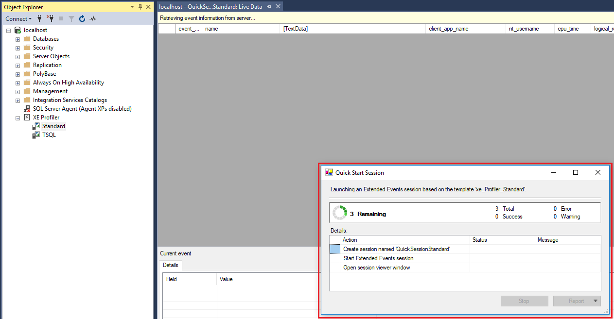
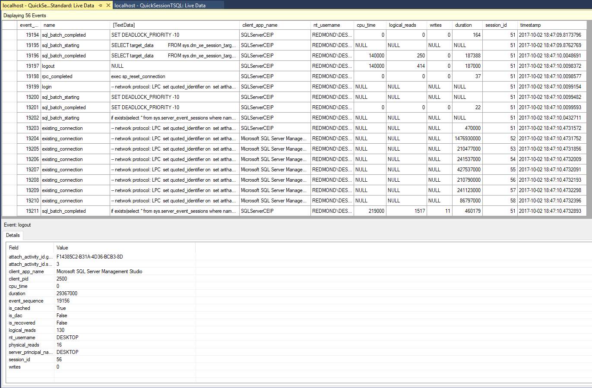

# Use the SSMS XEvent Profiler

[!INCLUDE[appliesto-ss-asdb-xxxx-xxx-md](../../includes/appliesto-ss-asdb-xxxx-xxx-md.md)]
The XEvent Profiler is a SQL Server Management Studio (SSMS) feature that displays a live viewer window of extended events. This overview describes the reasons for using this profiler, key features, and instructions to get started viewing extended events.

## Why would I use the XEvent Profiler?
Unlike SQL Profiler, XEvent profiler is directly integrated into SSMS and is built on top of the scalable Extended Events technology in the SQL engine. This feature enables quick access to a live streaming view of diagnostics events on the SQL server. This view can be customized and those customizations can be shared with other SSMS users as a .viewsettings file. The session created by XE Profiler is less intrusive to the running SQL server than a similar SQL trace would be when using SQL Profiler. This session can be customized by the user as well, using the existing XE session properties UI or by TSQL.

## Prerequisites
This feature is only available on SQL Server Management Studio (SSMS) v17.3 or later. Make sure you are using the latest version. You can find the latest version [here.](https://docs.microsoft.com/sql/ssms/download-sql-server-management-studio-ssms)

## Getting Started
To access the XEvent Profiler, follow these steps:

1. Open **SQL Server Management Studio**.

2. Connect to an instance of the SQL Server Database Engine or localhost.

3. In Object Explorer, find the XE Profiler menu item and expand it by clicking the '+' sign.

   

4. Double-click **Standard** if you want to view all extended events in this session. Click **T-SQL** if you want to view the logged SQL statements. If a session is not already created, a session is created for you.

   

5. You can now view your Extended Events.

   

## See Also
[Extended Events](../../relational-databases/extended-events/extended-events.md)  
[Extended Events Tools](../../relational-databases/extended-events/extended-events-tools.md)  
  
  
