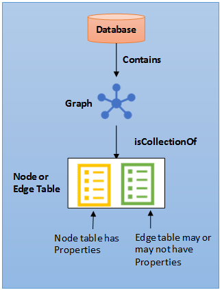
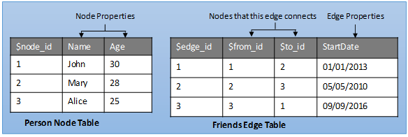

# SQL Graph Architecture  
[!INCLUDE[tsql-appliesto-ss2017-asdb-xxxx-xxx-md](../../includes/tsql-appliesto-ss2017-asdb-xxxx-xxx-md.md)]

Learn how SQL Graph is architected. Knowing the basics will make it easier to understand other SQL Graph articles.
 
## SQL Graph Database
Users can create one graph per database. A graph is a collection of node and edge tables. Node or edge tables can be created under any schema in the database, but they all belong to one logical graph. A node table is collection of similar type of nodes. For example, a Person node table holds all the Person nodes belonging to a graph. Similarly, an edge table is a collection of similar type of edges. For example, a Friends edge table holds all the edges that connect a Person to another Person. Since nodes and edges are stored in tables, most of the operations supported on regular tables are supported on node or edge tables. 
 
 
   

Figure 1: SQL Graph database architecture
 
## Node Table
A node table represents an entity in a graph schema. Every time a node table is created, along with the user-defined columns, an implicit `$node_id` column is created, which uniquely identifies a given node in the database. The values in `$node_id` are automatically generated and are a combination of `object_id` of that node table and an internally generated bigint value. However, when the `$node_id` column is selected, a computed value in the form of a JSON string is displayed. Also, `$node_id` is a pseudo column, that maps to an internal name with hex string in it. When you select `$node_id` from the table, the column name will appear as `$node_id_<hex_string>`. Using pseudo-column names in queries is the recommended way of querying the internal `$node_id` column and using internal name with hex string should be avoided.

It is recommended that users create a unique constraint or index on the `$node_id` column at the time of creation of node table, but if one is not created, a default unique, non-clustered index is automatically created. However, any index on a graph pseudo column is created on the underlying internal columns. That is, an index created on the `$node_id` column, will appear on the internal `graph_id_<hex_string>` column.   

## Edge Table
An edge table represents a relationship in a graph. Edges are always directed and connect two nodes. An edge table enables users to model many-to-many relationships in the graph. An edge table may or may not have any user-defined attributes in it. Every time an edge table is created, along with the user-defined attributes, three implicit columns are created in the edge table:

|Column name    |Description  |
|---   |---  |
|`$edge_id`   |Uniquely identifies a given edge in the database. It is a generated column and the value is a combination of object_id of the edge table and a internally generated bigint value. However, when the `$edge_id` column is selected, a computed value in the form of a JSON string is displayed. `$edge_id` is a pseudo-column, that maps to an internal name with hex string in it. When you select `$edge_id` from the table, the column name will appear as `$edge_id_\<hex_string>`. Using pseudo-column names in queries is the recommended way of querying the internal `$edge_id` column and using internal name with hex string should be avoided. |
|`$from_id`   |Stores the `$node_id` of the node, from where the edge originates.  |
|`$to_id`   |Stores the `$node_id` of the node, at which the edge terminates. |

The nodes that a given edge can connect is governed by the data inserted in the `$from_id` and `$to_id` columns. In the first release, it is not possible to define constraints on the edge table, to restrict it from connecting any two type of nodes. That is, an edge can connect any two nodes in the graph, regardless of their types.

Similar to the `$node_id` column, it is recommended that users create a unique index or constraint on the `$edge_id` column at the time of creation of the edge table, but if one is not created, a default unique, non-clustered index is automatically created on this column. However, any index on a graph pseudo column is created on the underlying internal columns. That is, an index created on the `$edge_id` column, will appear on the internal `graph_id_<hex_string>` column. It is also recommended, for OLTP scenarios, that users create an index on (`$from_id`, `$to_id`) columns, for faster lookups in the direction of the edge.  

Figure 2 shows how node and edge tables are stored in the database. 

   

Figure 2: Node and edge table representation

## Metadata
Use these metadata views to see attributes of a node or edge table.
 
### sys.tables
The following new, bit type, columns will be added to SYS.TABLES. If `is_node` is set to 1, that indicates that the table is a node table and if `is_edge` is set to 1, that indicates that the table is an edge table.
 
|Column Name |Data Type |Description |
|--- |---|--- |
|is_node |bit |1 = this is a node table |
|is_edge |bit |1 = this is an edge table |
 
### sys.columns
The `sys.columns` view contains additional columns `graph_type` and `graph_type_desc`, that indicate the type of the column in node and edge tables.
 
|Column Name |Data Type |Description |
|--- |---|--- |
|graph_type |int |Internal column with a set of values. The values are between 1-8 for graph columns and NULL for others.  |
|graph_type_desc |nvarchar(60)  |internal column with a set of values |
 
The following table lists the valid values for `graph_type` column

|Column Value  |Description  |
|---   |---   |
|1  |GRAPH_ID  |
|2  |GRAPH_ID_COMPUTED  |
|3  |GRAPH_FROM_ID  |
|4  |GRAPH_FROM_OBJ_ID  |
|5  |GRAPH_FROM_ID_COMPUTED  |
|6  |GRAPH_TO_ID  |
|7  |GRAPH_TO_OBJ_ID  |
|8  |GRAPH_TO_ID_COMPUTED  |

`sys.columns` also stores information about implicit columns created in node or edge tables. Following information can be retrieved from sys.columns, however, users cannot select these columns from a node or edge table. 

Implicit columns in a node table

|Column Name	|Data Type	|is_hidden	|Comment  |
|---  |---|---|---  |
|graph_id_\<hex_string>	|BIGINT	|1	|internal `graph_id` column  |
|$node_id_\<hex_string>	|NVARCHAR	|0	|External node `node_id` column  |

Implicit columns in an edge table

|Column Name	|Data Type	|is_hidden	|Comment  |
|---  |---|---|---  |
|graph_id_\<hex_string>	|BIGINT	|1	|internal `graph_id` column  |
|$edge_id_\<hex_string>	|NVARCHAR	|0	|external `edge_id` column  |
|from_obj_id_\<hex_string>	|INT	|1	|internal from node `object_id`  |
|from_id_\<hex_string>	|BIGINT	|1	|Internal from node `graph_id`  |
|$from_id_\<hex_string>	|NVARCHAR	|0	|external from node `node_id`  |
|to_obj_id_\<hex_string>	|INT	|1	|internal to node `object_id`  |
|to_id_\<hex_string>	|BIGINT	|1	|Internal to node `graph_id`  |
|$to_id_\<hex_string>	|NVARCHAR	|0	|external to node `node_id`  |
 
### System Functions
The following built-in functions are added. These will help users extract information from the generated columns. Note that, these methods will not validate the input from the user. If the user specifies an invalid `sys.node_id` the method will extract the appropriate part and return it. For example, OBJECT_ID_FROM_NODE_ID will take a `$node_id` as input and will return the object_id of the table, this node belongs to. 
 
|Built-in	|Description  |
|---  |---  |
|OBJECT_ID_FROM_NODE_ID	|Extract the object_id from a `node_id`  |
|GRAPH_ID_FROM_NODE_ID	|Extract the graph_id from a `node_id`  |
|NODE_ID_FROM_PARTS	|Construct a node_id from an `object_id` and a `graph_id`  |
|OBJECT_ID_FROM_EDGE_ID	|Extract `object_id` from `edge_id`  |
|GRAPH_ID_FROM_EDGE_ID	|Extract identity from `edge_id`  |
|EDGE_ID_FROM_PARTS	|Construct `edge_id` from `object_id` and identity  |

## Transact-SQL reference 
Learn the [!INCLUDE[tsql-md](../../includes/tsql-md.md)] extensions introduced in SQL Server and Azure SQL Database, that enable creating and querying graph objects. The query language extensions help query and traverse the graph using ASCII art syntax.
 
### Data Definition Language (DDL) statements

|Task	|Related Article  |Notes
|---  |---  |---  |
|CREATE TABLE |[CREATE TABLE &#40;Transact-SQL&#41;](../../t-sql/statements/create-table-sql-graph.md)|`CREATE TABLE ` is now extended to support creating a table AS NODE or AS EDGE. Note that an edge table may or may not have any user-defined attributes.  |
|ALTER TABLE	|[ALTER TABLE &#40;Transact-SQL&#41;](../../t-sql/statements/alter-table-transact-sql.md)|Node and edge tables can be altered the same way a relational table is, using the `ALTER TABLE`. Users can add or modify user-defined columns, indexes or constraints. However, altering internal graph columns, like `$node_id` or `$edge_id`, will result in an error.  |
|CREATE INDEX	|[CREATE INDEX &#40;Transact-SQL&#41;](../../t-sql/statements/create-index-transact-sql.md)  |Users can create indexes on pseudo-columns and user-defined columns in node and edge tables. All index types are supported, including clustered and non-clustered columnstore indexes.  |
|CREATE EDGE CONSTRAINTS	|[EDGE CONSTRAINTS &#40;Transact-SQL&#41;](../../relational-databases/tables/graph-edge-constraints.md)  |Users can now create edge constraints on edge tables to enforce specific semantics and also maintain data integrity  |
|DROP TABLE |[DROP TABLE &#40;Transact-SQL&#41;](../../t-sql/statements/drop-table-transact-sql.md)  |Node and edge tables can be dropped the same way a relational table is, using the `DROP TABLE`. However, in this release, there are no constraints to ensure that no edges point to a deleted node and cascaded deletion of edges, upon deletion of a node or node table is not supported. It is recommended that if a node table is dropped, users drop any edges connected to the nodes in that node table manually to maintain the integrity of the graph.  |

### Data Manipulation Language (DML) statements

|Task	|Related Article  |Notes
|---  |---  |---  |
|INSERT |[INSERT &#40;Transact-SQL&#41;](../../t-sql/statements/insert-sql-graph.md)|Inserting into a node table is no different than inserting into a relational table. The values for `$node_id` column is automatically generated. Trying to insert a value in `$node_id` or `$edge_id` column will result in an error. Users must provide values for `$from_id` and `$to_id` columns while inserting into an edge table. `$from_id` and `$to_id` are the `$node_id` values of the nodes that a given edge connects.  |
|DELETE	| [DELETE &#40;Transact-SQL&#41;](../../t-sql/statements/delete-transact-sql.md)|Data from node or edge tables can be deleted in same way as it is deleted from relational tables. However, in this release, there are no constraints to ensure that no edges point to a deleted node and cascaded deletion of edges, upon deletion of a node is not supported. It is recommended that whenever a node is deleted, all the connecting edges to that node are also deleted, to maintain the integrity of the graph.  |
|UPDATE	|[UPDATE &#40;Transact-SQL&#41;](../../t-sql/queries/update-transact-sql.md)  |Values in user-defined columns can be updated using the UPDATE statement. Updating the internal graph columns, `$node_id`, `$edge_id`, `$from_id` and `$to_id` is not allowed.  |
|MERGE |[MERGE &#40;Transact-SQL&#41;](../../t-sql/statements/merge-transact-sql.md)  |`MERGE` statement is supported on a node or edge table.  |

### Query Statements

|Task	|Related Article  |Notes
|---  |---  |---  |
|SELECT |[SELECT &#40;Transact-SQL&#41;](../../t-sql/queries/select-transact-sql.md)|Nodes and edges are stored as tables internally, hence most of the operations supported on a table in SQL Server or Azure SQL Database are supported on the node and edge tables  |
|MATCH	| [MATCH &#40;Transact-SQL&#41;](../../t-sql/queries/match-sql-graph.md)|MATCH built-in is introduced to support pattern matching and traversal through the graph.  |

## Limitations and known issues  
There are certain limitations on node and edge tables in this release:
* Local or global temporary tables cannot be node or edge tables.
* Table types and table variables cannot be declared as a node or edge table. 
* Node and edge tables cannot be created as system-versioned temporal tables.   
* Node and edge tables cannot be memory optimized tables.  
* Users cannot update the `$from_id` and `$to_id` columns of an edge using UPDATE statement. To update the nodes that an edge connects, users will have to insert the new edge pointing to new nodes and delete the previous one.
* Cross database queries on graph objects are not supported. 

## Next Steps
To get started with the new syntax, see [SQL Graph Database - Sample](./sql-graph-sample.md)
 

