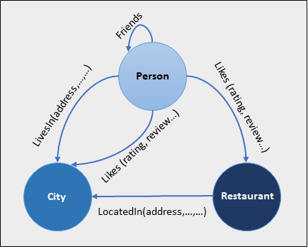

# Create a graph database and run some pattern matching queries using T-SQL
[!INCLUDE[tsql-appliesto-ss2017-asdb-xxxx-xxx-md](../../includes/tsql-appliesto-ss2017-asdb-xxxx-xxx-md.md)]

This sample provides a [!INCLUDE[tsql-md](../../includes/tsql-md.md)] script to create a graph database with nodes and edges and then use the new MATCH clause to match some patterns and traverse through the graph. This sample script will work on both Azure SQL Database and [!INCLUDE[sssqlv14](../../includes/sssqlv14-md.md)]  
 
## Sample Schema  
This sample creates a graph schema, as showed in Figure 1, for a hypothetical social network that has People, Restaurant and City nodes. These nodes are connected to each other using Friends, Likes, LivesIn and LocatedIn edges. 

  
Figure 1: Sample schema with restaurant, city, person nodes and LivesIn, LocatedIn, Likes edges.


## Sample Script
```
-- Create a graph demo database
CREATE DATABASE graphdemo;
go

USE  graphdemo;
go

-- Create NODE tables
CREATE TABLE Person (
  ID INTEGER PRIMARY KEY, 
  name VARCHAR(100)
) AS NODE;

CREATE TABLE Restaurant (
  ID INTEGER NOT NULL, 
  name VARCHAR(100), 
  city VARCHAR(100)
) AS NODE;

CREATE TABLE City (
  ID INTEGER PRIMARY KEY, 
  name VARCHAR(100), 
  stateName VARCHAR(100)
) AS NODE;

-- Create EDGE tables. 
CREATE TABLE likes (rating INTEGER) AS EDGE;
CREATE TABLE friendOf AS EDGE;
CREATE TABLE livesIn AS EDGE;
CREATE TABLE locatedIn AS EDGE;

-- Insert data into node tables. Inserting into a node table is same as inserting into a regular table
INSERT INTO Person VALUES (1,'John');
INSERT INTO Person VALUES (2,'Mary');
INSERT INTO Person VALUES (3,'Alice');
INSERT INTO Person VALUES (4,'Jacob');
INSERT INTO Person VALUES (5,'Julie');

INSERT INTO Restaurant VALUES (1,'Taco Dell','Bellevue');
INSERT INTO Restaurant VALUES (2,'Ginger and Spice','Seattle');
INSERT INTO Restaurant VALUES (3,'Noodle Land', 'Redmond');

INSERT INTO City VALUES (1,'Bellevue','wa');
INSERT INTO City VALUES (2,'Seattle','wa');
INSERT INTO City VALUES (3,'Redmond','wa');

-- Insert into edge table. While inserting into an edge table, 
-- you need to provide the $node_id from $from_id and $to_id columns.
INSERT INTO likes VALUES ((SELECT $node_id FROM Person WHERE id = 1), 
       (SELECT $node_id FROM Restaurant WHERE id = 1),9);
INSERT INTO likes VALUES ((SELECT $node_id FROM Person WHERE id = 2), 
      (SELECT $node_id FROM Restaurant WHERE id = 2),9);
INSERT INTO likes VALUES ((SELECT $node_id FROM Person WHERE id = 3), 
      (SELECT $node_id FROM Restaurant WHERE id = 3),9);
INSERT INTO likes VALUES ((SELECT $node_id FROM Person WHERE id = 4), 
      (SELECT $node_id FROM Restaurant WHERE id = 3),9);
INSERT INTO likes VALUES ((SELECT $node_id FROM Person WHERE id = 5), 
      (SELECT $node_id FROM Restaurant WHERE id = 3),9);

INSERT INTO livesIn VALUES ((SELECT $node_id FROM Person WHERE id = 1),
      (SELECT $node_id FROM City WHERE id = 1));
INSERT INTO livesIn VALUES ((SELECT $node_id FROM Person WHERE id = 2),
      (SELECT $node_id FROM City WHERE id = 2));
INSERT INTO livesIn VALUES ((SELECT $node_id FROM Person WHERE id = 3),
      (SELECT $node_id FROM City WHERE id = 3));
INSERT INTO livesIn VALUES ((SELECT $node_id FROM Person WHERE id = 4),
      (SELECT $node_id FROM City WHERE id = 3));
INSERT INTO livesIn VALUES ((SELECT $node_id FROM Person WHERE id = 5),
      (SELECT $node_id FROM City WHERE id = 1));

INSERT INTO locatedIn VALUES ((SELECT $node_id FROM Restaurant WHERE id = 1),
      (SELECT $node_id FROM City WHERE id =1));
INSERT INTO locatedIn VALUES ((SELECT $node_id FROM Restaurant WHERE id = 2),
      (SELECT $node_id FROM City WHERE id =2));
INSERT INTO locatedIn VALUES ((SELECT $node_id FROM Restaurant WHERE id = 3),
      (SELECT $node_id FROM City WHERE id =3));

-- Insert data into the friendof edge.
INSERT INTO friendof VALUES ((SELECT $NODE_ID FROM person WHERE ID = 1), (SELECT $NODE_ID FROM person WHERE ID = 2));
INSERT INTO friendof VALUES ((SELECT $NODE_ID FROM person WHERE ID = 2), (SELECT $NODE_ID FROM person WHERE ID = 3));
INSERT INTO friendof VALUES ((SELECT $NODE_ID FROM person WHERE ID = 3), (SELECT $NODE_ID FROM person WHERE ID = 1));
INSERT INTO friendof VALUES ((SELECT $NODE_ID FROM person WHERE ID = 4), (SELECT $NODE_ID FROM person WHERE ID = 2));
INSERT INTO friendof VALUES ((SELECT $NODE_ID FROM person WHERE ID = 5), (SELECT $NODE_ID FROM person WHERE ID = 4));


-- Find Restaurants that John likes
SELECT Restaurant.name
FROM Person, likes, Restaurant
WHERE MATCH (Person-(likes)->Restaurant)
AND Person.name = 'John';

-- Find Restaurants that John's friends like
SELECT Restaurant.name 
FROM Person person1, Person person2, likes, friendOf, Restaurant
WHERE MATCH(person1-(friendOf)->person2-(likes)->Restaurant)
AND person1.name='John';

-- Find people who like a restaurant in the same city they live in
SELECT Person.name
FROM Person, likes, Restaurant, livesIn, City, locatedIn
WHERE MATCH (Person-(likes)->Restaurant-(locatedIn)->City AND Person-(livesIn)->City);

```

## Clean Up  
Clean up the schema and database created for the sample.
```
USE graphdemo;
go

DROP TABLE IF EXISTS likes;
DROP TABLE IF EXISTS Person;
DROP TABLE IF EXISTS Restaurant;
DROP TABLE IF EXISTS City;
DROP TABLE IF EXISTS friendOf;
DROP TABLE IF EXISTS livesIn;
DROP TABLE IF EXISTS locatedIn;

USE master;
go
DROP DATABASE graphdemo;
go


```

## Script explanation  
This script uses the new T-SQL syntax to create node and edge tables. Shows how to insert data into node and edge tables using `INSERT` statement and also shows how to use `MATCH` clause for pattern matching and navigation.

|Command	|Notes
|---  |---  |
|[CREATE TABLE &#40;Transact-SQL&#41;](../../t-sql/statements/create-table-sql-graph.md)  |Create graph node or edge table  |
|[INSERT &#40;Transact-SQL&#41;](../../t-sql/statements/insert-sql-graph.md)  |Insert into a node or edge table  |
|[MATCH &#40;Transact-SQL&#41;](../../t-sql/queries/match-sql-graph.md)  |Use MATCH to match a pattern or traverse through the graph  |
