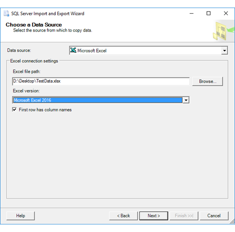
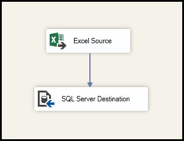

# Import data from Excel to SQL Server or Azure SQL Database
[!INCLUDE[appliesto-ss-asdb-xxxx-xxx-md](../../includes/appliesto-ss-asdb-xxxx-xxx-md.md)]

There are several ways to import data from Excel files to SQL Server or to Azure SQL Database. Some methods let you import data in a single step directly from Excel files; other methods require you to export your Excel data as text before you can import it. This article summarizes the frequently used methods and provides links for more detailed information.

## List of methods

-   You can import data in a single step, directly from Excel to SQL, by using one of the following tools:
    -   The [SQL Server Import and Export Wizard](#wiz)
    -   [SQL Server Integration Services (SSIS)](#ssis)
    -   The [OPENROWSET](#openrowset) function
-   You can import data in two steps, by exporting your data from Excel as text, and then using one of the following tools to import the text file:
    -   The [Import Flat File Wizard](#import-wiz)
    -   The [BULK INSERT](#bulk-insert) statement
    -   [BCP](#bcp)
    -   The [Copy Wizard (Azure Data Factory)](#adf-wiz)
    -   [Azure Data Factory](#adf)

If you want to import multiple worksheets from an Excel workbook, you typically have to run each of these tools once for each sheet.

A complete description of complex tools and services like SSIS or Azure Data Factory is beyond the scope of this list. To learn more about the solution that interests you, follow the links provided for more info.

> [!IMPORTANT]
> For detailed info about connecting to Excel files, and about limitations and known issues for loading data from or to Excel files, see [Load data from or to Excel with SQL Server Integration Services (SSIS)](../../integration-services/load-data-to-from-excel-with-ssis.md).

## <a name="wiz"></a> SQL Server Import and Export Wizard

Import data directly from Excel files by stepping through the pages of the SQL Server Import and Export Wizard. Optionally, save the settings as a SQL Server Integration Services (SSIS) package that you can customize and reuse later.

To learn how to launch the wizard, see [Start the SQL Server Import and Export Wizard](../../integration-services/import-export-data/start-the-sql-server-import-and-export-wizard.md).

For an example of using the wizard to import from Excel to SQL Server, see [Get started with this simple example of the Import and Export Wizard](../../integration-services/import-export-data/get-started-with-this-simple-example-of-the-import-and-export-wizard.md).



## <a name="ssis"></a> SQL Server Integration Services (SSIS)

If you're familiar with SSIS and don't want to run the SQL Server Import and Export Wizard, create an SSIS package that uses the Excel Source and the SQL Server Destination in the data flow.

For more info about these SSIS components, see the following topics:
-   [Excel Source](../../integration-services/data-flow/excel-source.md)
-   [SQL Server Destination](../../integration-services/data-flow/sql-server-destination.md)

To start learning how to build SSIS packages, see the tutorial [How to Create an ETL Package](../../integration-services/ssis-how-to-create-an-etl-package.md).



## <a name="openrowset"></a> OPENROWSET and linked servers

> [!NOTE]
> In Azure, the OPENROWSET and OPENDATASOURCE functions are available only on SQL Database Managed Instance.

> [!NOTE]
> The ACE provider (formerly the Jet provider) that connects to Excel data sources is intended for interactive client-side use. If you use the ACE provider on the server, especially in automated processes or processes running in parallel, you may see unexpected results.

### Distributed queries

Import data directly from Excel files by using the Transact-SQL `OPENROWSET` or `OPENDATASOURCE` function. This usage is called a *distributed query*.

Before you can run a distributed query, you have to enable the `ad hoc distributed queries` server configuration option, as shown in the following example. For more info, see [ad hoc distributed queries Server Configuration Option](../../database-engine/configure-windows/ad-hoc-distributed-queries-server-configuration-option.md).

```sql
sp_configure 'show advanced options', 1;
RECONFIGURE;
GO
sp_configure 'Ad Hoc Distributed Queries', 1;
RECONFIGURE;
GO
```

The following code sample uses `OPENROWSET` to import the data from the Excel `Data` worksheet into a new database table.

```sql
USE ImportFromExcel;
GO
SELECT * INTO Data_dq
FROM OPENROWSET('Microsoft.ACE.OLEDB.12.0',
    'Excel 12.0; Database=D:\Desktop\Data.xlsx', [Data$]);
GO
```

Here's the same example with `OPENDATASOURCE`.

```sql
USE ImportFromExcel;
GO
SELECT * INTO Data_dq
FROM OPENDATASOURCE('Microsoft.ACE.OLEDB.12.0',
    'Data Source=D:\Desktop\Data.xlsx;Extended Properties=Excel 12.0')...[Data$];
GO
```

To *append* the imported data to an *existing* table instead of creating a new table, use the `INSERT INTO ... SELECT ... FROM ...` syntax instead of the `SELECT ... INTO ... FROM ...` syntax used in the preceding examples.

To query the Excel data without importing it, just use the standard `SELECT ... FROM ...` syntax.

For more info about distributed queries, see the following topics:
-   [Distributed Queries](https://msdn.microsoft.com/library/ms188721(v=sql.105).aspx). (Distributed queries are still supported in SQL Server 2016, but the documentation for this feature has not been updated.)
-   [OPENROWSET](../../t-sql/functions/openrowset-transact-sql.md)
-   [OPENDATASOURCE](../../t-sql/functions/openquery-transact-sql.md)

### Linked servers

You can also configure a persistent connection to the Excel file as a *linked server*. The following example imports the data from the `Data` worksheet on the existing Excel linked server `EXCELLINK` into a new database table named `Data_ls`.

```sql
USE ImportFromExcel;
GO
SELECT * INTO Data_ls FROM EXCELLINK...[Data$];
GO
```

You can create a linked server from SQL Server Management Studio, or by running the system stored procedure `sp_addlinkedserver`, as shown in the following example.

```sql
DECLARE @RC int

DECLARE @server     nvarchar(128)
DECLARE @srvproduct nvarchar(128)
DECLARE @provider   nvarchar(128)
DECLARE @datasrc    nvarchar(4000)
DECLARE @location   nvarchar(4000)
DECLARE @provstr    nvarchar(4000)
DECLARE @catalog    nvarchar(128)

-- Set parameter values
SET @server =     'EXCELLINK'
SET @srvproduct = 'Excel'
SET @provider =   'Microsoft.ACE.OLEDB.12.0'
SET @datasrc =    'D:\Desktop\Data.xlsx'
SET @provstr =    'Excel 12.0'

EXEC @RC = [master].[dbo].[sp_addlinkedserver] @server, @srvproduct, @provider,
@datasrc, @location, @provstr, @catalog
```

For more info about linked servers, see the following topics:
-   [Create Linked Servers](../../relational-databases/linked-servers/create-linked-servers-sql-server-database-engine.md)
-   [OPENQUERY](../../t-sql/functions/openquery-transact-sql.md)

For more examples and info about both linked servers and distributed queries, see the following topics:
-   [How to use Excel with SQL Server linked servers and distributed queries](https://support.microsoft.com/help/306397/how-to-use-excel-with-sql-server-linked-servers-and-distributed-queries)
-   [How to import data from Excel to SQL Server](https://support.microsoft.com/help/321686/how-to-import-data-from-excel-to-sql-server)

## <a name="prereq"></a> Prerequisite - Save Excel data as text
To use the rest of the methods described on this page - the BULK INSERT statement, the BCP tool, or Azure Data Factory - first you have to export your Excel data to a text file.

In Excel, select **File | Save As** and then select **Text (Tab delimited) (\*.txt)** or **CSV (Comma delimited) (\*.csv)** as the destination file type.

If you want to export multiple worksheets from the workbook, select each sheet and then repeat this procedure. The **Save as** command exports only the active sheet.

> [!TIP]
> For best results with data importing tools, save sheets that contain only the column headers and the rows of data. If the saved data contains page titles, blank lines, notes, and so forth, you may see unexpected results later when you import the data.

## <a name="import-wiz"></a> The Import Flat File Wizard

Import data saved as text files by stepping through the pages of the Import Flat File Wizard.

As described previously in the [Prerequisite](#prereq) section, you have to export your Excel data as text before you can use the Import Flat File Wizard to import it.

For more info about the Import Flat File Wizard, see [Import Flat File to SQL Wizard](import-flat-file-wizard.md).

## <a name="bulk-insert"></a> BULK INSERT command

`BULK INSERT` is a Transact-SQL command that you can run from SQL Server Management Studio. The following example loads the data from the `Data.csv` comma-delimited file into an existing database table.

As described previously in the [Prerequisite](#prereq) section, you have to export your Excel data as text before you can use BULK INSERT to import it. BULK INSERT can't read Excel files directly.

```sql
USE ImportFromExcel;
GO
BULK INSERT Data_bi FROM 'D:\Desktop\data.csv'
   WITH (
      FIELDTERMINATOR = ',',
      ROWTERMINATOR = '\n'
);
GO
```

For more info, see the following topics:
-   [Import Bulk Data by Using BULK INSERT or OPENROWSET(BULK...)](../../relational-databases/import-export/import-bulk-data-by-using-bulk-insert-or-openrowset-bulk-sql-server.md)
-   [BULK INSERT](../../t-sql/statements/bulk-insert-transact-sql.md)

## <a name="bcp"></a> BCP tool

BCP is a program that you run from the command prompt. The following example loads the data from the `Data.csv` comma-delimited file into the existing `Data_bcp` database table.

As described previously in the [Prerequisite](#prereq) section, you have to export your Excel data as text before you can use BCP to import it. BCP can't read Excel files directly.

```sql
bcp.exe ImportFromExcel..Data_bcp in "D:\Desktop\data.csv" -T -c -t ,
```

For more info about BCP, see the following topics:
-   [Import and Export Bulk Data by Using the bcp Utility](../../relational-databases/import-export/import-and-export-bulk-data-by-using-the-bcp-utility-sql-server.md)
-   [bcp Utility](../../tools/bcp-utility.md)
-   [Prepare Data for Bulk Export or Import](../../relational-databases/import-export/prepare-data-for-bulk-export-or-import-sql-server.md)

## <a name="adf-wiz"></a> Copy Wizard (Azure Data Factory)
Import data saved as text files by stepping through the pages of the Azure Data Factory Copy Wizard.

As described previously in the [Prerequisite](#prereq) section, you have to export your Excel data as text before you can use Azure Data Factory to import it. Data Factory can't read Excel files directly.

For more info about the Copy Wizard, see the following topics:
-   [Data Factory Copy Wizard](https://docs.microsoft.com/azure/data-factory/data-factory-azure-copy-wizard)
-   [Tutorial: Create a pipeline with Copy Activity using Data Factory Copy Wizard](https://docs.microsoft.com/azure/data-factory/data-factory-copy-data-wizard-tutorial).

## <a name="adf"></a> Azure Data Factory
If you're familiar with Azure Data Factory and don't want to run the Copy Wizard, create a pipeline with a Copy activity that copies from the text file to SQL Server or to Azure SQL Database.

As described previously in the [Prerequisite](#prereq) section, you have to export your Excel data as text before you can use Azure Data Factory to import it. Data Factory can't read Excel files directly.

For more info about using these Data Factory sources and sinks, see the following topics:
-   [File system](https://docs.microsoft.com/azure/data-factory/data-factory-onprem-file-system-connector)
-   [SQL Server](https://docs.microsoft.com/azure/data-factory/data-factory-sqlserver-connector)
-   [Azure SQL Database](https://docs.microsoft.com/azure/data-factory/data-factory-azure-sql-connector)

To start learning how to copy data with Azure data factory, see the following topics:
-   [Move data by using Copy Activity](https://docs.microsoft.com/azure/data-factory/data-factory-data-movement-activities)
-   [Tutorial: Create a pipeline with Copy Activity using Azure portal](https://docs.microsoft.com/azure/data-factory/data-factory-copy-data-from-azure-blob-storage-to-sql-database)

## See Also
[Import data from Excel or export data to Excel with SQL Server Integration Services (SSIS)](../../integration-services/load-data-to-from-excel-with-ssis.md)
