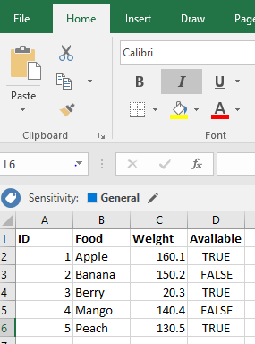

# Import Flat File to SQL Wizard
[!INCLUDE[appliesto-ss-asdb-xxxx-xxx-md](../../includes/appliesto-ss-asdb-xxxx-xxx-md.md)]
> For content related to the Import and Export Wizard, see [SQL Server Import and Export Wizard](https://docs.microsoft.com/sql/integration-services/import-export-data/import-and-export-data-with-the-sql-server-import-and-export-wizard).

Import Flat File Wizard is a simple way to copy data from a flat file (.csv, .txt) to a destination. This overview describes the reasons for using this wizard, how to find this wizard, and a simple example to follow.

## Why would I use this wizard?
This wizard was created to improve the current import experience leveraging an intelligent framework known as Program Synthesis using Examples ([PROSE](https://microsoft.github.io/prose/)). For a user without specialized domain knowledge, importing data can often be a complex, error prone, and tedious task. This wizard streamlines the import process as simple as selecting an input file and unique table name, and the PROSE framework handles the rest.

PROSE analyzes data patterns in your input file to infer column names, types, delimiters, and more. This framework learns the structure of the file and does all of the hard work so users don't have to.

To further understand the user experience improvement of the Import Flat File Wizard, check out this video:

> [!VIDEO https://channel9.msdn.com/Shows/Data-Exposed/Introducing-the-new-Import-Flat-File-Wizard-in-SSMS-173/player]

## Prerequisites
This feature is only available on SQL Server Management Studio (SSMS) v17.3 or later. Make sure you are using the latest version. You can find the latest version [here.](https://docs.microsoft.com/sql/ssms/download-sql-server-management-studio-ssms)
 
## Getting Started
To access the Import Flat File Wizard, follow these steps:

1. Open **SQL Server Management Studio**.
2. Connect to an instance of the SQL Server Database Engine or localhost.
3. Expand **Databases**, right-click a database (test in the example below), point to **Tasks**, and click **Import Flat File** above Import Data.

To learn more about the different functions of the wizard, refer to the following tutorial:

## Tutorial
For the purposes of this tutorial, feel free to use your own flat file. Otherwise, this tutorial is using the following CSV from Excel, which you are free to copy. If you use this CSV, title it **example.csv** and make sure to save it as a csv in an easy location such as your desktop.

### Step 1: Access Wizard and Intro Page
Access the wizard as described [here](#started).

The first page of the wizard is the welcome page. If you do not want to see this page again, feel free to click **Do not show this starting page again.**

### Step 2: Specify Input File
Click browse to select your input file. At default, the wizard searches for .csv and .txt files. 

The new table name should be unique, and the wizard does not allow you to move further if not.

### Step 3: Preview Data
The wizard generates a preview that you can view for the first 50 rows. If there are any problems, click cancel, otherwise proceed to the next page.

### Step 4: Modify Columns
The wizard identifies what it believes are the correct column names, data types, etc. Here is where you can edit the fields if they are incorrect (for example, data type should be a float instead of an int).

Proceed when ready.

### Step 5: Summary
This is simply a summary page displaying your current configuration. If there are issues, you can go back to previous sections. Otherwise, clicking finish attempts the import process.

### Step 6: Results
This page indicates whether the import was successful. If a green check mark appears, it was a success, otherwise you may need to review your configuration or input file for any errors.

## Learn More

Learn more about the wizard.
 
- **Learn more about importing other sources.** If you are looking to import more than flat files, see [SQL Server Import and Export Wizard](https://docs.microsoft.com/sql/integration-services/import-export-data/import-and-export-data-with-the-sql-server-import-and-export-wizard).
- **Learn more about connecting to flat file sources.** If you are looking for more information about connecting to flat file sources, see [Connect to a Flat File Data Source](https://docs.microsoft.com/sql/integration-services/import-export-data/connect-to-a-flat-file-data-source-sql-server-import-and-export-wizard).
- **Learn more about PROSE.** If you are looking for an overview of the intelligent framework used by this wizard, see [PROSE SDK](https://microsoft.github.io/prose/).

