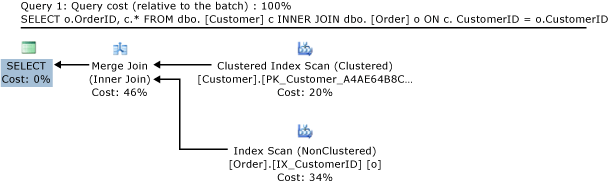
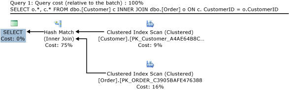
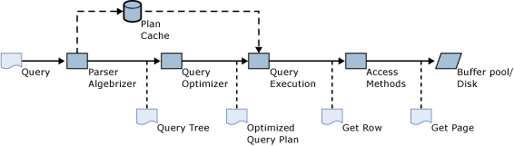
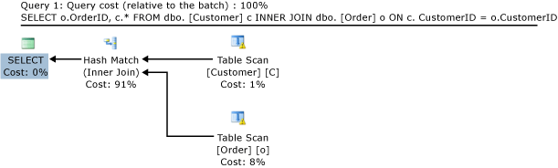
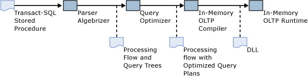
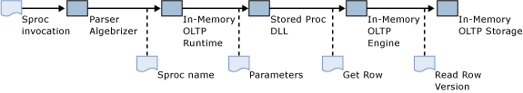
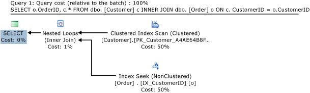

# A Guide to Query Processing for Memory-Optimized Tables
[!INCLUDE [SQL Server Azure SQL Database Azure SQL Managed Instance](../../includes/applies-to-version/sql-asdb-asdbmi.md)]

  In-Memory OLTP introduces memory-optimized tables and natively compiled stored procedures in [!INCLUDE[ssNoVersion](../../includes/ssnoversion-md.md)]. This article gives an overview of query processing for both memory-optimized tables and natively compiled stored procedures.  
  
 The document explains how queries on memory-optimized tables are compiled and executed, including:  
  
-   The query processing pipeline in [!INCLUDE[ssNoVersion](../../includes/ssnoversion-md.md)] for disk-based tables.  
  
-   Query optimization; the role of statistics on memory-optimized tables as well as guidelines for troubleshooting bad query plans.  
  
-   The use of interpreted [!INCLUDE[tsql](../../includes/tsql-md.md)] to access memory-optimized tables.  
  
-   Considerations about query optimization for memory-optimized table access.  
  
-   Natively compiled stored procedure compilation and processing.  
  
-   Statistics that are used for cost estimation by the optimizer.  
  
-   Ways to fix bad query plans.  
  
## Example Query  
 The following example will be used to illustrate the query processing concepts discussed in this article.  
  
 We consider two tables, Customer and Order. The following [!INCLUDE[tsql](../../includes/tsql-md.md)] script contains the definitions for these two tables and associated indexes, in their (traditional) disk-based form:  
  
```sql  
CREATE TABLE dbo.[Customer] (  
  CustomerID nchar (5) NOT NULL PRIMARY KEY,  
  ContactName nvarchar (30) NOT NULL   
)  
GO  
  
CREATE TABLE dbo.[Order] (  
  OrderID int NOT NULL PRIMARY KEY,  
  CustomerID nchar (5) NOT NULL,  
  OrderDate date NOT NULL  
)  
GO  
CREATE INDEX IX_CustomerID ON dbo.[Order](CustomerID)  
GO  
CREATE INDEX IX_OrderDate ON dbo.[Order](OrderDate)  
GO  
```  
  
 For constructing the query plans shown in this article, the two tables were populated with sample data from the Northwind sample database, which you can download from [Northwind and pubs Sample Databases for SQL Server 2000](https://github.com/Microsoft/sql-server-samples/tree/master/samples/databases/northwind-pubs).  
  
 Consider the following query, which joins the tables Customer and Order and returns the ID of the order and the associated customer information:  
  
```sql  
SELECT o.OrderID, c.* FROM dbo.[Customer] c INNER JOIN dbo.[Order] o ON c.CustomerID = o.CustomerID  
```  
  
 The estimated execution plan as displayed by [!INCLUDE[ssManStudioFull](../../includes/ssmanstudiofull-md.md)] is as follows  
  
   
Query plan for join of disk-based tables.  
  
 About this query plan:  
  
-   The rows from the Customer table are retrieved from the clustered index, which is the primary data structure and has the full table data.  
  
-   Data from the Order table is retrieved using the nonclustered index on the CustomerID column. This index contains both the CustomerID column, which is used for the join, and the primary key column OrderID, which is returned to the user. Returning additional columns from the Order table would require lookups in the clustered index for the Order table.  
  
-   The logical operator **Inner Join** is implemented by the physical operator **Merge Join**. The other physical join types are **Nested Loops** and **Hash Join**. The **Merge Join** operator takes advantage of the fact that both indexes are sorted on the join column CustomerID.  
  
 Consider a slight variation on this query, which returns all columns from the Order table, not only OrderID column:  
  
```sql  
SELECT o.*, c.* FROM dbo.[Customer] c INNER JOIN dbo.[Order] o ON c.CustomerID = o.CustomerID  
```  
  
 The estimated plan for this query is:  
  
   
Query plan for a hash join of disk-based tables.  
  
 In this query, rows from the Order table are retrieved using the clustered index. The **Hash Match** physical operator is now used for the **Inner Join**. The clustered index on Order is not sorted on CustomerID, and so a **Merge Join** would require a sort operator, which would affect performance. Note the relative cost of the **Hash Match** operator (75%) compared with the cost of the **Merge Join** operator in the previous example (46%). The optimizer would have considered the **Hash Match** operator also in the previous example, but concluded that the **Merge Join** operator gave better performance.  
  
## [!INCLUDE[ssNoVersion](../../includes/ssnoversion-md.md)] Query Processing for Disk-Based Tables  
 The following diagram outlines the query processing flow in [!INCLUDE[ssNoVersion](../../includes/ssnoversion-md.md)] for ad hoc queries:  
  
   
SQL Server query processing pipeline.  
  
 In this scenario:  
  
1.  The user issues a query.  
  
2.  The parser and algebrizer construct a query tree with logical operators based on the [!INCLUDE[tsql](../../includes/tsql-md.md)] text submitted by the user.  
  
3.  The optimizer creates an optimized query plan containing physical operators (for example, nested-loops join). After optimization, the plan may be stored in the plan cache. This step is bypassed if the plan cache already contains a plan for this query.  
  
4.  The query execution engine processes an interpretation of the query plan.  
  
5.  For each index seek, index scan, and table scan operator, the execution engine requests rows from the respective index and table structures from Access Methods.  
  
6.  Access Methods retrieves the rows from the index and data pages in the buffer pool and loads pages from disk into the buffer pool as needed.  

 For the first example query, the execution engine requests rows in the clustered index on Customer and the nonclustered index on Order from Access Methods. Access Methods traverses the B-tree index structures to retrieve the requested rows. In this case all rows are retrieved as the plan calls for full index scans.  

[!INCLUDE [sql-b-tree](../../includes/sql-b-tree.md)]
  
## Interpreted [!INCLUDE[tsql](../../includes/tsql-md.md)] Access to Memory-Optimized Tables  
 [!INCLUDE[tsql](../../includes/tsql-md.md)] ad hoc batches and stored procedures are also referred to as interpreted [!INCLUDE[tsql](../../includes/tsql-md.md)]. Interpreted refers to the fact that the query plan is interpreted by the query execution engine for each operator in the query plan. The execution engine reads the operator and its parameters and performs the operation.  
  
 Interpreted [!INCLUDE[tsql](../../includes/tsql-md.md)] can be used to access both memory-optimized and disk-based tables. The following figure illustrates query processing for interpreted [!INCLUDE[tsql](../../includes/tsql-md.md)] access to memory-optimized tables:  
  
   
Query processing pipeline for interpreted Transact-SQL access to memory-optimized tables.  
  
 As illustrated by the figure, the query processing pipeline remains mostly unchanged:  
  
-   The parser and algebrizer construct the query tree.  
  
-   The optimizer creates the execution plan.  
  
-   The query execution engine interprets the execution plan.  
  
 The main difference with the traditional query processing pipeline (figure 2) is that rows for memory-optimized tables are not retrieved from the buffer pool using Access Methods. Instead, rows are retrieved from the in-memory data structures through the In-Memory OLTP engine. Differences in data structures cause the optimizer to pick different plans in some cases, as illustrated by the following example.  
  
 The following [!INCLUDE[tsql](../../includes/tsql-md.md)] script contains memory-optimized versions of the Order and Customer tables, using hash indexes:  
  
```sql  
CREATE TABLE dbo.[Customer] (  
  CustomerID nchar (5) NOT NULL PRIMARY KEY NONCLUSTERED,  
  ContactName nvarchar (30) NOT NULL   
) WITH (MEMORY_OPTIMIZED=ON)  
GO  
  
CREATE TABLE dbo.[Order] (  
  OrderID int NOT NULL PRIMARY KEY NONCLUSTERED,  
  CustomerID nchar (5) NOT NULL INDEX IX_CustomerID HASH(CustomerID) WITH (BUCKET_COUNT=100000),  
  OrderDate date NOT NULL INDEX IX_OrderDate HASH(OrderDate) WITH (BUCKET_COUNT=100000)  
) WITH (MEMORY_OPTIMIZED=ON)  
GO  
```  
  
 Consider the same query executed on memory-optimized tables:  
  
```sql  
SELECT o.OrderID, c.* FROM dbo.[Customer] c INNER JOIN dbo.[Order] o ON c.CustomerID = o.CustomerID  
```  
  
 The estimated plan is as follows:  
  
   
Query plan for join of memory-optimized tables.  
  
 Observe the following differences with the plan for the same query on disk-based tables (figure 1):  
  
-   This plan contains a table scan rather than a clustered index scan for the table Customer:  
  
    -   The definition of the table does not contain a clustered index.  
  
    -   Clustered indexes are not supported with memory-optimized tables. Instead, every memory-optimized table must have at least one nonclustered index and all indexes on memory-optimized tables can efficiently access all columns in the table without having to store them in the index or refer to a clustered index.  
  
-   This plan contains a **Hash Match** rather than a **Merge Join**. The indexes on both the Order and the Customer table are hash indexes, and are thus not ordered. A **Merge Join** would require sort operators that would decrease performance.  
  
## Natively Compiled Stored Procedures  
 Natively compiled stored procedures are [!INCLUDE[tsql](../../includes/tsql-md.md)] stored procedures compiled to machine code, rather than interpreted by the query execution engine. The following script creates a natively compiled stored procedure that runs the example query (from the Example Query section).  
  
```sql  
CREATE PROCEDURE usp_SampleJoin  
WITH NATIVE_COMPILATION, SCHEMABINDING, EXECUTE AS OWNER  
AS BEGIN ATOMIC WITH   
(  TRANSACTION ISOLATION LEVEL = SNAPSHOT,  
  LANGUAGE = 'english')  
  
  SELECT o.OrderID, c.CustomerID, c.ContactName   
FROM dbo.[Order] o INNER JOIN dbo.[Customer] c   
  ON c.CustomerID = o.CustomerID  
  
END  
```  
  
 Natively compiled stored procedures are compiled at create time, whereas interpreted stored procedures are compiled at first execution time. (A portion of the compilation, particularly parsing and algebrization, take place at create. However, for interpreted stored procedures, optimization of the query plans takes place at first execution.) The recompilation logic is similar. Natively compiled stored procedures are recompiled on first execution of the procedure if the server is restarted. Interpreted stored procedures are recompiled if the plan is no longer in the plan cache. The following table summarizes compilation and recompilation cases for both natively compiled and interpreted stored procedures:  
  
|Compilation type|Natively compiled|Interpreted|  
|-|-----------------------|-----------------|  
|Initial compilation|At create time.|At first execution.|  
|Automatic recompilation|Upon first execution of the procedure after a database or server restart.|On server restart. Or, eviction from the plan cache, usually based on schema or stats changes, or memory pressure.|  
|Manual recompilation|Use **sp_recompile**.|Use **sp_recompile**. You can manually evict the plan from the cache, for example through DBCC FREEPROCCACHE. You can also create the stored procedure WITH RECOMPILE and the stored procedure will be recompiled at every execution.|  
  
### Compilation and Query Processing  
 The following diagram illustrates the compilation process for natively compiled stored procedures:  
  
   
Native compilation of stored procedures.  
  
 The process is described as,  
  
1.  The user issues a **CREATE PROCEDURE** statement to [!INCLUDE[ssNoVersion](../../includes/ssnoversion-md.md)].  
  
2.  The parser and algebrizer create the processing flow for the procedure, as well as query trees for the [!INCLUDE[tsql](../../includes/tsql-md.md)] queries in the stored procedure.  
  
3.  The optimizer creates optimized query execution plans for all the queries in the stored procedure.  
  
4.  The In-Memory OLTP compiler takes the processing flow with the embedded optimized query plans and generates a DLL that contains the machine code for executing the stored procedure.  
  
5.  The generated DLL is loaded into memory.  
  
 Invocation of a natively compiled stored procedure translates to calling a function in the DLL.  
  
   
Execution of natively compiled stored procedures.  
  
 Invocation of a natively compiled stored procedure is described as follows:  
  
1.  The user issues an **EXEC** _usp_myproc_ statement.  
  
2.  The parser extracts the name and stored procedure parameters.  
  
     If the statement was prepared, for example using **sp_prep_exec**, the parser does not need to extract the procedure name and parameters at execution time.  
  
3.  The In-Memory OLTP runtime locates the DLL entry point for the stored procedure.  
  
4.  The machine code in the DLL is executed and the results of are returned to the client.  
  
 **Parameter sniffing**  
  
 Interpreted [!INCLUDE[tsql](../../includes/tsql-md.md)] stored procedures are compiled at first execution, in contrast to natively compiled stored procedures, which are compiled at create time. When interpreted stored procedures are compiled at invocation, the values of the parameters supplied for this invocation are used by the optimizer when generating the execution plan. This use of parameters during compilation is called parameter sniffing.  
  
 Parameter sniffing is not used for compiling natively compiled stored procedures. All parameters to the stored procedure are considered to have UNKNOWN values. Like interpreted stored procedures, natively compiled stored procedures also support the **OPTIMIZE FOR** hint. For more information, see [Query Hints &#40;Transact-SQL&#41;](../../t-sql/queries/hints-transact-sql-query.md).  
  
### Retrieving a Query Execution Plan for Natively Compiled Stored Procedures  
 The query execution plan for a natively compiled stored procedure can be retrieved using **Estimated Execution Plan** in [!INCLUDE[ssManStudio](../../includes/ssmanstudio-md.md)], or using the SHOWPLAN_XML option in [!INCLUDE[tsql](../../includes/tsql-md.md)]. For example:  
  
```sql  
SET SHOWPLAN_XML ON  
GO  
EXEC dbo.usp_myproc  
GO  
SET SHOWPLAN_XML OFF  
GO  
```  
  
 The execution plan generated by the query optimizer consists of a tree with query operators on the nodes and leaves of the tree. The structure of the tree determines the interaction (the flow of rows from one operator to another) between the operators. In the graphical view of [!INCLUDE[ssManStudioFull](../../includes/ssmanstudiofull-md.md)], the flow is from right to left. For example, the query plan in figure 1 contains two index scan operators, which supplies rows to a merge join operator. The merge join operator supplies rows to a select operator. The select operator, finally, returns the rows to the client.  
  
### Query Operators in Natively Compiled Stored Procedures  
 The following table summarizes the query operators supported inside natively compiled stored procedures:  
  
|Operator|Sample query|Notes|  
|--------------|------------------|-----------|  
|SELECT|`SELECT OrderID FROM dbo.[Order]`||  
|INSERT|`INSERT dbo.Customer VALUES ('abc', 'def')`||  
|UPDATE|`UPDATE dbo.Customer SET ContactName='ghi' WHERE CustomerID='abc'`||  
|DELETE|`DELETE dbo.Customer WHERE CustomerID='abc'`||  
|Compute Scalar|`SELECT OrderID+1 FROM dbo.[Order]`|This operator is used both for intrinsic functions and type conversions. Not all functions and type conversions are supported inside natively compiled stored procedures.|  
|Nested Loops Join|`SELECT o.OrderID, c.CustomerID FROM dbo.[Order] o INNER JOIN dbo.[Customer] c`|Nested Loops is the only join operator supported in natively compiled stored procedures. All plans that contain joins will use the Nested Loops operator, even if the plan for same query executed as interpreted [!INCLUDE[tsql](../../includes/tsql-md.md)] contains a hash or merge join.|  
|Sort|`SELECT ContactName FROM dbo.Customer ORDER BY ContactName`||  
|Top|`SELECT TOP 10 ContactName FROM dbo.Customer`||  
|Top-sort|`SELECT TOP 10 ContactName FROM dbo.Customer  ORDER BY ContactName`|The **TOP** expression (the number of rows to be returned) cannot exceed 8,000 rows. Fewer if there are also join and aggregation operators in the query. Joins and aggregation do typically reduce the number of rows to be sorted, compared with the row count of the base tables.|  
|Stream Aggregate|`SELECT count(CustomerID) FROM dbo.Customer`|Note that the Hash Match operator is not supported for aggregation. Therefore, all aggregation in natively compiled stored procedures uses the Stream Aggregate operator, even if the plan for the same query in interpreted [!INCLUDE[tsql](../../includes/tsql-md.md)] uses the Hash Match operator.|  
  
## Column Statistics and Joins  

[!INCLUDE[ssNoVersion](../../includes/ssnoversion-md.md)] maintains statistics on values in index key columns to help estimate the cost of certain operations, such as index scan and index seeks. ( [!INCLUDE[ssNoVersion](../../includes/ssnoversion-md.md)] also creates statistics on non-index key columns if you explicitly create them or if the query optimizer creates them in response to a query with a predicate.) The main metric in cost estimation is the number of rows processed by a single operator. Note that for disk-based tables, the number of pages accessed by a particular operator is significant in cost estimation. However, as page count is not important for memory-optimized tables (it is always zero), this discussion focuses on row count. The estimation starts with the index seek and scan operators in the plan, and is then extended to include the other operators, like the join operator. The estimated number of rows to be processed by a join operator is based on the estimation for the underlying index, seek, and scan operators. For interpreted [!INCLUDE[tsql](../../includes/tsql-md.md)] access to memory-optimized tables, you can observe the actual execution plan to see the difference between the estimated and actual row counts for the operators in the plan.  
  
For the example in figure 1,  
  
- The clustered index scan on Customer has estimated 91; actual 91.  
- The nonclustered index scan on CustomerID has estimated 830; actual 830.  
- The Merge Join operator has estimated 815; actual 830.  
  
The estimates for the index scans are accurate. [!INCLUDE[ssNoVersion](../../includes/ssnoversion-md.md)] maintains the row count for disk-based tables. Estimates for full table and index scans are always accurate. The estimate for the join is fairly accurate, too.  
  
If these estimates change, the cost considerations for different plan alternatives change as well. For example, if one of the sides of the join has an estimated row count of 1 or just a few rows, using a nested loops joins is less expensive. Consider the following query:  
  
```sql
SELECT o.OrderID, c.* FROM dbo.[Customer] c INNER JOIN dbo.[Order] o ON c.CustomerID = o.CustomerID  
```  
  
After deleting all rows but one in the `Customer` table, the following query plan is generated:  
  
  
  
Regarding this query plan:  
  
- The Hash Match has been replaced with a Nested Loops physical join operator.  
- The full index scan on IX_CustomerID has been replaced with an index seek. This resulted in scanning 5 rows, instead of the 830 rows required for the full index scan.  
  
## See Also  
 [Memory-Optimized Tables](./sample-database-for-in-memory-oltp.md)  
  
