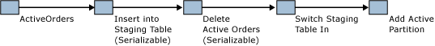

# Application Pattern for Partitioning Memory-Optimized Tables
[!INCLUDE[appliesto-ss-asdb-xxxx-xxx-md](../../includes/appliesto-ss-asdb-xxxx-xxx-md.md)]

  [!INCLUDE[hek_2](../../includes/hek-2-md.md)] supports a pattern where a limited amount of active data is kept in a memory-optimized table, while less-frequently accessed data is processed on disk. Typically, this would be a scenario where data is stored based on a **datetime** key.  
  
 You can emulate partitioned tables with memory-optimized tables by maintaining a partitioned table and a memory-optimized table with a common schema. Current data would be inserted and updated in the memory-optimized table, while less-frequently accessed data would be maintained in the traditional partitioned table.  
  
 An application that knows that the active data is in a memory-optimized table can use natively compiled stored procedures to access the data. Operations that need to access the entire span of data, or which may not know which table holds relevant data, use interpreted [!INCLUDE[tsql](../../includes/tsql-md.md)] to join the memory-optimized table with the partitioned table.  
  
 This partition switch is described as follows:  
  
-   Insert data from the In-Memory OLTP table into a staging table, possibly using a cutoff date.  
  
-   Delete the same data from the memory-optimized table.  
  
-   Swap in the staging table.  
  
-   Add the active partition.  
  
   
Active Data Maintenance  
  
 The actions starting with Deleting ActiveOrders need to be done during a maintenance window to avoid queries missing data during the time between deleting data and switching in the staging table.  
  
 For a related sample, see [Application-Level Partitioning](../../relational-databases/in-memory-oltp/application-level-partitioning.md).  
  
## Code Sample  
 The following sample shows how to use a memory-optimized table with a partitioned disk-based table. Frequently-used data is stored in memory. To save the data to disk, create a new partition and copy the data to the partitioned table.  
  
 The first part of this sample creates the database and necessary objects. The second part of the sample shows how to move data from a memory-optimized table into a partitioned table.  
  
```sql  
CREATE DATABASE partitionsample;  
GO  
  
-- enable for In-Memory OLTP - change file path as needed  
ALTER DATABASE partitionsample ADD FILEGROUP partitionsample_mod CONTAINS MEMORY_OPTIMIZED_DATA  
ALTER DATABASE partitionsample ADD FILE( NAME = 'partitionsample_mod' , FILENAME = 'c:\data\partitionsample_mod') TO FILEGROUP partitionsample_mod;  
GO  
  
USE partitionsample;  
GO  
  
-- frequently used portion of the SalesOrders - memory-optimized  
  
CREATE TABLE dbo.SalesOrders_hot (  
   so_id INT IDENTITY PRIMARY KEY NONCLUSTERED,  
   cust_id INT NOT NULL,  
   so_date DATETIME2 NOT NULL INDEX ix_date NONCLUSTERED,  
   so_total MONEY NOT NULL,  
   INDEX ix_date_total NONCLUSTERED (so_date desc, so_total desc)  
) WITH (MEMORY_OPTIMIZED=ON)  
GO  
  
-- cold portion of the SalesOrders - partitioned disk-based table  
CREATE PARTITION FUNCTION [ByDatePF](datetime2) AS RANGE RIGHT   
   FOR VALUES();  
GO  
  
CREATE PARTITION SCHEME [ByDateRange]   
   AS PARTITION [ByDatePF]   
   ALL TO ([PRIMARY]);  
GO  
  
CREATE TABLE dbo.SalesOrders_cold (  
   so_id INT NOT NULL,  
   cust_id INT NOT NULL,  
   so_date DATETIME2 NOT NULL,  
   so_total MONEY NOT NULL,  
   CONSTRAINT PK_SalesOrders_cold PRIMARY KEY (so_id, so_date),  
   INDEX ix_date_total NONCLUSTERED (so_date desc, so_total desc)  
) ON [ByDateRange](so_date)  
GO  
  
-- table for temporary partitions  
CREATE TABLE dbo.SalesOrders_cold_staging (  
   so_id INT NOT NULL,  
   cust_id INT NOT NULL,  
   so_date datetime2 NOT NULL,  
   so_total MONEY NOT NULL,  
   CONSTRAINT PK_SalesOrders_cold_staging PRIMARY KEY (so_id, so_date),  
   INDEX ix_date_total NONCLUSTERED (so_date desc, so_total desc),  
   CONSTRAINT CHK_SalesOrders_cold_staging CHECK (so_date >= '1900-01-01')  
)  
GO  
  
-- aggregate view of the hot and cold data  
CREATE VIEW dbo.SalesOrders  
AS SELECT so_id,  
   cust_id,  
   so_date,  
   so_total,  
   1 AS 'is_hot'  
   FROM dbo.SalesOrders_hot  
   UNION ALL  
   SELECT so_id,  
          cust_id,  
          so_date,  
          so_total,  
          0 AS 'is_hot'  
          FROM dbo.SalesOrders_cold;  
GO  
  
-- move all sales orders up to the split date to cold storage  
CREATE PROCEDURE dbo.usp_SalesOrdersOffloadToCold @splitdate datetime2  
   AS  
   BEGIN  
      BEGIN TRANSACTION;  
      -- create new heap based on the hot data to be moved to cold storage  
      INSERT INTO dbo.SalesOrders_cold_staging WITH( TABLOCKX)  
      SELECT so_id , cust_id , so_date , so_total  
         FROM dbo.SalesOrders_hot WITH ( serializable)  
         WHERE so_date <= @splitdate;  
  
      -- remove moved data  
      DELETE FROM dbo.SalesOrders_hot WITH( SERIALIZABLE)  
         WHERE so_date <= @splitdate;  
  
      -- update partition function, and switch in new partition  
      ALTER PARTITION SCHEME [ByDateRange] NEXT USED [PRIMARY];  
  
      DECLARE @p INT = ( SELECT MAX( partition_number) FROM sys.partitions WHERE object_id = OBJECT_ID( 'dbo.SalesOrders_cold'));  
      EXEC sp_executesql N'alter table dbo.SalesOrders_cold_staging  
         SWITCH TO dbo.SalesOrders_cold partition @i' , N'@i int' , @i = @p;  
  
      ALTER PARTITION FUNCTION [ByDatePF]()  
      SPLIT RANGE( @splitdate);  
  
      -- modify constraint on staging table to align with new partition  
      ALTER TABLE dbo.SalesOrders_cold_staging DROP CONSTRAINT CHK_SalesOrders_cold_staging;  
  
      DECLARE @s nvarchar( 100) = CONVERT( nvarchar( 100) , @splitdate , 121);  
      DECLARE @sql nvarchar( 1000) = N'alter table dbo.SalesOrders_cold_staging   
         add constraint CHK_SalesOrders_cold_staging check (so_date > ''' + @s + ''')';  
      PRINT @sql;  
      EXEC sp_executesql @sql;  
  
      COMMIT;  
END;  
GO  
  
-- insert sample values in the hot table  
INSERT INTO dbo.SalesOrders_hot VALUES(1,SYSDATETIME(), 1);   
GO  
  
INSERT INTO dbo.SalesOrders_hot VALUES(1, SYSDATETIME(), 1);  
GO  
  
INSERT INTO dbo.SalesOrders_hot VALUES(1, SYSDATETIME(), 1);  
GO  
  
-- verify contents of the table  
SELECT *  FROM dbo.SalesOrders;  
GO  
  
-- offload all sales orders to date to cold storage  
DECLARE  @t datetime2 = SYSDATETIME();  
EXEC dbo.usp_SalesOrdersOffloadToCold @t;  
  
-- verify contents of the tables  
SELECT * FROM dbo.SalesOrders;  
GO  
  
-- verify partitions  
SELECT OBJECT_NAME( object_id) , * FROM sys.dm_db_partition_stats ps  
   WHERE object_id = OBJECT_ID( 'dbo.SalesOrders_cold');  
  
-- insert more rows in the hot table  
INSERT INTO dbo.SalesOrders_hot VALUES(2, SYSDATETIME(), 1);  
GO  
  
INSERT INTO dbo.SalesOrders_hot VALUES(2, SYSDATETIME(), 1);  
GO  
  
INSERT INTO dbo.SalesOrders_hot VALUES(2, SYSDATETIME(), 1);  
GO  
  
-- verify contents of the tables  
SELECT * FROM dbo.SalesOrders;  
GO  
  
-- offload all sales orders to date to cold storage  
DECLARE @t datetime2 = SYSDATETIME();  
EXEC dbo.usp_SalesOrdersOffloadToCold @t;  
  
-- verify contents of the tables  
SELECT * FROM dbo.SalesOrders;  
GO  
  
-- verify partitions  
SELECT OBJECT_NAME( object_id) , partition_number , row_count  FROM sys.dm_db_partition_stats ps  
  WHERE object_id = OBJECT_ID( 'dbo.SalesOrders_cold') AND index_id = 1;  
```  
  
## See Also  
 [Memory-Optimized Tables](../../relational-databases/in-memory-oltp/memory-optimized-tables.md)  
  
  
